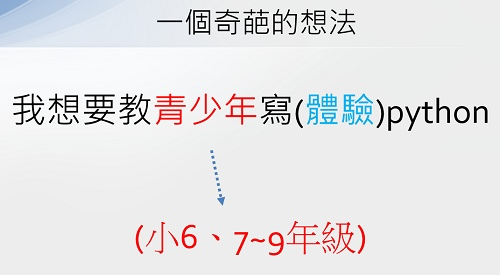
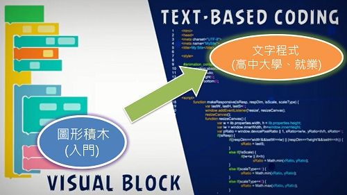
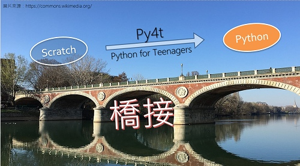

#  ❤️ 計畫緣由

------------

一位小學資訊教師，在教導學生數年的Scratch後，一直在思索「**中小學程式教育的下一步**」要如何邁出？

因該師本身成長與學習的過程中，對程式與:fontawesome-brands-python:Python的喜愛，於是逐漸有了想要「**教青少年寫Python程式**」的想法。

當然小6或是國中生的青少年，在年齡及各種先備知識上仍屬萌芽階段。但就算只能讓他們「**體驗文字程式**」，以有趣及新奇的方式認識Python，相信能啟發他們未來對程式設計的學習興趣。

------------

青少年使用者從積木程式入門之後，將來在高中、大學會接觸到文字程式，甚至在一些相關科系的就業上，會使用到多種文字程式。文字式程式語言，在視覺上、編寫上、操作上，均與圖形積木語言有著相當大的差異。

------------

Py4t是「**Python for teenagers**」的縮寫，也是在以上的想法中誕生的一個小型開發計畫，從2019年8月開始，逐步實作、試驗與探索出來的整合軟體，一個「**給青少年的Python編輯器**」，希望他們可以從Scratch開始，以較平順的學習遷移方式，橋接到:fontawesome-brands-python:Python程式。