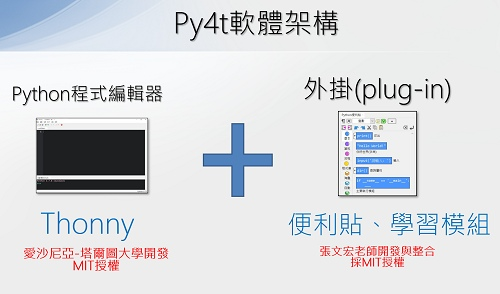

# 💛 軟體架構

「**Thonny編輯器**」再加上「**便利貼與學習模組的外掛**」，就成為了 Py4t (或可稱為ThonnyPy4t)。

Thonny 來自愛沙尼亞塔爾圖大學，並在CyberneticaAS、樹莓派基金會及開源社區的支援下開發。是一個適合初學者的:fontawesome-brands-python: Python 編輯器，有中文的使用介面(i18n)，並附有一個內建的 Python 直譯器，相當方便。在許多熱心人士的開發下，不斷有新的版本，除了 Python 語法，對 MicroPython 的支援也相當的優異。

因 Thonny 可使用 Tkinter 函式庫來開發外掛程式，於是作者就從便利貼的靈感開始，慢慢的摸索，一點一滴的整合，逐步的試誤，從便利貼、排版輔助與包裝各個學習模組，並參照 Thonny 的做法，將之整個打包在一個執行檔內，使用者「**只要安裝一次**」，就可以使用 Py4t 的所有功能。

Thonny 與 Py4t 的授權均採「[MIT授權](https://github.com/beardad1975/py4t/blob/master/LICENSE.txt)」，可以免費使用並且公開原始碼。
