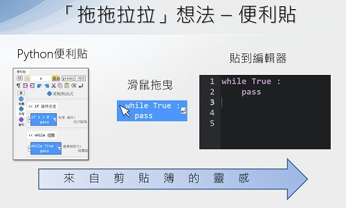

# Py4t的設計理念

---------------

### 📕 經驗遷移

Scratch是一個很棒的程式入門工具，讓學習者可以從有趣的遊戲與動畫的製作中，學習到程式的思考方式，以及循序、條件、重複的流程結構。這些學習到的知識與能力，在學習Python時，都可以用類比的方式將**學習經驗遷移**過來。

---------------

### 📘 便利貼

從圖形積木進入到文字程式，會遇到一些障礙，比如語言、鍵盤、排版、除錯等。

Py4t以來自剪貼簿的靈感，設計了**可拖曳至文字編輯區**的便利貼。這個設計可以讓青少年遷移在Scratch中累積的操作經驗，實際操作Py4t時，彷彿有積木的既視感，但卻又是在進行文字程式的編寫。

---------------

### 📗 排版輔助

Scratch的組合積木，其實是程式邏輯的思考與編寫動作。而在Python程式中，會轉變成文字的排版。Py4t提供了數種**排版輔助**的工具，讓Python寫起來能更加流暢。

---------------

### 📙 中英併用

在國際化通用的思維下，文字程式常常是以全英文的方式編寫。寫程式必需要思考邏輯，而寫全英文程式需要的更是**「翻譯 + 思考邏輯」**。這樣的方式在大學生等年紀較大的學習者比較容易克服，但對青少年的學習者來說，容易使之卻步，甚至見文字程式而生畏，反而產生了負面的印象。

基於以上原因，Py4t在學習橋接的考量下，不管是在範例或是學習模組上，大量採用**中英併用**的程式寫法，讓青少年**以母語思考邏輯**，順利的入門文字程式。因為如果入不了門，更不用談到什麼應用。順利入門之後，未來再朝國際化全英文程式的方向邁進。

---------------

### 📕 學習模組

當稍克服了文字程式障礙，可以順利的寫Python程式，這樣就足夠了嗎？對難度較高的文字程式來說，學習者的動機恐怕仍是不足。

為了吸引青少年的學習者，Py4y藉由各個學習模組，讓他(她)們以有趣新奇的方式學習程式，以具體化的方式呈現抽象的數字與邏輯，並了解程式在科技中的各種應用，Py4t把許多Python成熟的函式庫包裝成**學習模組**，以有趣簡易的方式讓青少年可以操作體驗，如海龜幾何繪圖、物理碰撞、3D模擬、視覺影像與運算思維…等。

---------------