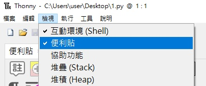
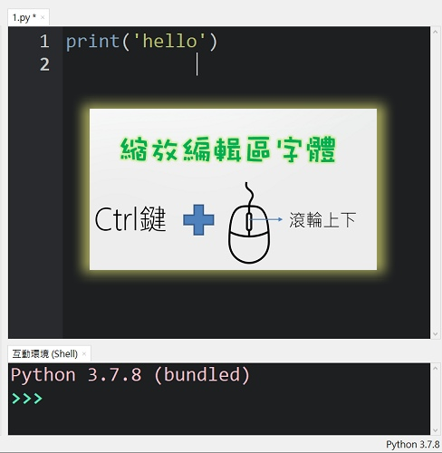
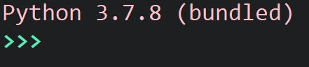
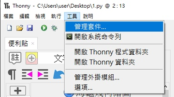
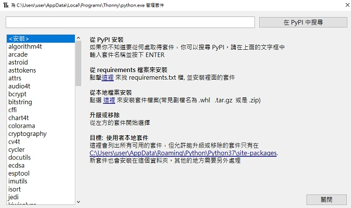
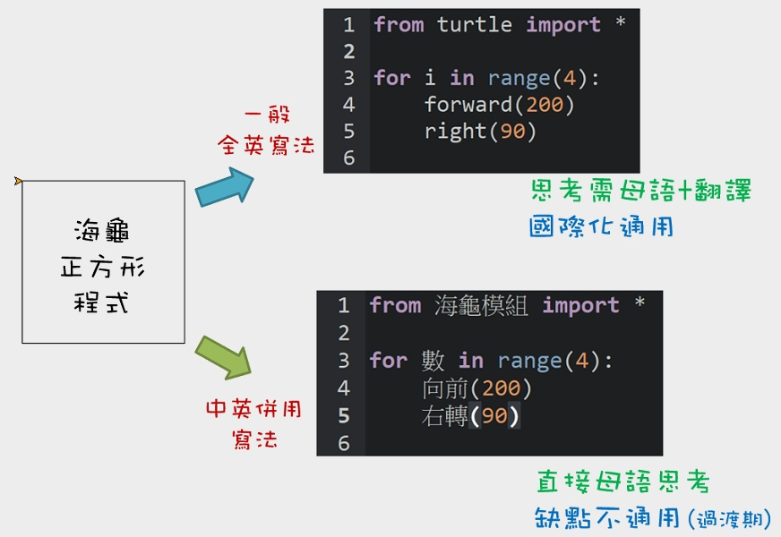
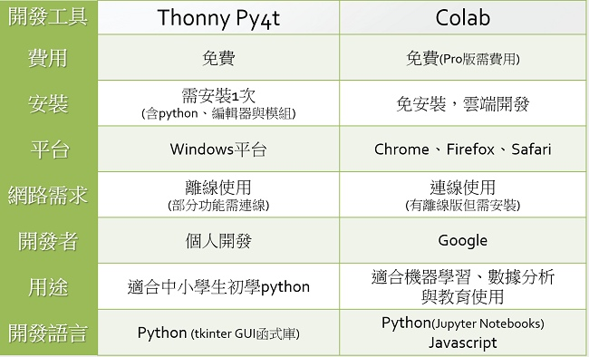
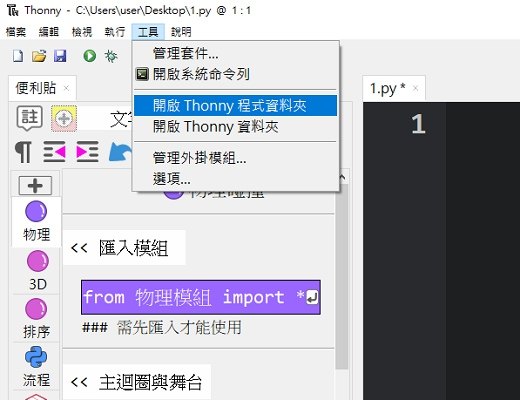
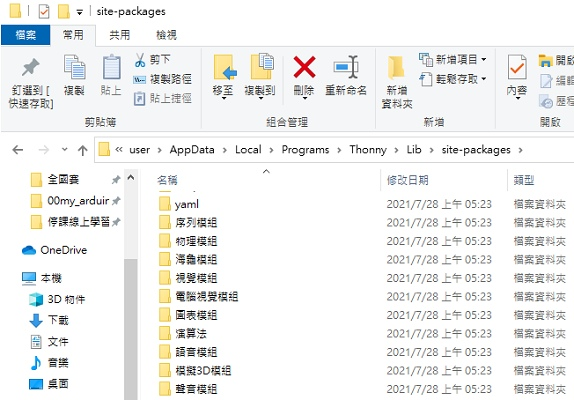

# 💚 問答 Q & A

## ❔ 便利貼與編輯排版

--------------------------------

🖐️ 便利貼是圖形積木嗎？

> 便利貼類似圖形積木，但本質上是經過設計的「**🔖程式碼便利貼**」，在拖曳便利貼時，會有彷彿有積木的既視感，但卻又是在進行文字程式的編寫。

> Scratch拖曳積木讓程式碼可以「**簡易輸入**」，而積木的組合其實是程式邏輯的「**思考與編寫**」。以上這個兩個動作，在文字程式是重要的基礎，Py4t採用便利貼與排版輔助的設計來做為橋接，讓青少年使用者逐步產生文字程式編寫的感覺與習慣，以利未來朝向文字程式設計之路。

🖐️ 便利貼不見了如何找出來？

> 請確認「檢視」選單中的「便利貼」是否有打勾。

> 

> 也要確認安裝的是thonnyPy4t，原本的thonny是不含便利貼功能的。

🖐️ Py4t編輯區的字體可以縮放嗎？

> 以「Ctrl鍵 + 滑鼠滾輪上下」，即可縮放編輯區的字體大小，非常方便。 

> 

     

## ❔ Py4t與Python

--------------------------------

🖐️ 用Py4t寫出來的程式是Python程式嗎？

> Py4t的便利貼，本質上只是一個類似剪貼簿的外掛，功用就是把程式碼複製到文字編輯器中，執行時是以「**標準的Python直譯器**」來執行，所以寫出來的程式就是「**合乎語法的Python程式**」。

> 

🖐️ 用Py4t能執行一般的Python程式嗎？

> Py4t能執行Python程式，因為Thonny本身就是標準的文字編輯器，基本的語法，內建的turtle都直接可執行。

> 如果Python程式有安裝套件需求，比如opencv的程式，就必需要先安裝opencv-python套件，只要套件能安裝就能執行。一般Python是使用pip安裝，而Thonny本身有內建一個套件安裝圖形工具，工具位置及使用畫面如下：

🖐️ Py4t寫出來的程式為什麼會有中文？跟一般的Python看起來不太一樣？

> Py4t學習模組與範例程式大量使用中文函式或變數，這是在學習模組中包裝出來的，因Python可使用unicode的名稱，所以可以在變數、函式名稱、物件名稱等處使用中文。使用學習模組寫出來的中英併用程式，是一個讓青少年可以橋接到Python的「**折衷設計**」，可以用母語來思考程式邏輯，也比較容易閱讀與理解，避免全英文在入門上的困難。

> 

> 當然使用中文也會有代價❕，第一個就是中文的打字比較繁鎖，這部分Py4t是使用便利貼來解決。

> 第二個代價就是會比較不國際化通用，青少年使用者若在將來想朝程式設計之路前進，建議「**未來要進入全英文的程式**」，這樣在參考國外的程式相關手冊及範例時，才能有更多的學習與收獲，程式的應用與視野會更加寬廣👁️。

🖐️ 一般的Python環境可以跑Py4t中英併用程式嗎？

> Py4t的學習模組，都有在[PYPI](https://pypi.org/)上發行套件，一般的Python環境要先安裝相關的套件(使用pip)，只要能順利安裝，就可以執行Py4t學習模組的程式碼。若安裝失敗，則要找出原因再修正。

> Py4t的便利貼與排版輔助，是專為青少年學習開發的，是屬於編輯器或IDE的功能。其他Python環境，因使用對象是針對大學生與成人，故較少見這些設計。

> Py4t的整合安裝檔，就是為了「**簡化Python環境建置**」的步驟而產生的(一次同時安裝Python、編輯器、相關套件、便利貼與排版)。

## ❔ Py4t版本與Colab

--------------------------------

🖐️ Py4t有雲端的版本嗎？

🖐️ Py4t有Mac的版本嗎？

🖐️ Py4t有Linux的版本嗎？

> Py4t目前**只有:fontawesome-brands-windows:Windows版本**(需安裝)。

> 因為Py4t是利用Thonny的外掛開發而成，會受限於Thonny的支援版本，故無雲端版。如有雲端版的需求，建議可使用google colab。兩者都是使用並學習Python的工具，相信在某些程度上可以搭配使用。

> 另外，因Py4t一開始的設定使用場地為中小學的電腦教室，且學習模組有包含了許多的函式庫，作者也只有用Win10的電腦開發，所以目前只有Windows版本。

🖐️ Py4t與google colab有什麼不同？

    

## ❔ Py4t與開放原始碼

--------------------------------

🖐️ Py4t的程式碼，在網路上看得到嗎？

> 因Py4t的相關程式是在:fontawesome-brands-github:github平台上開發的，所以程式原始碼可以在github上找到。以下列舉幾個項目：

>   | 項目                             | 連結                                                              |
>   | :-----------:                    | :------------------------------------:                            |
>   | 便利貼與排版輔助   | [thonny-postit](https://github.com/beardad1975/thonny-postit)           |
>   | 海龜幾何繪圖   | [turtle4t](https://github.com/beardad1975/turtle4t)           |

>更多的原始碼請參考各學習模組的說明頁。

🖐️ Py4t的程式碼，在本機資料夾找得到嗎？

>    若想找到目前Py4t程式中正在運行的函式庫程式，先到「工具」選單，「開啟Thonny資料夾」。

>    

>    在出現的資料夾中，往上一層找到「site-packages」的資料夾，這就是函式庫所在位置，有興趣者，可瀏覽相關內容。

>    

>    若想要測試修改程式，記得於儲存後，再重新開啟Py4t。

## ❔ Py4t授權與開發

🖐️ Py4t需要付費嗎？採用的軟體授權是什麼？

> 因為Py4t有包含Thonny並且是它的外掛程式，所以與Thonny採用相同的軟體授權，為[MIT授權](https://github.com/beardad1975/py4t/blob/master/LICENSE.txt)，可以免費使用並有公開原始源，無軟體使用擔保。

🖐️ 用Py4t的便利貼與學習模組，是用什麼語言寫的？

> Thonny編輯器、便利貼與學習模組，都是使用:fontawesome-brands-python:**Python語言開發**的，除了基本的程式結構，因程式資料與函式的複雜度，所以大量採用了Python「**物件導向**」的寫作方式。

> 當青少年使用者知道，他(她)是用Python語言寫出來的工具來學習Python，並幫助他(她)在未來讀書、就業時能運用Python解決問題。這樣的過程，對學習程式語言來說，就是一個很好的「**信心增強**」與「**良好循環**」，讓青少年使用者相信，學習Python是實用的。

🖐️ Py4t是誰開發的？

> Py4t的開發者是Wen-Hung, Chang. 張文宏，目前是於其空閒時間開發，所以版本更新的速度有限。歡迎各位先進於教育場所使用，並不吝給予意見回饋與錯誤回報，有問題可在[討論區](https://groups.google.com/g/py4t)中發問。

> 若各位先進有想要新增的功能，也歡迎一起運用:fontawesome-brands-github:github平台來開發Py4t程式，協助計畫的發展。

