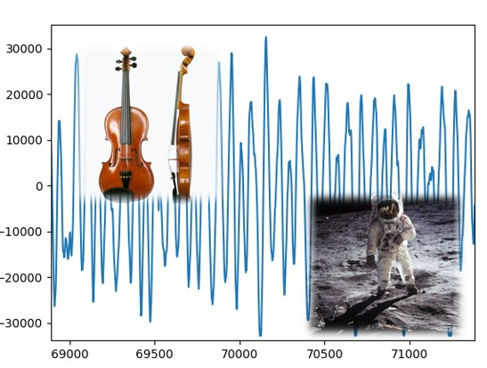

# 🔰 聲音範例 - 玩轉音訊


: 

<br/>

-------------------------------------

## 音訊處理

🎦 範例影片

<iframe width="560" height="315" src="https://www.youtube.com/embed/bxVtlTDf5hE?start=0&amp;end=702" frameborder="0" allow="accelerometer; autoplay; encrypted-media; gyroscope; picture-in-picture" allowfullscreen></iframe>


📄 Py4t程式碼

```python
from 聲音模組 import *
import matplotlib.pyplot as plt

聲音1 = 開啟wav檔('個人一小步.wav')
聲音2 = 開啟wav檔('小提琴聲音.wav')
聲音 = 聲音1.overlay(聲音2)
play(聲音)
聲音.儲存wav檔('音訊處理.wav')

陣列 = 聲音轉陣列(聲音)
plt.plot(陣列)
plt.show()
```

<br/><br/>

-------------------------------------