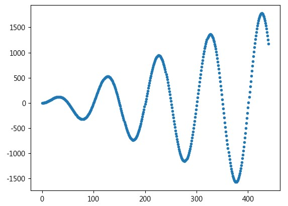
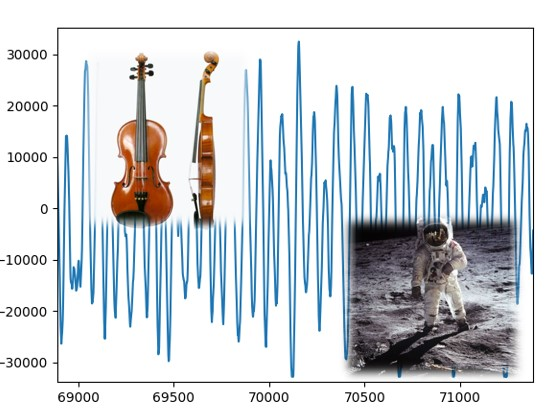

---
hide:
  - navigation
---

# 🔊 聲音 教學函式庫

---------------

### 📗 說明

---------------

: 聲音教學函式庫是建立在[pydub](https://github.com/jiaaro/pydub)、[simpleaudio](https://simpleaudio.readthedocs.io/en/latest/)及[pyaudio](https://people.csail.mit.edu/hubert/pyaudio/)等處理音訊的函式庫上。

: 此函式庫可以開啟與讀取wav檔，產生常見的聲波，做出聲音串接、混合、淡出入等處理效果，可以用來學習有關聲音訊號的知識並實作。

  

---------------

### 📘 範例程式

---------------

各種以聲音教學函式庫做出的程式範例。

| 範例                             | 截圖                                                              |
| :-----------:                    | :------------------------------------:                            |
| [聲音訊號](sound_signal.md)          | [{width=150}](sound_signal.md)           |
| [玩轉音訊](audio_processing.md)          | [{width=150}](audio_processing.md)           |