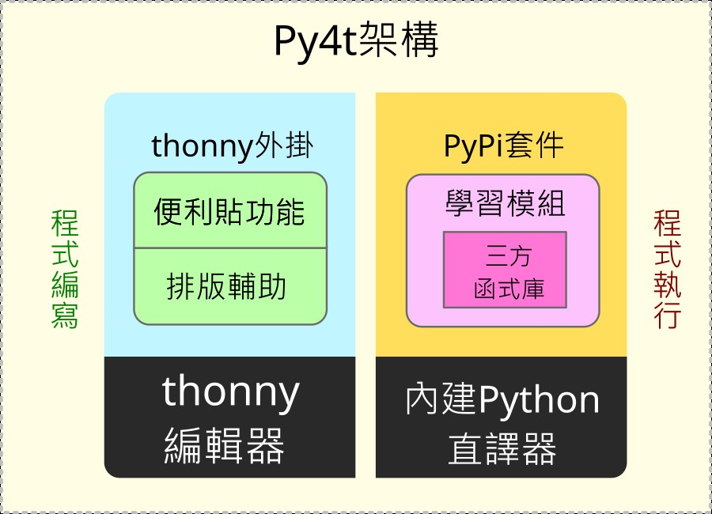
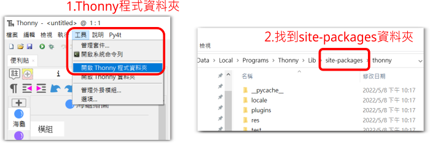
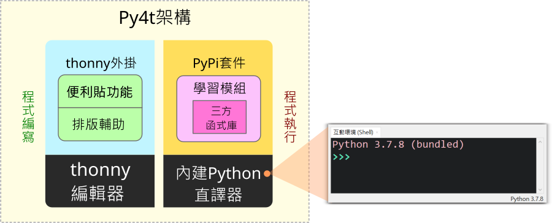
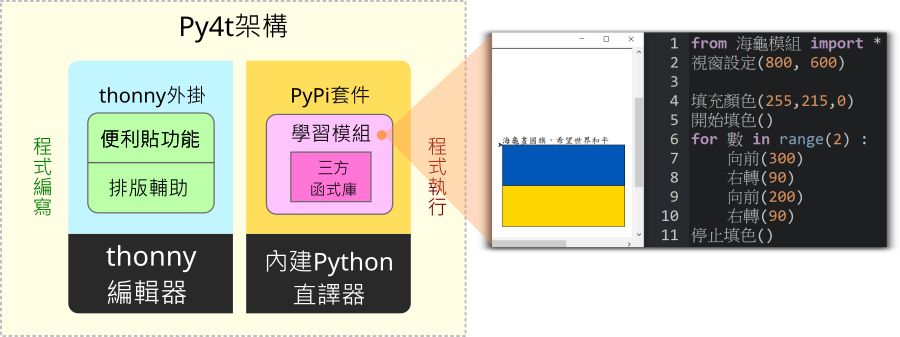

# 👨‍👩‍👧‍👦 [問答] Py4t架構與原始碼導覽

之前與一位高雄的蔡老師有email的往來討論，在討論中蔡老師表達了對Py4t的開發有興趣。於是趁空反思一下Py4t這3年來開發的歷程，寫下這篇參考資料，其中說明了Py4t的架構，也有程式原始碼的導覽，讓有興趣的老師參考。

本文有相當的難度，也僅是深入Py4t的起點，但如果當成一個中型的Python程式專案來研究，相信對有意願想要深入Python的老師也能有些助益。

 

----------------------------------

## 💠 Py4t的設計架構圖

Py4t包含了便利貼及排版輔助的thonny的外掛程式，還有為了教學而整合的學習模組，架構圖如下：

 

--------------------------------------------

## 💠 深入原始碼的基礎知識

為能順利理解Py4t的程式原始碼，建議讀者能有以下的基礎知識：

* 【認識python模組與套件】許多第三方函式庫，都以python套件的形式寫成，是函式庫互相引用的基礎，坊間許多python用書都會提到相關概念；也可以上網自學，如[解析Python模組(Module)和套件(Package)的概念](https://www.learncodewithmike.com/2020/01/python-module-and-package.html)

* 【python物件導向基本語法】 將程式與資料封裝在各個類別，並可繼承重複利用的設計工具，坊間許多python用書都會介紹相關語法及概念；也可以上網自學，如[淺談Python類別(Class)](https://www.learncodewithmike.com/2020/01/python-class.html)

* 【tkinter圖形介面基本認識】 內建在python標準函式庫中，是thonny與py4t的所使用的圖形介面(GUI)，參考用書推薦「Python GUI設計活用tkinter之路，深智出版」；也可以上網自學，像是[如何使用 Python Tkinter 製作 GUI 應用程式入門教學](https://blog.techbridge.cc/2019/09/21/how-to-use-python-tkinter-to-make-gui-app-tutorial/)

thonny與py4t的程式原始碼均託管在github網站，在說明程式原始碼時，會以github網站的程式碼為例。

讀者若想在本機修改及驗証py4t程式原始碼，要先找到本機的site-packages，所有的py4t外掛及學習模組程式碼，均可從此資料夾中找到，找出資料夾的方法如下：

 

--------------------------------------------

## 💠 thonny編輯器與外掛機制

thonny是一個適合初學者的python程式編輯器，在github的程式碼的網址為[https://github.com/thonny/thonny](https://github.com/thonny/thonny)，是一個全部由python語言開發，優秀的初學者編輯器。

thonny提供plug-in(外掛)，讓使用者可以擴充其功能，這是外掛原始說明的[連結](https://github.com/thonny/thonny/wiki/Plugins)。簡要來說，需在thonnycontrib下的套件中，以load_plugin函式為外掛程式的進入點。

[Py4t的外掛程式原始碼](https://github.com/beardad1975/thonny-postit/blob/master/thonnycontrib/postit/__init__.py#L1562)

本機Py4t的外掛程式位於site-packages中的thonnycontrib\postit\__init__.py

 

--------------------------------------------

## 💠 便利貼外掛程式 

以下列舉部分與便利貼相關的程式原始檔：

* [&lowbar;&lowbar;init&lowbar;&lowbar;.py](https://github.com/beardad1975/thonny-postit/blob/master/thonnycontrib/postit/__init__.py#L386) : 呼叫相關物件來產生便利貼

* [dropdown_postit.py](https://github.com/beardad1975/thonny-postit/blob/master/thonnycontrib/postit/dropdown_postit.py) : 下拉選單便利貼的物件定義

* [turtle4t.json](https://github.com/beardad1975/thonny-postit/blob/master/thonnycontrib/postit/tab_data/py4t/theme/turtle4t.json) : 海龜程式相關便利貼的資訊(json檔)

本機Py4t的便利貼程式位於site-packages中的thonnycontrib\postit資料夾中

 

--------------------------------------------

## 💠 排版輔助外掛程式 

以下列舉部分與排版輔助相關的程式原始檔：

* [&lowbar;&lowbar;init&lowbar;&lowbar;.py](https://github.com/beardad1975/thonny-postit/blob/master/thonnycontrib/postit/__init__.py#L1149) : 呼叫相關物件來產生排版輔助工具

* [indent_tool_postit.py](https://github.com/beardad1975/thonny-postit/blob/master/thonnycontrib/postit/tools/indent_tool_postit.py) : 縮排工具的物件定義

* [symbol_tool_postit.py](https://github.com/beardad1975/thonny-postit/blob/master/thonnycontrib/postit/tools/symbol_tool_postit.py) : 符號與內建函式工具的物件定義

* [copy_tool_postit.py](https://github.com/beardad1975/thonny-postit/blob/master/thonnycontrib/postit/tools/copy_tool_postit.py) : 剪下、複製與貼上工具的物件定義

本機Py4t的排版輔助程式位於site-packages中的thonnycontrib\postit\tools資料夾中

 

--------------------------------------------

## 💠 內建python直譯器

thonny內建python的直譯器，只要安裝一次就可以同時完成編輯器與Python直譯器的安裝。thonny亦提供圖形的pip套件安裝工具，從[工具]->[管理套件]中可以幫內建的Python直譯器安裝第三方的函式庫。

許多Py4t所使用到的第三方函式庫，都已包含在Py4t的安裝檔中。

 

--------------------------------------------

## 💠 整合學習模組

python的許多函式庫已相當成熟，但對年紀小的初學者來說，仍有些困難與繁雜。Py4t以學習模組包覆在第三方函式庫的做法，實踐程式簡化及中英併用的理念。

比如以海龜程式的學習模組為例：

* [&lowbar;&lowbar;init&lowbar;&lowbar;.py](https://github.com/beardad1975/turtle4t/blob/master/turtle4t/__init__.py#L143) : 海龜學習模組的部份翻譯

本機Py4t的海龜程式位於site-packages中的turtle4t資料夾中

其他學習模組的程式原始碼在此[連結](https://github.com/beardad1975?tab=repositories) (有4t結尾的名稱均是)

 

--------------------------------------------

## 💠 執行檔封裝

當寫好的程式，要讓人能使用時，必須要把thonny、py4t外掛及學習模組全部封裝成安裝檔。

* [create_installer.bat](https://github.com/beardad1975/py4t/blob/master/packaging/windows/create_installer.bat) :　封裝出windows版py4t安裝檔的批次指令

 

--------------------------------------------

