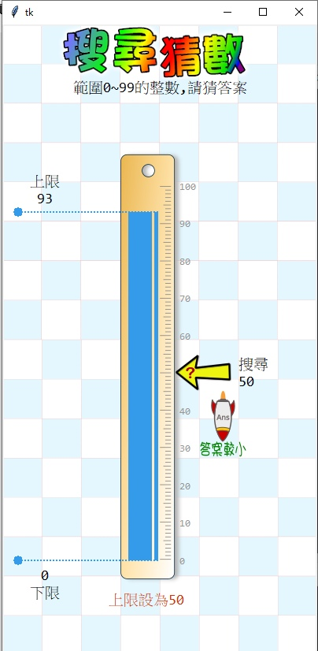

---
hide:
  - navigation
---

# Ⓜ️ 運算思維模組

---------------

### 📗 說明

運算思維(Computational thinking)是一種具備運用運算工具的思維能力，藉由分析問題、發展解題方法，並進行有效的決策(國教院)。核心能力為拆解問題、模式識別、抽象化、演算法設計。

演算法為運算思維的重要一環，Py4t以「程式執行就有具體圖像呈現」的方式，輔助青少年使用者，在學習初級演算法(排序、搜尋)過程中，能夠實作、測試、評估與改良演算法。

排序撲克的學習模組可以學習氣泡、選擇與插入排序法。搜尋猜數的學習模組可以實作線性搜尋法與二分插尋法。

---------------

### 📘 範例

| 範例                             | 執行截圖                                                              |
| :-----------:                    | :------------------------------------:                            |
| [排序撲克](poker_sort.md)     | [{width=150}](poker_sort.md)           |
| [搜尋猜數](search_guess.md)   | [{width=150}](search_guess.md)     |

---------------

### 📕 便利貼

以下為便利貼的使用資訊：

| 便利貼顯示                           | 便利貼內容                                                              |
| :-----------:                    | :------------------------------------:                            |
|     |     |

---------------

### 📙 模組原始碼

排序撲克與搜尋猜數在:fontawesome-brands-github:github上的原始碼: [algorithm4t](https://github.com/beardad1975/algorithm4t)

