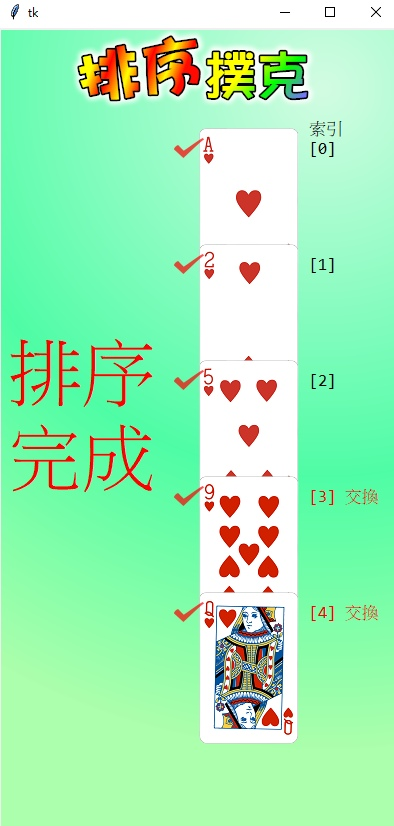

# 🔰 運算思維範例 - 排序撲克

---------------

### 🎦 範例影片

<div style="padding:75% 0 0 0;position:relative;"><iframe src="https://player.vimeo.com/video/584569991?badge=0&amp;autopause=0&amp;player_id=0&amp;app_id=58479" frameborder="0" allow="autoplay; fullscreen; picture-in-picture" allowfullscreen style="position:absolute;top:0;left:0;width:100%;height:100%;" title="poker_sort.mp4"></iframe></div><script src="https://player.vimeo.com/api/player.js"></script>

---------------

### 🏷️ 原理說明

排序撲克以程式執行就有撲克牌呈現、交換、插入動作呈現，讓青少年使用者學習初級排序演算法(氣泡、插入、選擇)。下方的範例是實作插入排序法，以每次發牌一張，就把手上的牌做排序的方式，完成排序。模組在布題、歷程、統計、結算均有相關的輔助功能，讓學習者可以專注於演算法的實作。

--------------

### 📄 Py4t程式碼

```python
from 演算法 import poker

def 回合排序(對) :
    for 索引 in range(對) :
        if poker[索引].點數 > poker[索引 + 1].點數 :  
            poker[索引].交換(索引 + 1)
        else :
            break
        
poker.產生牌組(5)
poker.發牌(單張=True)

for 數 in range(1, 5) :
    poker.發牌(單張=True)
    poker[-1].插入到(0)
    回合排序(對 = 數)

```

--------------

### 💻 執行截圖




