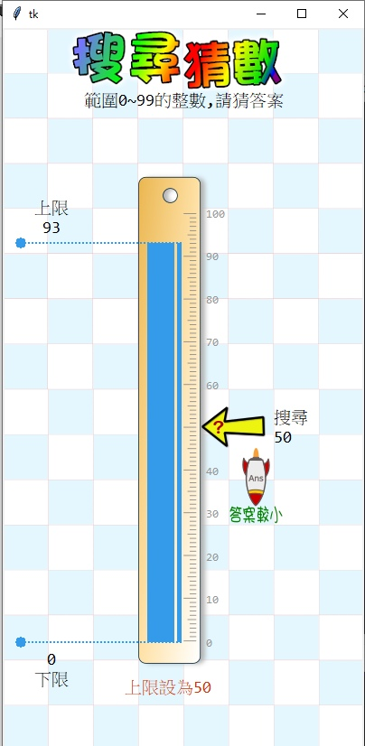

# 🔰 運算思維範例 - 搜尋猜數

---------------

### 🎦 範例影片

<div style="padding:75% 0 0 0;position:relative;"><iframe src="https://player.vimeo.com/video/584576157?badge=0&amp;autopause=0&amp;player_id=0&amp;app_id=58479" frameborder="0" allow="autoplay; fullscreen; picture-in-picture" allowfullscreen style="position:absolute;top:0;left:0;width:100%;height:100%;" title="search_guess.mp4"></iframe></div><script src="https://player.vimeo.com/api/player.js"></script>

---------------

### 🏷️ 原理說明

搜尋猜數以畫面上尺的刻度呈現數字，在執行搜尋動作時(大於、小於或等於答案)，具體顯示答案的方向，讓青少年使用者可以利用線性搜尋法及二分搜尋法，來找出答案。下方的範例是在範圍0~99的數列中，以二分搜尋法找出答案的演算法。

--------------

### 📄 Py4t程式碼

```python
from 演算法 import guess

guess.產生題目(100)

while True :
    中間 = round((guess.上限 + guess.下限)/2)
    if guess.答案 > 中間 :
        guess.下限 = 中間
    elif guess.答案 < 中間 :
        guess.上限 = 中間
    elif guess.答案 == 中間 :
        guess.提交搜尋()  
```

--------------

### 💻 執行截圖




