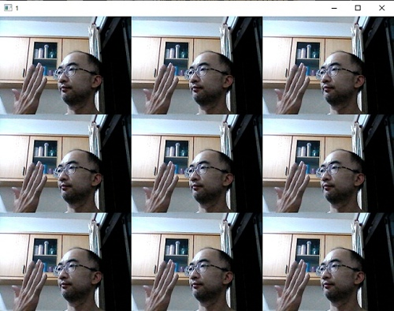

# 🔰 視覺範例 - 電視牆

### 🎦 範例影片

<div style="padding:75% 0 0 0;position:relative;"><iframe src="https://player.vimeo.com/video/584295868?badge=0&amp;autopause=0&amp;player_id=0&amp;app_id=58479" frameborder="0" allow="autoplay; fullscreen; picture-in-picture" allowfullscreen style="position:absolute;top:0;left:0;width:100%;height:100%;" title="camera_tile.mp4"></iframe></div><script src="https://player.vimeo.com/api/player.js"></script>

### 🏷️ 原理說明(灰階)

在每一張取影的攝影機影像中，先將影像轉成灰階，並把影像縮小(150)，再利用多維陣列的拼貼功能，在直向與橫向兩個方向中，各拼貼4次，就做出了如同電視牆的效果。

<sup><sub>💬電腦上需要有視訊攝影機</sub></sup>

--------------

### 📄 Py4t程式碼(灰階)

```python
from 視覺模組 import *
import numpy as 多維陣列

攝影機 = 設置影像擷取()

while True:
    陣列 = 擷取影像(攝影機)
    陣列 = 左右翻轉(陣列)
    陣列 = 彩色轉灰階(陣列)
    
    陣列 = 縮放影像(陣列, 寬度=150)
    拼貼陣列 = 多維陣列.tile(陣列, (4,4))
      
    顯示影像(拼貼陣列)
```

--------------

### 💻 執行截圖(灰階)


--------------

### 🏷️ 原理說明(彩色)

再來彩色電視牆的拼貼，拼貼時，在直向與橫向兩個方向中，各拼貼3次，但在第3維度(顏色)維特不變即可

--------------

### 📄 Py4t程式碼(彩色)

```python
from 視覺模組 import *
import numpy as 多維陣列

攝影機 = 設置影像擷取()

while True:
    陣列 = 擷取影像(攝影機)
    陣列 = 左右翻轉(陣列)
    
    
    陣列 = 縮放影像(陣列, 寬度=250)
    拼貼陣列 = 多維陣列.tile(陣列, (3,3,1))
      
    顯示影像(拼貼陣列)
```

--------------

### 💻 執行截圖(彩色)


