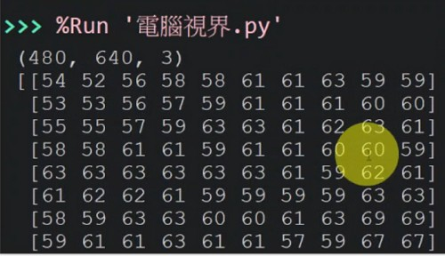

# 🔰 範例程式 - 電腦視界


: 

<br/>

-------------------------------------

## 電腦視界

🎦 範例影片

: <iframe width="560" height="315" src="https://www.youtube.com/embed/V2ei9Wurv6M?start=2&amp;end=382" frameborder="0" allow="accelerometer; autoplay; encrypted-media; gyroscope; picture-in-picture" allowfullscreen></iframe>

📄 Py4t程式碼

```python
from 視覺模組 import *

攝影機 = 設置影像擷取(後端='DSHOW')

while True :
    陣列 = 擷取影像(攝影機)
    陣列 = 左右翻轉(陣列)
    
    顯示影像(陣列)
    
    print(陣列.shape)
    print(陣列[0:10, 0:10, 0])
    
    陣列[:, 200:400, :] = 0
    顯示影像(陣列, 視窗名稱='Image 2')
```

<br/><br/>

-------------------------------------