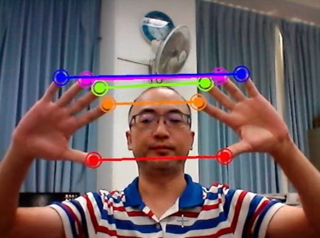

# 🔰 影像範例 - 數位花繩


: 

<br/>

-------------------------------------

## 數位花繩

🎦 Demo影片

: <iframe width="560" height="315" src="https://www.youtube.com/embed/Qnp3UXikoZo?start=6&amp;end=39" frameborder="0" allow="accelerometer; autoplay; encrypted-media; gyroscope; picture-in-picture" allowfullscreen></iframe>


<br/>
<br/>

📄 Py4t程式碼
<!-- 
* 說明1：[程式所需檔案](ar_mask_switch.zip)，下載後需將檔案解壓縮，在與程式相同的資料夾
* 說明2：每次重新偵測臉部時，即會切換
-->

```python
from 視覺模組 import *
import math

攝影機 = 設置影像擷取(後端='DSHOW')
偵測器 = 設置HandAndGesture()

finger_list = [4,8,12,16,20]
finger_flag_dict = { idx:False  for idx in finger_list }
color_dict = { 4 : (0, 0, 255),
            8 : (0, 128, 255),
            12 : (0, 255, 128),
            16 : (255, 0, 255),
            20 : (255, 0, 0)}

def check_finger_touched(手清單, idx):
    global finger_list
    global finger_flag_dict

    if finger_flag_dict[idx]:
        return

    x0, y0 = 手清單[0].特徵點(索引=idx)
    x1, y1 = 手清單[1].特徵點(索引=idx)
    distance = math.sqrt((x1-x0)**2 + (y1-y0)**2)
    if distance < 50:
        finger_flag_dict[idx] = True

def draw_line_index_finger(手清單, idx):
    pt1 = 手清單[0].特徵點(索引=idx)
    pt2 = 手清單[1].特徵點(索引=idx)   
    color=color_dict[idx]

    畫直線(image=陣列,
        pt1=pt1,
        pt2=pt2,
        color=color,
        thickness=2)
    畫圓形(image=陣列,
        center=pt1,
        radius=5,
        color=color,
        thickness=-1)
    畫圓形(image=陣列,
        center=pt1,
        color=color,
        radius=8)
    畫圓形(image=陣列,
        center=pt2,
        radius=5,
        color=color,
        thickness=-1)
    畫圓形(image=陣列,
        center=pt2,
        color=color,
        radius=8)

while True :
    陣列 = 擷取影像(攝影機)
    陣列 = 左右翻轉(陣列)
    結果 = 偵測器.process(陣列)
    if 結果:
        手清單 = 取出Hand清單(結果)
        if len(手清單) == 2:
            for idx in finger_list:
                check_finger_touched(手清單,idx)
                if finger_flag_dict[idx]:
                    draw_line_index_finger(手清單, idx)
                    
    顯示影像(陣列)
```