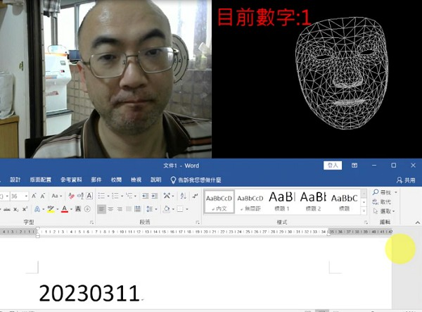

# 🔰 範例程式 - 人臉輸入數字


: 

<br/>

-------------------------------------

## 人臉輸入數字

🎦 Demo影片

: <iframe width="560" height="315" src="https://www.youtube.com/embed/yVZ2dYt8KTU" frameborder="0" allow="accelerometer; autoplay; encrypted-media; gyroscope; picture-in-picture" allowfullscreen></iframe>


<br/>
<br/>

📄 Py4t程式碼

* 說明1：執行程式後，開啟文字編輯器(如記事本)，並將點選編輯區取得焦點(插入點閃爍)
* 說明2：眨右眼增加數字，眨左眼減少數字，開口輸入數字


```python
from 視覺模組 import *
import pyautogui

攝影機 = 設置影像擷取(後端='DSHOW')
偵測器 = 設置FaceMesh()
數字 = 0
左眼計數器 = 0
右眼計數器 = 0
開口計數器 = 0

while True :
    左眼計數器 += 1
    右眼計數器 += 1
    開口計數器 += 1
    陣列 = 擷取影像(攝影機)
    陣列 = 左右翻轉(陣列)
    顯示影像(陣列)
    
    結果 = 偵測器.process(陣列)
    if 結果:
        陣列[:, :, :] = 0
        畫出文字(image=陣列,
             text='目前數字:'+str(數字),
             pos=(10, 10),
             size=60)
        
        標記FaceMesh(陣列, 結果)
        特徵清單 = 取出Landmarks(結果)
        開口長度 = abs(特徵清單[13][1] - 特徵清單[14][1])
        if 開口長度 > 10 :
            標記FaceMesh(陣列, 結果, 'LIPS')
            if 開口計數器 > 20:
                pyautogui.press(str(數字))
                開口計數器 = 0
            
        開眼長度1 = abs(特徵清單[385][1] - 特徵清單[380][1])
        開眼長度2 = abs(特徵清單[158][1] - 特徵清單[153][1])
        if 開眼長度1 < 6:
            標記FaceMesh(陣列, 結果, 'LEFT_EYE')
            if 右眼計數器 > 30:
                數字 += 1
                數字 = 數字 % 10
                右眼計數器 = 0
        elif 開眼長度2 < 6:
            標記FaceMesh(陣列, 結果, 'RIGHT_EYE')
            if 左眼計數器 > 30:
                數字 -= 1
                數字 = (數字+10) % 10
                左眼計數器 = 0
                        
        顯示影像(陣列, 視窗名稱='Image 2')

```

<br/><br/>

