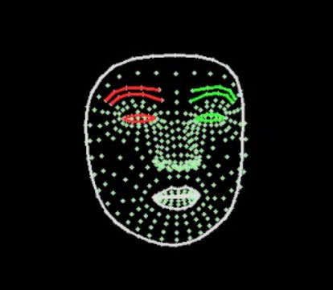

# 🔰 範例程式 - 臉部網格


: 

<br/>

-------------------------------------

## 更多臉部特徵

🎦 範例影片

: <iframe width="560" height="315" src="https://www.youtube.com/embed/9pxUQugN83E?start=2&amp;end=340" frameborder="0" allow="accelerometer; autoplay; encrypted-media; gyroscope; picture-in-picture" allowfullscreen></iframe>

📄 Py4t程式碼

```python
from 視覺模組 import *

攝影機 = 設置影像擷取(後端='DSHOW')
偵測器 = 設置FaceMesh()

while True :
    陣列 = 擷取影像(攝影機)
    陣列 = 左右翻轉(陣列)
    顯示影像(陣列)
    
    結果 = 偵測器.process(陣列)
    if 結果:
        陣列[:, :, :] = 0
        標記FaceMesh(陣列, 結果, 'FACE_LANDMARKS')
        標記FaceMesh(陣列, 結果, 'CONTOURS')
               
        顯示影像(陣列, 視窗名稱='Image 2') 
```

<br/><br/>

-------------------------------------

## 臉部動作

🎦 範例影片

: <iframe width="560" height="315" src="https://www.youtube.com/embed/9pxUQugN83E?start=343&amp;end=596" frameborder="0" allow="accelerometer; autoplay; encrypted-media; gyroscope; picture-in-picture" allowfullscreen></iframe>

📄 Py4t程式碼

```python
from 視覺模組 import *

攝影機 = 設置影像擷取(後端='DSHOW')
偵測器 = 設置FaceMesh()
數字 = 0

while True :
    陣列 = 擷取影像(攝影機)
    陣列 = 左右翻轉(陣列)
    顯示影像(陣列)
    
    結果 = 偵測器.process(陣列)
    if 結果:
        陣列[:, :, :] = 0
        標記FaceMesh(陣列, 結果)
        特徵清單 = 取出Landmarks(結果)        
        
        開口長度 = abs(特徵清單[13][1] - 特徵清單[14][1])
        if 開口長度 > 10 :
            標記FaceMesh(陣列, 結果, 'LIPS')
            數字 += 1
            print(數字)
        顯示影像(陣列, 視窗名稱='Image 2') 
```

<br/><br/>

-------------------------------------