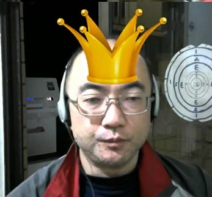

# 🔰 範例程式 - 濾鏡貼紙


: 

<br/>

-------------------------------------

## 特徵點與png去背圖

🎦 範例影片

: <iframe width="560" height="315" src="https://www.youtube.com/embed/JVkRS2VDHJg?start=0&amp;end=506" frameborder="0" allow="accelerometer; autoplay; encrypted-media; gyroscope; picture-in-picture" allowfullscreen></iframe>


📄 Py4t程式碼

```python
from 視覺模組 import *

攝影機 = 設置影像擷取(後端='DSHOW')
png陣列 = 讀取png影像('crown.png')
偵測器 = 設置FaceMesh()

while True :
    陣列 = 擷取影像(攝影機)
    陣列 = 左右翻轉(陣列)
    顯示影像(陣列)
    
    結果 = 偵測器.process(陣列)
    if 結果:
        特徵清單 = 取出Landmarks(結果)
        貼上png中心點(陣列,png陣列,特徵清單[10])
        
        顯示影像(陣列, 視窗名稱='Image 2')  
```

<br/><br/>


-------------------------------------

## 兩點轉換

🎦 範例影片


: <iframe width="560" height="315" src="https://www.youtube.com/embed/JVkRS2VDHJg?start=513&amp;end=704" frameborder="0" allow="accelerometer; autoplay; encrypted-media; gyroscope; picture-in-picture" allowfullscreen></iframe>


📄 Py4t程式碼

```python
from 視覺模組 import *

攝影機 = 設置影像擷取(後端='DSHOW')
png陣列 = 讀取png影像('crown.png')
偵測器 = 設置FaceMesh()

while True :
    陣列 = 擷取影像(攝影機)
    陣列 = 左右翻轉(陣列)
    顯示影像(陣列)
    
    結果 = 偵測器.process(陣列)
    if 結果:
        特徵清單 = 取出Landmarks(結果)
        轉換png陣列 = 兩點transform(
            來源影像=png陣列,
            來源pt1=(100,150),
            來源pt2=(150,150),
            目標影像=陣列,
            目標pt1=特徵清單[109],
            目標pt2=特徵清單[338])
        貼上png(陣列,轉換png陣列)
        
        顯示影像(陣列, 視窗名稱='Image 2') 
```

<br/><br/>