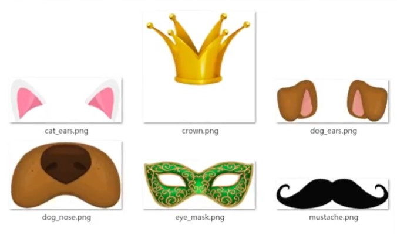

# 🔰 範例程式 - 濾鏡貼紙(多種切換)


: 

<br/>

-------------------------------------

## 濾鏡貼紙(多種切換)

🎦 Demo影片

: <iframe width="560" height="315" src="https://www.youtube.com/embed/014fzyDGMvo" frameborder="0" allow="accelerometer; autoplay; encrypted-media; gyroscope; picture-in-picture" allowfullscreen></iframe>

<br/>
<br/>

📄 Py4t程式碼

* 說明1：[程式所需圖檔](filter_sticker_switch.zip)，下載後需將圖片解壓縮，在與程式相同的資料夾
* 說明2：每次重新偵測臉部時，即會切換

```python
from 視覺模組 import *
import itertools

攝影機 = 設置影像擷取(後端='DSHOW')
偵測器 = 設置FaceMesh()
裝飾清單 = [None]

png陣列 = 讀取png影像('crown.png')
pt1 = (80,160)
pt2 = (170,160)
索引1 = 103
索引2 = 10
裝飾清單.append((png陣列,pt1,pt2,索引1,索引2))

png陣列 = 讀取png影像('dog_ears.png')
pt1 = (150,200)
pt2 = (450,200)
索引1 = 103
索引2 = 332
裝飾清單.append((png陣列,pt1,pt2,索引1,索引2))

png陣列 = 讀取png影像('dog_nose.png')
pt1 = (120,70)
pt2 = (200,70)
索引1 = 166
索引2 = 392
裝飾清單.append((png陣列,pt1,pt2,索引1,索引2))

png陣列 = 讀取png影像('cat_ears.png')
pt1 = (100,220)
pt2 = (500,220)
索引1 = 103
索引2 = 332
裝飾清單.append((png陣列,pt1,pt2,索引1,索引2))

png陣列 = 讀取png影像('eye_mask.png')
pt1 = (230,120)
pt2 = (370,120)
索引1 = 133
索引2 = 362
裝飾清單.append((png陣列,pt1,pt2,索引1,索引2))

png陣列 = 讀取png影像('mustache.png')
pt1 = (116,0)
pt2 = (184,0)
索引1 = 166
索引2 = 392
裝飾清單.append((png陣列,pt1,pt2,索引1,索引2))

裝飾循環 = itertools.cycle(裝飾清單)
裝飾項目 = next(裝飾循環)

while True :
    陣列 = 擷取影像(攝影機)
    陣列 = 左右翻轉(陣列)
    
    結果 = 偵測器.process(陣列)
    if 結果 and 裝飾項目:
        特徵清單 = 取出Landmarks(結果)
        轉換png陣列 = 兩點transform(
            來源影像=裝飾項目[0],
            來源pt1=裝飾項目[1],
            來源pt2=裝飾項目[2],
            目標影像=陣列,
            目標pt1=特徵清單[裝飾項目[3]],
            目標pt2=特徵清單[裝飾項目[4]])
        貼上png(陣列,轉換png陣列)
    
    
    按鍵 = 等待按鍵(20)
    if 按鍵  == ' ':
        裝飾項目 = next(裝飾循環)
    顯示影像(陣列)

```

<br/><br/>


