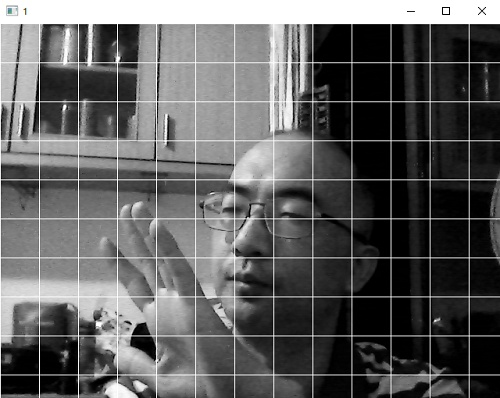
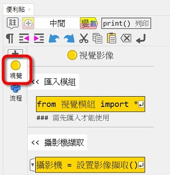

---
hide:
  - navigation
---

# Ⓜ️ 視覺 教學函式庫

---------------

### 📗 說明

這個教學函式庫是建立在[opencv-python](https://pypi.org/project/opencv-python/)、[mss](https://python-mss.readthedocs.io/)、[imutils](https://github.com/PyImageSearch/imutils)等電腦視覺與影像函式庫上。從攝影機或是影像檔案，取得[numpy](https://numpy.org/)多維陣列的影像，可以對影像做出改變亮度、對比、縮放、負片和左右翻轉等效果，並進行電腦影像的處理。

本函式庫常常會搭配[numpy](https://numpy.org/)多維陣列及[matplotlib](https://matplotlib.org/)資料可視化函式庫一起使用。

視覺教學函式庫可以顯示攝影機畫面，並對擷取到的多維陣列，做一些如格線與電視牆的效果處理

💬使用視訊功能時，電腦上需要有視訊攝影機

---------------

### 📘 範例

| 範例                             | 截圖                                                              |
| :-----------:                    | :------------------------------------:                            |
| [灰階點陣](grayscale_pixel.md)          | [{width=150}](grayscale_pixel.md)           |
| [攝影機](camera.md)          | [{width=150}](camera.md)           |
| [影像格線](camera_slice.md)          | [{width=150}](camera_slice.md)           |
| [電視牆](camera_tile.md)          | [{width=150}](camera_tile.md)           |

---------------

### 📕 便利貼

以下為便利貼的使用資訊(視覺與多維)：

| 便利貼顯示                           | 便利貼內容                                                              |
| :-----------:                    | :------------------------------------:                            |
|     |     |
|     |     |

---------------

### 📙 原始碼

視覺 教學函式庫 在:fontawesome-brands-github:github上的原始碼: [cv4t](https://github.com/beardad1975/cv4t)

