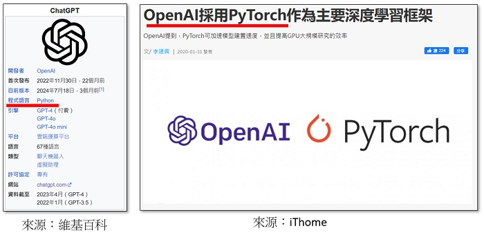
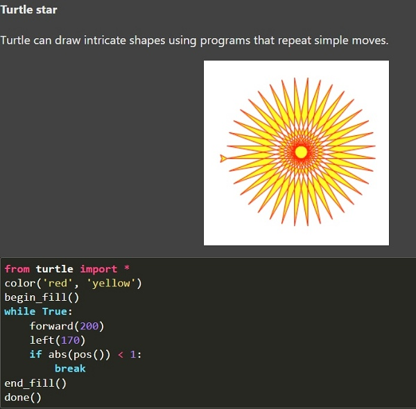

---
hide:
  - navigation
---

# 📚AI當助教・一起來教青少年學Python

----------------------------
##  📕 引言 
----------------------------

: 近來生成式AI發展快速，網站上多了許多文字、程式、圖片、音樂及影片等生成服務。不過，也經常可以看到如下方的報導或影片。

: 

: <sup>(資料來源:</sup>[^job_replace]<sup>)</sup>

[^job_replace]: youtube頻道 -- USTV 非凡電視、Joen99、朱宥勳使出人生攻擊!、HackBear 泰瑞


<br/>
<br/>


: <iframe width="560" height="315" src="https://www.youtube.com/embed/J1P_RIeYPVY?start=212&amp;end=271" frameborder="0" allow="accelerometer; autoplay; encrypted-media; gyroscope; picture-in-picture" allowfullscreen></iframe>

: <sup>(59秒, 資料來源:</sup>[^job_disappear]<sup>)</sup>

[^job_disappear]: 3億工作即將消失？AI 熱潮半年，你的工作真的有改變嗎？, by 志祺七七 X 圖文不符  , [youtube連結](https://youtu.be/J1P_RIeYPVY) 


<br/>

: AI雖然為人們帶來了新的便利服務，但未來人們的工作真的會被AI取代嗎？程式設計師會被AI取代嗎？以下經由體驗AI助理的程式設計輔助，相信在你心中就會有自己的看法。

----------------------------
##  📗 Coding工作
----------------------------

: ChatGPT是OpenAI所開發的大型語言模型，能夠以對話的方式理解並回應使用者的輸入內容，從2022年底發佈以來，受到全球的矚目。ChatGPT是資訊科學家研究深度學習的里程碑，你知道它是用什麼程式語言開發出來的嗎？


: 


<br/>
<br/>


: Coding(程式設計)是什麼？撰寫python程式需要人們需要做哪些事？讓我們來寫個簡單的海龜程式吧(Py4t簡化便利貼)


???+ example "範例程式 海龜畫多邊形 - - - - - - - (海龜畫多邊形 1/2 新檔)"

    === "💻程式碼"

        ```python
        from 海龜模組 import *
        速度('fastest')

        for 數 in range(500) :
            向前(數*2)
            右轉(360/5 - 1)    

        完成()
        ```

<br/>


: 想一想，在程式設計的過程中，人們通常要做哪些事？

: 


<br/>
<br/>


: 海龜的原文是turltle，相關的功能可以到官網查詢。 :fontawesome-solid-link: <a href="https://docs.python.org/3.10/library/turtle.html" target="_blank">turtle官網</a>

: 

: 接下來，利用官網上的說明，將程式改寫為英文程式。

<BR/>
<BR/>

???+ example "範例程式 turtle英文程式 - - - - - - - (海龜畫多邊形 2/2 接續)"

    === "💻程式碼"

        ```python
        from turtle import *
        speed('fastest')

        for i in range(500) :
            forward(i*2)
            right(360/5 - 1)    

        done()
        ```

<br/>

: 除了基本的編輯，在程式設計的過程中，人們還要做什麼事？

: 

: 這些程式的工作，真的會被AI取代嗎？

<br/>
<br/>

----------------------------
##  📘 不用學程式？
----------------------------

: Nvidia(輝達)是美國一家以設計和銷售圖形處理器（GPU）的科技公司，在2024年6月，它取代微軟成為全球市值最高的公司。這家公司與AI有什麼關係呢？


<iframe width="560" height="315" src="https://www.youtube.com/embed/UgmO0hkPF88?start=153&amp;end=263" frameborder="0" allow="accelerometer; autoplay; encrypted-media; gyroscope; picture-in-picture" allowfullscreen></iframe>

: <sup>(1分52秒, 資料來源:</sup>[^about_nvidia]<sup>)</sup>

[^about_nvidia]: 看懂 #Nvidia 如何因20年前的一個決定，成為今天AI霸主【懂商業 看商周】Ep.25 #GTC #黃仁勳, by 商業周刊  , [youtube連結](https://youtu.be/UgmO0hkPF88) 

<br/>
<br/>

: 黃仁勳(Jensen Huang)是臺灣裔美國人，出生於臺灣的台南，9歲時移居美國，是NVIDIA（輝達）的共同創辦人暨執行長，他參加杜拜 (UNA/WAM) 2024 年世界政府高峰會，以下是有關他的訪談：

<br/>

<iframe width="560" height="315" src="https://www.youtube.com/embed/HN4Gzy9vUBY?start=0&amp;end=49" frameborder="0" allow="accelerometer; autoplay; encrypted-media; gyroscope; picture-in-picture" allowfullscreen></iframe>
: <sup>(50秒, 播放速度請調為0.75, 資料來源:</sup>[^dont_learn_code]<sup>)</sup>

[^dont_learn_code]: Nvidia 黃仁勳談AI時代該如何教育下一代, by 麥塊程式教育  , [youtube連結](https://youtu.be/HN4Gzy9vUBY) 


<br/>


----------------------------
##  📙 整合AI助理
----------------------------


----------------------------
##  📕 AI助理應用 
----------------------------


----------------------------
##  📗 思考未來程式教育
----------------------------


