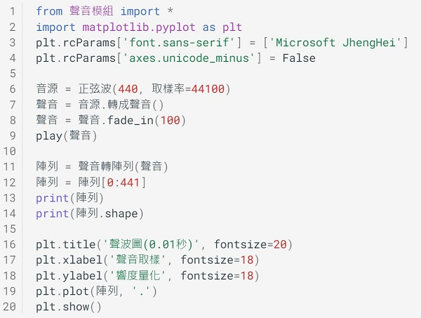

---
hide:
  - navigation
---

# 📚 陣列與數位訊號

: 引言(陣列 訊號)

??? info "關於視覺與聲音教學模組"

    : ...

    : :fontawesome-solid-link: <a href="../../turtle4t/" target="_blank">...</a>

    

----------------------------

##  📙 numpy多維陣列

***1維陣列*** 

----------------------------

: 1維陣列操作

    

----------------------------

***2維陣列*** 

----------------------------

: 2維陣列操作

    

----------------------------

##  📗 聲音與1維陣列 

***聲音的要素*** 

----------------------------

: 3要素

: 正弦波  (補充正弦波訊號函式)

    

----------------------------

###  ► 聲音訊號 

----------------------------

: 音源

: 轉成1維 圖表  離散點

: 取樣 量化 (改變音高，大小聲)

: 正弦波 方波 白噪音 

: 聲音的處理 (相加 淡出  )

???+ example "範例程式 聲音訊號 - - - - - - - (聲音與1維陣列 1/2 新檔)"

    === "🎦操作影片"
    
        <iframe width="560" height="315" src="https://www.youtube.com/embed/-BMUwYRELw4" frameborder="0" allow="accelerometer; autoplay; encrypted-media; gyroscope; picture-in-picture" allowfullscreen></iframe>

        【長度14:47 章節時間如下】

        * 0:00 存檔、切換便利貼
        * 1:00 聲音、陣列與圖表
        * 5:50 取樣與量化
        * 10:34 陣列切片與音源

    === "💻程式截圖"

         

    

----------------------------

###  ► 音訊處理 

----------------------------

: 樂器的波形

: 人聲的波形

: 聲音的處理 混合

   

----------------------------

##  📘 灰階圖與2維陣列

***灰階圖生成***

----------------------------

    

----------------------------

***照片數位處理*** 

----------------------------

   

----------------------------

##  📙 彩色影像與3維陣列

***彩圖通道分離***

----------------------------

   

----------------------------

***視訊拼接*** 

----------------------------

   