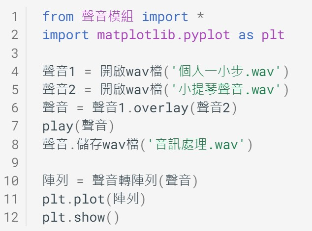
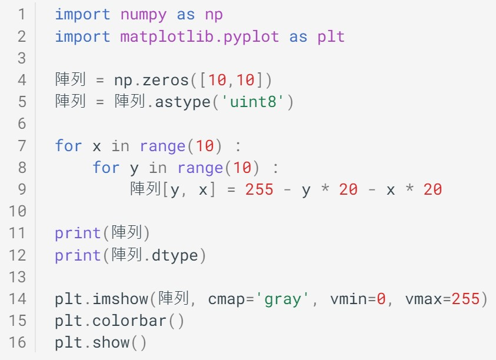

---
hide:
  - navigation
---

# 📚 陣列與影音數位化

: 引言(陣列 訊號)

??? info "關於視覺與聲音教學模組"

    : ...

    : :fontawesome-solid-link: <a href="../../turtle4t/" target="_blank">...</a>

    

----------------------------

##  📙 陣列資料結構

### ***list與array***

----------------------------

    

----------------------------

### ***numpy多維陣列*** 

----------------------------

    

----------------------------

##  📗 音訊與1維陣列(2) 

### ***聲音要素***

----------------------------

: 聲音是一種由振動產生的波動，聲波通過空氣的傳播，當耳朵接收到聲波時，就會讓我們聽見聲音。

: 那聲音有什麼基本的組成要素呢？一起來看看下面的影片：

: <iframe width="560" height="315" src="https://www.youtube.com/embed/d6Lzym61NDg?start=0&amp;end=108" frameborder="0" allow="accelerometer; autoplay; encrypted-media; gyroscope; picture-in-picture" allowfullscreen></iframe>

: (1分48秒, 資料來源:[^sound_elements])

[^sound_elements]: 【波動與聲音】 聲音的三要素, By 均一教育平台 Junyi Academy , [youtube連結](https://youtu.be/d6Lzym61NDg) 

: 經由影片的說明，我們可以得知，聲音的三要素是「**音調**」、「**響度**」與「**音色**」。

  

: 聲波不同的振動頻率，會產生不同的音調，讓我們感受到高音與低音。

: 

: (資料來源:[^sound_elements])

: 

  

: 特定的頻率，可依規則組成不同的音階，讓聲音變成悅耳的音樂，音階與頻率的對照表如下：

: 

: (資料來源:[^pitch_frequency])

[^pitch_frequency]: Make Maker . Arduino 蜂鳴器發聲, [http://jiader.blogspot.com/2018/08/arduino.html](http://jiader.blogspot.com/2018/08/arduino.html)

  

: 聲波的振動幅度大小，會產生不同的聲音響度，讓我們感受到大聲與小聲。

: 

: (資料來源:[^sound_elements])

: 

  

: 不同聲源的聲波有不同的波形，會產生不同的音色，讓我們可以分辨出如人聲與樂器聲的差異。

: 

: (資料來源:[^sound_elements])

    

----------------------------

###  ***聲音訊號*** 

----------------------------

: 聲音訊號可以定義為「**隨著時間改變的振幅大小**」，在經過**取樣**與**量化**的處理後，就可以將聲音**數位化**。音訊的數位聲波資訊可以利用「**1維陣列的資料結構**」來存放。為了更清楚地觀察聲波變化，我們可以將音訊的資料陣列以圖表的方式來呈現。

: 

  

: 真實世界中的聲波是連續的類比訊號，如果要將聲波數位化，變成一個個離散的數位訊號，就必須對聲音訊號做「取樣」的動作，取樣的資料因為具有相同型態，多以陣列的資料結構存放，請看下圖：

: 

  

: 了解了「取樣率」與「取樣週期」後，看看下圖中，在常見的數位音訊取樣率。取樣率越高，數位音訊的品質就越好。

: 

: (資料來源:[^sample_rate_example])

[^sample_rate_example]: 取樣率, [維基百科連結](https://zh.wikipedia.org/zh-tw/%E9%87%87%E6%A0%B7%E7%8E%87) 

  

: 在將聲音訊號取樣時，取到的值是聲音的振幅大小(與響度有關)，這個動作是「量化」，可以使用不同位元數來表示量化的值。採用的位元數越高，振幅會有更細膩的變化，音訊的品質就越好。

: 

  

: 

: * 自然界中的聲音可以弦波來表示，弦波是類比訊號的代表。

: * 方波是只有「低」與「高」這兩種變化，常出現在電子訊號的處理，是數位訊號的代表。

: * 如果將量化值以隨機方式產生，就會是發出沙沙聲的雜訊。而其中的白噪音是一種均勻分布，平均值為0，樣本之間互相獨立的均勻雜訊。根據一些研究顯示，在一定的條件下，白噪音可以幫助睡眠(註[^white_noise_and_sleeping])。

[^white_noise_and_sleeping]: hello醫師, 白噪音可助眠～這3種潛在影響要注意, [https://helloyishi.com.tw/sleep/a-good-nights-sleep/what-does-white-noise-affect-us/](https://helloyishi.com.tw/sleep/a-good-nights-sleep/what-does-white-noise-affect-us/)

  

: 請動手實作程式。

???+ example "範例程式 聲音訊號 - - - - - - - (音訊與1維陣列 1/2 新檔)"

    === "🎦操作影片"
    
        <iframe width="560" height="315" src="https://www.youtube.com/embed/-BMUwYRELw4" frameborder="0" allow="accelerometer; autoplay; encrypted-media; gyroscope; picture-in-picture" allowfullscreen></iframe>

        【長度14:47 章節時間如下】

        * 0:00 存檔、切換便利貼
        * 1:00 聲音、陣列與圖表
        * 5:50 取樣與量化
        * 10:34 陣列切片與音源

    === "💻程式截圖"

         

    

----------------------------

###  ***玩轉聲音*** 

----------------------------

: 我們使用人類說話聲、鋼琴聲、小提琴聲，來觀察不同聲音的不同波形，不同波形的聲音會產生不同的音色。

: 

??? info "個人一小步，人類一大步"

    : 1969年7月21日凌晨2點56分（UTC），美國太空人阿姆斯壯的左腳踏上了月球，並說道：「這是一個人的一小步，卻是人類的一大步」。本課程使用這個聲音做為範例。
    : （That's one small step for man, one giant leap for mankind.）

    : 詳見：[維基百科](https://zh.m.wikipedia.org/zh-tw/%E5%B0%BC%E5%B0%94%C2%B7%E9%98%BF%E5%A7%86%E6%96%AF%E7%89%B9%E6%9C%97)	

  

: 聲音數位化後，就可以利用電腦來做各種處理，讓聲音陣列中的取樣資料經由運算後，產生不同的效果。

: 淡出及淡入是常見的音訊處理方式，讓聲音的開始、結束或連接不會太突兀。淡出與淡入處理的波形圖如下：

: 

  

: 聲音反轉，是把聲音的取樣資料，反向播放。

: 

  

: 兩個聲音可以做串接的處理，下面是兩種波形的串接示範：

: 

  

: 如果要讓聲音串接得更平順，可以使用交叉淡化，兩個聲音交界時，會做淡化及交錯的處理。

: 

  

: 使用聲音混合(或覆疊)，可以將兩種聲音合在一起。

: 

  

: 請動手實作程式。

???+ example "範例程式 玩轉聲音 - - - - - - - (音訊與1維陣列 2/2 新檔)"

    === "🎦操作影片"
    
        <iframe width="560" height="315" src="https://www.youtube.com/embed/bxVtlTDf5hE?start=0&amp;end=702" frameborder="0" allow="accelerometer; autoplay; encrypted-media; gyroscope; picture-in-picture" allowfullscreen></iframe>

        【長度11:42 章節時間如下】

        * 0:00 存檔、切換便利貼
        * 0:56 wav檔、陣列與聲波圖
        * 3:32 不同聲色與波形
        * 5:46 單一聲音處理
        * 7:47 兩種聲音處理
        * 10:35 儲存wav檔

    === "💻程式截圖"

         

   

----------------------------

##  📘 灰階與2維陣列(2)

### ***灰階點陣***

----------------------------

: 影像可以定義為隨著空間座標改變的亮度值，電磁波頻譜中的一小段是可見光，可見光波傳播到人類的眼睛時，我們就會感覺到光的顏色。

: 數位影像，將類比影像資料，以2維空間的方式取樣並將色光的亮度值量化，就會形成點陣的方陣資料，儲存在如2維陣列的資料結構中。

: 

: (資料來源:[^digital_image_creation])

[^digital_image_creation]: Basic Properties of Digital Images, [https://hamamatsu.magnet.fsu.edu/articles/digitalimagebasics.html](https://hamamatsu.magnet.fsu.edu/articles/digitalimagebasics.html)

  

: 為求簡單好理解，這邊先使用灰階影像，只有一個顏色通道，量位位元深度使用8個位元，數值範圍的是從不發光(黑0)到發光(白255)。從下圖可以看出2維陣列與灰階點陣圖的關係。

: 

: (資料來源:[^2d-pixel-array])

[^2d-pixel-array]: Image – 2D pixel array, [https://www.researchgate.net/figure/Image-2D-pixel-array_fig4_267204802](https://www.researchgate.net/figure/Image-2D-pixel-array_fig4_267204802)

  

: numpy多維陣列中的資料有不同的類型，有不同的位元組大小，能存放的資料範圍也不同。

| 資料類型  | 位元組 | 說明                          |
| ---------|--- | ------------------------------------ |
| uint8     | 1  |  非負整數，範圍0～255 (在課程中用來存放影像資料)  |
| int16     | 2  |  整數，範圍-32768～32767 (在課程中用來存放音訊資料) |
| float64   | 8 | 雙精度浮點數(可使用小數) |

  

: 因整數類型有固定的數值範圍，當超過最大值時，就會產生溢位(overflow)的情形，看看下圖的計數器，再加1之後會變成多大呢？

: 

: (資料來源:[^integer_overflow])

[^integer_overflow]: MIT News, Better debugger, [https://news.mit.edu/2015/integer-overflow-debugger-outperforms-predecessors-0324](https://news.mit.edu/2015/integer-overflow-debugger-outperforms-predecessors-0324)

: numpy多維陣列中的uint8，當發生超過最大值255的溢位情形時，會再從0開始。

  

一起來動手寫程式。

???+ example "範例程式 灰階點陣 - - - - - - - (灰階與2維陣列 1/2 新檔)"

    === "🎦操作影片"
    
        <iframe width="560" height="315" src="https://www.youtube.com/embed/vC0rJwPXcQY?start=0&amp;end=581" frameborder="0" allow="accelerometer; autoplay; encrypted-media; gyroscope; picture-in-picture" allowfullscreen></iframe>

        【長度9:41 章節時間如下】

        * 0:00 存檔、切換便利貼
        * 1:05  2維陣列與資料類型
        * 3:04 灰階點陣圖與顏色條
        * 7:12 for迴圈改變點陣圖

    === "💻程式截圖"

         

    

----------------------------

### ***灰階拼貼*** 

----------------------------

: 待建置…

   

----------------------------

##  📙 彩色影像與3維陣列(2)

### ***通道分離***

----------------------------

: 待建置…

   

----------------------------

### ***視訊分割*** 

----------------------------

: 待建置…

   