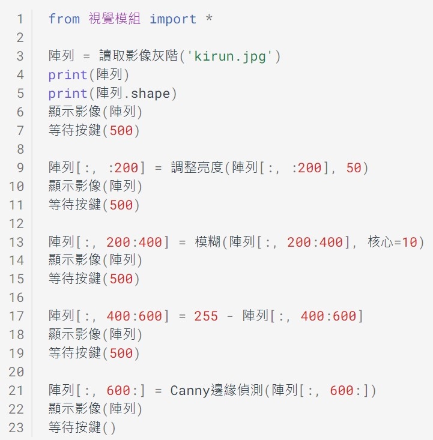
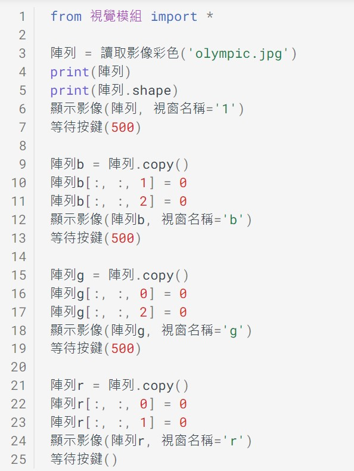
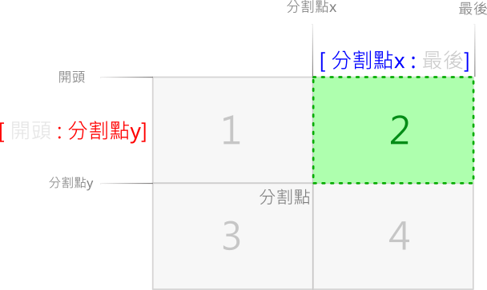
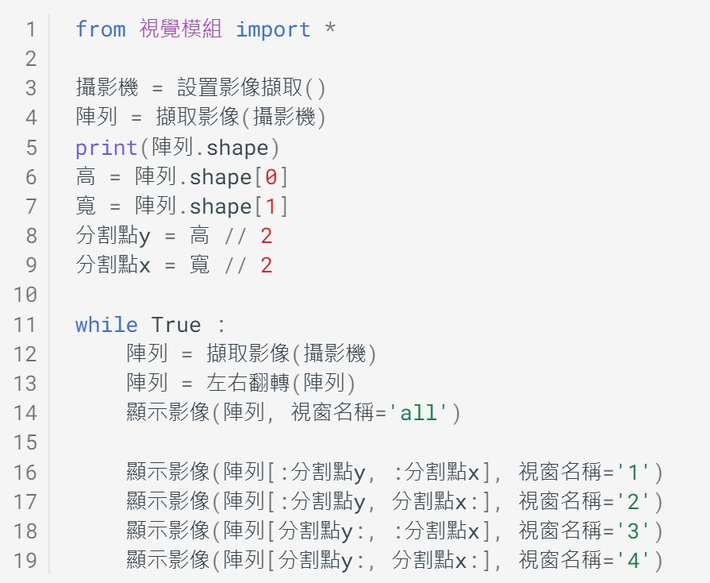

---
hide:
  - navigation
---

# 📚 陣列與影音數位化

: 當我們使用電腦來處理影像與聲音時，常常會使用相關的影像及音訊處理軟體。

: 

: 你曾經想過嗎？電腦在播放音樂、剪裁音樂、顯示照片、影片編輯時，它到底做了什麼計算？聲音與照片是如何以數位資料來表示呢？

: 在本課程中，我們將探索影音數位資料與陣列的關係。

??? info "關於視覺影像與聲音訊號"

    : 本課程使用到整合後的教學函式庫，如下連結

    : :fontawesome-solid-link: <a href="../../cv4t/" target="_blank">Py4t 視覺影像 說明、範例程式</a>

    : :fontawesome-solid-link: <a href="../../audio4t/" target="_blank">Py4t 聲音訊號 說明、範例程式</a>

 
 

----------------------------

##  📙 陣列資料結構

### ***陣列是什麼*** 

----------------------------

: 在資訊科學中，陣列(Array)是一種**資料結構**，是由**相同類型元素**（element）的集合所組成。

: 陣列可分成1、2、3維陣列。

: 

: 

: 

: (資料來源:[^parking_array])

[^parking_array]: 圖片來源：康軒教科書 國中二上科技領域資訊科技課本第52頁圖片

  

----------------------------

### ***numpy多維陣列*** 

----------------------------

: 

: (資料來源:[^numpy_intro])

[^numpy_intro]: NumPy 函式庫, [https://steam.oxxostudio.tw/category/python/numpy/about-numpy.html](https://steam.oxxostudio.tw/category/python/numpy/about-numpy.html)

: 

: (資料來源:[^123d_array])

[^123d_array]: 6 Best NumPy Online Courses for Beginners in 2022, [https://medium.com/javarevisited/6-best-online-courses-to-learn-numpy-for-beginners-60120f611e06](https://medium.com/javarevisited/6-best-online-courses-to-learn-numpy-for-beginners-60120f611e06)

  

: 

: (資料來源:[^np_array_1d])

[^np_array_1d]: NumPy Illustrated: The Visual Guide to NumPy, [https://betterprogramming.pub/numpy-illustrated-the-visual-guide-to-numpy-3b1d4976de1d](https://betterprogramming.pub/numpy-illustrated-the-visual-guide-to-numpy-3b1d4976de1d)

  

: 

: (資料來源:[^numpy_slice])

[^numpy_slice]: Python NumPy Tutorial: An Applied Introduction for Beginners, [https://www.learndatasci.com/tutorials/applied-introduction-to-numpy-python-tutorial/](https://www.learndatasci.com/tutorials/applied-introduction-to-numpy-python-tutorial/)

    

----------------------------

##  📗 音訊與1維陣列(2) 

### ***聲音要素***

----------------------------

: 聲音是一種由振動產生的波動，聲波通過空氣的傳播，當耳朵接收到聲波時，就會讓我們聽見聲音。

: 那聲音有什麼基本的組成要素呢？一起來看看下面的影片：

: <iframe width="560" height="315" src="https://www.youtube.com/embed/d6Lzym61NDg?start=0&amp;end=108" frameborder="0" allow="accelerometer; autoplay; encrypted-media; gyroscope; picture-in-picture" allowfullscreen></iframe>

: (1分48秒, 資料來源:[^sound_elements])

[^sound_elements]: 【波動與聲音】 聲音的三要素, By 均一教育平台 Junyi Academy , [youtube連結](https://youtu.be/d6Lzym61NDg) 

: 經由影片的說明，我們可以得知，聲音的三要素是「**音調**」、「**響度**」與「**音色**」。

  

: 聲波不同的振動頻率，會產生不同的音調，讓我們感受到高音與低音。

: 

: (資料來源:[^sound_elements])

: 

  

: 特定的頻率，可依規則組成不同的音階，讓聲音變成悅耳的音樂，音階與頻率的對照表如下：

: 

: (資料來源:[^pitch_frequency])

[^pitch_frequency]: Make Maker . Arduino 蜂鳴器發聲, [http://jiader.blogspot.com/2018/08/arduino.html](http://jiader.blogspot.com/2018/08/arduino.html)

  

: 聲波的振動幅度大小，會產生不同的聲音響度，讓我們感受到大聲與小聲。

: 

: (資料來源:[^sound_elements])

: 

  

: 不同聲源的聲波有不同的波形，會產生不同的音色，讓我們可以分辨出如人聲與樂器聲的差異。

: 

: (資料來源:[^sound_elements])

    

----------------------------

###  ***聲音訊號*** 

----------------------------

: 聲音訊號可以定義為「**隨著時間改變的振幅大小**」，在經過**取樣**與**量化**的處理後，就可以將聲音**數位化**。音訊的數位聲波資訊可以利用「**1維陣列的資料結構**」來存放。為了更清楚地觀察聲波變化，我們可以將音訊的資料陣列以圖表的方式來呈現。

: 

  

: 真實世界中的聲波是連續的**類比訊號**，如果要將聲波數位化，變成一個個離散的**數位訊號**，就必須對聲音訊號做「**取樣**」的動作，取樣的資料因為具有相同型態，多以陣列的資料結構存放，請看下圖：

: 

  

: 了解了「取樣率」與「取樣週期」後，看看下圖中，在常見的數位音訊取樣率。取樣率越高，數位音訊的品質就越好。

: 

: (資料來源:[^sample_rate_example])

[^sample_rate_example]: 取樣率, [維基百科連結](https://zh.wikipedia.org/zh-tw/%E9%87%87%E6%A0%B7%E7%8E%87) 

  

: 在將聲音訊號取樣時，取到的值是聲音的**振幅大小**(與響度有關)，這個動作是「**量化**」，可以使用不同位元數來表示量化的值。採用的位元數越高，振幅會有更細膩的變化，音訊的品質就越好。

: 

  

: 

: * 自然界中的聲音可以弦波來表示，弦波是類比訊號的代表。

: * 方波是只有「低」與「高」這兩種變化，常出現在電子訊號的處理，是數位訊號的代表。

: * 如果將量化值以隨機方式產生，就會是發出沙沙聲的雜訊。而其中的白噪音是一種均勻分布，平均值為0，樣本之間互相獨立的均勻雜訊。根據一些研究顯示，在一定的條件下，白噪音可以幫助睡眠(註[^white_noise_and_sleeping])。

[^white_noise_and_sleeping]: hello醫師, 白噪音可助眠～這3種潛在影響要注意, [https://helloyishi.com.tw/sleep/a-good-nights-sleep/what-does-white-noise-affect-us/](https://helloyishi.com.tw/sleep/a-good-nights-sleep/what-does-white-noise-affect-us/)

  

: 請動手實作程式。

???+ example "範例程式 聲音訊號 - - - - - - - (音訊與1維陣列 1/2 新檔)"

    === "🎦操作影片"
    
        <iframe width="560" height="315" src="https://www.youtube.com/embed/-BMUwYRELw4" frameborder="0" allow="accelerometer; autoplay; encrypted-media; gyroscope; picture-in-picture" allowfullscreen></iframe>

        【長度14:47 章節時間如下】

        * 0:00 存檔、切換便利貼
        * 1:00 聲音、陣列與圖表
        * 5:50 取樣與量化
        * 10:34 陣列切片與音源

    === "💻程式截圖"

         

    

----------------------------

###  ***玩轉聲音*** 

----------------------------

: 我們使用人類說話聲、鋼琴聲、小提琴聲，來觀察不同聲音的不同波形，不同波形的聲音會產生不同的音色。

: 

??? info "個人一小步，人類一大步"

    : 1969年7月21日凌晨2點56分（UTC），美國太空人阿姆斯壯的左腳踏上了月球，並說道：「這是一個人的一小步，卻是人類的一大步」。本課程使用這個聲音做為範例。
    : （That's one small step for man, one giant leap for mankind.）

    : 詳見：[維基百科](https://zh.m.wikipedia.org/zh-tw/%E5%B0%BC%E5%B0%94%C2%B7%E9%98%BF%E5%A7%86%E6%96%AF%E7%89%B9%E6%9C%97)	

  

: 聲音數位化後，就可以利用電腦來做各種處理，讓聲音陣列中的取樣資料經由運算後，產生不同的效果。

: 淡出及淡入是常見的音訊處理方式，讓聲音的開始、結束或連接不會太突兀。淡出與淡入處理的波形圖如下：

: 

  

: 聲音反轉，是把聲音的取樣資料，反向播放。

: 

  

: 兩個聲音可以做串接的處理，下面是兩種波形的串接示範：

: 

  

: 如果要讓聲音串接得更平順，可以使用交叉淡化，兩個聲音交界時，會做淡化及交錯的處理。

: 

  

: 使用聲音混合(或覆疊)，可以將兩種聲音合在一起。

: 

  

: 請動手實作程式。

???+ example "範例程式 玩轉聲音 - - - - - - - (音訊與1維陣列 2/2 新檔)"

    === "🎦操作影片"
    
        <iframe width="560" height="315" src="https://www.youtube.com/embed/bxVtlTDf5hE?start=0&amp;end=702" frameborder="0" allow="accelerometer; autoplay; encrypted-media; gyroscope; picture-in-picture" allowfullscreen></iframe>

        【長度11:42 章節時間如下】

        * 0:00 存檔、切換便利貼
        * 0:56 wav檔、陣列與聲波圖
        * 3:32 不同聲色與波形
        * 5:46 單一聲音處理
        * 7:47 兩種聲音處理
        * 10:35 儲存wav檔

    === "💻程式截圖"

         

   

----------------------------

##  📘 灰階與2維陣列(2)

### ***灰階點陣***

----------------------------

: 影像可以定義為「**隨著空間座標改變的亮度值**」，電磁波頻譜中的一小段是可見光，可見光波傳播到人類的眼睛時，我們就會感覺到光的顏色。

: 數位影像，將類比影像資料，以2維空間的方式**取樣**並將色光的亮度值**量化**，就會形成點陣的方陣資料，儲存在如陣列的資料結構中。

: 

: (資料來源:[^digital_image_creation])

[^digital_image_creation]: Basic Properties of Digital Images, [https://hamamatsu.magnet.fsu.edu/articles/digitalimagebasics.html](https://hamamatsu.magnet.fsu.edu/articles/digitalimagebasics.html)

  

: 為求簡單好理解，這邊先使用灰階影像，只有一個顏色通道，量位位元深度使用8個位元，數值範圍的是從不發光(黑0)到發光(白255)。從下圖可以看出2維陣列與灰階點陣圖的關係。

: 

: (資料來源:[^2d-pixel-array])

[^2d-pixel-array]: Image – 2D pixel array, [https://www.researchgate.net/figure/Image-2D-pixel-array_fig4_267204802](https://www.researchgate.net/figure/Image-2D-pixel-array_fig4_267204802)

  

: numpy多維陣列中的資料有不同的類型，有不同的位元組大小，能存放的資料範圍也不同。

| 資料類型  | 位元組 | 說明                          |
| ---------|--- | ------------------------------------ |
| uint8     | 1  |  非負整數，範圍0～255 (在課程中用來存放影像資料)  |
| int16     | 2  |  整數，範圍-32768～32767 (在課程中用來存放音訊資料) |
| float64   | 8 | 雙精度浮點數(可使用小數) |

  

: 因整數類型有固定的數值範圍，當超過最大值時，就會產生溢位(overflow)的情形，看看下圖的計數器，再加1之後會變成多大呢？

: 

: (資料來源:[^integer_overflow])

[^integer_overflow]: MIT News, Better debugger, [https://news.mit.edu/2015/integer-overflow-debugger-outperforms-predecessors-0324](https://news.mit.edu/2015/integer-overflow-debugger-outperforms-predecessors-0324)

: numpy多維陣列中的uint8，當發生超過最大值255的溢位情形時，會再從0開始；反之，當發生超過最小值0的溢位情形時，則會從255開始

  

一起來動手寫程式。

???+ example "範例程式 灰階點陣 - - - - - - - (灰階與2維陣列 1/2 新檔)"

    === "🎦操作影片"
    
        <iframe width="560" height="315" src="https://www.youtube.com/embed/vC0rJwPXcQY?start=0&amp;end=581" frameborder="0" allow="accelerometer; autoplay; encrypted-media; gyroscope; picture-in-picture" allowfullscreen></iframe>

        【長度9:41 章節時間如下】

        * 0:00 存檔、切換便利貼
        * 1:05  2維陣列與資料類型
        * 3:04 灰階點陣圖與顏色條
        * 7:12 for迴圈改變點陣圖

    === "💻程式截圖"

         

    

----------------------------

### ***灰階切片*** 

----------------------------

: 利用python的切片語法(slicing)，我們可以取出2維陣列的一塊區域。

: 

: (資料來源:[^np_matrix_indexing_2d])

[^np_matrix_indexing_2d]: NumPy: the absolute basics for beginners, [https://numpy.org/devdocs/user/absolute_beginners.html](https://numpy.org/devdocs/user/absolute_beginners.html)

  

: 將陣列經過各種計算處理，顯示出來的圖片也會跟著改變。以下是模糊的處理，也可以稱為平滑處理，具有影像去噪的效果。

: 

 

: 平滑處理通常是運用卷積運算(Convolution)，利用一個卷積核掃過整張圖，來得到新的圖片陣列。

: 

: (資料來源:[^average_blur_kernel])

[^average_blur_kernel]: Computer Vision for Beginners: Part 2, [https://towardsdatascience.com/computer-vision-for-beginners-part-2-29b3f9151874](https://towardsdatascience.com/computer-vision-for-beginners-part-2-29b3f9151874)

  

: 以下是將陣列中的值，以亮度最大值(255)減去，會得到負片效果，圖片亮度反轉。

: 

  

: 下圖是將陣列做Canny邊緣偵測的運算處理。

: 

  

: 利用陣列切片與運算效果來處理照片，請動手寫出程式。

???+ example "範例程式 灰階切片 - - - - - - - (灰階與2維陣列 2/2 新檔)"

    === "🎦操作影片"
    
        <iframe width="560" height="315" src="https://www.youtube.com/embed/okx9rlfdDs8?start=0&amp;end=586" frameborder="0" allow="accelerometer; autoplay; encrypted-media; gyroscope; picture-in-picture" allowfullscreen></iframe>

        【長度9:46 章節時間如下】

        * 0:00 存檔、切換便利貼
        * 0:56 讀取顯示圖片、列印陣列
        * 3:11 切片調整亮度
        * 5:01 切片糢糊處理
        * 6:29 切片負片效果
        * 8:17 切片邊緣偵測

    === "💻程式截圖"

         

    

----------------------------

##  📙 彩色影像與3維陣列(2)

### ***通道分離***

----------------------------

: 彩色影像的亮度分為3個通道，分別為藍(Blue)、綠(Green)、紅(Red)三層，所以彩色影像可以使用3維陣列來表示。

  

: 

: (資料來源:[^xyz_bgr])

[^xyz_bgr]: 機械視覺: 在python上操作opencv-基礎 &#8211; Q. Y. Wu Code World, [https://qingyangdotblog.wordpress.com/2017/08/28/%E6%A9%9F%E6%A2%B0%E8%A6%96%E8%A6%BA-%E5%9C%A8python%E4%B8%8A%E6%93%8D%E4%BD%9Copencv-%E5%9F%BA%E7%A4%8E/](https://qingyangdotblog.wordpress.com/2017/08/28/%E6%A9%9F%E6%A2%B0%E8%A6%96%E8%A6%BA-%E5%9C%A8python%E4%B8%8A%E6%93%8D%E4%BD%9Copencv-%E5%9F%BA%E7%A4%8E/)

  
: 

: (資料來源:[^3d_array_channel])

[^3d_array_channel]: Perform Basic Image Processing using Python3 and OpenCV, [https://tbhaxor.com/basic-image-processing-using-python3-and-opencv/](https://tbhaxor.com/basic-image-processing-using-python3-and-opencv/)

  

: 請著將彩色圖片轉為3維陣列，利用陣列的處理，分離出藍綠紅的3個通道。

???+ example "範例程式 通道分離 - - - - - - - (彩色影像與3維陣列 1/2 新檔)"

    === "🎦操作影片"
    
        <iframe width="560" height="315" src="https://www.youtube.com/embed/kd3NUcxbMd0?start=0&amp;end=475" frameborder="0" allow="accelerometer; autoplay; encrypted-media; gyroscope; picture-in-picture" allowfullscreen></iframe>

        【長度7:55 章節時間如下】

        * 0:00 存檔、切換便利貼
        * 0:55 讀取顯示圖片、列印陣列
        * 3:11 藍色通道分離
        * 5:09 綠色通道分離
        * 6:26 紅色通道分離

    === "💻程式截圖"

         

    

----------------------------

### ***視訊分割*** 

----------------------------

: 在一些商場，有時可以看到，由多個顯示器組成的數位顯示牆(電視牆)。

: 

  

: 利用陣列切片的處理，將攝影機擷取到的影像，切成4塊，模擬數位顯示牆(電視牆)的效果。

: 

 

: 

 

: 

 

: 

 

: 動手寫出程式。

???+ example "範例程式 視訊分割 - - - - - - - (彩色影像與3維陣列 2/2 新檔)"

    === "🎦操作影片"
    
        <iframe width="560" height="315" src="https://www.youtube.com/embed/KtVq_qbH3aA?start=0&amp;end=639" frameborder="0" allow="accelerometer; autoplay; encrypted-media; gyroscope; picture-in-picture" allowfullscreen></iframe>

        【長度10:39 章節時間如下】

        * 0:00 存檔、切換便利貼
        * 0:50 設置攝影機、陣列形狀
        * 1:39 攝影機畫面、左右翻轉
        * 2:54 分割變數設值
        * 5:42 分割畫面1(左上)
        * 6:54 分割畫面2(右上)
        * 7:51 分割畫面3(左下)
        * 8:55 分割畫面4(右下)

    === "💻程式截圖"

         

   