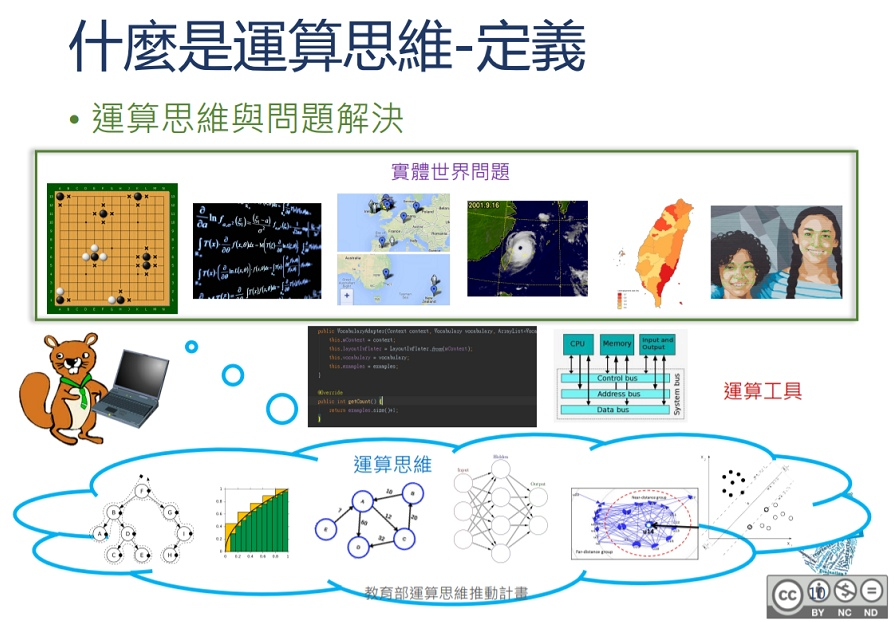
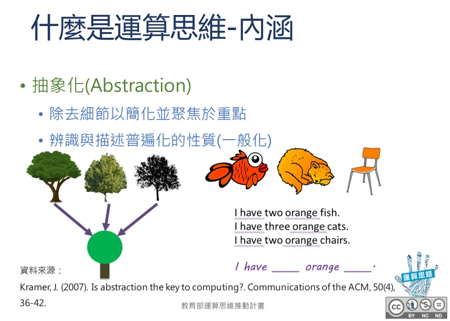
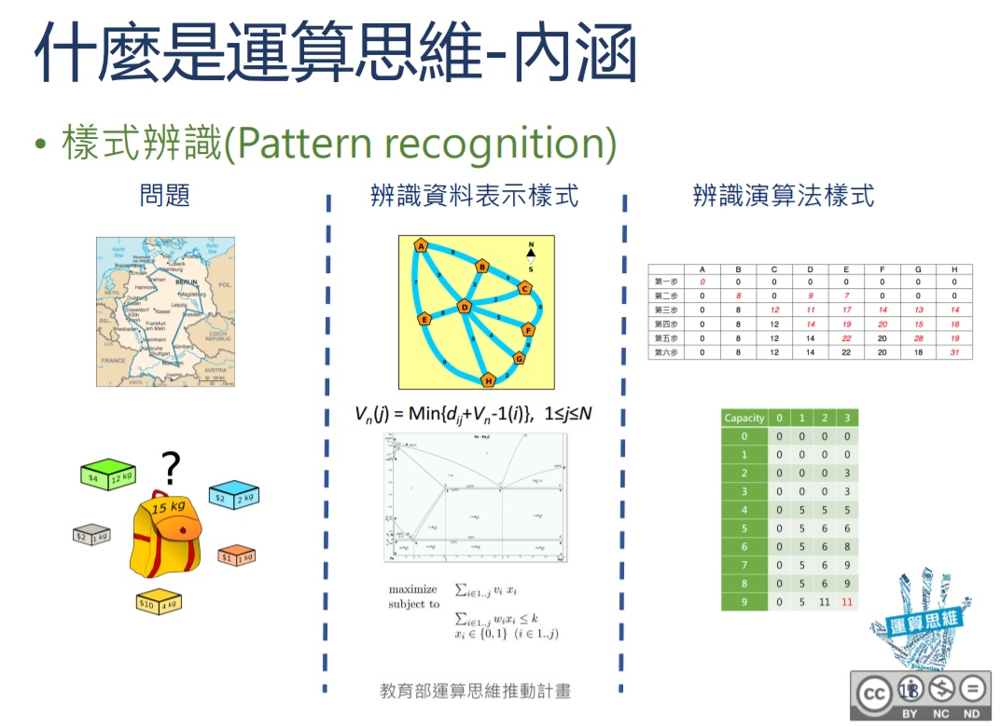
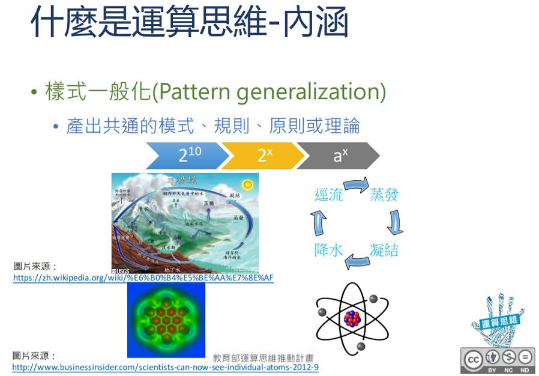
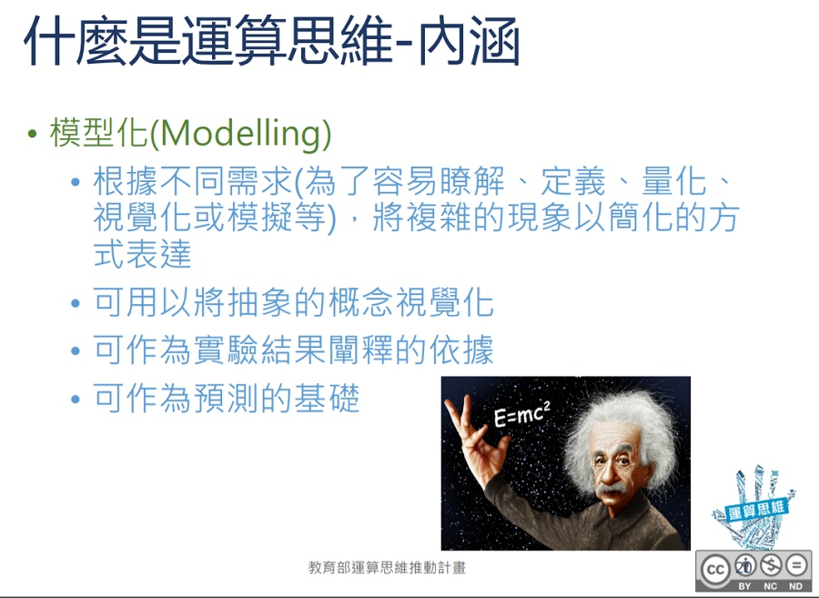
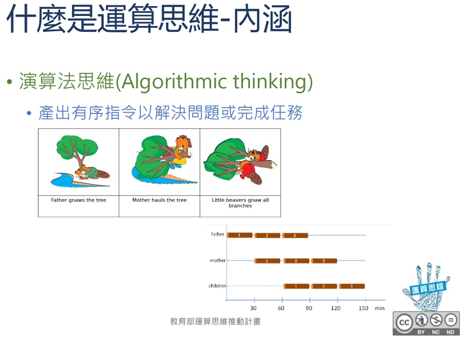
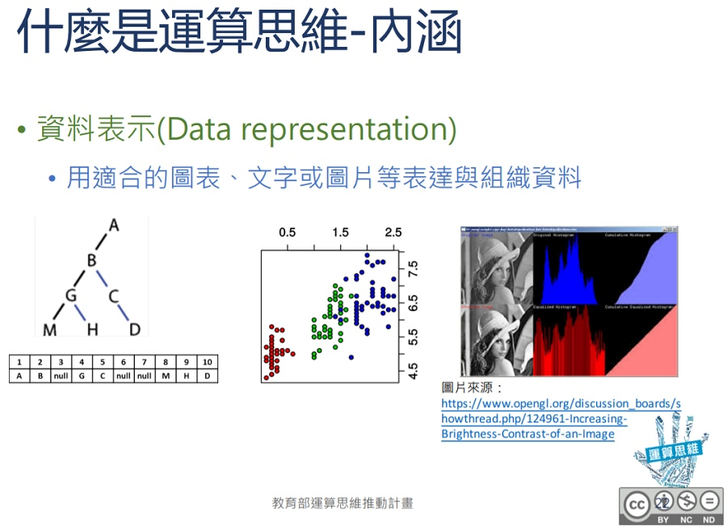

#  🧡 運算思維

--------------------------

## 📙 定義

: (資料來源:[^1])

[^1]: 運算思維簡介, [pdf檔案連結](http://webnas.bhes.ntpc.edu.tw/wordpress/wp-content/uploads/2018/03/1%E9%81%8B%E7%AE%97%E6%80%9D%E7%B6%AD%E7%B0%A1%E4%BB%8B.pdf) ,CC BY-NC-ND , 教育部運算思維推動計畫

   

--------------------------

## 📗 抽象化

: (資料來源:[^1])

   

--------------------------

## 📘 樣式辨識

: (資料來源:[^1])

   

--------------------------

## 📕 樣式一般化

: (資料來源:[^1])

   

--------------------------

## 📙 模型化

: (資料來源:[^1])

   

--------------------------

## 📗 演算法思維

: (資料來源:[^1])

   

--------------------------
 

## 📘 資料表示

: (資料來源:[^1])

   

