---
hide:
  - toc
---

#  🧡 Scratch 到 Python - 基本語法

## 📙 var 變數

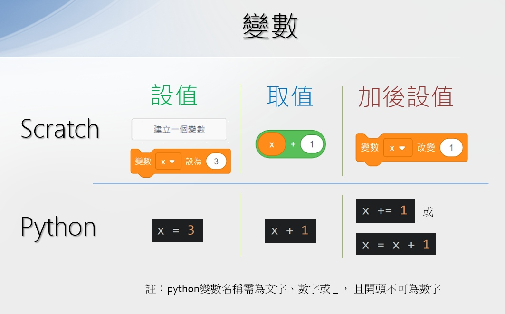

   

--------------------------

## 📗 block 區塊與縮排

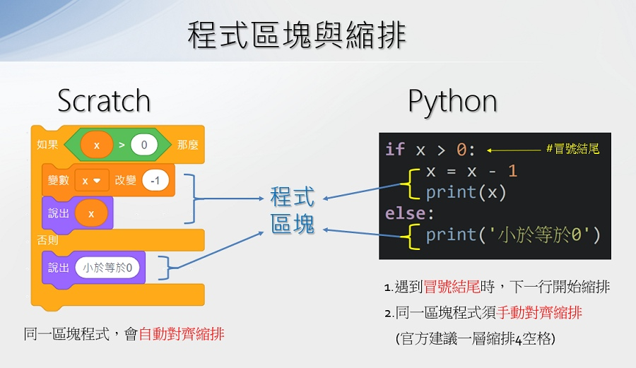

   

--------------------------

## 📕 sequence 循序

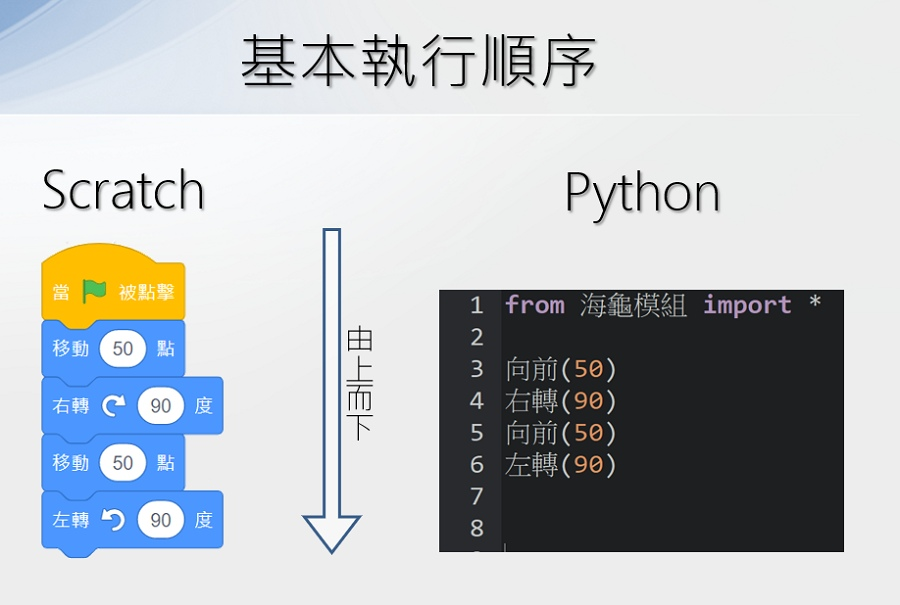

   

--------------------------

## 📘 選擇結構

#### ▪️ if 單向

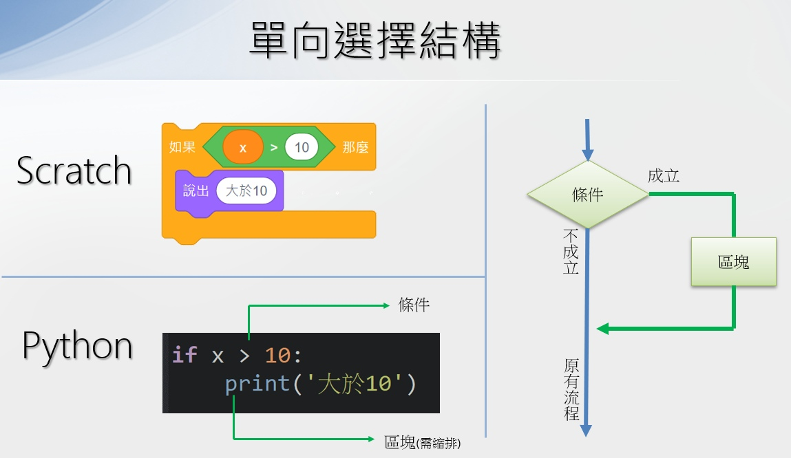

   

--------------------------

#### ▪️ if_else 雙向

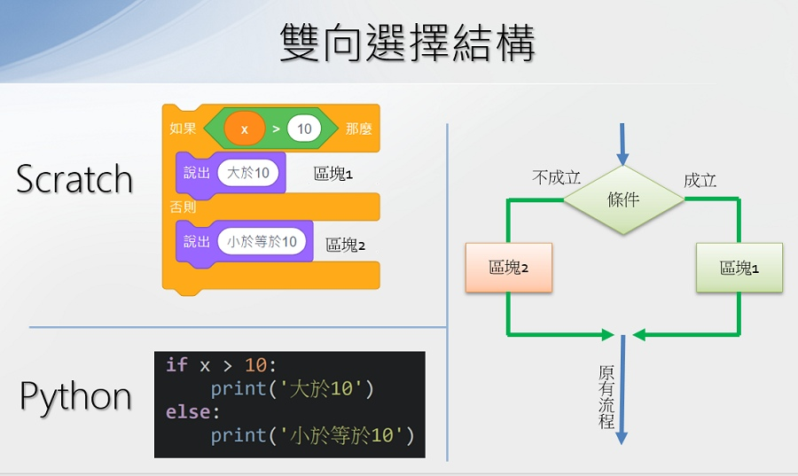

   

--------------------------

#### ▪️ if_elif_else 多向

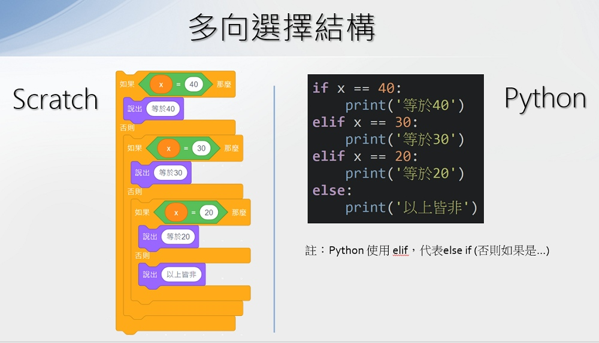

   

--------------------------

## 📘 計次式重複

#### ▪️ for 迴圈

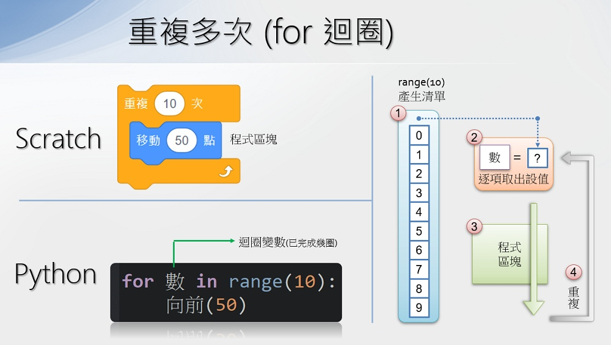

   

--------------------------

#### ▪️ loop_var 迴圈變數與圈數

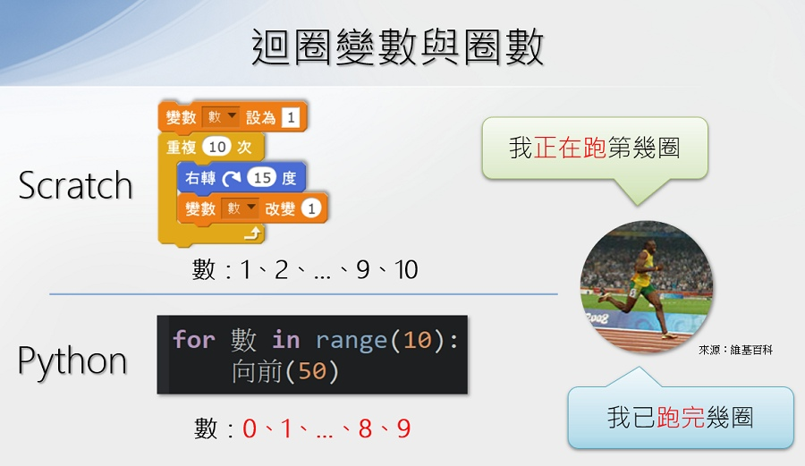

   

--------------------------

#### ▪️ range 數列函式

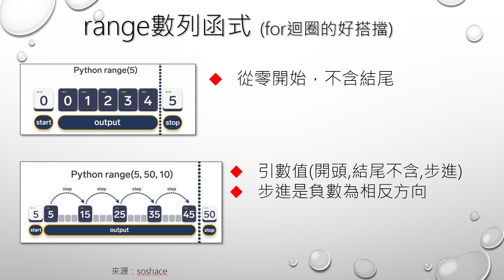

   

--------------------------

## 📘 條件式重複

#### ▪️ while_true 重複無限次

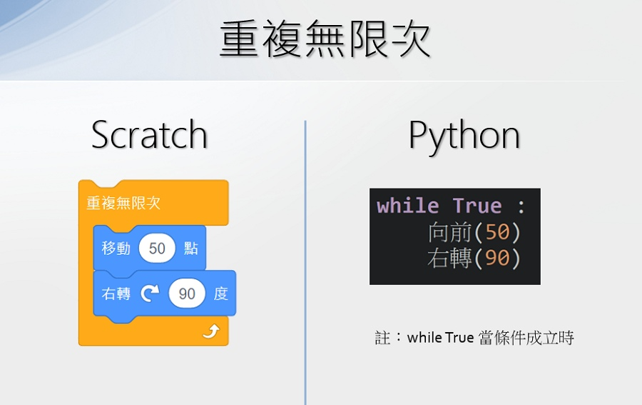

   

--------------------------

#### ▪️ while 重複依條件

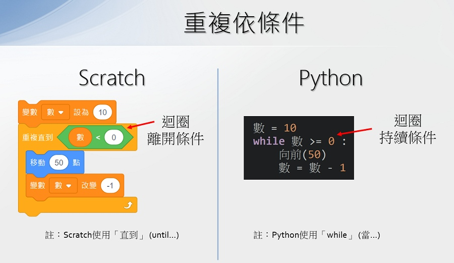

   

--------------------------

## 📗 模組化設計

#### ▪️ function 函式

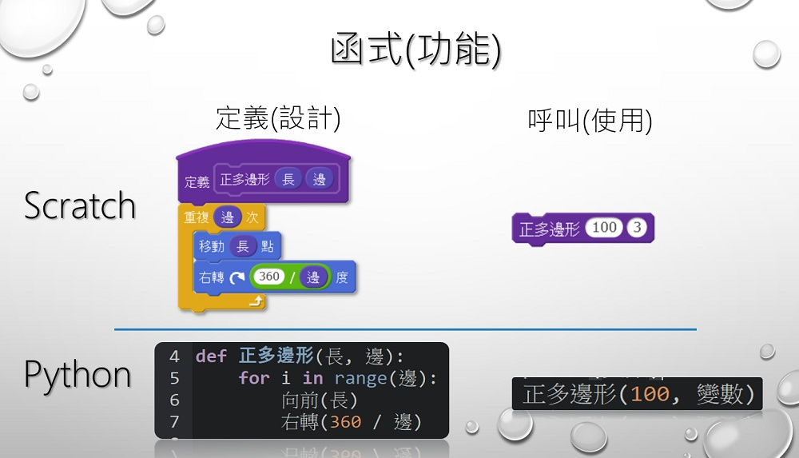

   

--------------------------

## 📗 進階程式概念

#### ▪️ event_driven 事件驅動

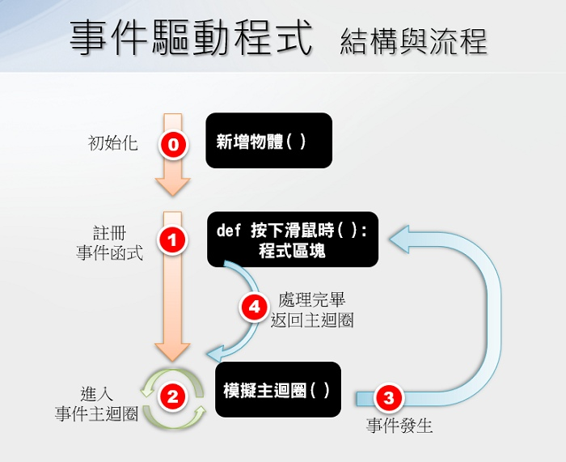

   

--------------------------

#### ▪️ mouse_event 滑鼠操作事件

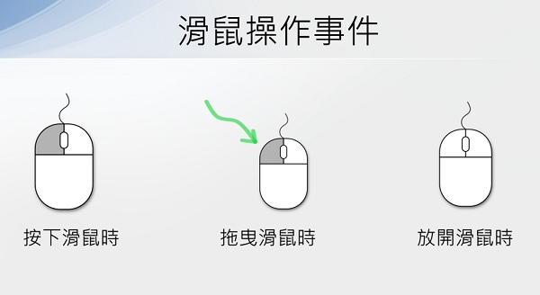

   