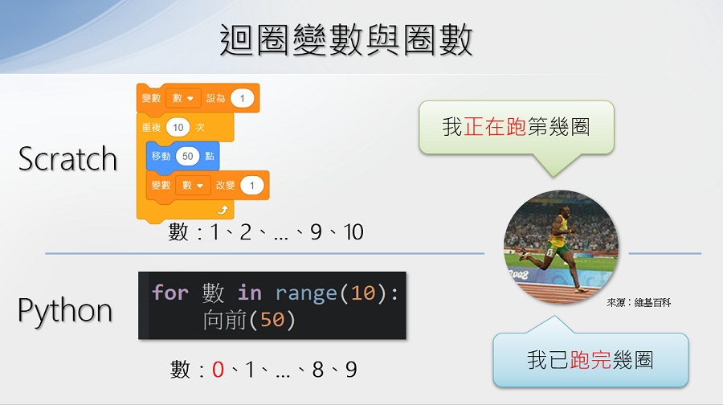
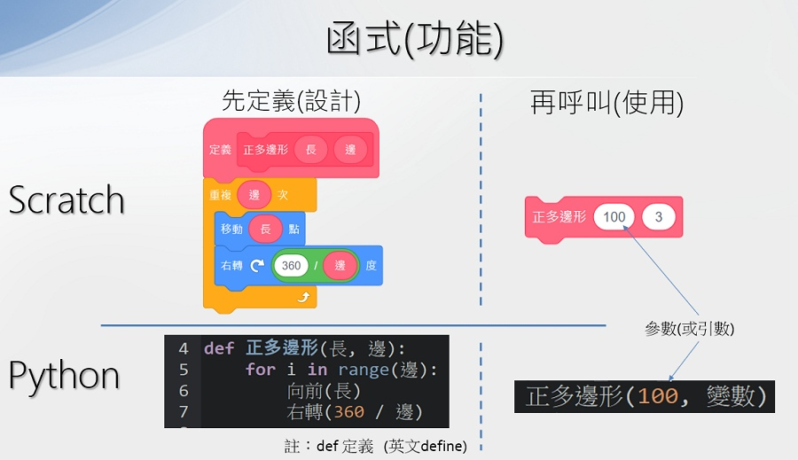

#  🧡 Scratch 到 Python - 基本語法

## 📙 變數

   

--------------------------

## 📗 區塊與縮排

   

--------------------------

## 📕 循序

   

--------------------------

## 📘 選擇結構

#### ▪️ 單向

   

--------------------------

#### ▪️ 雙向

   

--------------------------

#### ▪️ 多向

   

--------------------------

## 📘 計次式重複

#### ▪️ for 迴圈

   

--------------------------

#### ▪️ 迴圈變數與圈數

   

--------------------------

#### ▪️ range數列函式

   

--------------------------

## 📘 條件式重複

#### ▪️ 重複無限次

   

--------------------------

#### ▪️ 重複依條件

   

--------------------------

## 📗 模組化設計

#### ▪️ 函式

   

--------------------------

## 📗 進階程式概念

#### ▪️ 事件驅動

   

--------------------------

#### ▪️ 滑鼠操作事件

   