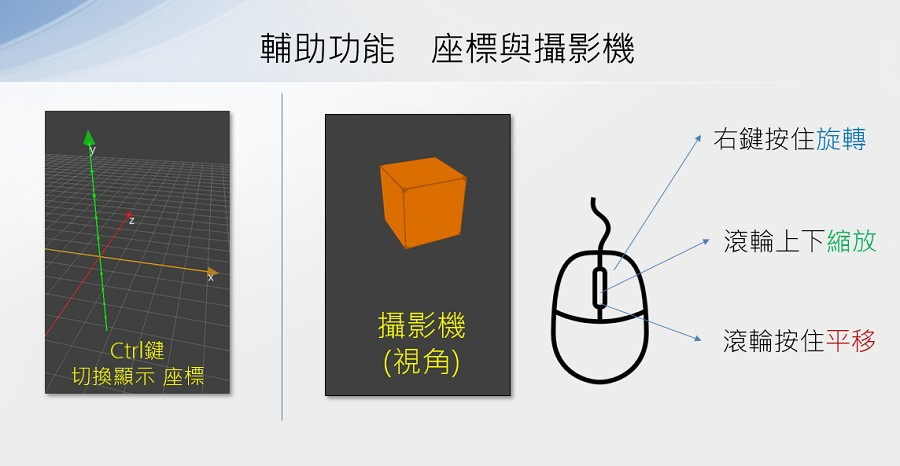
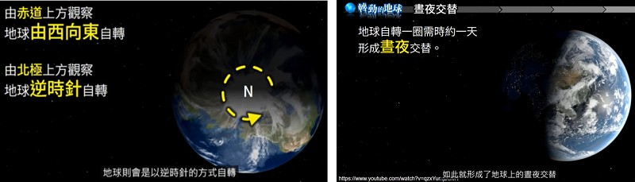
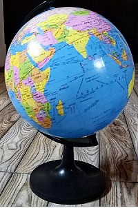

---
hide:
  - navigation
---

# 📚 探索3D空間

我們人類生活的地方，就是一個3D的立體空間。比起平面來說，空間中的位置、長度與角度…等更是複雜。近年來，由於3D硬體加速與軟體的發展，利用資訊科技來計算模擬3D已變得容易許多。所以不管在遊戲、VR、AR、電影、工業設計、生物科技、建築展示…等許多領域，都可以看到3D技術的運用。


:  


: <sup>(資料來源:新冠病毒</sup>[^sars-cov-2]  <sup>, 人腦中央溝</sup>[^central_sulcus]    <sup>)</sup>

[^sars-cov-2]: SARS-CoV-2形態, By AustroHungarian1867, [維基百科連結](https://commons.wikimedia.org/wiki/File:SARS-CoV-2_virion_animation.gif) 

[^central_sulcus]: 人腦中央溝, By Polygon data were generated by Database Center for Life Science(DBCLS), [維基百科連結](https://es.m.wikipedia.org/wiki/Archivo:Central_sulcus_animation_small.gif) 


在這個課程中，我們將從基礎開始，透過Python程式的撰寫活動，一起來學習3D程式並體驗其樂趣。

??? info "關於3D程式"

    : Py4t是在Panda3D與Ursina的基礎上，來達到3D程式的功能

    : :fontawesome-solid-link: <a href="../../threed4t/" target="_blank">Py4t 3D學習模組 說明、範例程式與原始碼</a>


<br/><br/><br/> 

----------------------------

##  📙 3D基礎(3)

----------------------------

3D的基礎是什麼？先從3D圖形設計者的角度來瞭解：

: <iframe width="560" height="315" src="https://www.youtube.com/embed/VT5oZndzj68?start=25&amp;end=118" frameborder="0" allow="accelerometer; autoplay; encrypted-media; gyroscope; picture-in-picture" allowfullscreen></iframe>

: <sup>(1分33秒, 選中文字幕,  資料來源:</sup>[^intro_3d_graphics]<sup>)</sup>

[^intro_3d_graphics]:學習3D電腦圖像的新手指南, By 
Blender Guru, [youtube連結](https://youtu.be/VT5oZndzj68) 

<br/><br/>

----------------------------

***空間座標與位置***

----------------------------


3D也可稱為3維空間，是由右左、上下、前後3個維度(3 Dimensions)所構成的空間。

在3D空間中，要如何將物體定位呢？想一想，在平面的空間(2維)，我們會使用x與y座標來做為定位。從這樣的概念延伸，就可以用xyz的座標，做為空間中的定位。不過，空間座標中的xyz，分別是代表哪些維度呢？

: 

<br/><br/>

為了讓學習者容易理解3D程式，Py4t內建了座標與攝影機(視角)的輔助操作，幫助我們了解與驗証3D模擬空間。    

: 

<br/>

當3D空間的模擬物體，投影至2D畫面時(如觀看者的螢幕)，可以分成透視與正交投影2種方式：


: 

: <sup>(資料來源:</sup>[^3d_projection]<sup>)</sup>

[^3d_projection]: 3d projection, [維基百科連結](https://en.wikipedia.org/wiki/3D_projection)


<br/>

運用3D空間座標的概念，一起來動手寫程式吧！

???+ example "範例程式 空間座標與位置 - - - - - - - (3D基礎1/3 新檔)"
    
    === "🎦操作影片"
        
        <iframe width="560" height="315" src="https://www.youtube.com/embed/xnP4PEybUJ0?start=2&amp;end=390" frameborder="0" allow="accelerometer; autoplay; encrypted-media; gyroscope; picture-in-picture" allowfullscreen></iframe>

        【長度6:29 章節時間如下】

        * 0:00 存檔、匯入模組
        * 0:51 座標與攝影機
        * 2:21 立方體位置
        * 4:05 球體位置
        * 5:38 透視與正交投影

    === "💻程式碼"

        ```python
        from 模擬3D模組 import *

        物體 = 新增立方體()
        物體.位置x = 1
        物體.位置y = 2
        物體.位置z = 3

        物體2 = 新增球體()
        物體2.位置 = [-1,-2,-3]

        模擬主迴圈()
        ```


??? info "模擬主迴圈？流程？"

    : 什麼是「模擬主迴圈」？它的程式結構與演算流程是什麼？

    : :fontawesome-solid-link: <a href="../basic/scratch_python_compare/#event_driven" target="_blank">事件驅動程式 結構與流程</a>

    -----------------------------

    : 補充資料 
    
    : :fontawesome-solid-link: <a href="https://zh.wikipedia.org/wiki/%E4%BA%8B%E4%BB%B6%E9%A9%85%E5%8B%95%E7%A8%8B%E5%BC%8F%E8%A8%AD%E8%A8%88" target="_blank">維基百科: 事件驅動程式設計</a>

<br/><br/><br/>


----------------------------

***3軸縮放與旋轉***

----------------------------


藉由3D的模擬，我們可以將3D模型，依xyz三個軸向來做出縮放與旋轉的動作，如下圖：


: 


: 

<br/>

使用3D空間中物體的縮放與旋轉概念，來寫出程式。

???+ example "範例程式 3軸縮放與旋轉 - - - - - - - (3D基礎2/3 新檔)"

    === "🎦操作影片"
        <iframe width="560" height="315" src="https://www.youtube.com/embed/PSL2Pi5_MTs?start=2&amp;end=354" frameborder="0" allow="accelerometer; autoplay; encrypted-media; gyroscope; picture-in-picture" allowfullscreen></iframe>

        【長度5:52 章節時間如下】      

        * 0:00 存檔、匯入模組
        * 0:54 3軸縮放
        * 3:45 繞軸旋轉

    === "💻程式碼"

        ```python
        from 模擬3D模組 import *

        物體 = 新增立方體線框()
        物體.縮放x = 2
        物體.縮放y = 5
        物體.縮放z = 10

        def 當更新時(dt):
            物體.旋轉z += 1
            
        模擬主迴圈()
        ```


<br/><br/><br/>


----------------------------

***顏色與材質貼圖***

----------------------------


電腦的影像經由螢幕發光後，被使用者看見。光的顏色由基本的紅、綠、藍三個色光混合而成，又稱為RGB三原色。

: 

<br/>

除了顏色以外，也可以透過平面的材質貼圖，對應到3D物體中的不同多邊形的平面上，可以讓3D模型更加的生動有趣。

: <iframe width="560" height="315" src="https://www.youtube.com/embed/Yx2JNbv8Kpg?start=115&amp;end=218" frameborder="0" allow="accelerometer; autoplay; encrypted-media; gyroscope; picture-in-picture" allowfullscreen></iframe>

: <sup>(1分43秒, 資料來源:</sup>[^uv_map]<sup>)</sup>

[^uv_map]: UV Maps Explained, By 
FlippedNormals Marketplace, [youtube連結](https://www.youtube.com/watch?v=Yx2JNbv8Kpg) 

<br/>


Py4t預設的立方體，其材質貼圖對應至各面的情形如下：

: 


<br/>


一起動手實作出程式，控制3D物體的顏色與材質。

???+ example "範例程式 顏色與材質 - - - - - - - (3D基礎3/3 新檔)"

    === "🎦操作影片"
        <iframe width="560" height="315" src="https://www.youtube.com/embed/WwzIwKTmgfU?start=2&amp;end=416" frameborder="0" allow="accelerometer; autoplay; encrypted-media; gyroscope; picture-in-picture" allowfullscreen></iframe>

        【長度6:55 章節時間如下】

        * 0:00 存檔、匯入模組
        * 0:54 設定顏色
        * 3:38 材質貼圖

    === "💻程式碼"

        ```python
        # 需匯入火焰.mp4(3D便利貼:材質->匯入)

        from 模擬3D模組 import *

        物體 = 新增箭頭()
        物體.位置x = -2
        物體.顏色 = color.rgb(255,255,0)

        物體2 = 新增立方體()
        物體2.材質貼圖 = '火焰.mp4'

        模擬主迴圈()
        ```

        註: 材質貼圖檔需先匯入至同一資料夾


<br/><br/><br/> 


----------------------------

##  📕 轉動地球(2)


: ***地球自轉***

----------------------------

地球是我們居住的星球，也是宇宙中人類已知唯一存在生命的天體。

地球的轉動會造成日夜的變化，它是如何轉動的呢？

<iframe width="560" height="315" src="https://www.youtube.com/embed/CDrcJ0OBvdU?start=0&amp;end=45" frameborder="0" allow="accelerometer; autoplay; encrypted-media; gyroscope; picture-in-picture" allowfullscreen></iframe>

: <sup>(45秒, 資料來源:</sup>[^earth_rotation]<sup>)</sup>

[^earth_rotation]: 地球自轉與晝夜變化｜國中地科 , By 張鎰銳 , [youtube連結](https://youtu.be/CDrcJ0OBvdU)

<br/>


從影片中可以得知，地球的自轉規則如下：



: <sup>(資料來源:</sup>[^earth_rotation]<sup>)</sup>

<br/>


Py4t預設的球體，其材質貼圖對應至球面的情形如下：

: 


<br/>

客製化地球材質貼圖，利用繪圖軟體(如小畫家)，標示出赤道以及地球的自轉方向。


: 

: <sup>(NASA地球材質貼圖, 資料來源:</sup>[^blue_marble]<sup>)</sup>

[^blue_marble]: The Blue Marble - NASA Visible Earth , [連結](https://visibleearth.nasa.gov/images/57723/the-blue-marble)


??? info "關於赤道"
    : :fontawesome-solid-long-arrow-alt-right: <a href="https://zh.wikipedia.org/wiki/%E8%B5%A4%E9%81%93" target="_blank">維基百科: 赤道</a>
    


[^earth_rotation]: 地球自轉與晝夜變化｜國中地科 , By 張鎰銳 , [youtube連結](https://youtu.be/CDrcJ0OBvdU)

<br/><br/>


綜合所學的知識，試著做出地球的自轉程式。

???+ example "範例程式 地球自轉 - - - - - - - (轉動地球1/2 新檔)"

    === "🎦操作影片"
        <iframe width="560" height="315" src="https://www.youtube.com/embed/-lC84lJOQuE?start=2&amp;end=424" frameborder="0" allow="accelerometer; autoplay; encrypted-media; gyroscope; picture-in-picture" allowfullscreen></iframe>

        【長度7:02 章節時間如下】

        * 0:00 存檔、匯入模組
        * 0:49 球體與貼圖
        * 3:25 標示自轉方向
        * 5:44 地球自轉

    === "💻程式碼"

        ```python
        # 需匯入地球.jpg(3D便利貼:材質->匯入)

        from 模擬3D模組 import *

        地球 = 新增球體()
        地球.材質貼圖 = '地球.jpg'
        地球.縮放 = 5

        def 當更新時(dt):
            地球.旋轉y -= 0.1
            
        模擬主迴圈()
        ```

??? info "關於 Google Earth"
    : 是一款Google公司開發的虛擬地球儀軟體，它將衛星圖、航空照相和GIS資料疊加在地球的三維模型上
  
    : :fontawesome-solid-long-arrow-alt-right: <a href="https://www.google.com/intl/zh-TW/earth/" target="_blank">Google Earth</a>

<br/><br/><br/>

----------------------------

***地球傾斜***

---------------------------


在自然教室或地科教室中，常常可以看到地球儀，是一個用來表示地球的球體模型。


: 

: <sup>(資料來源:</sup>[^globe]<sup>)</sup>

[^globe]: World Globe Map , By Intisar Ali , [維基百科連結](https://commons.wikimedia.org/wiki/File:World_Globe_Map.jpg)

<br/>

地球儀中的地球是傾斜的，這樣會帶來什麼影響呢？


<iframe width="560" height="315" src="https://www.youtube.com/embed/vsTt5HS8b2c?start=58&amp;end=91" frameborder="0" allow="accelerometer; autoplay; encrypted-media; gyroscope; picture-in-picture" allowfullscreen></iframe>

: <sup>(33秒, 資料來源:</sup>[^earth_revolution]<sup>)</sup>

[^earth_revolution]: 晝夜交替與四季變化 , By 臺灣南區氣象中心 , [youtube連結](https://youtu.be/vsTt5HS8b2c)

<br/>

由於地球的傾斜與公轉，產生了一年四季的變化。


: <sup>(資料來源:</sup>[^earth_revolution]<sup>)</sup>

<br/>

如何在程式中做到地球繞著軸自轉，並且自轉軸也傾斜呢？讓我們來了解3D物體的親子關係。


<br/>

請試著寫出地球傾斜的程式。

???+ example "範例程式 地球傾斜 - - - - - - - (轉動地球2/2 接續)"

    === "🎦操作影片"
        <iframe width="560" height="315" src="https://www.youtube.com/embed/-lC84lJOQuE?start=428&amp;end=613" frameborder="0" allow="accelerometer; autoplay; encrypted-media; gyroscope; picture-in-picture" allowfullscreen></iframe>

        【長度3:05 章節時間如下】

        * 7:08 地球傾斜

    === "💻程式碼"

        ```python
        # 需匯入地球.jpg(3D便利貼:材質->匯入)

        from 模擬3D模組 import *

        自轉軸 = 新增直線()
        自轉軸.旋轉z = 23.5

        地球 = 新增球體()
        地球.材質貼圖 = '地球.jpg'
        地球.縮放 = 5
        地球.親代 = 自轉軸

        def 當更新時(dt):
            地球.旋轉y -= 0.1
            
        模擬主迴圈()
        ```

        註: 材質貼圖檔需匯入在相同資料夾。

??? question "更多練習"

    : 1.請利用範例材質中的地球儀外框以及3D的角柱或圓柱，在3D空間中調整位置與縮放倍率，組成一個地球儀。

    : 2.這幾年的疫情對全球產生巨大的影響，生活在台灣的我們也都有切身的感受，請在地球材質貼圖上，寫下你對疫情的祝福與希望。

<br/><br/><br/>


 

----------------------------

##  📘 漸層螢幕(2)

: ***虛擬螢幕***

----------------------------

在3C賣場展售的顯示器，常常會條列出螢幕相關的規格資料，比如螢幕的尺寸、比例與解析度等。

: 

: <sup>(資料來源:</sup>[^ratio_resolution]<sup>)</sup>

[^ratio_resolution]: 16:9 aspect ratio, [維基百科連結](https://en.wikipedia.org/wiki/16:9_aspect_ratio). Computer monitor, https://en.wikipedia.org/wiki/Computer_monitor

在上圖中的解析度720p，代表的規格是螢幕的寬有1280個點，高有720個點，這些點又稱為畫素(pixel)，是影像顯示的基本單位。


<br/>

請以下列的規格，利用3D程式做出一個虛擬螢幕：

<br/>


???+ example "範例程式 虛擬螢幕 - - - - - - - (漸層螢幕1/2 新檔)"

    === "🎦操作影片"
        <iframe width="560" height="315" src="https://www.youtube.com/embed/3RNyfWZ9GTc?start=2&amp;end=512" frameborder="0" allow="accelerometer; autoplay; encrypted-media; gyroscope; picture-in-picture" allowfullscreen></iframe>

        【長度8:30 章節時間如下】

        * 0:00 存檔、匯入模組
        * 0:54 虛擬螢幕
        * 4:15 螢幕外框

    === "💻程式碼"

        ```python
        # 需匯入平板外框.png(3D便利貼:材質->匯入)

        from 模擬3D模組 import *

        for x in range(16) :
            for y in range(12) :
                點 = 新增圓形平面()
                點.位置 = [x,y,0]
                點.顏色 = color.red

        框 = 新增方形平面()
        框.材質貼圖 = '平板外框.png'
        框.縮放 = [16*1.2, 12*1.2, 1]
        框.位置 = [7.5, 5.5, 0]

        模擬主迴圈()
        ```

        註: 材質貼圖檔需匯入。

??? question "更多練習"

    : 寬高比16:9是常見的電視、電腦顯示器規格，請將虛擬螢幕改為16:9。


<br/>

----------------------------


***彩色漸層***

----------------------------


油畫是西方繪畫史中的主要繪畫方式。由於油畫顏料不透明，覆蓋力強，繪畫時可以由深到淺，逐層覆蓋，使繪畫產生立體感，畫出豐富、逼真的色彩。

: 

: <sup>(資料來源:</sup>[^mona_lisa]<sup>)</sup>

[^mona_lisa]: 油畫, [維基百科連結](https://zh.wikipedia.org/zh-mo/%E6%B2%B9%E7%94%BB)

<br/>

利用不同油畫顏料的比例混合，改變顏色的飽和度，可以調製出顏色漸漸改變的漸層色：


<iframe width="560" height="315" src="https://www.youtube.com/embed/x2WAKqIe2UU?start=35&amp;end=170" frameborder="0" allow="accelerometer; autoplay; encrypted-media; gyroscope; picture-in-picture" allowfullscreen></iframe>

: <sup>(2分15秒, 資料來源:</sup>[^hue_oilpaint]<sup>)</sup>

[^hue_oilpaint]: Tutorial : Hue, Value & Saturation , By CITY STATIONERY GROUP SAL , [youtube連結](https://youtu.be/x2WAKqIe2UU)  

<br/>

電腦的顯示器，將不同強度的紅、綠、藍色光混合來生成不同的顏色，這就是RGB三原色的加色法，但這種顏色對大多數人來說並不直覺，比如我們很難直接判斷出橘色的RGB比例。

HSV是另一種色彩的模型，它代表的是色相、飽和度與明度。以人類更熟悉的方式來表達顏色：「這是什麼顏色？深淺如何？明暗如何？」。


: 

: <sup>(資料來源:</sup>[^hsv_color]<sup>)</sup>

[^hsv_color]: HSL和HSV色彩空間, [維基百科連結](https://zh.wikipedia.org/zh-tw/HSL%E5%92%8CHSV%E8%89%B2%E5%BD%A9%E7%A9%BA%E9%97%B4)


<br/>

認識了HSV色彩空間後，要怎麼做出漸層色呢？

: 

<br/>

綜合以上，請寫出漸層顏色的程式。

???+ example "範例程式 彩色漸層 - - - - - - - (漸層螢幕2/2 接續)"

    === "🎦操作影片"
        <iframe width="560" height="315" src="https://www.youtube.com/embed/3RNyfWZ9GTc?start=517&amp;end=639" frameborder="0" allow="accelerometer; autoplay; encrypted-media; gyroscope; picture-in-picture" allowfullscreen></iframe>

        
        【長度2:02 章節時間如下】

        * 8:37 彩色漸層

    === "💻程式碼"

        ```python
        # 需匯入平板外框.png(3D便利貼:材質->匯入)

        from 模擬3D模組 import *

        for x in range(16) :
            for y in range(12) :
                點 = 新增圓形平面()
                點.位置 = [x,y,0]
                點.顏色 = color.hsv(x*10, 1, 1)
                
        框 = 新增方形平面()
        框.材質貼圖 = '平板外框.png'
        框.縮放 = [16*1.2, 12*1.2, 1]
        框.位置 = [7.5, 5.5, 0]

        模擬主迴圈()
        ```

        註: 材質貼圖檔需匯入。


??? question "更多練習"

    : 1.可以改變漸層的方向嗎？做出如上下或斜向的漸層嗎？

    : 2.可以改變漸層的顏色嗎？如紅綠漸層、綠藍漸層等。 

    : 

<br/><br/><br/>


----------------------------

##  📙 全景水晶球(2)

: ***360全景相片***

----------------------------

Google地圖中的<a href="https://www.google.com/streetview/" target="_blank">街景服務</a>，提供水平方向360°及垂直方向180°的街道全景，讓使用者能檢視所選城市地面上街道不同位置及其兩旁的景物，由Google街景車拍攝了許多的360度全景照片所構成。


: 

: <sup>(資料來源:Google地圖街景服務</sup><sup>)</sup>

<br/>

360 VR影片是可自由轉動角度觀看的影片，令人有身歷其境的感覺。以下是交通部觀光局所拍攝的360 VR「印象」，介紹台灣的國際知名地標或景點。


: <iframe width="560" height="315" src="https://www.youtube.com/embed/fmlcg2u3gB0?start=0&amp;end=40" frameborder="0" allow="accelerometer; autoplay; encrypted-media; gyroscope; picture-in-picture" allowfullscreen></iframe>


: <sup>(40秒, 資料來源:</sup>[^vr_taiwan]<sup>)</sup>

[^vr_taiwan]: 360 VR影片《印象》, by 交通部觀光局, [youtube連結](https://youtu.be/fmlcg2u3gB0?list=RDCMUCYLYBjgRZCeArwSJXpi36JA)


<br/>

如何產生360全景相片呢？有許多不同的設備及處理方式，其中一種方式是使用配有2顆魚眼鏡頭的360相機，1顆魚眼鏡頭可拍下 180 度的環境，使用 2 顆的話，就可以拼接出 360 度的全景照片。

: 

<br/>

360全景照片搭配Py4t的內面貼圖球體，會產生街景圖的環繞效果。

內面貼圖球體的材質會在內側，如果以碗來類比，就像是把圖貼在碗的裡面。

: 

: <sup>(故宮博物院 青瓷劃花三魚小碗，資料來源:</sup>[^ancient_bowl]<sup>)</sup>

[^ancient_bowl]: 青瓷劃花三魚小碗, [維基百科連結](https://zh.wikipedia.org/wiki/%E9%9D%92%E7%93%B7%E5%8A%83%E8%8A%B1%E4%B8%89%E9%AD%9A%E5%B0%8F%E7%A2%97)


<br/>

請用3D程式做出360全景相片。

???+ example "範例程式 全景相片 - - - - - - - (全景水晶球1/2 新檔)"

    === "🎦操作影片"
        <iframe width="560" height="315" src="https://www.youtube.com/embed/hogWFR9Z094?start=0&amp;end=235" frameborder="0" allow="accelerometer; autoplay; encrypted-media; gyroscope; picture-in-picture" allowfullscreen></iframe>

        【長度3:55 章節時間如下】

        * 0:00 存檔、匯入模組
        * 0:48 全景相片
        * 2:31 轉動360照片

    === "💻程式碼"

        ```python
        # 需匯入教室360.jpg(3D便利貼:材質->匯入)

        from 模擬3D模組 import *

        物體 = 新增內面貼圖球體()
        物體.材質貼圖 = '教室360.jpg'
        物體.縮放 = 5

        def 當更新時(dt):
            物體.旋轉y += 0.1
            
        模擬主迴圈()
        ```

        註: 材質貼圖檔需匯入並修改。


<br/>
<br/>
<br/>

----------------------------


***全景水晶球***

----------------------------


水晶球是指由水晶或玻璃製作的球體，在古代是被用來宗教、占卜，也可當成魔術的道具。

 
: 

: <sup>(資料來源:</sup>[^crystal_ball]<sup>)</sup>

[^crystal_ball]: 水晶球 , [維基百科連結](https://zh.wikipedia.org/wiki/%E6%B0%B4%E6%99%B6%E7%90%83)

<br/>


抬頭顯示器(HUD)是一種目前普遍運用在航空器上的飛行輔助儀器，飛行員不需要低頭查看儀表就能夠看到需要的資訊。部分汽車也以類似的裝置。在電子遊戲領域中，HUD是使用者介面的一部分。

: 

: <sup>(資料來源:</sup>[^hud]<sup>)</sup>

[^hud]: Head-up display , [維基百科連結](https://en.wikipedia.org/wiki/Head-up_display)

<br/>

3D程式的使用者介面(UI)有自己獨立的座標，如下圖：


: 

<br/>

請將水晶球外框的圖片，以HUD的使用者介面方式設置，再加上360全景照片，就可以做出一個特別的水晶球，一起來寫寫看。


???+ example "範例程式 水晶球 - - - - - - - (全景水晶球2/2 接續)"

    === "🎦操作影片"
        <iframe width="560" height="315" src="https://www.youtube.com/embed/hogWFR9Z094?start=238&amp;end=559" frameborder="0" allow="accelerometer; autoplay; encrypted-media; gyroscope; picture-in-picture" allowfullscreen></iframe>

        【長度5:21 章節時間如下】

        * 3:58 水晶球
        * 6:38 外框置於界面        


    === "💻程式碼"

        ```python
        # 需匯入教室360.jpg(3D便利貼:材質->匯入)
        # 需匯入水晶球外框.png(3D便利貼:材質->匯入)

        from 模擬3D模組 import *
        舞台 = 模擬3D引擎(800,800)

        水晶球 = 新增內面貼圖球體()
        水晶球.材質貼圖 = '教室360.jpg'
        水晶球.縮放 = 5

        外框 = 新增方形平面()
        外框.材質貼圖 = '水晶球外框.png'
        外框.親代 = 舞台.使用者介面
        外框.縮放 = 0.8
        外框.位置y = -0.03

        def 當更新時(dt):
            水晶球.旋轉y += 0.1
            
        模擬主迴圈()
        ```

        註: 材質貼圖檔需匯入並修改。

<br/><br/><br/>

----------------------------

##  📗 魔術方塊(2)

: ***魔方模型***

----------------------------

魯比克·厄爾諾是匈牙利的建築學和雕塑學教授，為了幫助學生們認識空間立方體的組成和結構，所以他自己動手做出了第一個魔術方塊的雛形來，其靈感是來自於多瑙河中的沙礫。

1974年，魯比克教授發明了第一個魔術方塊，1980年Ideal Toys公司於販售此玩具，並將名稱改為Rubik's Cube。

<br/>

: 

: <sup>(資料來源:</sup>[^rubik_cube]<sup>)</sup>

[^rubik_cube]: 魔術方塊, [維基百科連結](https://zh.m.wikipedia.org/zh-tw/%E9%AD%94%E6%96%B9)


<br/>
<br/>

常見的魔術方塊為3x3x3(長寬高)，官方配色有6色，並有固定排列

: 

: <sup>(資料來源:</sup>[^rubik_cube]<sup>)</sup>

<br/>

利用3D程式，把魔術方塊的外觀模型建立起來，一起動手做做看！


???+ example "範例程式 魔方模型 - - - - - - - (魔術方塊1/2 新檔)"

    === "🎦操作影片"
        <iframe width="560" height="315" src="https://www.youtube.com/embed/depPHSCWvcA?start=0&amp;end=400" frameborder="0" allow="accelerometer; autoplay; encrypted-media; gyroscope; picture-in-picture" allowfullscreen></iframe>

        【長度6:40 章節時間如下】

        * 0:00 存檔、匯入模組
        * 0:46 單排魔方
        * 3:10 三層魔方
        * 5:11 貼圖客製化        


    === "💻程式碼"

        ```python
        # 需匯入魔方6面.png(3D便利貼:材質->匯入)

        from 模擬3D模組 import *

        for z in range(3) :
            for y in range(3) :
                for x in range(3) :            
                    物體 = 新增6面貼圖方塊()
                    物體.材質貼圖 = '魔方6面.png'
                    物體.位置 = [x,y,z]
                                
        模擬主迴圈()
        ```

        註: 材質貼圖檔需匯入並修改。

??? question "練習 自訂材質"

    : 匯入自訂材質，並用繪圖軟體設計客製化圖案的魔方

??? question "更多練習"

    : 1.市面上有4x4x4或5x5x5的魔術方塊，可以用程式做出來嗎？

    : 2.魔術方塊常常一不小心就轉亂了，可以做出轉亂過的魔方嗎？

<br/><br/><br/>

----------------------------

***單層轉動***

----------------------------

魔術方塊可以轉動，不過常常一不小心就轉亂了。

: 

: <sup>(資料來源:</sup>[^rubik_cube]<sup>)</sup>


為了記錄下復原、轉亂的過程或公式的步驟，由David Singmaster發明了以下的書寫法式：


: * R(Right)、L(Left)、U(Up)、D(Down)、F(Front)、B(Back)分別代表右、左、上、下、前、後層。

: * 若是順時針旋轉，則直接寫上符號；若是逆時針旋轉，則在符號後加上「'」或是「i」；若是旋轉180°，則在符號後加上「2」或是「²」。


: 

 <sup>(資料來源:</sup>[^rubik_cube]<sup>)</sup>

<br/>

如果要讓魔方程式做出如上圖的「U的轉法」，要怎麼做呢？

: 

<br/>

請動手寫出程式。

 

???+ example "範例程式 單層轉動 - - - - - - - (魔術方塊2/2 接續)"

    === "🎦操作影片"
        <iframe width="560" height="315" src="https://www.youtube.com/embed/depPHSCWvcA?start=403&amp;end=736" frameborder="0" allow="accelerometer; autoplay; encrypted-media; gyroscope; picture-in-picture" allowfullscreen></iframe>

        【長度5:33 章節時間如下】

        * 6:43 調整變數及座標
        * 8:21 旋轉中心
        * 10:58 單層旋轉        

    === "💻程式碼"

        ```python
        # 需匯入魔方6面.png(3D便利貼:材質->匯入)
        
        from 模擬3D模組 import *

        旋轉中心 = 新增物體()

        for z in [-1, 0, 1] :
            for y in [-1, 0, 1] :
                for x in [-1, 0, 1] :            
                    方塊 = 新增6面貼圖方塊()
                    方塊.材質貼圖 = '魔方6面.png'
                    方塊.位置 = [x,y,z]
                    if y == 1:
                        方塊.親代 = 旋轉中心

        def 當更新時(dt):
            旋轉中心.旋轉y += 0.5
            
        模擬主迴圈()
        ```

        註: 材質貼圖檔需匯入並修改。

??? question "更多練習"

    : 修改程式，做出不同的轉法，如R(右)、L(左)、U(上)、D(下)、F(前)、B(後)等。


<br/><br/><br/>
