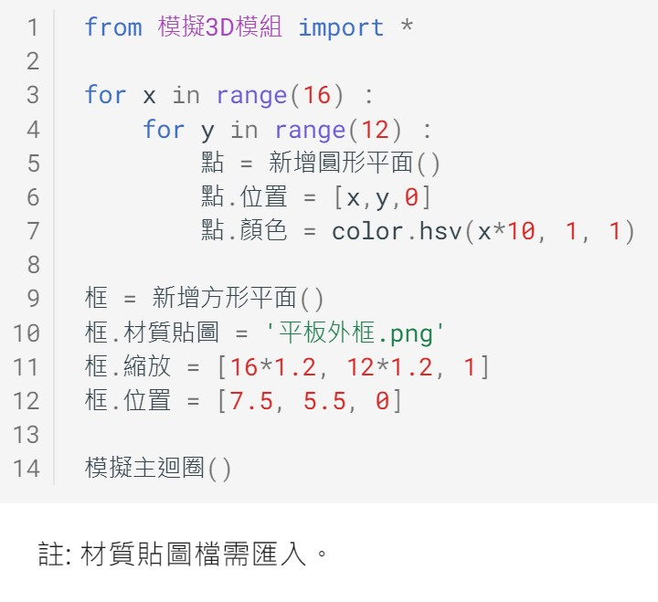

---
hide:
  - navigation
---

# 📚 3D空間大探索

我們人類生活的地方，就是一個3D的立體空間。比起平面來說，空間中的位置與角度…等更是相對地複雜。近年來，由於3D硬體加速與軟體的發展，利用資訊科技來模擬3D已變得容易許多。所以不管在遊戲、VR、AR、電影、工業設計、生物科技、建築展示…等許多領域，都可以看到3D技術的運用。

:  

: (資料來源:新冠病毒[^sars-cov-2]  , 人腦中央溝[^central_sulcus]    )

[^sars-cov-2]: SARS-CoV-2形態, By AustroHungarian1867, [維基百科連結](https://commons.wikimedia.org/wiki/File:SARS-CoV-2_virion_animation.gif) 

[^central_sulcus]: 人腦中央溝, By Polygon data were generated by Database Center for Life Science(DBCLS), [維基百科連結](https://es.m.wikipedia.org/wiki/Archivo:Central_sulcus_animation_small.gif) 

在這個課程中，我們將從基礎開始，透過Python程式的撰寫活動，一起來學習3D程式並體驗其樂趣。

??? info "關於3D程式"

     :fontawesome-solid-link: <a href="../../threed4t/" target="_blank">3D學習模組 說明</a>

    

----------------------------

##  📕 3D程式基礎

----------------------------

什麼是3D呢？3D也可稱為3維空間，是由右左、上下、前後3個維度(3 Dimensions)所構成的空間。

在3D空間中，要如何將物體定位呢？想一想，在平面的空間(2維)，我們會使用x與y座標來做為定位。從這樣的概念延伸，就可以用xyz的座標，做為空間中的定位。不過，空間座標中的xyz，分別是代表哪些軸向呢？

: 

  

Py4t為了容易理解與學習3D，特別內建了座標與攝影機(視角)的輔助操作，幫助我們了解與驗証3D模擬空間。輔助的操作如下：    

: 

 

當3D空間的模擬物體，投影至2D畫面(觀看者的視角)時，可以分成透視與正交投影2種方式：

: 

: (資料來源:[^3d_projection])

[^3d_projection]: 3d projection, [維基百科連結](https://en.wikipedia.org/wiki/3D_projection)

 

一起動手來寫程式。

???+ example "3D程式基礎 範例 (1/3 新檔) --- 空間座標與位置"
    === "🎦Py4t操作影片(6:29)"
    
        <iframe width="560" height="315" src="https://www.youtube.com/embed/xnP4PEybUJ0?start=2&amp;end=390" frameborder="0" allow="accelerometer; autoplay; encrypted-media; gyroscope; picture-in-picture" allowfullscreen></iframe>

    === "💻Python程式截圖"

        

??? abstract "模擬主迴圈？流程？"

    什麼是「模擬主迴圈」？它的程式結構與演算流程是什麼？

    :fontawesome-solid-link: <a href="../basic/scratch_python_compare/#event_driven" target="_blank">事件驅動程式 結構與流程</a>

    -----------------------------

    補充資料 
    
    :fontawesome-solid-link: <a href="https://zh.wikipedia.org/wiki/%E4%BA%8B%E4%BB%B6%E9%A9%85%E5%8B%95%E7%A8%8B%E5%BC%8F%E8%A8%AD%E8%A8%88" target="_blank">維基百科: 事件驅動程式設計</a>

   

----------------------------

藉由3D的模擬，我們可以將3D模型，依xyz三個軸向來做出縮放與旋轉的動作，如下圖：

: 

: 

一起來寫寫看。

??? example "3D程式基礎 範例 (2/3 新檔) --- 3軸縮放與旋轉"

    === "💻Python程式截圖"

        

   

----------------------------

電腦的影像經由螢幕發光後，被使用者看見。光的顏色由基本的紅、綠、藍三個色光混合而成，又稱為RGB三原色。

: 

 

透過平面的材質貼圖，對應到3D物體中的不同多邊形的平面上，可以讓3D模型更加的生動有趣。

: <iframe width="560" height="315" src="https://www.youtube.com/embed/Yx2JNbv8Kpg?start=115&amp;end=218" frameborder="0" allow="accelerometer; autoplay; encrypted-media; gyroscope; picture-in-picture" allowfullscreen></iframe>

: (1分43秒, 資料來源:[^uv_map])

[^uv_map]: UV Maps Explained, By 
FlippedNormals Marketplace, [youtube連結](https://www.youtube.com/watch?v=Yx2JNbv8Kpg) 

 

一起動手實作出程式吧

??? example "3D程式基礎 範例 (3/3 新檔) --- 顏色與材質貼圖"

    === "💻Python程式截圖"

        

    

----------------------------

##  📕 魔術方塊

----------------------------

魯比克·厄爾諾是匈牙利的建築學和雕塑學教授，為了幫助學生們認識空間立方體的組成和結構，所以他自己動手做出了第一個魔術方塊的雛形來，其靈感是來自於多瑙河中的沙礫。

1974年，魯比克教授發明了第一個魔術方塊，1980年Ideal Toys公司於販售此玩具，並將名稱改為Rubik's Cube。

 

: 

: (資料來源:[^rubik_cube])

[^rubik_cube]: 魔術方塊, [維基百科連結](https://zh.m.wikipedia.org/zh-tw/%E9%AD%94%E6%96%B9)

 
 

常見的魔術方塊為3x3x3(長寬高)，官方配色有6色，並有固定排列

: 

: (資料來源:[^rubik_cube])

 

利用3D程式，把魔術方塊的外觀模型建立起來，一起動手做做看！

??? example "魔術方塊 範例 (1/1 新檔) --- 魔術方塊"

    === "💻Python程式截圖"

        

??? question "自主學習 更多魔方變化"

    1.市面上有4x4x4或5x5x5的魔術方塊，可以用程式做出來嗎？

    2.魔術方塊常常一不小心就轉亂了，可以做出轉亂過的魔方嗎？ 

    

----------------------------

##  📕 彩色漸層

----------------------------

油畫是西方繪畫史中的主要繪畫方式。由於油畫顏料不透明，覆蓋力強，繪畫時可以由深到淺，逐層覆蓋，使繪畫產生立體感，畫出豐富、逼真的色彩。

: 

: (資料來源:[^mona_lisa])

[^mona_lisa]: 油畫, [維基百科連結](https://zh.wikipedia.org/zh-mo/%E6%B2%B9%E7%94%BB)

 

利用不同油畫顏料的比例混合，改變顏色的飽和度，可以調製出顏色漸漸改變的漸層色：

<iframe width="560" height="315" src="https://www.youtube.com/embed/x2WAKqIe2UU?start=35&amp;end=170" frameborder="0" allow="accelerometer; autoplay; encrypted-media; gyroscope; picture-in-picture" allowfullscreen></iframe>

: (2分15秒, 資料來源:[^hue_oilpaint])

[^hue_oilpaint]: Tutorial : Hue, Value & Saturation , By CITY STATIONERY GROUP SAL , [youtube連結](https://youtu.be/x2WAKqIe2UU)  

 

電腦的顯示器，將不同強度的紅、綠、藍色光混合來生成不同的顏色，這就是RGB三原色的加色法，但這種顏色對大多數人來說並不直覺，比如我們很難直接判斷出橘色的RGB比例。

HSV是另一種色彩的模型，它代表的是色相、飽和度與明度。以人類更熟悉的方式來表達顏色：「這是什麼顏色？深淺如何？明暗如何？」。

: 

: (資料來源:[^hsv_color])

[^hsv_color]: HSL和HSV色彩空間, [維基百科連結](https://zh.wikipedia.org/zh-tw/HSL%E5%92%8CHSV%E8%89%B2%E5%BD%A9%E7%A9%BA%E9%97%B4)

 

在賣場的展售顯示器，常常會條列出相關的規格，比如螢幕的尺寸、比例與解析度。

: 

: (資料來源:[^ratio_resolution])

[^ratio_resolution]: 16:9 aspect ratio, [維基百科連結](https://en.wikipedia.org/wiki/16:9_aspect_ratio). Computer monitor, https://en.wikipedia.org/wiki/Computer_monitor

 

利用HSV的色彩模型，做出一個可以表現出不同顏色漸層的程式。

??? example "彩色漸層 範例 (1/1 新檔) --- 彩色漸層"

    === "💻Python程式截圖"

        

   

