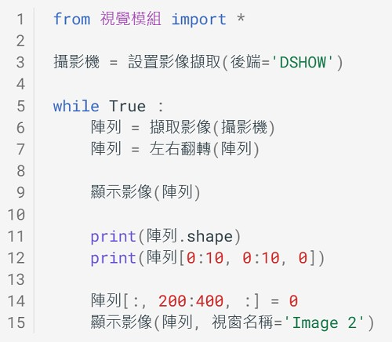
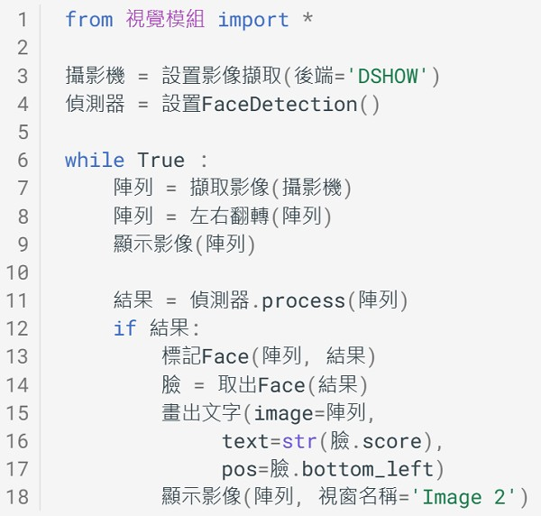
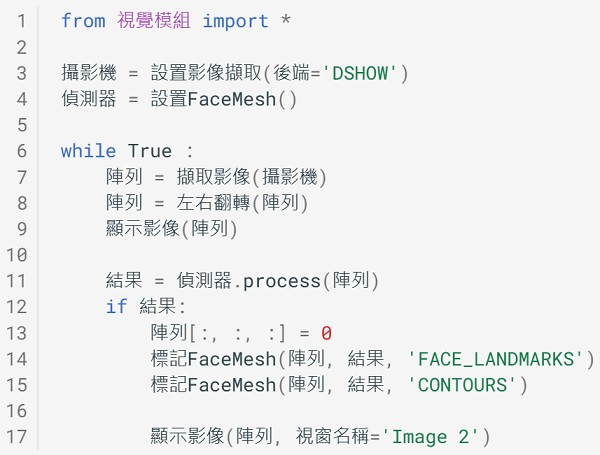
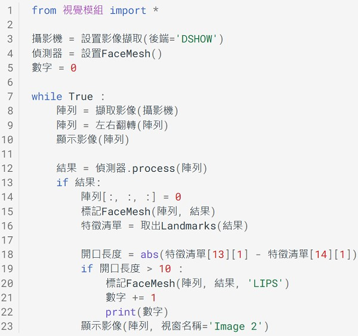
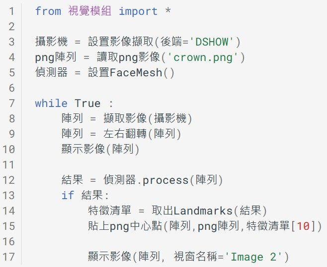
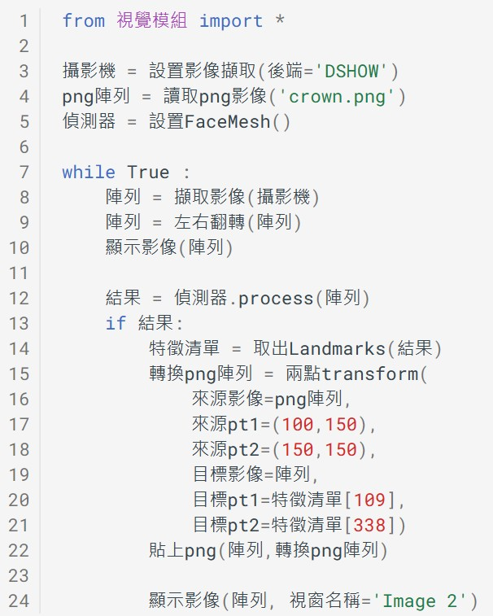
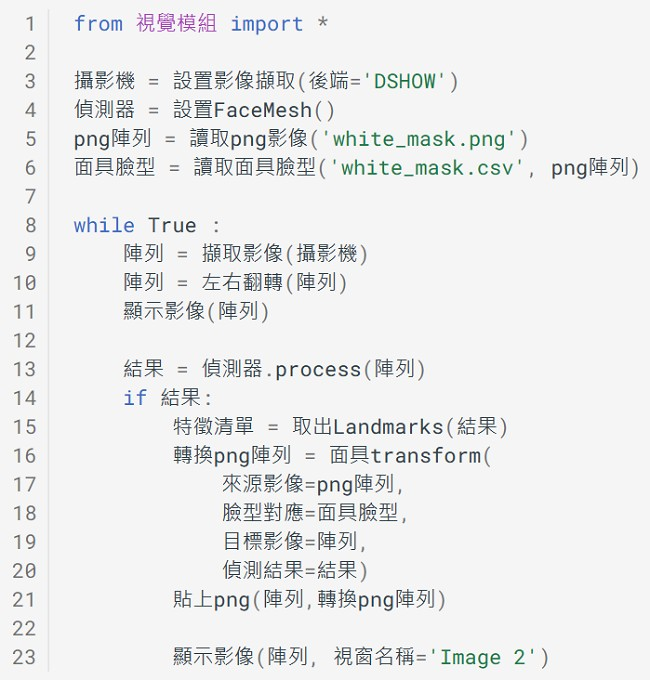

---
hide:
  - navigation
---

# 📚 人臉偵測與臉部特徵

: <iframe width="560" height="315" src="https://www.youtube.com/embed/l4fi-X5vZzI?start=30&amp;end=127" frameborder="0" allow="accelerometer; autoplay; encrypted-media; gyroscope; picture-in-picture" allowfullscreen></iframe>

: (1分37秒, 資料來源:[^face_pareidolia])

[^face_pareidolia]: 為何我們總是會看到臉孔?, by 皮毛小知識  , [youtube連結](https://youtu.be/l4fi-X5vZzI) 

 
 
  

----------------------------

##  📙 電腦視界(1)

----------------------------

???+ example "範例程式 電腦視界 - - - - - - - (電腦視界 1/1 新檔)"

    === "🎦操作影片"
    
        <iframe width="560" height="315" src="https://www.youtube.com/embed/V2ei9Wurv6M?start=2&amp;end=382" frameborder="0" allow="accelerometer; autoplay; encrypted-media; gyroscope; picture-in-picture" allowfullscreen></iframe>

        【長度6:20 章節時間如下】

        * 0:00 存檔、切換便利貼
        * 1:00 設置攝影機
        * 1:36 攝影機單張畫面
        * 2:15 觀察陣列
        * 3:43 攝影機連續畫面
        * 4:35 鏡像-左右翻轉
        * 5:06 修改攝影機畫面

    === "💻程式截圖"

         

 
 

----------------------------

##  📗  看見人臉(1)

----------------------------

: <iframe width="560" height="315" src="https://www.youtube.com/embed/aircAruvnKk?start=0&amp;end=156" frameborder="0" allow="accelerometer; autoplay; encrypted-media; gyroscope; picture-in-picture" allowfullscreen></iframe>

: (2分36秒,有中文字幕,資料來源:[^multilayer_perceptron])

[^multilayer_perceptron]: 究竟神經網路是什麼？ l 第一章 深度學習, By 3Blue1Brown  , [youtube連結](https://youtu.be/aircAruvnKk)

???+ example "範例程式 看見人臉 - - - - - - - (看見人臉 1/1 新檔)"

    === "🎦操作影片"
    
        <iframe width="560" height="315" src="https://www.youtube.com/embed/TUb_CzM2PjI?start=2&amp;end=348" frameborder="0" allow="accelerometer; autoplay; encrypted-media; gyroscope; picture-in-picture" allowfullscreen></iframe>

        【長度5:46 章節時間如下】

        * 0:00 存檔、切換便利貼
        * 0:41 設置攝影機、人臉偵測器
        * 1:22 擷取影像迴圈
        * 2:32 偵測、標示人臉
        * 4:10 標示信心值

    === "💻程式截圖"

         

 
 

----------------------------

##  📘  臉部網格(2)

***更多臉部特徵***

----------------------------

???+ example "範例程式 更多臉部特徵 - - - - - - - (臉部網格 1/2 新檔)"

    === "🎦操作影片"
    
        <iframe width="560" height="315" src="https://www.youtube.com/embed/9pxUQugN83E?start=2&amp;end=340" frameborder="0" allow="accelerometer; autoplay; encrypted-media; gyroscope; picture-in-picture" allowfullscreen></iframe>

        【長度5:38 章節時間如下】

        * 0:00 存檔、切換便利貼
        * 0:39 更多臉部特徵 
        * 0:50 設置攝影機、臉部網格偵測器
        * 1:35 擷取影像迴圈
        * 2:33 偵測臉部特徵點
        * 3:35 標示臉部網格、特徵點與輪廓

    === "💻程式截圖"

         

 
 

----------------------------

***臉部動作***

----------------------------

???+ example "範例程式 臉部動作 - - - - - - - (臉部網格 2/2 接續)"

    === "🎦操作影片"
    
        <iframe width="560" height="315" src="https://www.youtube.com/embed/9pxUQugN83E?start=343&amp;end=596" frameborder="0" allow="accelerometer; autoplay; encrypted-media; gyroscope; picture-in-picture" allowfullscreen></iframe>

        【長度4:13 章節時間如下】

        * 5:43 臉部動作
        * 6:25 計算開口長度
        * 8:07 符合開口條件的動作

    === "💻程式截圖"

         

 
 

----------------------------

##  📗  濾鏡貼紙(2)

***特徵點與png去背圖***

----------------------------

???+ example "範例程式 特徵點與png去背圖 - - - - - - - (濾鏡貼紙 1/2 新檔)"

    === "🎦操作影片"
    
        <iframe width="560" height="315" src="https://www.youtube.com/embed/JVkRS2VDHJg?start=0&amp;end=506" frameborder="0" allow="accelerometer; autoplay; encrypted-media; gyroscope; picture-in-picture" allowfullscreen></iframe>

        【長度 章節時間如下】

        * 0:00 存檔、切換便利貼
        * 0:51 攝影機程式
        * 2:24 png去背圖
        * 4:37 取得特徵點
        * 6:26 png貼至特徵點

    === "💻程式截圖"

        

 
 

----------------------------

***兩點轉換***

----------------------------

???+ example "範例程式 兩點轉換 - - - - - - - (濾鏡貼紙 2/2 接續)"

    === "🎦操作影片"
    
        <iframe width="560" height="315" src="https://www.youtube.com/embed/JVkRS2VDHJg?start=513&amp;end=704" frameborder="0" allow="accelerometer; autoplay; encrypted-media; gyroscope; picture-in-picture" allowfullscreen></iframe>

        【長度 章節時間如下】

        * 8:33 兩點轉換

    === "💻程式截圖"

        

 
 

----------------------------

##  📘  AR面具(1)

----------------------------

???+ example "範例程式 AR面具 - - - - - - - (AR面具 1/1 新檔)"

    === "🎦操作影片"
    
        <iframe width="560" height="315" src="https://www.youtube.com/embed/-rWygtI_UGo" frameborder="0" allow="accelerometer; autoplay; encrypted-media; gyroscope; picture-in-picture" allowfullscreen></iframe>

        【長度 章節時間如下】

        * 0:00 存檔、切換便利貼
        * 0:39 攝影機程式
        * 2:15 臉部偵測
        * 4:08 載入面具資料
        * 6:18 面具轉換

    === "💻程式截圖"

        

 
 

----------------------------

##  📙 結語

----------------------------

: <iframe width="560" height="315" src="https://www.youtube.com/embed/qbckDLoklZE" frameborder="0" allow="accelerometer; autoplay; encrypted-media; gyroscope; picture-in-picture" allowfullscreen></iframe>

: (7分31秒, 資料來源:[^face_recognition_issue])

[^face_recognition_issue]: 【民視全球新聞】人臉辨識雙面刃 用之不當恐引社會危機, by 民視新聞網  , [youtube連結](https://youtu.be/qbckDLoklZE) 

