---
hide:
  - navigation
---

# 📚 人臉偵測與臉部特徵

: 腦筋急轉彎，看看下面的照片，你看到了什麼？

: 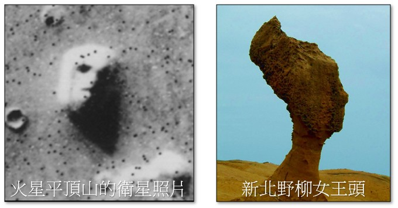

: (資料來源:[^pareidolia_scene])

[^pareidolia_scene]: 空想性錯視 維基百科, https://zh.wikipedia.org/zh-tw/%E7%A9%BA%E6%83%B3%E6%80%A7%E9%94%99%E8%A7%86

: 這種心理現象一般稱為空想性錯視(pareidolia)。

: 那什麼是空想性錯視呢？我們可以透過下方影片來瞭解：

: <iframe width="560" height="315" src="https://www.youtube.com/embed/l4fi-X5vZzI?start=30&amp;end=127" frameborder="0" allow="accelerometer; autoplay; encrypted-media; gyroscope; picture-in-picture" allowfullscreen></iframe>

: (1分37秒, 資料來源:[^face_pareidolia])

[^face_pareidolia]: 為何我們總是會看到臉孔?, by 皮毛小知識  , [youtube連結](https://youtu.be/l4fi-X5vZzI) 

: 空想性錯視是人類大腦與生俱來的功能，讓我們能認出人臉。你知道嗎？電腦在相關軟硬體的搭配下，也可以看出人臉呢！在這個課程中，讓我們一起來探索人臉偵測的資訊科技，及其相關應用。

??? info "關於視覺影像"

    : 本課程使用到整合後的教學函式庫，如下連結。

    : :fontawesome-solid-link: <a href="../../cv4t/" target="_blank">Py4t 視覺影像 說明、範例程式</a>

 
 
  

----------------------------

##  📙 電腦視界(1)

----------------------------

: 在此，我們要來了解，當電腦在觀看週遭環境時，到底看到了什麼？

: 首先，電腦以視訊攝影機做為眼睛，透過攝影機中的感光電子元件，將拍攝到的影像轉換成由0與1組成的數位訊號，後續可以讓它做各種運算處理並顯示在螢幕上。

 

: 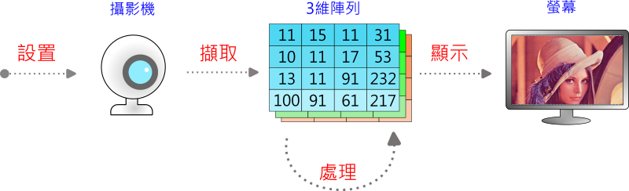

 

: 由上圖中可以得知，影像在電腦的記憶體中，會以陣列的資料結構存放，那什麼是陣列呢？

: 陣列(Array)是一種**資料結構**，是由**相同資料類型**(整數、字串或浮點數等)元素所組成。

: 常見的陣列種類可分成1、2、3維陣列，讓大量資料的排列方式更多元，在生活中都有實際的應用情形。

: 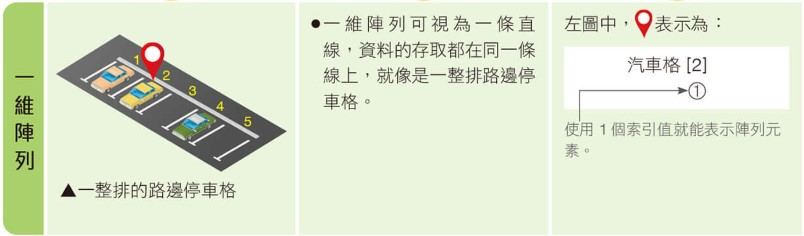

: 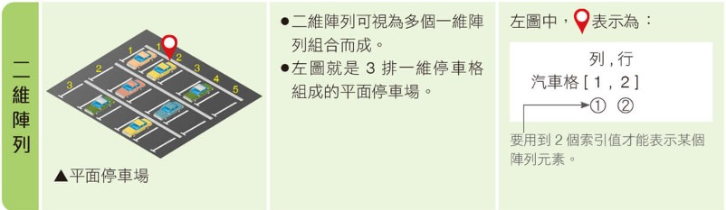

: 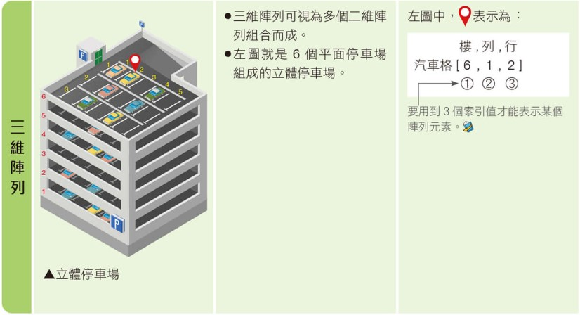

: (資料來源:[^parking_array])

[^parking_array]: 圖片來源：康軒教科書 國中二上科技領域資訊科技課本第52頁圖片

 
 

: 如果我們想要對影像做分析或處理，就必須要處理影像的3維陣列，利用索引的方式可以讓我們指定陣列的某一部分，在本課程中會使用numpy函式庫的多維陣列，其索引語法如下：

: 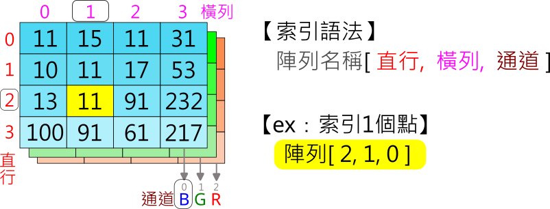

 
 
: 如果一次只能索引一個點的話，當我們想要一次存取一塊陣列，在程式撰寫時會變得更複雜。numpy函式庫提供切片(slicing)的語法，讓我們可以很方便的索引到一塊陣列。

: 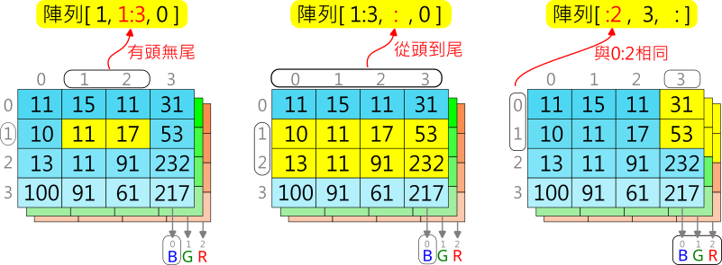

 

接著讓我們來實作看看。

???+ example "範例程式 電腦視界 - - - - - - - (電腦視界 1/1 新檔)"

    === "🎦操作影片"
    
        <iframe width="560" height="315" src="https://www.youtube.com/embed/V2ei9Wurv6M?start=2&amp;end=382" frameborder="0" allow="accelerometer; autoplay; encrypted-media; gyroscope; picture-in-picture" allowfullscreen></iframe>

        【長度6:20 章節時間如下】

        * 0:00 存檔、切換便利貼
        * 1:00 設置攝影機
        * 1:36 攝影機單張畫面
        * 2:15 觀察陣列
        * 3:43 攝影機連續畫面
        * 4:35 鏡像-左右翻轉
        * 5:06 修改攝影機畫面

    === "💻程式截圖"

         

 
 

----------------------------

##  📗  看見人臉(1)

----------------------------

: 想要讓電腦認出人臉，我們可以透過人臉偵測器來達成。

: 首先，設置人臉偵測器，之後將代表影像的3維陣列做為偵測器的輸入，從結果中，我們就可以得到人臉的資訊。

 

: 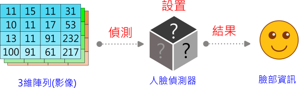

 

: 人臉偵測器感覺起來很像神秘的黑盒子，它的內部到底是什麼呢？

: 這個偵測器，其實是由全球資料科學家所研究的機器學習(Machine Learning)的結果之一，特別是這幾年快速發展的深度學習(Deep Learning)，由於這個主題相當的龐大與複雜，我們僅會透過下方的影片(手寫數字辨識)，做為對深度學習的基本認識。

 

: <iframe width="560" height="315" src="https://www.youtube.com/embed/aircAruvnKk?start=0&amp;end=156" frameborder="0" allow="accelerometer; autoplay; encrypted-media; gyroscope; picture-in-picture" allowfullscreen></iframe>

: (2分36秒,請自行開啟中文字幕,資料來源:[^multilayer_perceptron])

[^multilayer_perceptron]: 究竟神經網路是什麼？ l 第一章 深度學習, By 3Blue1Brown  , [youtube連結](https://youtu.be/aircAruvnKk)

 

: 資料科學家從人類的神經元及神經系統得到靈感，建構出以數學及電腦程式組成的人工神經網路。

: 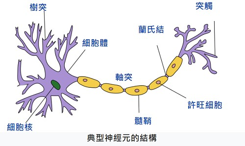

: (資料來源:[^human_neuron])

[^human_neuron]: 神經元 維基百科, https://zh.wikipedia.org/zh-tw/%E7%A5%9E%E7%B6%93%E5%85%83

 

: 人臉偵測器，是由深度學習方式所訓練出來的人工神經網路。其最簡單的型式是多層感知器，由每一層中的神經元，互相關連，組成複雜的神經網路來做出如同人類能力的各項辨識。

 

: 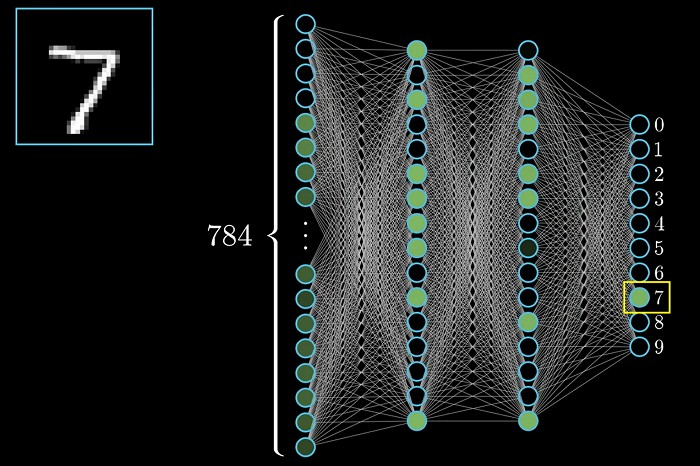

 

: 接著讓我們來實作看看。

 

???+ example "範例程式 看見人臉 - - - - - - - (看見人臉 1/1 新檔)"

    === "🎦操作影片"
    
        <iframe width="560" height="315" src="https://www.youtube.com/embed/TUb_CzM2PjI?start=2&amp;end=348" frameborder="0" allow="accelerometer; autoplay; encrypted-media; gyroscope; picture-in-picture" allowfullscreen></iframe>

        【長度5:46 章節時間如下】

        * 0:00 存檔、切換便利貼
        * 0:41 設置攝影機、人臉偵測器
        * 1:22 擷取影像迴圈
        * 2:32 偵測、標示人臉
        * 4:10 標示信心值

    === "💻程式截圖"

         

 
 

----------------------------

##  📘  臉部網格(2)

***更多臉部特徵***

----------------------------

: 在電腦科學中，臉部特徵(face landmark)是指臉部一組組容易尋找的點，眼睛、鼻子、嘴脣等。

: 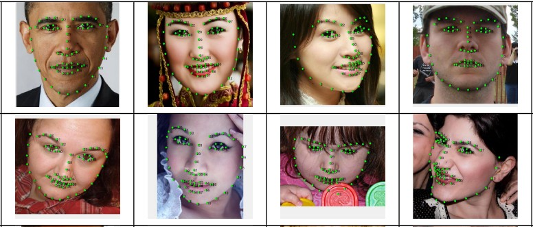

: (資料來源:[^face_landmark_photos])

[^face_landmark_photos]: Deep Recurrent Regression for Facial Landmark Detection, https://arxiv.org/pdf/1510.09083.pdf

 

: 各個臉部特徵點會有給定的編號，本課程所使用的臉部網格位置及編號(468點，來自mediapipe)，詳見 [臉部特徵點編號圖](face_mesh.png)。

 

: 有了臉部特徵點之後，將不同組的特徵點連結起來，可以得到臉部網格或是臉部輪廓等效果，看起來是不是很有趣啊。

: 

 

: 一起來動手實作。

???+ example "範例程式 更多臉部特徵 - - - - - - - (臉部網格 1/2 新檔)"

    === "🎦操作影片"
    
        <iframe width="560" height="315" src="https://www.youtube.com/embed/9pxUQugN83E?start=2&amp;end=340" frameborder="0" allow="accelerometer; autoplay; encrypted-media; gyroscope; picture-in-picture" allowfullscreen></iframe>

        【長度5:38 章節時間如下】

        * 0:00 存檔、切換便利貼
        * 0:39 更多臉部特徵 
        * 0:50 設置攝影機、臉部網格偵測器
        * 1:35 擷取影像迴圈
        * 2:33 偵測臉部特徵點
        * 3:35 標示臉部網格、特徵點與輪廓

    === "💻程式截圖"

         

 
 

----------------------------

***臉部動作***

----------------------------

: 霍金(Stephen William Hawking, 1942-2018)是世界知名的英國物理學家，他提出的黑洞理論，量子力學…等，在科學上有許多貢獻。他也曾出版過知名的科普書籍「時間簡史：從大爆炸到黑洞」。

: 霍金患有漸凍人症，從二十多歲開始，必須要使用枴杖與輪椅才能行走，病情也隨著時間逐漸惡化至嚴重。在這樣的環境下，他是如何撰寫研究論文與書本寫作的呢？讓我們一起來認識霍金的高科技輪椅。

 

: <iframe width="560" height="315" src="https://www.youtube.com/embed/18HzCMecF4g" frameborder="0" allow="accelerometer; autoplay; encrypted-media; gyroscope; picture-in-picture" allowfullscreen></iframe>

: (3分08秒,資料來源:[^wheelchair_technology])

[^wheelchair_technology]: 霍金的天价轮椅有何黑科技？眨眨眼就能说话，轮椅界的劳斯莱斯！, By 科普記  , [youtube連結](https://youtu.be/18HzCMecF4g)

 

: 那我們如何使用人臉偵測關鍵點的技術，來幫助因行動不便，而無法使用現有輸入方式的人呢？

: 我們可以嘗試用臉部動作來做出打字輸入的簡易程式，比如說，使用嘴脣上的2個關鍵點，並計算距離後，就可以偵測開口的動作。有了關鍵的偵測開口動作，未來就可以將程式擴展為具有文字輸入的功能。

 

: 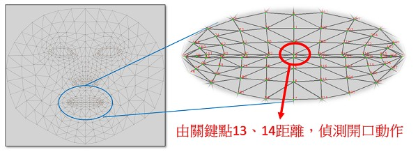

 

: 一起來實作看看，偵測開口動作的程式。

???+ example "範例程式 臉部動作 - - - - - - - (臉部網格 2/2 接續)"

    === "🎦操作影片"
    
        <iframe width="560" height="315" src="https://www.youtube.com/embed/9pxUQugN83E?start=343&amp;end=596" frameborder="0" allow="accelerometer; autoplay; encrypted-media; gyroscope; picture-in-picture" allowfullscreen></iframe>

        【長度4:13 章節時間如下】

        * 5:43 臉部動作
        * 6:25 計算開口長度
        * 8:07 符合開口條件的動作

    === "💻程式截圖"

         

??? info "進階範例 人臉輸入數字"

    : 人臉數字輸入，眨右眼增加數字，眨左眼減少數字，開口輸入數字

    : :fontawesome-solid-link: <a href="/cv4t/face_input_number/" target="_blank">進階範例 人臉輸入數字</a>

 
 

----------------------------

##  📗  濾鏡貼紙(2)

***特徵點與png去背圖***

----------------------------

: 從臉部網格所取得的特徵點，多是以圖片座標xy來表達，但這個座標系統與我們在數學課所學的平面直角座標略有不同，簡單來說，是將第一象限做上下翻轉而來，每個座標值沒有負數，且均為整數。

 

: 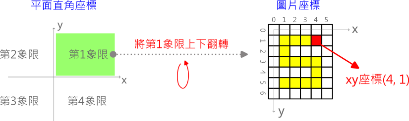

 

: 臉部特徵點還可以有什麼應用呢？我們可以做出類似IG的濾鏡貼紙效果，幫相機裡的人增加卡通裝飾。

: 想要達到這個功能，必須要能夠將一張圖，覆疊至另一張圖上。為了有更好的覆疊效果，我們需要認識alpha(阿爾法)通道。

: 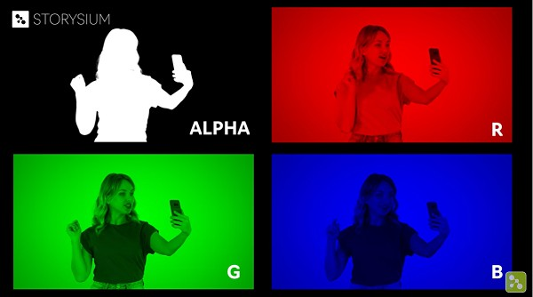

: (資料來源:[^alpha_channel])

 

: 通常電腦圖片是以Red、Green、Blue三個通道。但有些圖片具有RGBA四個通道(如PNG圖檔)，A通道也稱為alpha通道，此通道代表的不是顏色，而是不透明度，如下圖所示，白色部份是不透明(值為255)，黑色的部份是透明(值為0)。

 

: 

: (資料來源:[^alpha_channel])

[^alpha_channel]:Export with ALPHA Channel to make your video Transparent - Premiere Pro, by storysium, https://youtu.be/s3r5Ezzv3Rs

 

從下面的影片中，可以看出alpha通道的效果，可以讓圖片的背景去除。

 

: <iframe width="560" height="315" src="https://www.youtube.com/embed/s3r5Ezzv3Rs?start=9&amp;end=29" frameborder="0" allow="accelerometer; autoplay; encrypted-media; gyroscope; picture-in-picture" allowfullscreen></iframe>

: (20秒,資料來源:[^alpha_channel])

 

: 接著，我們會使用png去背圖來覆疊到攝影機的視訊上，一起來實作看看。

???+ example "範例程式 特徵點與png去背圖 - - - - - - - (濾鏡貼紙 1/2 新檔)"

    === "🎦操作影片"
    
        <iframe width="560" height="315" src="https://www.youtube.com/embed/JVkRS2VDHJg?start=0&amp;end=506" frameborder="0" allow="accelerometer; autoplay; encrypted-media; gyroscope; picture-in-picture" allowfullscreen></iframe>

        【長度 章節時間如下】

        * 0:00 存檔、切換便利貼
        * 0:51 攝影機程式
        * 2:24 png去背圖
        * 4:37 取得特徵點
        * 6:26 png貼至特徵點

    === "💻程式截圖"

        

 
 

----------------------------

***兩點轉換***

----------------------------

: 在上一個範例中，雖然有將裝飾的png圖貼上，但實際運行時，發現了一些問題，就是當自己的臉在不同的遠近及角度時，裝飾圖都不會改變，造成比例大小及角度的不一致，這要怎麼克服呢？

: 在這裡，我們會採用已經經過簡化後的兩點transform(轉換)來解決這個問題。首先，利用繪圖軟體來找出裝飾圖png上的來源點1及來源點2的座標。再來從 [臉部特徵點編號圖](face_mesh.png) 中找出目標點1及目標點2的編號，經由兩點transform，裝飾圖png就會適當的縮放與旋轉，產生位置吻合的轉換png陣列。

 

: 

??? info "關於兩點transform的原理與實作"

    : 兩點轉換的原理，需使用到平移、旋轉及放大的轉換矩陣。

    : :fontawesome-solid-link: <a href="https://en.wikipedia.org/wiki/Transformation_matrix#Other_kinds_of_transformations" target="_blank">transformation matrix</a>

    : 兩點轉換的原始碼，使用到numpy及opencv，來完成需要的矩陣運算

    : :fontawesome-solid-link: <a href="https://github.com/beardad1975/cv4t/blob/main/cv4t/draw_lib.py#L173" target="_blank">兩點轉換原始碼</a>

 
 

: 有了轉換後的裝飾圖png，再把它覆疊到原本的攝影機影像上，就可以做出如IG的濾鏡貼紙效果了。

: 

 

: 動手實作看看。

???+ example "範例程式 兩點轉換 - - - - - - - (濾鏡貼紙 2/2 接續)"

    === "🎦操作影片"
    
        <iframe width="560" height="315" src="https://www.youtube.com/embed/JVkRS2VDHJg?start=513&amp;end=704" frameborder="0" allow="accelerometer; autoplay; encrypted-media; gyroscope; picture-in-picture" allowfullscreen></iframe>

        【長度 章節時間如下】

        * 8:33 兩點轉換

    === "💻程式截圖"

        

??? info "進階範例 濾鏡貼紙(多種切換)"

    : 使用空白鍵切換不同的造型貼紙

    : :fontawesome-solid-link: <a href="/cv4t/ar_mask_switch/" target="_blank">進階範例 濾鏡貼紙(多種切換)</a>

 
 

----------------------------

##  📘  AR面具(1)

----------------------------

???+ example "範例程式 AR面具 - - - - - - - (AR面具 1/1 新檔)"

    === "🎦操作影片"
    
        <iframe width="560" height="315" src="https://www.youtube.com/embed/-rWygtI_UGo" frameborder="0" allow="accelerometer; autoplay; encrypted-media; gyroscope; picture-in-picture" allowfullscreen></iframe>

        【長度 章節時間如下】

        * 0:00 存檔、切換便利貼
        * 0:39 攝影機程式
        * 2:15 臉部偵測
        * 4:08 載入面具資料
        * 6:18 面具轉換

    === "💻程式截圖"

        

 
 

----------------------------

##  📙 科技社會議題

----------------------------

: <iframe width="560" height="315" src="https://www.youtube.com/embed/qbckDLoklZE" frameborder="0" allow="accelerometer; autoplay; encrypted-media; gyroscope; picture-in-picture" allowfullscreen></iframe>

: (7分31秒, 資料來源:[^face_recognition_issue])

[^face_recognition_issue]: 【民視全球新聞】人臉辨識雙面刃 用之不當恐引社會危機, by 民視新聞網  , [youtube連結](https://youtu.be/qbckDLoklZE) 

