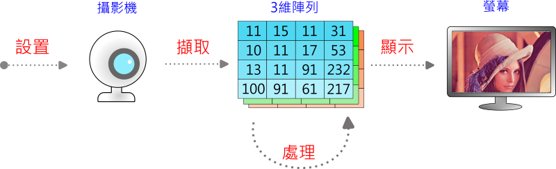
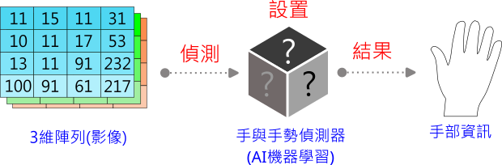
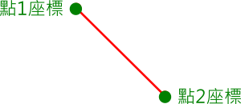
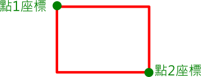
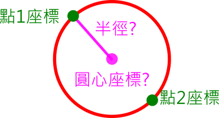
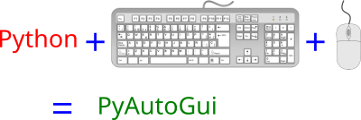
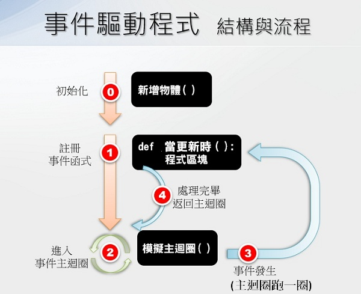

---
hide:
  - navigation
---

# 📚 手部偵測與體感互動

: 什麼是體感互動？

<br/>


: <iframe width="560" height="315" src="https://www.youtube.com/embed/1YSH7sNCKRM?start=0&amp;end=26" frameborder="0" allow="accelerometer; autoplay; encrypted-media; gyroscope; picture-in-picture" allowfullscreen></iframe>

: <sup>(26秒, 資料來源:</sup>[^motion_control_game]<sup>)</sup>

[^motion_control_game]: 《Nintendo Switch 運動》介紹影片(新增高爾夫球)（香港）, by Nintendo HK官方頻道  , [youtube連結](https://youtu.be/1YSH7sNCKRM) 

<br/>

??? info "建議先備課程"

     在學習本課程前，建議先體驗過 :fontawesome-solid-long-arrow-alt-right: <a href="../face_detection_and_landmarks/" target="_blank">「人臉偵測與臉部特徵」</a> ，在學習概念銜接上會較為平順。

??? info "kinect體感作品參考"

    筆者於2014年實作的kinect體感作品--機器娃娃
     
     :fontawesome-solid-long-arrow-alt-right: <a href="https://youtu.be/Kj-kAHYOaN0" target="_blank">機器娃娃</a>


<br/>
<br/>
<br/>


----------------------------

##  📙 手與手勢偵測(3)

*** 攝影機程式 ***

----------------------------

: 運作流程

<br/>

: 


<br/>


???+ example "範例程式 攝影機程式 - - - - - - - (手與手勢偵測 1/3 新檔)"

    === "💻程式碼"

        ```python
        from 視覺模組 import *

        攝影機 = 設置影像擷取(後端='DSHOW')

        while True :
            陣列 = 擷取影像(攝影機)
            陣列 = 左右翻轉(陣列)
            顯示影像(陣列)
        ```

<br/>
<br/>


----------------------------

*** 手部特徵點 ***

----------------------------


: 偵測流程

<br/>

: 


<br/>
<br/>

: 手部關鍵點

<br/>

: 

: <sup>(資料來源:</sup>[^hand_landmarks]<sup>)</sup>

[^hand_landmarks]: mediapipe , https://developers.google.com/mediapipe/solutions/vision/hand_landmarker

<br/>

???+ example "範例程式 手部特徵點 - - - - - - - (手與手勢偵測 2/3 接續)"

    === "💻程式碼"

        ```python
        from 視覺模組 import *

        攝影機 = 設置影像擷取(後端='DSHOW')
        偵測器 = 設置HandAndGesture()

        while True :
            陣列 = 擷取影像(攝影機)
            陣列 = 左右翻轉(陣列)

            結果 = 偵測器.process(陣列)
            if 結果:
                標記Hand(陣列, 結果)
            顯示影像(陣列)        
        ```

<br/>
<br/>

----------------------------

*** 左右手與手勢 ***

----------------------------

<br/>

: 手勢偵測

<br/>

|   手勢   | 中文說明  |
|  :-----------:   | :-----------:   |
| "None"  | 無手勢 |
| "Closed_Fist"  | 握拳(石頭) |
| "Open_Palm"  | 開掌(布) |
| "Pointing_Up"  | 食指向上 |
| "Thumb_Down"  | 拇指向下(倒讚) |
| "Thumb_Up"  | 拇指向上(讚) |
| "Victory"  | 勝利(剪刀) |
| "ILoveYou"  | 我愛你(伸出拇指、食指與小指) |
 
    
  
   
<br/>     
<br/>      
     

<br/>

???+ example "範例程式 左右手與手勢 - - - - - - - (手與手勢偵測 3/3 接續)"

    === "💻程式碼"

        ```python
        from 視覺模組 import *

        攝影機 = 設置影像擷取(後端='DSHOW')
        偵測器 = 設置HandAndGesture()

        while True :
            陣列 = 擷取影像(攝影機)
            陣列 = 左右翻轉(陣列)
            
            結果 = 偵測器.process(陣列)
            if 結果:
                標記Hand(陣列, 結果)
                手 = 取出Hand(結果)
                print(手.handedness)    
                print(手.gesture)
                
            顯示影像(陣列)       
        ```

<br/>
<br/>


----------------------------

##  📗  幾何形狀互動(2)

*** 直線互動 ***

----------------------------

: 直線

<br/>

: 


<br/>


???+ example "範例程式 直線互動 - - - - - - - (幾何形狀互動 1/2 新檔)"

    === "💻程式碼"

        ```python
        from 視覺模組 import *

        攝影機 = 設置影像擷取(後端='DSHOW')
        偵測器 = 設置HandAndGesture()

        while True :
            陣列 = 擷取影像(攝影機)
            陣列 = 左右翻轉(陣列)
            結果 = 偵測器.process(陣列)

            if 結果:
                手 = 取出Hand(結果)
                手指1 = 手.特徵點(索引=8)
                手指2 = 手.特徵點(索引=4)
                
                畫直線(image=陣列,
                    pt1=手指1,
                    pt2=手指2)
                畫圓形(image=陣列,
                    center=手指1,
                    radius=5,
                    color=(0,0,255),
                    thickness=-1)
                畫圓形(image=陣列,
                    center=手指2,
                    radius=5,
                    color=(0,0,255),
                    thickness=-1)

            顯示影像(陣列)
        ```


<br/>
<br/>

----------------------------

*** 矩形互動 ***

----------------------------

: 矩線

<br/>

: 


<br/>


???+ example "範例程式 矩形互動 - - - - - - - (幾何形狀互動 1/2 接續)"

    === "💻程式碼"

        ```python
        from 視覺模組 import *

        攝影機 = 設置影像擷取(後端='DSHOW')
        偵測器 = 設置HandAndGesture()

        while True :
            陣列 = 擷取影像(攝影機)
            陣列 = 左右翻轉(陣列)
            結果 = 偵測器.process(陣列)

            if 結果:
                手清單 = 取出Hand清單(結果)
                if len(手清單) == 2:
                    手指1 = 手清單[0].特徵點(索引=8)
                    手指2 = 手清單[1].特徵點(索引=8)
                    
                    畫矩形(image=陣列,
                        pt1=手指1,
                        pt2=手指2)
                    畫圓形(image=陣列,
                        center=手指1,
                        radius=5,
                        color=(0,0,255),
                        thickness=-1)
                    畫圓形(image=陣列,
                        center=手指2,
                        radius=5,
                        color=(0,0,255),
                        thickness=-1)
                    
            顯示影像(陣列)
        ```

<br/>
<br/>

??? info "練習 圓形互動"
    : 請利用手部的兩點，決定圓心與半徑，做出圓形互動的效果

    : 

    : :fontawesome-solid-link: <a href="https://youtu.be/Llzt5yX_fTQ?start=3398&end=3834" target="_blank">圓形互動實作影片(Py4t練功坊)</a>


??? info "進階範例 數位花繩"

    : 將兩手相對應的指頭靠近後，會產生直線連結

    : :fontawesome-solid-link: <a href="../../cv4t/digital_rope/" target="_blank">進階範例 數位花繩</a>

<br/>
<br/>


: <iframe width="560" height="315" src="https://www.youtube.com/embed/21LtA5-wiwU" frameborder="0" allow="accelerometer; autoplay; encrypted-media; gyroscope; picture-in-picture" allowfullscreen></iframe>

: <sup>(1分11秒, 資料來源:</sup>[^leap_motion]<sup>)</sup>

[^leap_motion]: Leap Motion With Windows, by Leap Motion  , [youtube連結](https://youtu.be/21LtA5-wiwU) 

??? info "Leap Motion體感作品參考"

    筆者於2015年實作的leap motion體感作品--用手控制機器娃娃頭部
     
     :fontawesome-solid-long-arrow-alt-right: <a href="https://youtu.be/We1G-vzsJKs" target="_blank">用手控制機器娃娃頭部</a>


<br/>
<br/>
<br/>

----------------------------

##  📘  圖像互動(2)


*** 模糊控制 ***

----------------------------

<br/>

: 模糊處理(平滑處理)，影像去噪

: 

<br/>

: 卷積核與卷積運算

: 

: <sup>(資料來源:</sup>[^average_blur_kernel]<sup>)</sup>

[^average_blur_kernel]: Computer Vision for Beginners: Part 2, [https://towardsdatascience.com/computer-vision-for-beginners-part-2-29b3f9151874](https://towardsdatascience.com/computer-vision-for-beginners-part-2-29b3f9151874)

<br/>

???+ example "範例程式 模糊控制 - - - - - - - (圖像互動 1/2 新檔)"

    === "💻程式碼"

        ```python
        from 視覺模組 import *

        攝影機 = 設置影像擷取(後端='DSHOW')
        偵測器 = 設置HandAndGesture()
        kernel = 30

        while True :
            陣列 = 擷取影像(攝影機)
            陣列 = 左右翻轉(陣列)
            結果 = 偵測器.process(陣列)
            
            if 結果:
                kernel -= 2    
            else:
                kernel += 2        
            kernel = max(1, min(30,kernel))    
            陣列 = 模糊(陣列, 核心=kernel)  
            
            顯示影像(陣列)
        ```

<br/>
<br/>


----------------------------


*** 掌中球 ***

----------------------------

: 背景透明圖

<br/>

: 

: <sup>(資料來源:</sup>[^alpha_channel]<sup>)</sup>

[^alpha_channel]:Export with ALPHA Channel to make your video Transparent - Premiere Pro, by storysium, https://youtu.be/s3r5Ezzv3Rs

<br/>

: 兩點對應

<br/>

: 


<br/>


???+ example "範例程式 掌中球 - - - - - - - (圖像互動 2/2 新檔)"

    === "💻程式碼"

        ```python
        # 需匯入basketball.png(視覺便利貼:png->匯入)

        from 視覺模組 import *

        攝影機 = 設置影像擷取(後端='DSHOW')
        偵測器 = 設置HandAndGesture()
        png陣列 = 讀取png影像('basketball.png')

        while True :
            陣列 = 擷取影像(攝影機)
            陣列 = 左右翻轉(陣列)
            結果 = 偵測器.process(陣列)
            if 結果:
                手 = 取出Hand(結果)
                手指1 = 手.特徵點(索引=4)
                手指2 = 手.特徵點(索引=20)
                籃球1 = (30,300)
                籃球2 = (630,300)
                
                轉換png陣列 = 兩點transform(
                    來源影像=png陣列,
                    來源pt1=籃球1,
                    來源pt2=籃球2,
                    目標影像=陣列,
                    目標pt1=手指1,
                    目標pt2=手指2)
                貼上png(陣列,轉換png陣列)
                        
            顯示影像(陣列)  
        ```

<br/>
<br/>


----------------------------

##  📘  鍵盤互動(2)

*** 記事本自動化 ***

----------------------------

什麼是PyAutoGui？
<br/>

: 

<br/>
<br/>

???+ example "範例程式 記事本自動化 - - - - - - - (鍵盤互動 1/2 新檔)"

    === "💻程式碼"

        ```python
        import pyautogui
        import os
        import time

        # 開啟 記事本
        os.startfile('notepad.exe')
        time.sleep(1)

        # key in 文字
        for i in 'How are you?' :
            pyautogui.press(i)
            pyautogui.press('enter')
        ```


<br/>
<br/>
<br/>

----------------------------

*** 體感小恐龍 ***

----------------------------

<br/>
結合手勢與自動化程式，來玩小恐龍遊戲。

<br/>
???+ example "範例程式 體感小恐龍 - - - - - - - (鍵盤互動 2/2 新檔)"

    === "💻程式碼"

        ```python
        from 視覺模組 import *
        import pyautogui
        import os
        import time

        攝影機 = 設置影像擷取(後端='DSHOW')
        偵測器 = 設置HandAndGesture()
        延遲計數器 = 0 

        # 產生影像視窗
        陣列 = 擷取影像(攝影機)
        顯示影像(陣列)

        # 開啟chrome(若開啟失敗，請手動開啟並輸入網址)
        os.startfile('chrome.exe')
        time.sleep(1)

        # 輸入小恐龍網址
        for c in 'chrome://dino':
            pyautogui.press(c)
        pyautogui.press('enter')

        while True :
            延遲計數器 -= 1
            陣列 = 擷取影像(攝影機)
            陣列 = 左右翻轉(陣列)
            結果 = 偵測器.process(陣列)
            if 結果 and 延遲計數器 < 0:
                手 = 取出Hand(結果)
                if 手.gesture == "Open_Palm":
                    print('空白鍵', end=' ')
                    pyautogui.press('space')
                    延遲計數器 = 5
            顯示影像(陣列)
        ```

<br/>
<br/>

: <iframe width="560" height="315" src="https://www.youtube.com/embed/4-lmRwhr-1E" frameborder="0" allow="accelerometer; autoplay; encrypted-media; gyroscope; picture-in-picture" allowfullscreen></iframe>


: <sup>(1分11秒, 資料來源:</sup>[^virturl_screen]<sup>)</sup>

[^virturl_screen]: 「關鍵報告」虛擬螢幕 GOOGLE手勢傳感勾雛型, by 東森新聞 CH51  , [youtube連結](https://youtu.be/4-lmRwhr-1E) 

<br/>
<br/>
<br/>
<br/>


----------------------------

##  📗  3D互動(3)

*** 攝影機與3D貼圖 ***

----------------------------

: 3D程式流程與攝影機流程，要如何合併？

<br/>

: 

<br/>

: 


<br/>


???+ example "範例程式 攝影機與3D貼圖 - - - - - - - (3D互動 1/3 新檔)"

    === "💻程式碼"

        ```python
        from 模擬3D模組 import *
        from 視覺模組 import *

        攝影機 = 設置影像擷取(後端='DSHOW')
        舞台 = 模擬3D引擎(1600,800)

        螢幕 = 新增方形平面()
        螢幕.縮放 = [6.4, 4.8, 1]

        def 當更新時(dt):
            陣列 = 擷取影像(攝影機)
            陣列 = 左右翻轉(陣列)
            螢幕.多維陣列貼圖 = 陣列
            
        模擬主迴圈()
        ```


<br/>
<br/>

----------------------------

*** 地球與星空 ***

----------------------------

<br/>
加入地球與星空的物件及貼圖
<br/>


???+ example "範例程式 地球與星空 - - - - - - - (3D互動 2/3 接續)"

    === "💻程式碼"

        ```python
        # 需匯入地球.jpg(3D便利貼:材質->匯入)
        # 需匯入星空.jpg(3D便利貼:材質->匯入)

        from 模擬3D模組 import *
        from 視覺模組 import *

        攝影機 = 設置影像擷取(後端='DSHOW')
        舞台 = 模擬3D引擎(1600,800)

        螢幕 = 新增方形平面()
        螢幕.縮放 = [6.4, 4.8, 1]
        螢幕.位置x = -4

        地球 = 新增球體()
        地球.縮放 = 5
        地球.位置x = 3
        地球.材質貼圖 = '地球.jpg'

        星空 = 新增內面貼圖球體()
        星空.縮放 = 100
        星空.材質貼圖 = '星空.jpg'

        def 當更新時(dt):
            地球.旋轉y -= 0.4
            陣列 = 擷取影像(攝影機)
            陣列 = 左右翻轉(陣列)
            螢幕.多維陣列貼圖 = 陣列
            
        模擬主迴圈()
        ```

<br/>
<br/>

----------------------------

*** 旋轉縮放互動 ***

----------------------------

<br/>

結合手勢來控制地球

旋轉：一手做出「石頭」的手勢，另一手的拇指食指調整速度

旋轉：一手做出「布」的手勢，另一手的拇指食指調整大小


<br/>


???+ example "範例程式 旋轉縮放互動 - - - - - - - (3D互動 3/3 接續)"

    === "💻程式碼"

        ```python
        # 需匯入地球.jpg(3D便利貼:材質->匯入)
        # 需匯入星空.jpg(3D便利貼:材質->匯入)

        from 模擬3D模組 import *
        from 視覺模組 import *

        攝影機 = 設置影像擷取(後端='DSHOW')
        偵測器 = 設置HandAndGesture()
        舞台 = 模擬3D引擎(1600,800)

        螢幕 = 新增方形平面()
        螢幕.縮放 = [6.4, 4.8, 1]
        螢幕.位置x = -4

        地球 = 新增球體()
        地球.縮放 = 5
        地球.位置x = 3
        地球.材質貼圖 = '地球.jpg'

        星空 = 新增內面貼圖球體()
        星空.縮放 = 100
        星空.材質貼圖 = '星空.jpg'

        def 當更新時(dt):
            地球.旋轉y -= 0.4
            陣列 = 擷取影像(攝影機)
            陣列 = 左右翻轉(陣列)
            結果 = 偵測器.process(陣列)
            if 結果:
                手 = 取出Hand(結果)
                手清單 = 取出Hand清單(結果)
                if 手.gesture == 'Closed_Fist':
                    if len(手清單) == 1:
                        地球.旋轉y -= 2
                    else:
                        手指距離 = abs(手清單[1].y(索引=8)-手清單[1].y(索引=4))
                        地球.旋轉y -= 手指距離 / 20
                        畫直線(image=陣列,
                            pt1=手清單[1].特徵點(索引=8),
                            pt2=手清單[1].特徵點(索引=4))
                elif 手.gesture == 'Open_Palm':
                    地球.旋轉y -= 2
                    if len(手清單) == 2:
                        手指距離 = abs(手清單[1].y(索引=8)-手清單[1].y(索引=4))
                        地球.縮放 =手指距離 / 20
                        畫直線(image=陣列,
                            pt1=手清單[1].特徵點(索引=8),
                            pt2=手清單[1].特徵點(索引=4))                            
            螢幕.多維陣列貼圖 = 陣列            
        模擬主迴圈()
        ```


<br/>
<br/>


<br/>
<br/>