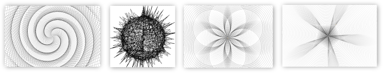
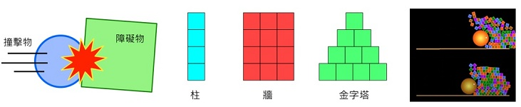
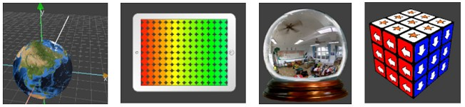
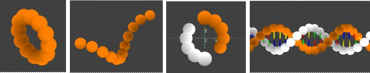
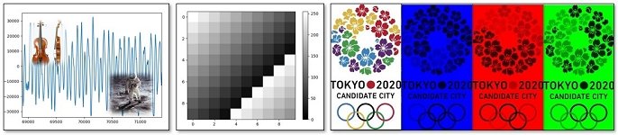

---
hide:
  - navigation
---

從推廣研習的簡報與範例程式轉化而成的課程講義，從單元主題開始，包含影片、圖片、說明、範例程式、練習與補充資料，可讓資訊科技教師於教學現場使用，也可以讓有興趣者自學。

 

## 🐢 海龜繪圖(4)

----------------------------

???+ success  "入門 - 海龜畫國旗 "
    
    

    : 學習海龜程式，畫出與方形、圓形、星形相關的國旗。　 :fontawesome-solid-long-arrow-alt-right: <a href="national_flag/" target="_blank">「海龜畫國旗」</a>

??? abstract  "專題 - 中華民國國旗 "    
    :  

    : 利用所學的長方形、圓形與星形，思考、設計與規劃，用海龜程式實作出我們的國旗。　 :fontawesome-solid-long-arrow-alt-right: <a href="project_roc_flag/" target="_blank">「中華民國國旗」</a>

 

----------------------------

???+ success  "海龜畫禪繞  "
    
    

    使用海龜程式，以筆劃元素、基本圖樣、重複規則來畫出禪繞圖。

    : :fontawesome-solid-long-arrow-alt-right: <a href="zentangle/" target="_blank">「海龜畫禪繞」</a>

??? abstract  "專題 - 海龜與樹 "    
    

    : 使用海龜程式，從碎形與遞迴，畫出樹的形狀，搭配剪影風格，產生具有混沌狀態的樹。　 :fontawesome-solid-long-arrow-alt-right: <a href="project_fractal_tree/" target="_blank">「海龜與樹」</a>

   

## 🏀 物理模擬(2)

-----------------------

???+ success  "力與運動遊樂場"
    

    學習物理程式，做出彈性、斜面、拋體與重力等模擬程式。
    :fontawesome-solid-long-arrow-alt-right: <a href="mechanics_playground/" target="_blank">「力與運動遊樂場」</a>

??? abstract  "專題 - 物理撞擊實驗室 "    
    
    

    利用撞擊物與障礙物，進行撞擊的測試，找出影響撞擊的因素。
    :fontawesome-solid-long-arrow-alt-right: <a href="project_collision_lab/" target="_blank">「物理撞擊實驗室」</a>

   

##

## 🧊 3D 程式 (2)

-----------------------

???+ success  "探索3D空間"
    
    
    學習3D程式，做出地球模型、彩色漸層、全景水晶球與魔術方塊。
    :fontawesome-solid-long-arrow-alt-right: <a href="explore3d/" target="_blank">「探索3D空間」</a>

??? abstract  "專題 - DNA與遺傳編碼 "    
    
    

    認識DNA的基本知識，實作出雙螺旋模型，並加上遺傳訊息的編碼，完成人類X染色體的片段模型。

    :fontawesome-solid-long-arrow-alt-right: <a href="project_dna_genetic_code/" target="_blank">「DNA與遺傳編碼」</a>

   

## 〽️ 影音數位化(1)

-----------------------

???+ success  "陣列與影音數位化"
    
    
    

    認識numpy多維陣列，以1、2、3維陣列處理聲音及影像數位訊號。

    :fontawesome-solid-long-arrow-alt-right: <a href="array_and_digital_signal/" target="_blank">「陣列與影音數位化」</a>

   

## ✴️ 機器學習及應用(1)

-----------------------

???+ success  "人臉偵測與臉部特徵"
    
    

    以攝影機程式及人臉偵測器來找出臉部特徵，做為簡易應用。

    :fontawesome-solid-long-arrow-alt-right: <a href="face_detection_and_landmarks/" target="_blank">「人臉偵測與臉部特徵」</a>

   

##

## 📚 教科書與Python(1)

-----------------------

???+ success  "Python程式設計 計算篇 (9上翰林版2-2)"
    
    利用Py4t的便利貼與輔助排版，實作課本上的範例程式。

    學習Python基本語法，銜接高中資訊科技課程。

    :fontawesome-solid-long-arrow-alt-right: <a href="textbook_hanlin9_example/" target="_blank">「Python程式設計-計算篇 (9上翰林版2-2)」</a>

   

  

##

## 🔗 Py4t雲端硬碟

: Py4t研習、練功坊相關資料

: [Py4t雲端硬碟連結](https://drive.google.com/drive/folders/1LhMRBFhtEZI6fBmS9eolo1qUwi3o0vMC?usp=share_link)

-----------------------

