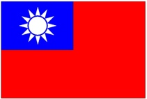

---
hide:
  - navigation
---

從一場場的推廣研習簡報與實際教學資料轉化而成的課程講義，從單元主題開始，包含影片、圖片、說明、範例程式、練習與補充資料，方便資訊科技教師於教學現場使用。

----------------------------

#### 💡 <a href="/lesson/national_flag/" target="_blank">海龜畫國旗</a>

??? info  "課程摘要"
    
    

    : 學習海龜程式，畫出與方形、圓形、星形相關的國旗。　 :fontawesome-solid-long-arrow-alt-right: <a href="/lesson/national_flag/" target="_blank">進入「海龜畫國旗」</a>

    ---------------------------

    :  

    : 程式專題：中華民國國旗

    : 利用所學的基本形狀，畫出我們的國旗。　 :fontawesome-solid-long-arrow-alt-right: <a href="/lesson/national_flag/project_roc_flag/" target="_blank">進入專題</a>

  

----------------------------

#### 💡 [力與運動遊樂場](mechanics_playground/index.md)

??? info  "課程摘要"
    學習物理程式，做出與彈性、斜面、拋體與重力相關的模擬。

    

