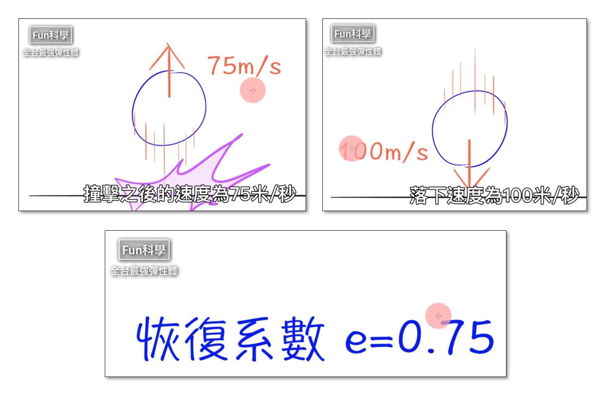

# 📚Py4t課程 - 力與運動遊樂場

----------------------------

##  📙 球的彈性

----------------------------

**階段1: 新增圓球**

:  

: 利用基本的程式來產生物理舞台，按下滑鼠後可以新增圓球。

: 一起動手來寫程式吧！

??? example "Let's Code 新增圓球"

    :fontawesome-solid-link: <a href="../../pie4t/bounce_ball/#_1" target="_blank">Py4t範例程式 新增圓球</a>

??? info "補充資料"

    什麼是「模擬主迴圈」？

    程式除了由依序執行、條件分支與重複結構，還有別的執行方式嗎？
    
    請參考:fontawesome-solid-link: <a href="https://zh.wikipedia.org/wiki/%E4%BA%8B%E4%BB%B6%E9%A9%85%E5%8B%95%E7%A8%8B%E5%BC%8F%E8%A8%AD%E8%A8%88" target="_blank">維基百科: 事件驅動程式設計</a>

    

----------------------------

**階段2: 恢復係數**

: 如何知道一顆球的彈性好不好呢？
 
<iframe width="560" height="315" src="https://www.youtube.com/embed/_RWqefx0vAg?start=95&amp;end=215" frameborder="0" allow="accelerometer; autoplay; encrypted-media; gyroscope; picture-in-picture" allowfullscreen></iframe>

  

: 恢復係數可以衡量兩個物體在碰撞後的反彈程度

 
: (圖片來源[^1])

[^1]: 引用自【Fun科學】超彈力橡皮筋球 https://www.youtube.com/watch?v=_RWqefx0vAg 

  

: 讓我們用程式來模擬不同彈性的球吧！

??? example "Let's Code 恢復係數"

     :fontawesome-solid-link: <a href="../../pie4t/bounce_ball/#2" target="_blank">Py4t範例程式 恢復係數</a>

??? info "補充資料"

    了解更多 :fontawesome-solid-link: <a href="https://zh.wikipedia.org/wiki/%E6%81%A2%E5%A4%8D%E7%B3%BB%E6%95%B0" target="_blank">恢復係數</a>

    恢復係數與球類比賽有什麼關係？ :fontawesome-solid-link: <a href="https://zh.wikipedia.org/wiki/%E4%B8%AD%E8%8F%AF%E8%81%B7%E6%A3%92%E6%AF%94%E8%B3%BD%E7%94%A8%E7%90%83%E7%88%AD%E8%AD%B0" target="_blank">中華職棒比賽用球爭議</a>

    

----------------------------

**階段3: 超強彈性體**

: 將兩顆很有彈性的球互相碰撞，會發生什麼事？

<iframe width="560" height="315" src="https://www.youtube.com/embed/_RWqefx0vAg?start=227&amp;end=414" frameborder="0" allow="accelerometer; autoplay; encrypted-media; gyroscope; picture-in-picture" allowfullscreen></iframe>

  

 
: (圖片來源[^1])

: 兩顆很有彈性的球在一起，下方的球數倍大於上方的球，就可以組成超越原本的彈性體

: 有沒有覺得很神奇？讓我們用程式來模擬看看吧！

??? example "Let's Code 超強彈性體"

     :fontawesome-solid-link: <a href="../../pie4t/bounce_ball/#3" target="_blank">Py4t範例程式 超強彈性體</a>

??? question "更多練習"

    影片中有3顆球的實驗，請你試著改寫程式，讓大、中、小球組成超強彈性體吧。

??? info "補充資料"

     超強彈性體的原理是什麼？請參考:fontawesome-solid-link: <a href="https://zh.wikipedia.org/wiki/%E5%BD%88%E6%80%A7%E7%A2%B0%E6%92%9E" target="_blank">維基百科: 彈性碰撞</a>

    

----------------------------