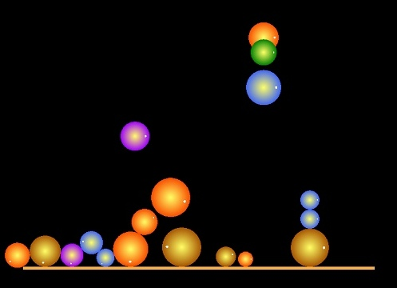
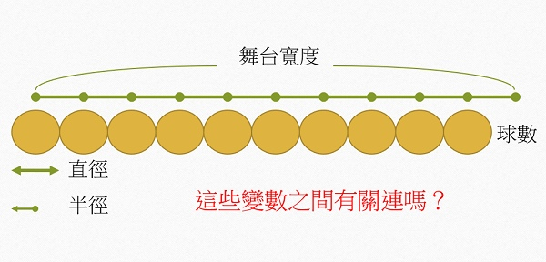

---
hide:
  - navigation
---

# 📚 力與運動遊樂場   

電腦除了計算，也可以模擬科學實驗，幫助學習者理解概念。

讓我們使用Py4t來進行各種有趣的 **力與運動程式模擬** 吧！

相信你在體驗之後，未來學習相關的自然課或理化課時，就會更有 **學習動機**。

    

----------------------------

##  📕 球的彈性

----------------------------

很多同學下課時喜歡打球，球能做出各種不同的彈跳，彈性是什麼？彈性可以測量嗎？

: (資料來源:[^1])

[^1]: 新建中籃球場, By Yu tptw, [維基百科連結](https://zh.wikipedia.org/wiki/File:%E6%96%B0%E5%BB%BA%E4%B8%AD%E7%B1%83%E7%90%83%E5%A0%B420211110.jpg) 

    

----------------------------

### ▪️ 新增圓球

----------------------------

利用基本的物理學習模組來產生物理舞台，按下滑鼠後可以新增圓球。

 

 

一起動手來寫程式吧！

??? example "Py4t範例程式 新增圓球"

    :fontawesome-solid-link: <a href="../../pie4t/bounce_ball/#_1" target="_blank">Let's Code 新增圓球 (含操作影片、程式碼及說明)</a>

??? abstract "模擬主迴圈？流程？"

    什麼是「模擬主迴圈」？它的程式結構與演算流程是什麼？

    :fontawesome-solid-link: <a href="../basic/scratch_python_compare/#_16" target="_blank">事件驅動程式 結構與流程</a>

    -----------------------------

    補充資料 
    
    :fontawesome-solid-link: <a href="https://zh.wikipedia.org/wiki/%E4%BA%8B%E4%BB%B6%E9%A9%85%E5%8B%95%E7%A8%8B%E5%BC%8F%E8%A8%AD%E8%A8%88" target="_blank">維基百科: 事件驅動程式設計</a>

    

----------------------------

### ▪️ 恢復係數

----------------------------

如何知道一顆球的彈性好不好呢？
 
<iframe width="560" height="315" src="https://www.youtube.com/embed/_RWqefx0vAg?start=95&amp;end=215" frameborder="0" allow="accelerometer; autoplay; encrypted-media; gyroscope; picture-in-picture" allowfullscreen></iframe>

: (資料來源:[^2])

  

恢復係數可以衡量兩個物體在碰撞後的反彈程度。

 

: (資料來源:[^2])

[^2]: 【Fun科學】超彈力橡皮筋球, By 佑來了, [youtube連結](https://www.youtube.com/watch?v=_RWqefx0vAg) 

  

讓我們用程式來模擬不同彈性的球吧！

??? example "Py4t範例程式 恢復係數"

     :fontawesome-solid-link: <a href="../../pie4t/bounce_ball/#2" target="_blank"> Let's Code 恢復係數 (含操作影片、程式碼及說明)</a>

??? info "補充資料"

    了解更多 :fontawesome-solid-link: <a href="https://zh.wikipedia.org/wiki/%E6%81%A2%E5%A4%8D%E7%B3%BB%E6%95%B0" target="_blank">恢復係數</a>

    恢復係數與球類比賽有什麼關係？ :fontawesome-solid-link: <a href="https://zh.wikipedia.org/wiki/%E4%B8%AD%E8%8F%AF%E8%81%B7%E6%A3%92%E6%AF%94%E8%B3%BD%E7%94%A8%E7%90%83%E7%88%AD%E8%AD%B0" target="_blank">中華職棒比賽用球爭議</a>

    

----------------------------

### ▪️ 超強彈性體

----------------------------

將兩顆很有彈性的球互相碰撞，會發生什麼事？

<iframe width="560" height="315" src="https://www.youtube.com/embed/_RWqefx0vAg?start=227&amp;end=414" frameborder="0" allow="accelerometer; autoplay; encrypted-media; gyroscope; picture-in-picture" allowfullscreen></iframe>

: (資料來源:[^2])

  

 

: (資料來源:[^2])

太奇妙了！將兩顆很有彈性的球在一起，下方的球較大，上方的球較小，竟然就變成可以超越原本高度的彈性體。

讓我們用程式來模擬這個現象。

??? example "Py4t範例程式 超強彈性體"

     :fontawesome-solid-link: <a href="../../pie4t/bounce_ball/#3" target="_blank"> Let's Code 超強彈性體 (含操作影片、程式碼及說明)</a>

??? question "更多練習"

    影片中有3顆球的實驗，請你試著改寫程式，讓大、中、小球組成超強彈性體吧。

??? info "彈性碰撞"

     超強彈性體的原理是什麼？請參考:fontawesome-solid-link: <a href="https://zh.wikipedia.org/wiki/%E5%BD%88%E6%80%A7%E7%A2%B0%E6%92%9E" target="_blank">維基百科: 彈性碰撞</a>

    

----------------------------

##  📒 力與斜面

----------------------------

下圖是公園裡常會出現的溜滑梯，它的傾斜度不同時，溜起來的感覺也不同。

: (資料來源:[^3])

[^3]: 位於葫蘆埤自然公園中的溜滑梯, By 月亮灣, [維基百科連結](https://zh.wikipedia.org/wiki/File:葫蘆埤自然公園溜滑梯.jpg)

 

----------------------------

### ▪️ 新增球與斜面

----------------------------

用斜面來模擬溜滑梯，在程式中要如何做出不同的傾斜度呢？

 

 

Py4t物理學習模組內建了地形的輔助功能，會使用到Ctrl鍵及Alt鍵(需英文輸入法)，操作如下圖：

 

動手做做看，建立出不同的斜面。

??? example "Py4t範例程式 新增球與斜面"

     :fontawesome-solid-link: <a href="../../pie4t/force_and_slide/#1" target="_blank">Let's Code 新增球與斜面 (含操作影片、程式碼及說明)</a>

    

----------------------------

### ▪️ 速度比較

----------------------------

當球在不同的斜面落下，會怎樣呢？

 

 

用程式來模擬看看。

??? example "Py4t範例程式 速度比較"

     :fontawesome-solid-link: <a href="../../pie4t/force_and_slide/#2" target="_blank">Let's Code 速度比較 (含操作影片、程式碼及說明)</a>

??? info "補充資料" 
    
    :fontawesome-solid-link: <a href="https://www.youtube.com/watch?v=TMEB1KoJpNI" target="_blank">youtube: 吉娃斯科學小教室 : 斜面運動、重力、支撐力</a>

    

    

----------------------------

### ▪️ 摩擦力

----------------------------

<iframe width="560" height="315" src="https://www.youtube.com/embed/JdMkAvibBec?start=12&amp;end=96" frameborder="0" allow="accelerometer; autoplay; encrypted-media; gyroscope; picture-in-picture" allowfullscreen></iframe>

: (資料來源:[^4])

[^4]: 如果摩擦力消失一分鐘？, By 大膽科學, [youtube連結](https://www.youtube.com/watch?v=JdMkAvibBec&t=12s)

 

摩擦力作用於物體的相反方向。

 

: (資料來源:[^5])

[^5]: 摩擦力受各性質的影響, 引用自中學生網站, [pdf連結](https://www.shs.edu.tw/works/essay/2011/03/2011033016033626.pdf)

用程式來模擬看看。

??? example "Py4t範例程式 摩擦力"

     :fontawesome-solid-link: <a href="../../pie4t/force_and_slide/#3" target="_blank">Let's Code 摩擦力 (含操作影片、程式碼及說明)</a>

??? info "補充資料" 
    
    :fontawesome-solid-link: <a href="https://www.youtube.com/watch?v=9DMUl30gFXk" target="_blank">youtube: myViewBoard 原創內容：摩擦力</a>

    :fontawesome-solid-link: <a href="https://www.youtube.com/watch?v=Bhm3iPFqYEo" target="_blank">youtube: 均一教育平台【八下理化】【觀念】摩擦力</a>

    

    

----------------------------

### ▪️ 施加力量

----------------------------

<iframe width="560" height="315" src="https://www.youtube.com/embed/oPsfwZXCf1s?start=14&amp;end=77" frameborder="0" allow="accelerometer; autoplay; encrypted-media; gyroscope; picture-in-picture" allowfullscreen></iframe>

: (資料來源:[^6])

[^6]: 8歲女孩成功挑戰5公尺極限滑板, By 即新聞, [youtube連結](https://www.youtube.com/watch?v=oPsfwZXCf1s&t=14s)

用滑板衝上斜坡時，會發生什麼事？

用程式來模擬看看。

??? example "Py4t範例程式 施力"

    :fontawesome-solid-link: <a href="../../pie4t/force_and_slide/#4" target="_blank">Let's Code 施力 (含操作影片、程式碼及說明)</a>

??? info "補充資料" 
    
    :fontawesome-solid-link: <a href="https://www.youtube.com/watch?v=yGPpFelGeEQ" target="_blank">youtube: 國中理化教學資料庫 伽利略斜面實驗</a>

    

----------------------------

##  📙 彈性排列

什麼是繩波？

<iframe width="560" height="315" src="https://www.youtube.com/embed/P7QrXW4ky34" frameborder="0" allow="accelerometer; autoplay; encrypted-media; gyroscope; picture-in-picture" allowfullscreen></iframe>

: (資料來源:[^7])

[^7]: 繩波示波器, By 國中理化教學資料庫, [youtube連結](https://www.youtube.com/watch?v=P7QrXW4ky34)

讓我們用多顆球的排列做出類似繩波的效果。

----------------------------

### ▪️ 固定球數

----------------------------

如何一次產生多顆球並產生有變化的彈跳呢？

利用之前的恢復係數，讓我們來實作程式吧！

??? example "Py4t範例程式 固定球數"

     :fontawesome-solid-link: <a href="../../pie4t/bounce_array/#1" target="_blank">Let's Code 固定球數 (含操作影片、程式碼及說明)</a>

??? abstract "結構化程式設計"

    :fontawesome-solid-link: <a href="../basic/scratch_python_compare/#for" target="_blank">計次式重複 (for 迴圈)</a>

    :fontawesome-solid-link: <a href="../basic/scratch_python_compare/#_9" target="_blank">迴圈變數與圈數</a>

    

----------------------------

### ▪️ 變數模式識別

----------------------------

如果要從10顆球，可以隨意調整成20或40或80顆，程式要如何寫呢？

識別變數的模式，找出各個變數之間的關係！

??? abstract "運算思維"

    :fontawesome-solid-link: <a href="../basic/comthink/#_4" target="_blank">樣式辨識</a>

 

想清楚了嗎？動手寫寫看。

??? example "Py4t範例程式 變數模式識別"

     :fontawesome-solid-link: <a href="../../pie4t/bounce_array/#2" target="_blank">Let's Code 變數模式識別 (含操作影片、程式碼及說明)</a>

   

----------------------------

### ▪️ 不同波動變化

----------------------------

利用不同的彈性排列變化，來做出不同的效果吧

??? example "Py4t範例程式 不同波動變化"

     :fontawesome-solid-link: <a href="../../pie4t/bounce_array/#3" target="_blank">Let's Code 不同波動變化 (含操作影片、程式碼及說明)</a>

??? abstract "結構化程式設計"

    :fontawesome-solid-link: <a href="../basic/scratch_python_compare/#_6" target="_blank">雙向選擇結構</a>

??? info "補充資料"

    多顆圓球不斷彈跳的樣子，會聯想到什麼？ 
    
    :fontawesome-solid-link: <a href="https://www.youtube.com/watch?v=k80ID8yVJyg" target="_blank">youtube: 繩波的反射示範實驗</a>

    :fontawesome-solid-link: <a href="https://youtu.be/bHIoI4-iB_A" target="_blank">youtube: 量子現象【觀念】波粒二象性－物質波（高一物理）</a>

   

----------------------------

##  📗 重力控制

重力是什麼？如果有一天重力消失了會如何？

<iframe width="560" height="315" src="https://www.youtube.com/embed/1rKUPNASJqQ?start=0&amp;end=183" frameborder="0" allow="accelerometer; autoplay; encrypted-media; gyroscope; picture-in-picture" allowfullscreen></iframe>

: (資料來源:[^8])

[^8]: 如果重力不再存在?!, By 大膽科學, [youtube連結](https://www.youtube.com/watch?v=1rKUPNASJqQ)

除非我們到外太空，不然在地球上很難進行重力的實驗。

不過我們可以經由物理程式的模擬，做出無重力，甚至是重力反轉的現象。

以下讓我們一步步探討來實做出重力模擬的程式。

----------------------------

### ▪️ 慣性與重力

----------------------------

: 筆要如何才能掉進罐子呢？

<iframe width="560" height="315" src="https://www.youtube.com/embed/LeDtM7Hpl-Q?start=3&amp;end=98" frameborder="0" allow="accelerometer; autoplay; encrypted-media; gyroscope; picture-in-picture" allowfullscreen></iframe>

: (資料來源:[^9])

[^9]: 慣性定律 Law of Inertia, By 中央大學科學教育中心實驗頻道, [youtube連結](https://www.youtube.com/watch?v=LeDtM7Hpl-Q&t=3s)

  

什麼是慣性定律呢？

<iframe width="560" height="315" src="https://www.youtube.com/embed/Wc9W-Fb44Dk?start=62&amp;end=132" frameborder="0" allow="accelerometer; autoplay; encrypted-media; gyroscope; picture-in-picture" allowfullscreen></iframe>

: (資料來源:[^10])

[^10]: 吉娃斯科學小教室｜#13: 慣性定律｜兒童科普動畫, By EngineTV 原金動畫, [youtube連結](https://www.youtube.com/watch?v=Wc9W-Fb44Dk&t=62s)

  

用程式來模擬慣性吧。

??? example "Py4t範例程式 施力"

    :fontawesome-solid-link: <a href="../../pie4t/inertia_gravity/#1" target="_blank">Let's Code 慣性運動 (含操作影片、程式碼及說明)</a>

??? info "補充資料" 
    
    :fontawesome-solid-link: <a href="https://zh.wikipedia.org/wiki/%E6%85%A3%E6%80%A7" target="_blank">維基百科: 慣性</a>

    

    衝力的方向使用到向量，可參考 :fontawesome-solid-link: <a href="https://youtu.be/4H04xpngVlo?list=PLTQ2T0cDHYPfypQn6t_sXV1N581kwf7Ei" target="_blank">youtube: 平面運動 【觀念】向量（1）向量的表示方法</a>

    

----------------------------

### ▪️ 拋體運動

----------------------------

有看過推鉛球的運動嗎？

<iframe width="560" height="315" src="https://www.youtube.com/embed/EkiaYNEAagA?start=0&amp;end=118" frameborder="0" allow="accelerometer; autoplay; encrypted-media; gyroscope; picture-in-picture" allowfullscreen></iframe>

: (資料來源:[^11])

[^11]: 超越人類極限【金牌鉛球國手】巨人手掌宛如人體砲臺發射器, By 健人蓋伊, [youtube連結](https://www.youtube.com/watch?v=EkiaYNEAagA)

   

鉛球被推出時，為什麼在空中的軌跡是拋物線？

<iframe width="560" height="315" src="https://www.youtube.com/embed/bhavS93SEaM?start=32&amp;end=97" frameborder="0" allow="accelerometer; autoplay; encrypted-media; gyroscope; picture-in-picture" allowfullscreen></iframe>

: (資料來源:[^12])

[^12]: 吉娃斯科學小教室｜#37 : 拋體運動｜動能、重力、運動半徑｜兒童科普動畫, By 
EngineTV 原金動畫, [youtube連結](https://www.youtube.com/watch?v=bhavS93SEaM&t=32s)

  

用程式來模擬拋體運動吧。

??? example "Py4t範例程式 拋體運動"

    :fontawesome-solid-link: <a href="../../pie4t/inertia_gravity/#2" target="_blank">Let's Code 拋體運動 (含操作影片、程式碼及說明)</a>

??? info "補充資料" 
    
    :fontawesome-solid-link: <a href="https://zh.wikipedia.org/wiki/%E6%8B%8B%E9%AB%94" target="_blank">維基百科: 拋體</a>

    :fontawesome-solid-link: <a href="https://www.zetria.org/view.php?subj=physics&chap=lfym2aorgz" target="_blank">學呀: 拋物線運動</a>

    

----------------------------

### ▪️ 重力搬運

----------------------------

在國際太空站的趣味奧運比賽。

<iframe width="560" height="315" src="https://www.youtube.com/embed/ZlPpHILyEl4?start=0&amp;end=54" frameborder="0" allow="accelerometer; autoplay; encrypted-media; gyroscope; picture-in-picture" allowfullscreen></iframe>

: (資料來源:[^13])

[^13]: Highlights from the first-ever space Olympics!, By 
NASA, [youtube連結](https://www.youtube.com/watch?v=ZlPpHILyEl4)

  

無重力漂浮是不是很特別。
用程式來模擬重力的控制吧。

??? example "Py4t範例程式 重力搬運"

    :fontawesome-solid-link: <a href="../../pie4t/inertia_gravity/#3" target="_blank">Let's Code 重力搬運 (含操作影片、程式碼及說明)</a>

??? abstract "事件驅動程式"

    :fontawesome-solid-link: <a href="../basic/scratch_python_compare/#_16" target="_blank">事件驅動程式 結構與流程</a>

??? question "更多練習"

    範例程式中的方塊是由原點發射的，請修改程式，改成方塊會依滑鼠位置放置，但會有隨機的轉動及速度，類似太空中物體的漂浮，你有信心挑戰看看嗎？
    
    (提示：需使用随機模組，随機決定方塊的速度及角速度)。

??? info "補充資料" 
   
    :fontawesome-solid-link: <a href="https://www.youtube.com/watch?v=VB20FLopIWg" target="_blank">youtube: 高一物理【觀念】重力</a>
    
    :fontawesome-solid-link: <a href="https://zh.wikipedia.org/wiki/%E5%BC%95%E5%8A%9B" target="_blank">維基百科: 重力</a>

    