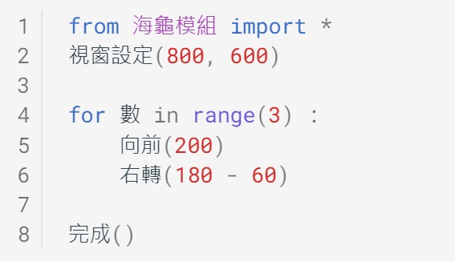
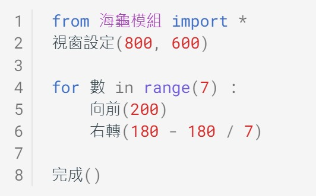

---
hide:
  - navigation
---

# 📚海龜畫國旗

聯合國是一個由各個國家組成的國際組織，致力於促進各國在經濟、社會、人權、自由、民主以及世界和平的合作。聯合國的總部位於美國紐約市，在其外懸掛著各國的國旗。

: (資料來源:[^flags_un])

[^flags_un]: United Nations Headquarters, New York . By Rick Banjornas, [來源連結](https://uil.unesco.org/literacy/literacy-and-education-democracy-essential-milestones-advance-sdgs-during-and-beyond-covid) , 9 October 2020

國旗是國家的代表，國旗裡的線條、顏色與形狀，都有它的歷史由來。在此，我們將一同思考、並利用海龜程式來實作出國旗。

??? info "關於海龜程式"

     :fontawesome-solid-link: <a href="../../turtle4t/" target="_blank">海龜學習模組 說明</a>

    

----------------------------

##  📙 國旗基本外形 

***世界各國國旗*** 

----------------------------

國旗會出現在什麼場合？

<iframe width="480" height="270" src="https://www.youtube.com/embed/FX5F3pk5MWU" title="YouTube video player" frameborder="0" allow="accelerometer; autoplay; clipboard-write; encrypted-media; gyroscope; picture-in-picture" allowfullscreen></iframe>

: (資料來源:[^tokyo_olympics_badminton])

[^tokyo_olympics_badminton]: 經典影音館 2020東京奧運 李洋/王齊麟 #麟洋配 男子羽球雙打金牌頒獎 #國旗歌 (2021.07.31) , By 台灣天眼 , [youtube連結](https://www.youtube.com/watch?v=FX5F3pk5MWU)  

 

世界上的國旗有哪些？

:fontawesome-solid-link: <a href="https://zh.wikipedia.org/wiki/%E5%9C%8B%E6%97%97%E5%88%97%E8%A1%A8" target="_blank">維基百科 國旗列表</a> - 列舉世界上主權國家的國旗

: (資料來源:[^wikipedia_national_flags])

[^wikipedia_national_flags]: By H8edge, [維基百科連結](https://commons.wikimedia.org/w/index.php?curid=68410306) ,CC BY-SA 4.0

各國國旗的外形，有沒有什麼相同點呢？

??? abstract "運算思維"

    :fontawesome-solid-link: <a href="../basic/comthink/#_3" target="_blank">抽象化</a>

    :fontawesome-solid-link: <a href="../basic/comthink/#_4" target="_blank">樣式辨識</a>

??? question "自主學習 資料搜尋 "

    閱讀上方的國旗網路資料(或其他網站)，請挑選某一個國家的國旗，做出一篇世界國旗的簡介吧！    

    (內容可包含該國國旗的尺寸規格、歷史故事、設計理念…等)

    

----------------------------

***畫出正方形***

----------------------------

各國國旗的基本外形都是長方形，而長方形之中最有規律的就是正方形，讓我們先從簡單的正方形開始實作。

想一想，在數學課曾經學過的正方形，它的性質是什麼？

 

:  

  

如何利用海龜的「向前」及「右(左)轉」來畫出正方形？

 

:  

 

???+ example "範例程式 正方形"

    === "🎦Py4t操作影片"
    
        <iframe width="560" height="315" src="https://www.youtube.com/embed/Wh7ExxELMYg" frameborder="0" allow="accelerometer; autoplay; encrypted-media; gyroscope; picture-in-picture" allowfullscreen></iframe>

    === "💻Python程式截圖"

         

??? abstract "結構化程式設計"

    :fontawesome-solid-link: <a href="../basic/scratch_python_compare/#sequence" target="_blank">循序</a>

    :fontawesome-solid-link: <a href="../basic/scratch_python_compare/#for" target="_blank">計次式重複 (for 迴圈)</a>

    

----------------------------

***長方形及填色***

----------------------------

畫出正方形後，接著來畫出長方形。

想想看，長方形與正方形有什麼不同？長方形的規律又是什麼？

 

:  

 

 還有要如何用海龜程式在長方形中填色呢？

 

:  

試著用海龜程式畫出長方形並填色。

 

???+ example "範例程式 長方形及填色"

    === "🎦Py4t操作影片"
    
        <iframe width="560" height="315" src="https://www.youtube.com/embed/xL_e-SZklWo" frameborder="0" allow="accelerometer; autoplay; encrypted-media; gyroscope; picture-in-picture" allowfullscreen></iframe>

    === "💻Python程式截圖"

         

    

----------------------------

##  📗 方形相關國旗

***國旗規格***

----------------------------

除了形狀以外，我們還需注意不同國旗的規格(如顏色、尺寸等)，這樣畫出來的國旗會更標準，以標準比例呈現的國旗也是一種國際禮儀與尊重。

以法國國旗為例，它的形狀是由3個長方形色塊所組成，相關規格如下：

: :fontawesome-solid-link: <a href="https://zh.wikipedia.org/wiki/%E6%B3%95%E5%9B%BD%E5%9B%BD%E6%97%97" target="_blank">維基百科 法國國旗</a> - 簡介與規格

   

----------------------------

***法國國旗***

----------------------------

了解法國國旗的規格後，你有信心用海龜程式畫出來嗎？

在實作之前，先思考一下，法國國旗有3個長方形色塊，要先畫出哪一個呢？每個色塊的比例又是多大呢？

  

 

??? abstract "運算思維"

    :fontawesome-solid-link: <a href="../basic/comthink/#_7" target="_blank">演算法思維</a>

  

用海龜程式來把想法一實作出來。(建議將規格尺寸放大100倍)

 

???+ example "範例程式 法國國旗"

    === "🎦Py4t操作影片"
    
        <iframe width="560" height="315" src="https://www.youtube.com/embed/GKyYdbDMH1A" frameborder="0" allow="accelerometer; autoplay; encrypted-media; gyroscope; picture-in-picture" allowfullscreen></iframe>

    === "💻Python程式截圖"

         

  

??? question "自主學習 想法二實作"

    生活中的問題常常不只一種解決方法。像上圖中的想法二就是另一種畫出法國國旗的方法，依藍、白、紅色畫出一樣大的色塊來完成。

    請你試試看，如何用想法二來實作出法國國旗呢？(注意起點位置的變化) 

??? question "自主學習 RGB國旗顏色"

    在範例程式中，僅使用純藍、白、紅色來畫出法國國旗。但依照它的規格，其藍色的RGB值是(0,85,164)，白色的RGB值是(255,255,255)，紅色的RGB值是(250,60,50)。
    
    什麼是RGB值呢？RGB是紅綠藍顏色模型，將紅（Red）、綠（Green）、藍（Blue）三原色的色光以不同的比例相加以產生各種色光。(詳見<a href="https://zh.wikipedia.org/wiki/%E4%B8%89%E5%8E%9F%E8%89%B2%E5%85%89%E6%A8%A1%E5%BC%8F" target="_blank">維基百科</a>)

    請使用標準RGB顏色值，讓海龜畫出法國國旗。(提示：「填充顏色 RGB」便利貼) 

??? question "自主學習 其他方形國旗 "

    找找看，還有其他國家的國旗與長方形相關的嗎？

    請從 :fontawesome-solid-link: <a href="https://zh.wikipedia.org/wiki/%E5%9C%8B%E6%97%97%E5%88%97%E8%A1%A8" target="_blank">維基百科 國旗列表</a>中，找到由長方形或正方形組成的國旗，依據國旗的說明與規格，試著用海龜程式畫出來。(如中歐地區的德國)

   

----------------------------

## 📘 圓形相關國旗

***日本國旗規格***

----------------------------

有些國家的國旗中有包含圓形，以下為日本國旗的規格：

: 

: (資料來源:[^japan_flag])

[^japan_flag]: Zscout370 - 投稿者自身による作品, based on http://law.e-gov.go.jp/htmldata/H11/H11HO127.html, CC 表示-継承 4.0, https://commons.wikimedia.org/w/index.php?curid=3109313による

你看得出日本國旗的寬高比例與紅色圓形比例嗎？(提示：圓形直徑為高的3/5)

   

----------------------------

***座標與移動***

----------------------------

除了規格以外，日本國旗的紅色圓形繪圖，需要有移動海龜而不畫線的功能，要怎麼做呢？

首先要認識海龜程式的座標系統：

 

: 

 

接著是海龜的移動(不畫線)順序：

 

: 

   

----------------------------

***畫出日本國旗***

----------------------------

知道了以上的資訊，就可以實作出日本國旗了。(建議將規格尺寸放大100倍)

在做之前，請你先思考一下繪製順序(先畫圓形或長方形)，再動手寫寫看。

 

???+ example "範例程式 日本國旗"

    === "🎦Py4t操作影片"
    
        <iframe width="560" height="315" src="https://www.youtube.com/embed/upF-HpneLPY" frameborder="0" allow="accelerometer; autoplay; encrypted-media; gyroscope; picture-in-picture" allowfullscreen></iframe>

    === "💻Python程式截圖"

         

??? question "自主學習 資料搜尋"

    你能找出國旗中有包含圓形的國家嗎？請找出至少3個。    

    :fontawesome-solid-link: <a href="https://zh.wikipedia.org/wiki/%E5%9C%8B%E6%97%97%E5%88%97%E8%A1%A8" target="_blank">維基百科 國旗列表</a>

   

----------------------------

##  📙 星形相關國旗 

***畫出星形 ***

----------------------------

相信你已經了解正方形的海龜程式，但如果要改成畫正三角形的話，要怎麼做？想想看三角形的性質是什麼？

 

 

 

???+ example "範例程式 正三角形"

    === "🎦Py4t操作影片"
    
        <iframe width="560" height="315" src="https://www.youtube.com/embed/5vxxz9MCqUw" frameborder="0" allow="accelerometer; autoplay; encrypted-media; gyroscope; picture-in-picture" allowfullscreen></iframe>

    === "💻Python程式截圖"

         

   

----------------------------

你知道嗎？海龜在右(左)轉時，轉出來的角度其實是外角。

: 

 

畫出星形時，海龜需要轉彎的外角是幾度呢？以下是星形的外角公式：

 

: 

: (資料來源:[^star_fomula])

[^star_fomula]: 自由軟體Scratch融入數學領域教學(王公國小102上半年教師在職資訊應用培訓)

 

有了以上的公式，試著用海龜程式來畫出星形。

 

???+ example "範例程式 奇數角星形"

    === "🎦Py4t操作影片"
    
        <iframe width="560" height="315" src="https://www.youtube.com/embed/hlib0KmRiI0" frameborder="0" allow="accelerometer; autoplay; encrypted-media; gyroscope; picture-in-picture" allowfullscreen></iframe>

    === "💻Python程式截圖"

         

??? question "自主學習 十二角星形"

    請利用上圖的公式，試著讓海龜程式畫出十二角星形吧！

   

----------------------------

***越南國旗*** 

----------------------------

以下是越南國旗的規格：

: 

: (資料來源:[^vietnam_flag])

[^vietnam_flag]: Flag of Vietnam, By MapGrid , [維基百科連結](https://commons.wikimedia.org/wiki/File:Flag_of_Vietnam_(construction_sheet).svg)

 

為能使用海龜繪製，還需要知道5角星形的繪製起點，經由規格估計星形起點大約在座標9,12處(原點於左下)

 

: 

  

接下來，試著做出越南國旗的程式。(建議將規格尺寸放大10倍)

 

???+ example "範例程式 越南國旗"

    === "🎦Py4t操作影片"
    
        <iframe width="560" height="315" src="https://www.youtube.com/embed/3Fa8GosgRIw" frameborder="0" allow="accelerometer; autoplay; encrypted-media; gyroscope; picture-in-picture" allowfullscreen></iframe>

    === "💻Python程式截圖"

         

??? question "自主學習 資料搜尋"

    你能找出國旗中有包含星形的國家嗎？請找出至少2個。    

    :fontawesome-solid-link: <a href="https://zh.wikipedia.org/wiki/%E5%9C%8B%E6%97%97%E5%88%97%E8%A1%A8" target="_blank">維基百科 國旗列表</a>

   

----------------------------

##  ⭐ 進階專題

----------------------------

太棒了，經過了前面的課程，相信你已經學會許多幾何形狀與各國國旗的畫法，以及問題思考與動手實作的方式。

如果想要更進一步，可以挑戰下面的程式專題哦！

:fontawesome-solid-link: <a href="../project_roc_flag/" target="_blank">中華民國國旗</a>

    

