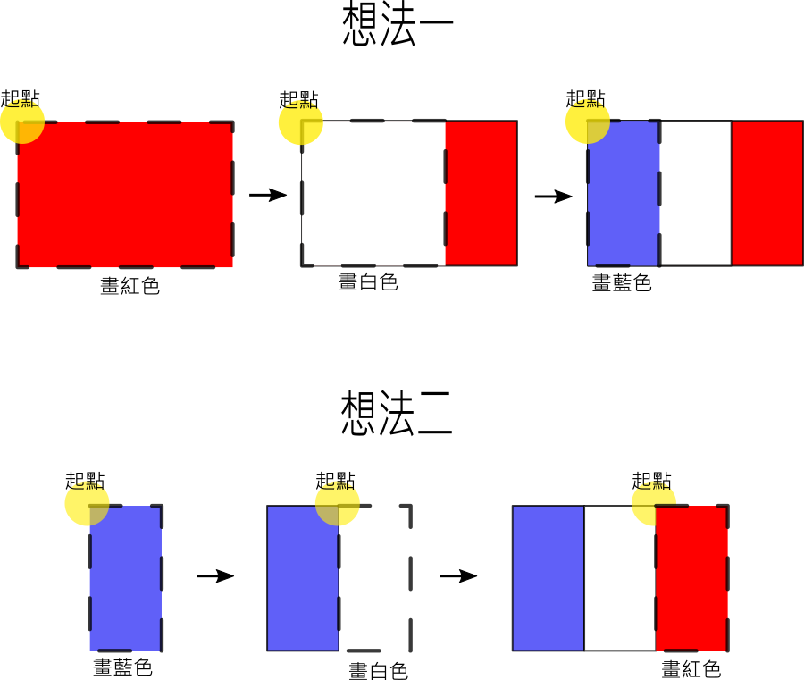
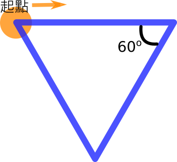

---
hide:
  - navigation
---

# 📚海龜畫國旗

海龜程式除了畫幾何圖形，也可以用來畫出許多不同的國旗，讓我們一起思考並實際動手做出。

: (圖片來源[^1])

[^1]: United Nations Headquarters, New York by Rick Banjornas, https://uil.unesco.org/literacy/literacy-and-education-democracy-essential-milestones-advance-sdgs-during-and-beyond-covid

----------------------------

##  📙 國旗基本外形 

----------------------------

###  ▪️ 世界各國國旗 

----------------------------

國旗出現的場合

<iframe width="480" height="270" src="https://www.youtube.com/embed/FX5F3pk5MWU" title="YouTube video player" frameborder="0" allow="accelerometer; autoplay; clipboard-write; encrypted-media; gyroscope; picture-in-picture" allowfullscreen></iframe>

國旗是國家的代表，旗子裡的線條、顏色與形狀，都有它的由來。

    

:fontawesome-solid-link: <a href="https://zh.wikipedia.org/wiki/%E5%9C%8B%E6%97%97%E5%88%97%E8%A1%A8" target="_blank">維基百科 國旗列表</a> - 列舉世界上主權國家的國旗

: (圖片來源[^2])

[^2]: 由 H8edge - 自己的作品, CC BY-SA 4.0, https://commons.wikimedia.org/w/index.php?curid=68410306

??? question "資料搜尋"

    閱讀上方的國旗網路資料(或其他網站)，請挑選某一個國家的國旗，做出一篇世界國旗的簡介吧！    

    (內容可包含該國國旗的尺寸規格、歷史故事、設計理念…等)

    

----------------------------

###  ▪️ 畫出正方形

----------------------------

國旗的基本外形是長方形，而長方形之中最有規律的是正方形，讓我們先從畫正方形開始！

想一想，正方形有什麼特性與規律？

 

:  

可以利用海龜的「向前」及「右(左)轉」來畫出正方形嗎？

??? example "Py4t範例程式 正方形"

     :fontawesome-solid-link: <a href="../../turtle4t/draw_square/" target="_blank">Let's Code 畫出正方形 (含操作影片、程式碼及說明)</a>

    

----------------------------

###  ▪️ 長方形及填色

----------------------------

畫出正方形後，接著來畫出長方形。

想想看，長方形與正方形有什麼不同？長方形的規律又是什麼？

 

:  

 

 還有要如何用海龜程式在長方形中填色呢？

 

:  

試著用海龜程式畫出長方形並填色。

    

----------------------------

##  📗 方形相關國旗

----------------------------

###  ▪️ 國旗的規格

----------------------------

除了形狀以外，我們還需注意不同國旗的規格(如顏色、尺寸等)，這樣畫出來的國旗會更標準。

以法國國旗為例，它的形狀是3個長方形組成，相關規格如下：

: :fontawesome-solid-link: <a href="https://zh.wikipedia.org/wiki/%E6%B3%95%E5%9B%BD%E5%9B%BD%E6%97%97" target="_blank">維基百科 法國國旗</a> - 簡介與規格

   

----------------------------

###  ▪️ 法國國旗

----------------------------

了解法國國旗的規格後，你有信心用海龜程式畫出來嗎？

在實作之前，先思考一下，法國國旗有3個長方形色塊，要先畫出哪一個呢？每個色塊的比例又是多大呢？

  

用海龜程式來把想法一實作出來。

??? example "Py4t範例程式 法國國旗"

     :fontawesome-solid-link: <a href="../../turtle4t/flag_of_france/" target="_blank">Let's Code 法國國旗 (含操作影片、程式碼及說明)</a>

??? question "練習 想法二"

    試試看，如何利用想法二來做出法國國旗呢？ 

??? question "更多練習 "

    找找看，還有其他長方形相關的國旗嗎？

    請從 :fontawesome-solid-link: <a href="https://zh.wikipedia.org/wiki/%E5%9C%8B%E6%97%97%E5%88%97%E8%A1%A8" target="_blank">維基百科 國旗列表</a>中，找到由長方形或正方形組成的國旗，依據國旗的說明與規格，試著用海龜程式畫出來。(如中歐地區的德國)

   

----------------------------

###  📘 圓形相關國旗

有些國家的國旗中有包含圓形。

: 

: (圖片來源[^3])

[^3]: Zscout370 - 投稿者自身による作品, based on http://law.e-gov.go.jp/htmldata/H11/H11HO127.html, CC 表示-継承 4.0, https://commons.wikimedia.org/w/index.php?curid=3109313による

你看得出日本國旗的長寬比例與紅色圓形比例嗎？用海龜來畫出日本國旗吧！

??? example "Py4t範例程式 日本國旗"

     :fontawesome-solid-link: <a href="../../turtle4t/flag_of_japan/" target="_blank">Let's Code 日本國旗 (含操作影片、程式碼及說明)</a>

??? question "資料搜尋"

    你能找出國旗中有包含圓形的國家嗎？請找出至少3個。    

    :fontawesome-solid-link: <a href="https://zh.wikipedia.org/wiki/%E5%9C%8B%E6%97%97%E5%88%97%E8%A1%A8" target="_blank">維基百科 國旗列表</a>

??? success "進階學習"

    恭喜你，學習了以海龜程式來畫出各式各樣的國旗，你的感想是什麼呢？

    如果覺得有趣的話，可以挑戰下面的「進階程式設計」

   

----------------------------

###  📓 進階: 畫出星形

當我們已經會寫正方形的海龜程式後，請試著把程式改成正三角形。

程式要更改哪些地方呢？

 

 

??? question "更多練習 正六邊形"

    那如何讓海龜畫出正六邊形？

    想一想，正三角形與正六邊形的程式有什麼不同！

      

    

   

你知道嗎？海龜在右(左)轉時，轉出來的角度其實是外角。

: 

   

畫出星形時，需要轉彎的外角是幾度呢？

: 

: (公式來源[^3])

[^3]: 自由軟體Scratch融入數學領域教學(王公國小102上半年教師在職資訊應用培訓)

??? example "Py4t範例程式 奇數角星形"

     :fontawesome-solid-link: <a href="../../turtle4t/odd_number_star/" target="_blank">Let's Code 奇數角星形 (含操作影片、程式碼及說明)</a>

??? question "練習題 十二角星形"

    請利用上圖的公式，試著讓海龜程式畫出十二角星形吧！

   

----------------------------

###  📓 專題: 中華民國國旗

:fontawesome-solid-link: <a href="/lesson/national_flag/project_roc_flag/" target="_blank">專題：中華民國國旗</a>

: 利用前面所學的基本形狀，畫出我們的中華民國國旗

