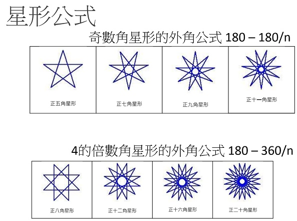

# 📚Py4t學習單元 - 海龜畫國旗

海龜程式除了畫幾何圖形，也可以用來畫國旗，讓我們一起思考與實作。

----------------------------

###  📙 國旗出現的場合 

: :fontawesome-brands-youtube: 2020東京奧運男子羽球雙打金牌頒獎影片

: <iframe width="480" height="270" src="https://www.youtube.com/embed/FX5F3pk5MWU" title="YouTube video player" frameborder="0" allow="accelerometer; autoplay; clipboard-write; encrypted-media; gyroscope; picture-in-picture" allowfullscreen></iframe>

: 國旗是國家的代表，旗子裡的線條、顏色與形狀，都有它的由來。

: 想一想，如何用海龜程式來畫出國旗呢？

    

----------------------------

###  📕 畫出正方形

: 國旗的基本形狀是方形，讓我們來練習看看！

:  

: 想一想，正方形有什麼特性與規律？

: 可以利用海龜的「向前」「右(左)轉」來畫出正方形嗎？

??? example "Let's Code 正方形"

     :fontawesome-solid-link: <a href="../../turtle4t/draw_square/" target="_blank">Py4t範例程式 畫出正方形</a>

??? question "練習題 長方形"

      

    如何讓海龜畫出長方形？

    想一想，長方形的特性與規律是什麼？試著讓海龜程式畫出長方形吧！

    

----------------------------

###  📒 認識世界各國的國旗

: 

: (圖片來源[^1])

[^1]: 由 H8edge - 自己的作品, CC BY-SA 4.0, https://commons.wikimedia.org/w/index.php?curid=68410306

----------------------------

: :fontawesome-solid-link: <a href="https://zh.wikipedia.org/wiki/%E5%9C%8B%E6%97%97%E5%88%97%E8%A1%A8" target="_blank">維基百科 國旗列表</a> - 列舉世界上主權國家的國旗

??? question "資料搜尋"

    閱讀上方的國旗網路資料(或其他網站)，請挑選某一個國家的國旗，做出一篇世界國旗的介紹吧！    

    (內容可包含該國國旗的尺寸規格、歷史故事、設計理念…等)

    

----------------------------

###  📗 有方形的國旗

當我們已經學會畫出正方形與長方形後。想想看，世界國旗中有與方形相關的嗎？

: 

: :fontawesome-solid-link: <a href="https://zh.wikipedia.org/wiki/%E6%B3%95%E5%9B%BD%E5%9B%BD%E6%97%97" target="_blank">維基百科 法國國旗</a> - 簡介與規格

: 讓我們用海龜來畫出法國國旗吧。

??? example "Let's Code 法國國旗"

     :fontawesome-solid-link: <a href="../../turtle4t/flag_of_france/" target="_blank">Py4t範例程式 法國國旗</a>

??? question "更多練習"

    找找看，還有其他的方形相關國旗嗎？

    請從 :fontawesome-solid-link: <a href="https://zh.wikipedia.org/wiki/%E5%9C%8B%E6%97%97%E5%88%97%E8%A1%A8" target="_blank">維基百科 國旗列表</a>中，找到由長方形或正方形組成的國旗，依據國旗的說明與規格，試著用海龜程式畫出來。(如中歐地區的德國)

   

----------------------------

###  📘 有圓形的國旗

有些國家的國旗中有包含圓形。

: 

: (圖片來源[^2])

[^2]: Zscout370 - 投稿者自身による作品, based on http://law.e-gov.go.jp/htmldata/H11/H11HO127.html, CC 表示-継承 4.0, https://commons.wikimedia.org/w/index.php?curid=3109313による

你看得出日本國旗的長寬比例與紅色圓形比例嗎？用海龜來畫出日本國旗吧！

??? example "Let's Code 日本國旗"

     :fontawesome-solid-link: <a href="../../turtle4t/flag_of_japan/" target="_blank">Py4t範例程式 日本國旗</a>

??? question "資料搜尋"

    你能找出國旗中有包含圓形的國家嗎？請找出至少3個。    

    :fontawesome-solid-link: <a href="https://zh.wikipedia.org/wiki/%E5%9C%8B%E6%97%97%E5%88%97%E8%A1%A8" target="_blank">維基百科 國旗列表</a>

??? success "學習心得"

    恭喜你，學習了以海龜程式來畫出各式各樣的國旗，你的感想是什麼呢？

    如果覺得有趣的話，可以挑戰下面的「進階程式設計」

   

----------------------------

###  📓 進階: 畫出星形

你知道嗎？海龜在右(左)轉時，轉出來的角度其實是外角。

: 

畫出星形時，需要轉彎的外角是幾度呢？

: 

: (公式來源[^3])

[^3]: 自由軟體Scratch融入數學領域教學(王公國小102上半年教師在職資訊應用培訓)

??? example "Let's Code 奇數角星形"

     :fontawesome-solid-link: <a href="../../turtle4t/odd_number_star/" target="_blank">Py4t範例程式 奇數角星形</a>

??? question "練習題 十二角星形"

    請利用上圖的公式，試著讓海龜程式畫出十二角星形吧！

   

----------------------------

###  📓 進階: 我們的國旗

: 

: (圖片來源[^4])

[^4]: https://zh.wikipedia.org/wiki/File:Republic_of_China(Taiwan)_sheet.png

綜合前面所學的海龜繪圖技巧，要如何畫出我們的國旗呢？

??? example "Let's Code 我們的國旗"

     :fontawesome-solid-link: <a href="../../turtle4t/roc_flag/" target="_blank">Py4t範例程式 我們的國旗</a>

??? success "心得"

    這些程式很不簡單吧！如果看得懂的話，你就真的是太厲害了。 

    學習了海龜程式來畫出各式各樣的國旗，你的感想是什麼？

  

--8<-- "includes/abbreviations.md"

