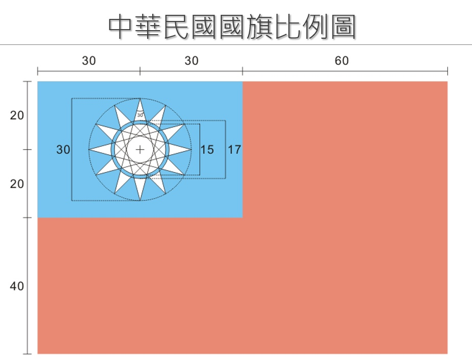

---
hide:
  - navigation
---

# 📚專題：中華民國國旗

中華民國國旗

----------------------------

###  📓 進階: 我們的國旗

: 

: (圖片來源[^4])

[^4]: https://zh.wikipedia.org/wiki/File:Republic_of_China(Taiwan)_sheet.png

綜合前面所學的海龜繪圖技巧，要如何畫出我們的國旗呢？

??? example "Py4t範例程式 我們的國旗"

     :fontawesome-solid-link: <a href="../../turtle4t/roc_flag/" target="_blank">Let's Code 我們的國旗 (含程式碼及說明)</a>

??? success "學習心得"

    這些程式很不簡單吧！如果看得懂的話，你就真的是太厲害了。 

    學習了海龜程式來畫出各式各樣的國旗，你的感想是什麼？

  

