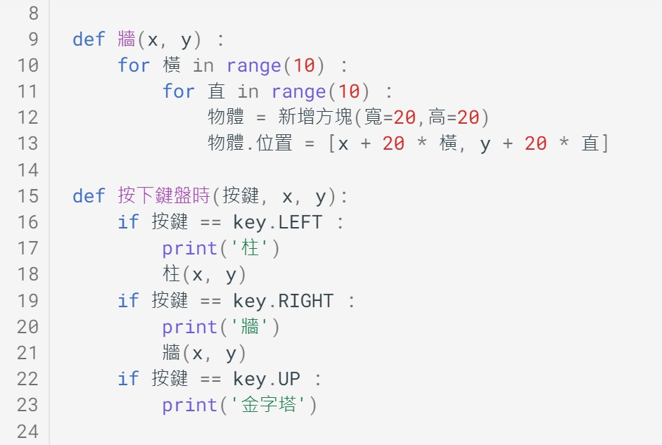
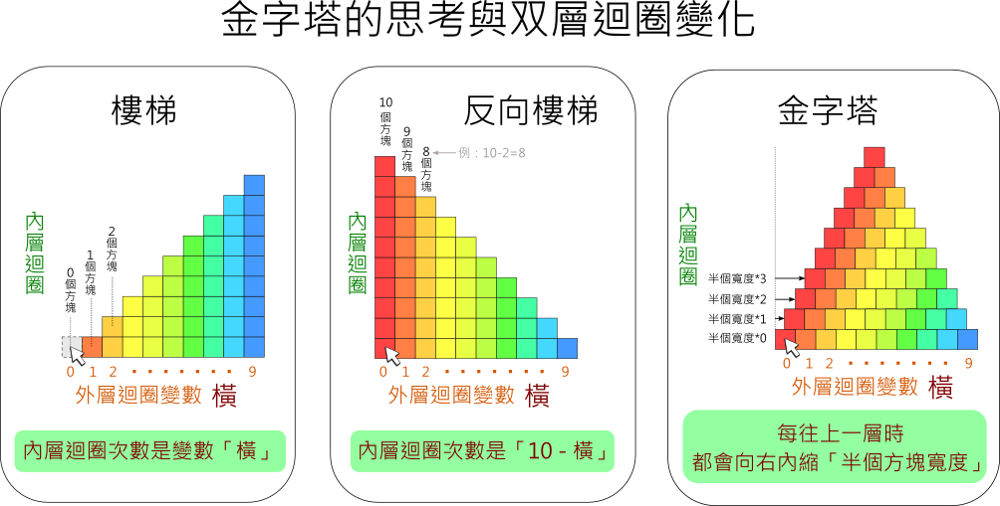
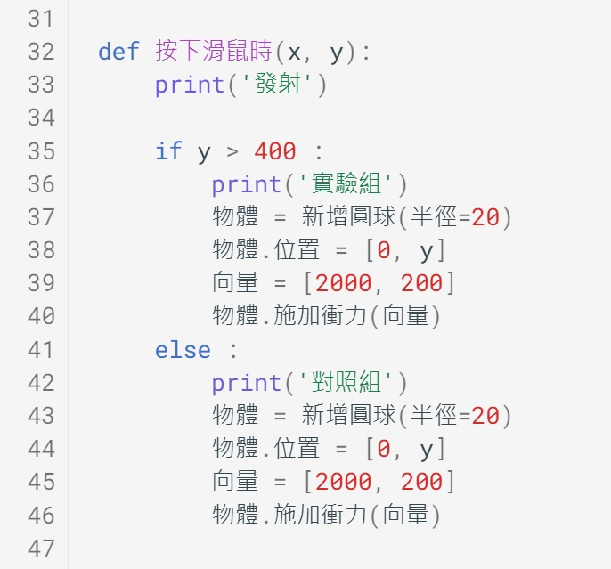

---
hide:
  - navigation
---

# 📚專題：物理撞擊實驗室

----------------------------
##  📕 引言 
----------------------------

汽車撞擊測試是一種對市售新車所做的撞擊試驗，測試車輛的耐撞性是否符合安全設計標準。在車禍事故發生時，能最大程度保障司機與乘客的安全。

<iframe width="560" height="315" src="https://www.youtube.com/embed/G0EVIYU59zk?start=0&amp;end=125" frameborder="0" allow="accelerometer; autoplay; encrypted-media; gyroscope; picture-in-picture" allowfullscreen></iframe>

: (資料來源:[^car_collision])

[^car_collision]: 汽車撞擊測試, By 消費者委員會(香港), [youtube連結](https://www.youtube.com/watch?v=G0EVIYU59zk) 

在正面、後面與測面撞擊的測試中，車子與障礙物的質量、速度、方向、結構、材料…等，都會影響撞擊結果，從車內假人身上的感測器，也可以了解撞擊過程中，對人類身體的影響。

在之前的學習中，相信各位已經練習過運動物理量的設置與模擬。在本專題中，請做出一個**與物理撞擊模擬有關的程式**。

??? quote "建議先備課程"

     在學習本專題前，建議先完成 :fontawesome-solid-long-arrow-alt-right: <a href="../mechanics_playground/" target="_blank">「力與運動遊樂場」</a> ，在學習概念銜接上會較為平順。

??? info "補充資料"

     :fontawesome-solid-link: <a href="https://www.car-safety.org.tw/car_safety/TemplateOneList?OpID=373" target="_blank">車輛安全資訊網 實車碰撞</a>

     :fontawesome-solid-link: <a href="https://zh.wikipedia.org/wiki/%E7%A2%B0%E6%92%9E%E6%B5%8B%E8%AF%95%E5%81%87%E4%BA%BA" target="_blank">維基百科 碰撞測試假人</a>

     

    

----------------------------
##  📙 問題 
----------------------------

首先，將撞擊模擬的物體分成「撞擊物」與「障礙物」，分別以圓形及方形做為代表。

 

: 

接著思考以下的問題：

* 撞擊物的運動有哪些性質呢？

* 障礙物的結構要如何設計？

* 哪些因素會影響撞擊的結果？

還有想到其他與撞擊模擬相關的問題嗎？

    

----------------------------
##  📗 搜尋
----------------------------

利用**搜尋引擎**，運用「運動定律」「碰撞」…等**關鍵字**，可以找到許多相關的資料。

 

撞擊物的運動相關性質：

: :fontawesome-solid-long-arrow-alt-right: <a href="https://zh.wikipedia.org/wiki/%E6%85%A3%E6%80%A7" target="_blank">維基百科: 慣性</a>

: :fontawesome-solid-long-arrow-alt-right: <a href="https://zh.wikipedia.org/wiki/%E5%8A%A0%E9%80%9F%E5%BA%A6" target="_blank">維基百科: 加速度</a>    

: :fontawesome-solid-long-arrow-alt-right: <a href="https://zh.wikipedia.org/wiki/%E6%8B%8B%E9%AB%94" target="_blank">維基百科: 拋體</a>

: :fontawesome-solid-long-arrow-alt-right: <a href="https://www.zetria.org/view.php?subj=physics&chap=lfym2aorgz" target="_blank">學呀: 拋物線運動</a>

 

障礙物參考資料：

: :fontawesome-solid-long-arrow-alt-right:  <a href="https://zh.wikipedia.org/wiki/%E5%A4%9A%E7%B1%B3%E8%AB%BE%E9%AA%A8%E7%89%8C%E6%95%88%E6%87%89" target="_blank">維基百科: 多米諾骨牌效應</a>

: :fontawesome-solid-long-arrow-alt-right:  <a href="https://zh.wikipedia.org/wiki/%E5%A2%99" target="_blank">維基百科: 牆</a>

: :fontawesome-solid-long-arrow-alt-right:  <a href="https://zh.wikipedia.org/wiki/%E9%87%91%E5%AD%97%E5%A1%94" target="_blank">維基百科: 金字塔</a>

 

可能會影響碰撞的因素：

: :fontawesome-solid-long-arrow-alt-right:  <a href="https://zh.wikipedia.org/wiki/%E4%BD%93%E7%A7%AF" target="_blank">維基百科: 體積</a>

: :fontawesome-solid-long-arrow-alt-right:  <a href="https://zh.wikipedia.org/wiki/%E8%B3%AA%E9%87%8F%E8%88%87%E9%87%8D%E9%87%8F%E7%9A%84%E6%AF%94%E8%BC%83" target="_blank">維基百科: 質量與重量的比較</a>

: :fontawesome-solid-long-arrow-alt-right:  <a href="https://zh.wikipedia.org/wiki/%E5%AF%86%E5%BA%A6" target="_blank">維基百科: 密度</a>

: :fontawesome-solid-long-arrow-alt-right:  <a href="https://lis.org.tw/post/00000175" target="_blank">LIS情境科學教材: 浮力與密度-阿基米德</a>

: :fontawesome-solid-long-arrow-alt-right:  <a href="https://zh.wikipedia.org/wiki/%E5%86%B2%E9%87%8F" target="_blank">維基百科: 衝量</a>

除了以上的資料，還有沒有其他的參考資料？找到資料後，要怎麼運用這些資料呢？

    

----------------------------
##  📒 規劃
----------------------------

在進行撞擊模擬時，參考以下圖的方式，來判斷撞墼力的大小：

: 

: (資料來源:[^railgun])

[^railgun]: Fun科學-超‧電磁砲-噴飛的硬幣, By 佑來了, [youtube連結](https://youtu.be/sKcblM1ayts) 

 

在參考資料並簡化後，採用3種障礙物設計，供撞擊物做不同的碰撞模擬：

  

: 

 
 

撞擊物以滑鼠控制，障礙物以鍵盤設置，模擬操作的設計構想如下圖：

 

: 

 

    

----------------------------
##  📘 實作

###  ***程式結構***

----------------------------

程式的主要流程設計如下：

: 

初步完成規畫後，接下來可以動手寫程式了。

 

???+ example "範例程式 程式結構"

    === "🎦操作影片"
    
        <iframe width="560" height="315" src="https://www.youtube.com/embed/dIjMzArPjqI?start=2&amp;end=260" frameborder="0" allow="accelerometer; autoplay; encrypted-media; gyroscope; picture-in-picture" allowfullscreen></iframe>

    === "💻程式碼截圖"

         

   

----------------------------

###  ***發射撞擊物***

----------------------------

為了讓碰撞模擬在操作上有多變性與互動性，撞擊物的設計在點擊滑鼠時會從左向右射出

當一開始施力於撞擊物時，跟據牛頓運動定關，會產生加速度並且移動，物體運動的同時也會受到重力的影響，產生如下的拋物線軌跡：

  

: 

 

由上圖可以得知，讓撞擊物的開始方向稍微斜上，可以讓運動的軌跡不會降低太快也不會飛得太高。在發射的程式中，會加一些方向向上的力量。

 
來動手寫寫看。
 

???+ example "範例程式 發射撞擊物"

    === "🎦操作影片"
    
        <iframe width="560" height="315" src="https://www.youtube.com/embed/dIjMzArPjqI?start=263&amp;end=378" frameborder="0" allow="accelerometer; autoplay; encrypted-media; gyroscope; picture-in-picture" allowfullscreen></iframe>

    === "💻程式碼截圖"

         

   

----------------------------

###  ***障礙物 - 柱***

----------------------------

: 

???+ example "範例程式 柱"

    === "🎦操作影片"
    
        <iframe width="560" height="315" src="https://www.youtube.com/embed/dIjMzArPjqI?start=380&amp;end=590" frameborder="0" allow="accelerometer; autoplay; encrypted-media; gyroscope; picture-in-picture" allowfullscreen></iframe>

    === "💻程式碼截圖"

         

   

----------------------------

###  ***障礙物 - 牆***

----------------------------

: 

???+ example "範例程式 牆"

    === "🎦操作影片"
    
        <iframe width="560" height="315" src="https://www.youtube.com/embed/dIjMzArPjqI?start=595&amp;end=722" frameborder="0" allow="accelerometer; autoplay; encrypted-media; gyroscope; picture-in-picture" allowfullscreen></iframe>

    === "💻程式碼截圖"

         

   

----------------------------

###  ***障礙物 - 金字塔***

----------------------------

: 

???+ example "範例程式 金字塔"

    === "🎦操作影片"
    
        <iframe width="560" height="315" src="https://www.youtube.com/embed/dIjMzArPjqI?start=725&amp;end=886" frameborder="0" allow="accelerometer; autoplay; encrypted-media; gyroscope; picture-in-picture" allowfullscreen></iframe>

    === "💻程式碼截圖"

         

   

----------------------------

###  ***實驗組與對照組***

----------------------------

???+ example "範例程式 實驗組與對照組"

    === "🎦操作影片"
    
        <iframe width="560" height="315" src="https://www.youtube.com/embed/dIjMzArPjqI?start=888&amp;end=1014" frameborder="0" allow="accelerometer; autoplay; encrypted-media; gyroscope; picture-in-picture" allowfullscreen></iframe>

    === "💻程式碼截圖"

         

   

----------------------------

###  ***撞擊測試***

----------------------------

<!--
https://www.youtube.com/watch?v=DG44CT46rSM

【基本測量】密度的測量
均一教育平台 Junyi Academy
-->

???+ example "範例程式 撞擊測試"

    === "🎦操作影片"
    
        <iframe width="560" height="315" src="https://www.youtube.com/embed/dIjMzArPjqI?start=1016&amp;end=1267" frameborder="0" allow="accelerometer; autoplay; encrypted-media; gyroscope; picture-in-picture" allowfullscreen></iframe>

    === "💻程式碼截圖"

         

   

----------------------------
##  📙 擴展

### ***慢動作***

----------------------------

<iframe width="560" height="315" src="https://www.youtube.com/embed/0-pZ4t-kAWw?start=0&amp;end=36" frameborder="0" allow="accelerometer; autoplay; encrypted-media; gyroscope; picture-in-picture" allowfullscreen></iframe>

: (資料來源:[^slow_motion])

[^slow_motion]: EVERYTHING Looks Better in Slow Motion, By Legendary Shots, [youtube連結](https://youtu.be/0-pZ4t-kAWw) 

???+ example "範例程式 慢動作"

    === "🎦操作影片"
    
        <iframe width="560" height="315" src="https://www.youtube.com/embed/dIjMzArPjqI?start=1269&amp;end=1415" frameborder="0" allow="accelerometer; autoplay; encrypted-media; gyroscope; picture-in-picture" allowfullscreen></iframe>

    === "💻程式碼截圖"

         

   

----------------------------

###  ***子彈射擊***

----------------------------

???+ example "範例程式 子彈射擊"

    === "🎦操作影片"
    
        <iframe width="560" height="315" src="https://www.youtube.com/embed/dIjMzArPjqI?start=1417&amp;end=1521" frameborder="0" allow="accelerometer; autoplay; encrypted-media; gyroscope; picture-in-picture" allowfullscreen></iframe>

    === "💻程式碼截圖"

         

   

----------------------------

##  📒 結語

----------------------------

  

