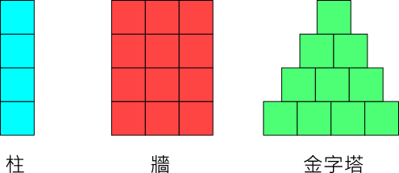
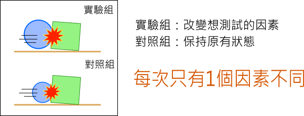

---
hide:
  - navigation
---

# 📚專題：物理撞擊實驗室

----------------------------
##  📕 引言 
----------------------------

汽車撞擊測試是一種對市售新車所做的撞擊試驗，測試車輛的耐撞性是否符合安全設計標準，讓車子在發生車禍事故發生時，能最大程度保障司機與乘客的安全。

<iframe width="560" height="315" src="https://www.youtube.com/embed/G0EVIYU59zk?start=0&amp;end=125" frameborder="0" allow="accelerometer; autoplay; encrypted-media; gyroscope; picture-in-picture" allowfullscreen></iframe>

: <sup>(2分05秒, 資料來源:</sup>[^car_collision]<sup>)</sup>

[^car_collision]: 汽車撞擊測試, By 消費者委員會(香港), [youtube連結](https://www.youtube.com/watch?v=G0EVIYU59zk) 


在正面、後面與測面撞擊的測試中，車子與障礙物的質量、速度、方向、結構、材料…等，都會影響撞擊結果，從車內假人身上的感測器，也可以了解撞擊過程中，對人類身體的影響。

在之前的學習中，相信各位已經練習過利用物理程式來做運動物理量的設置與模擬。在本專題中，請做出一個**與物理撞擊模擬有關的程式**。


??? quote "建議先備課程"

     在學習本專題前，建議先完成 :fontawesome-solid-long-arrow-alt-right: <a href="../mechanics_playground/" target="_blank">「力與運動遊樂場」</a> ，在學習概念銜接上會較為平順。


??? info "補充資料"

     :fontawesome-solid-link: <a href="https://www.car-safety.org.tw/car_safety/TemplateOneList?OpID=373" target="_blank">車輛安全資訊網 實車碰撞</a>

     :fontawesome-solid-link: <a href="https://zh.wikipedia.org/wiki/%E7%A2%B0%E6%92%9E%E6%B5%8B%E8%AF%95%E5%81%87%E4%BA%BA" target="_blank">維基百科 碰撞測試假人</a>


     


<br/><br/><br/> 

----------------------------
##  📙 問題 
----------------------------

要如何進行撞擊的模擬呢？

首先，將撞擊模擬的物體分成「撞擊物」與「障礙物」，分別以圓形及方形做為代表。

<br/>

: 


接著思考以下的問題：

* 撞擊物的運動有哪些性質呢？

* 障礙物的排列結構有哪些形式？

* 什麼因素會影響撞擊的結果？

<br/>

想一想，還有想到與撞擊模擬相關的問題嗎？


<br/><br/><br/> 

----------------------------
##  📗 搜尋
----------------------------

利用**搜尋引擎**，運用「運動定律」「碰撞」…等**關鍵字**，可以找到許多相關的資料。

<br/>

撞擊物的運動相關性質：

: :fontawesome-solid-long-arrow-alt-right: <a href="https://zh.wikipedia.org/wiki/%E6%85%A3%E6%80%A7" target="_blank">維基百科: 慣性</a>


: :fontawesome-solid-long-arrow-alt-right: <a href="https://zh.wikipedia.org/wiki/%E5%8A%A0%E9%80%9F%E5%BA%A6" target="_blank">維基百科: 加速度</a>    

: :fontawesome-solid-long-arrow-alt-right: <a href="https://zh.wikipedia.org/wiki/%E6%8B%8B%E9%AB%94" target="_blank">維基百科: 拋體</a>

: :fontawesome-solid-long-arrow-alt-right: <a href="https://www.zetria.org/view.php?subj=physics&chap=lfym2aorgz" target="_blank">學呀: 拋物線運動</a>


<br/>

障礙物參考資料：

: :fontawesome-solid-long-arrow-alt-right:  <a href="https://zh.wikipedia.org/wiki/%E5%A4%9A%E7%B1%B3%E8%AB%BE%E9%AA%A8%E7%89%8C%E6%95%88%E6%87%89" target="_blank">維基百科: 多米諾骨牌效應</a>

: :fontawesome-solid-long-arrow-alt-right:  <a href="https://zh.wikipedia.org/wiki/%E5%A2%99" target="_blank">維基百科: 牆</a>


: :fontawesome-solid-long-arrow-alt-right:  <a href="https://zh.wikipedia.org/wiki/%E9%87%91%E5%AD%97%E5%A1%94" target="_blank">維基百科: 金字塔</a>


<br/>


可能會影響碰撞的因素：

: :fontawesome-solid-long-arrow-alt-right:  <a href="https://zh.wikipedia.org/wiki/%E4%BD%93%E7%A7%AF" target="_blank">維基百科: 體積</a>


: :fontawesome-solid-long-arrow-alt-right:  <a href="https://zh.wikipedia.org/wiki/%E8%B3%AA%E9%87%8F%E8%88%87%E9%87%8D%E9%87%8F%E7%9A%84%E6%AF%94%E8%BC%83" target="_blank">維基百科: 質量與重量的比較</a>

: :fontawesome-solid-long-arrow-alt-right:  <a href="https://zh.wikipedia.org/wiki/%E5%AF%86%E5%BA%A6" target="_blank">維基百科: 密度</a>


: :fontawesome-solid-long-arrow-alt-right:  <a href="https://lis.org.tw/post/00000175" target="_blank">LIS情境科學教材: 浮力與密度-阿基米德</a>

: :fontawesome-solid-long-arrow-alt-right:  <a href="https://zh.wikipedia.org/wiki/%E5%86%B2%E9%87%8F" target="_blank">維基百科: 衝量</a>


除了以上的資料，還有沒有其他的參考資料？找到資料後，要怎麼運用這些資料呢？


<br/><br/><br/> 

----------------------------
##  📒 構思
----------------------------

在進行撞擊模擬時，會參考下圖的方式，由撞擊後掉落物體的多或少，來判斷撞擊力的大小：

: 

: <sup>(資料來源:</sup>[^railgun]<sup>)</sup>

[^railgun]: Fun科學-超‧電磁砲-噴飛的硬幣, By 佑來了, [youtube連結](https://youtu.be/sKcblM1ayts) 

<br/>

參考資料並簡化後，將採用3種障礙物設計，供撞擊物做不同的碰撞模擬：

<br/> 

: 

<br/>
<br/>

在程式的操作方式，撞擊物使用滑鼠控制，障礙物以鍵盤設置，模擬操作的設計構想如下圖：

<br/>

: 

<br/>


<br/><br/><br/> 

----------------------------
##  📘 實作(7)


###  ***程式結構***

----------------------------

由於物理程式是採用事件驅動的方式，所以程式的主要流程與結構設計會考慮到鍵盤與滑鼠的事件處理函式，如下圖：


: 


初步完成規劃後，就可以動手寫程式的主要結構。

<br/>

???+ example "專題實作 範例 (1/7 新檔) --- 程式結構"

    === "🎦Py4t操作影片(4:18)"
    
        <iframe width="560" height="315" src="https://www.youtube.com/embed/dIjMzArPjqI?start=2&amp;end=260" frameborder="0" allow="accelerometer; autoplay; encrypted-media; gyroscope; picture-in-picture" allowfullscreen></iframe>

    === "💻Python程式碼"

        ```python
        from 物理模組 import *
        舞台 = 物理引擎(800,800)
                    
        def 按下鍵盤時(按鍵, x, y):
            if 按鍵 == key.LEFT :
                print('柱')
            if 按鍵 == key.RIGHT :
                print('牆')
            if 按鍵 == key.UP :
                print('金字塔')

        def 按下滑鼠時(x, y):
            print('發射')

        模擬主迴圈()
        ``` 


??? abstract "模擬主迴圈"
    :fontawesome-solid-link: <a href="../basic/scratch_python_compare/#event_driven" target="_blank">事件驅動程式 結構與流程</a>

??? abstract "結構化程式設計"

    :fontawesome-solid-link: <a href="../basic/scratch_python_compare/#if" target="_blank">選擇結構</a>

<br/><br/><br/>


----------------------------

###  ***發射撞擊物***

----------------------------


為了讓碰撞模擬在操作上有多變性與互動性，撞擊物的設計在點擊滑鼠時會從左向右射出

當一開始施力於撞擊物時，根據牛頓運動定律，會產生加速度並且移動，物體在空中移動的同時也會受到重力的影響，產生如下的拋物線軌跡：

<br/> 

: 

<br/>

由上圖可以得知，讓撞擊物的開始方向些微的斜上，可以讓運動的軌跡不會降低太快也不會飛得太高。所以在發射的程式中，會加一些向上的力量，儘量保持高度。

<br/>

動手寫寫看發射的程式。

<br/>


???+ example "專題實作 範例 (2/7 接續) --- 發射撞擊物"

    === "🎦Py4t操作影片(1:55)"
    
        <iframe width="560" height="315" src="https://www.youtube.com/embed/dIjMzArPjqI?start=263&amp;end=378" frameborder="0" allow="accelerometer; autoplay; encrypted-media; gyroscope; picture-in-picture" allowfullscreen></iframe>

    === "💻Python程式碼"

        ```python
        from 物理模組 import *
        舞台 = 物理引擎(800,800)

        def 按下鍵盤時(按鍵, x, y):
            if 按鍵 == key.LEFT :
                print('柱')
            if 按鍵 == key.RIGHT :
                print('牆')
            if 按鍵 == key.UP :
                print('金字塔')

        def 按下滑鼠時(x, y):
            print('發射')
            物體 = 新增圓球(半徑=20)
            物體.位置 = [0, y]
            向量 = [2000, 200]
            物體.施加衝力(向量)
            
        模擬主迴圈()
        ``` 

<br/><br/><br/>


----------------------------

###  ***障礙物 - 柱***

----------------------------

先利用之前學到的方式，按滑鼠就會產生方塊。之後就要思考一下，如何使用重複結構(迴圈)，一次就能產生柱的障礙物。在迴圈中，柱的直排方塊座標，有沒有什麼規律呢？

<br/>

: 

<br/>

動手實作看看。

<br/>

???+ example "專題實作 範例 (3/7 接續) --- 柱"

    === "🎦Py4t操作影片(3:30)"
    
        <iframe width="560" height="315" src="https://www.youtube.com/embed/dIjMzArPjqI?start=380&amp;end=590" frameborder="0" allow="accelerometer; autoplay; encrypted-media; gyroscope; picture-in-picture" allowfullscreen></iframe>

    === "💻Python程式碼"

        ```python
        from 物理模組 import *
        舞台 = 物理引擎(800,800)

        def 柱(x, y) :
            for 直 in range(10) :
                物體 = 新增方塊(寬=20,高=20)
                物體.位置 = [x, y + 20 * 直]
                
        def 按下鍵盤時(按鍵, x, y):
            if 按鍵 == key.LEFT :
                print('柱')
                柱(x, y)
            if 按鍵 == key.RIGHT :
                print('牆')
            if 按鍵 == key.UP :
                print('金字塔')

        def 按下滑鼠時(x, y):
            print('發射')
            物體 = 新增圓球(半徑=20)
            物體.位置 = [0, y]
            向量 = [2000, 200]
            物體.施加衝力(向量)
            
        模擬主迴圈()
        ```

??? abstract "結構化程式設計"

    :fontawesome-solid-link: <a href="../basic/scratch_python_compare/#for" target="_blank">重複結構</a>

<br/><br/><br/>

----------------------------

###  ***障礙物 - 牆***

----------------------------


牆的實作可以從柱的程式而來，柱是一層迴圈，而牆就需要使用双層迴圈。在双層迴圈中，能夠找出方塊座標的樣式嗎？

<br/>

: 

<br/>

請試著寫出程式。

<br/>

???+ example "專題實作 範例 (4/7 接續) --- 牆"

    === "🎦Py4t操作影片(2:07)"
    
        <iframe width="560" height="315" src="https://www.youtube.com/embed/dIjMzArPjqI?start=595&amp;end=722" frameborder="0" allow="accelerometer; autoplay; encrypted-media; gyroscope; picture-in-picture" allowfullscreen></iframe>

    === "💻Python程式碼"

        ```python
        from 物理模組 import *
        舞台 = 物理引擎(800,800)

        def 柱(x, y) :
            for 直 in range(10) :
                物體 = 新增方塊(寬=20,高=20)
                物體.位置 = [x, y + 20 * 直]

        def 牆(x, y) :
            for 橫 in range(10) :
                for 直 in range(10) :
                    物體 = 新增方塊(寬=20,高=20)
                    物體.位置 = [x + 20 * 橫, y + 20 * 直]

        def 按下鍵盤時(按鍵, x, y):
            if 按鍵 == key.LEFT :
                print('柱')
                柱(x, y)
            if 按鍵 == key.RIGHT :
                print('牆')
                牆(x, y)
            if 按鍵 == key.UP :
                print('金字塔')

        def 按下滑鼠時(x, y):
            print('發射')
            物體 = 新增圓球(半徑=20)
            物體.位置 = [0, y]
            向量 = [2000, 200]
            物體.施加衝力(向量)
            
        模擬主迴圈()
        ``` 

<br/><br/><br/>

----------------------------

###  ***障礙物 - 金字塔***

----------------------------

如何從牆的程式來做出金字塔呢？要先思考兩個迴圈之間的關係，做出樓梯的形狀。再思考如何從樓梯形狀變化成金字塔形狀。相關思考如下圖：

<br/>

: 

<br/>

動手寫出程式

<br/>


???+ example "專題實作 範例 (5/7 接續) --- 金字塔"

    === "🎦Py4t操作影片(2:41)"
    
        <iframe width="560" height="315" src="https://www.youtube.com/embed/dIjMzArPjqI?start=725&amp;end=886" frameborder="0" allow="accelerometer; autoplay; encrypted-media; gyroscope; picture-in-picture" allowfullscreen></iframe>

    === "💻Python程式碼"

        ```python
        from 物理模組 import *
        舞台 = 物理引擎(800,800)

        def 柱(x, y) :
            for 直 in range(10) :
                物體 = 新增方塊(寬=20,高=20)
                物體.位置 = [x, y + 20 * 直]

        def 牆(x, y) :
            for 橫 in range(10) :
                for 直 in range(10) :
                    物體 = 新增方塊(寬=20,高=20)
                    物體.位置 = [x + 20 * 橫, y + 20 * 直]

        def 金字塔(x, y) :
            for 橫 in range(10) :
                for 直 in range(10 - 橫) :
                    物體 = 新增方塊(寬=20,高=20)
                    物體.位置 = [x + 20 * 橫 + 10 * 直, y + 20 * 直]

        def 按下鍵盤時(按鍵, x, y):
            if 按鍵 == key.LEFT :
                print('柱')
                柱(x, y)
            if 按鍵 == key.RIGHT :
                print('牆')
                牆(x, y)
            if 按鍵 == key.UP :
                print('金字塔')
                金字塔(x, y)

        def 按下滑鼠時(x, y):
            print('發射')
            物體 = 新增圓球(半徑=20)
            物體.位置 = [0, y]
            向量 = [2000, 200]
            物體.施加衝力(向量)
            
        模擬主迴圈()
        ``` 


<br/><br/><br/>

----------------------------

###  ***實驗組與對照組***

----------------------------

為了讓撞擊的結果更為清楚，會將畫面分成上下兩部份，上方為實驗組，下方為對照組。


<br/>



<br/>

依規劃的方式動手實作

<br/>

??? abstract "如何新增地形？"

    :fontawesome-solid-link: <a href="../mechanics_playground/terrain_assist.jpg" target="_blank">增加刪除地形 操作說明</a>


???+ example "專題實作 範例 (6/7 接續) --- 實驗組與對照組"

    === "🎦Py4t操作影片(2:06)"
    
        <iframe width="560" height="315" src="https://www.youtube.com/embed/dIjMzArPjqI?start=888&amp;end=1014" frameborder="0" allow="accelerometer; autoplay; encrypted-media; gyroscope; picture-in-picture" allowfullscreen></iframe>

    === "💻Python程式碼"

        ```python
        from 物理模組 import *
        舞台 = 物理引擎(800,800)

        def 柱(x, y) :
            for 直 in range(10) :
                物體 = 新增方塊(寬=20,高=20)
                物體.位置 = [x, y + 20 * 直]

        def 牆(x, y) :
            for 橫 in range(10) :
                for 直 in range(10) :
                    物體 = 新增方塊(寬=20,高=20)
                    物體.位置 = [x + 20 * 橫, y + 20 * 直]

        def 金字塔(x, y) :
            for 橫 in range(10) :
                for 直 in range(10 - 橫) :
                    物體 = 新增方塊(寬=20,高=20)
                    物體.位置 = [x + 20 * 橫 + 10 * 直, y + 20 * 直]

        def 按下鍵盤時(按鍵, x, y):
            if 按鍵 == key.LEFT :
                print('柱')
                柱(x, y)
            if 按鍵 == key.RIGHT :
                print('牆')
                牆(x, y)
            if 按鍵 == key.UP :
                print('金字塔')
                金字塔(x, y)

        def 按下滑鼠時(x, y):
            print('發射')
            
            if y > 400 :
                print('實驗組')
                物體 = 新增圓球(半徑=20)
                物體.位置 = [0, y]
                向量 = [2000, 200]
                物體.施加衝力(向量)
            else :
                print('對照組')
                物體 = 新增圓球(半徑=20)
                物體.位置 = [0, y]
                向量 = [2000, 200]
                物體.施加衝力(向量)

        模擬主迴圈()
        ``` 


<br/><br/><br/>

----------------------------

###  ***撞擊測試***

----------------------------

到此終於可以開始進行撞擊測試了。到底什麼會影響撞擊的結果呢？

<br/>


<br/>

越重的物體也有可能會影響結果，但是當撞擊物有不同大小時，要如何決定重量呢？先了解一下什麼是密度：

<br/>

<iframe width="560" height="315" src="https://www.youtube.com/embed/DG44CT46rSM?start=0&amp;end=137" frameborder="0" allow="accelerometer; autoplay; encrypted-media; gyroscope; picture-in-picture" allowfullscreen></iframe>

: <sup>(2分17秒, 資料來源:</sup>[^density]<sup>)</sup>

[^density]: 基本測量 密度的測量, By 均一教育平台 Junyi Academy, [youtube連結](https://www.youtube.com/watch?v=DG44CT46rSM) 

<br/>

根據以上的思考，將會對「不同結構」、「不同高度」、「不同大小」、「不同密度」，分別進行撞擊測試。

<br/>


???+ example "專題實作 範例 (7/7 接續) --- 撞擊測試"

    === "🎦Py4t操作影片(4:11)"
    
        <iframe width="560" height="315" src="https://www.youtube.com/embed/dIjMzArPjqI?start=1016&amp;end=1267" frameborder="0" allow="accelerometer; autoplay; encrypted-media; gyroscope; picture-in-picture" allowfullscreen></iframe>

    === "💻Python程式碼"

        ```python
        from 物理模組 import *
        舞台 = 物理引擎(800,800)

        def 柱(x, y) :
            for 直 in range(10) :
                物體 = 新增方塊(寬=20,高=20)
                物體.位置 = [x, y + 20 * 直]
                物體.密度 = 1

        def 牆(x, y) :
            for 橫 in range(10) :
                for 直 in range(10) :
                    物體 = 新增方塊(寬=20,高=20)
                    物體.位置 = [x + 20 * 橫, y + 20 * 直]
                    物體.密度 = 1

        def 金字塔(x, y) :
            for 橫 in range(10) :
                for 直 in range(10 - 橫) :
                    物體 = 新增方塊(寬=20,高=20)
                    物體.位置 = [x + 20 * 橫 + 10 * 直, y + 20 * 直]
                    物體.密度 = 1

        def 按下鍵盤時(按鍵, x, y):
            if 按鍵 == key.LEFT :
                print('柱')
                柱(x, y)
            if 按鍵 == key.RIGHT :
                print('牆')
                牆(x, y)
            if 按鍵 == key.UP :
                print('金字塔')
                金字塔(x, y)

        def 按下滑鼠時(x, y):
            print('發射')
            
            if y > 400 :
                print('實驗組')
                物體 = 新增圓球(半徑=60)
                物體.位置 = [0, y]
                向量 = [2000, 200]
                物體.施加衝力(向量)
                物體.密度 = 10
            else :
                print('對照組')
                物體 = 新增圓球(半徑=60)
                物體.位置 = [0, y]
                向量 = [2000, 200]
                物體.施加衝力(向量)
                物體.密度 = 1

        模擬主迴圈()
        ```


<br/><br/><br/>


----------------------------
##  📙 擴展(2)


### ***慢動作***

----------------------------

在有些真實世界的實驗中，會使用高速攝影機錄影，在事後以慢動作播放來做出更詳細的分析，看一下高速攝影機的慢動作效果：

<br/>

<iframe width="560" height="315" src="https://www.youtube.com/embed/0-pZ4t-kAWw?start=0&amp;end=36" frameborder="0" allow="accelerometer; autoplay; encrypted-media; gyroscope; picture-in-picture" allowfullscreen></iframe>

: <sup>(36秒, 資料來源:</sup>[^slow_motion]<sup>)</sup>

[^slow_motion]: EVERYTHING Looks Better in Slow Motion, By Legendary Shots, [youtube連結](https://youtu.be/0-pZ4t-kAWw) 

<br/>

物理程式中有慢動作的控制方法，增加新的事件處理函式，可以利用按鍵來控制慢動作的有無。

一起來實作看看。

<br/>

???+ example "專題擴展 範例 (1/2 接續) --- 慢動作"

    === "🎦Py4t操作影片(2:26)"
    
        <iframe width="560" height="315" src="https://www.youtube.com/embed/dIjMzArPjqI?start=1269&amp;end=1415" frameborder="0" allow="accelerometer; autoplay; encrypted-media; gyroscope; picture-in-picture" allowfullscreen></iframe>

    === "💻Python程式碼"

        ```python
        from 物理模組 import *
        舞台 = 物理引擎(800,800)

        def 柱(x, y) :
            for 直 in range(10) :
                物體 = 新增方塊(寬=20,高=20)
                物體.位置 = [x, y + 20 * 直]
                物體.密度 = 1

        def 牆(x, y) :
            for 橫 in range(10) :
                for 直 in range(10) :
                    物體 = 新增方塊(寬=20,高=20)
                    物體.位置 = [x + 20 * 橫, y + 20 * 直]
                    物體.密度 = 1

        def 金字塔(x, y) :
            for 橫 in range(10) :
                for 直 in range(10 - 橫) :
                    物體 = 新增方塊(寬=20,高=20)
                    物體.位置 = [x + 20 * 橫 + 10 * 直, y + 20 * 直]
                    物體.密度 = 1

        def 按下鍵盤時(按鍵, x, y):
            if 按鍵 == key.LEFT :
                print('柱')
                柱(x, y)
            if 按鍵 == key.RIGHT :
                print('牆')
                牆(x, y)
            if 按鍵 == key.UP :
                print('金字塔')
                金字塔(x, y)
            if 按鍵 == key.SPACE :
                舞台.慢動作 = True

        def 放開鍵盤時(按鍵, x, y):
            舞台.慢動作 = False

        def 按下滑鼠時(x, y):
            print('發射')
            
            if y > 400 :
                print('實驗組')
                物體 = 新增圓球(半徑=60)
                物體.位置 = [0, y]
                向量 = [2000, 200]
                物體.施加衝力(向量)
                物體.密度 = 10
            else :
                print('對照組')
                物體 = 新增圓球(半徑=60)
                物體.位置 = [0, y]
                向量 = [2000, 200]
                物體.施加衝力(向量)
                物體.密度 = 1

        模擬主迴圈()
        ``` 

<br/><br/><br/>


----------------------------

###  ***子彈射擊***

----------------------------

撞擊物的開始速度會不會影響結果？我們先來看一下子彈發射的樣子：

<br/>

<iframe width="560" height="315" src="https://www.youtube.com/embed/JFEkpBhBJug?start=0&amp;end=166" frameborder="0" allow="accelerometer; autoplay; encrypted-media; gyroscope; picture-in-picture" allowfullscreen></iframe>

: <sup>(2分46秒, 資料來源:</sup>[^student_shoot_target]<sup>)</sup>

[^student_shoot_target]: 2017.03.29國軍教學生打靶 培養高中"神射手", By udn video, [youtube連結](https://youtu.be/JFEkpBhBJug) 

<br/>

在物理程式的內部原理是經由物理公式計算出來的一格一格畫面，當撞擊物速度快到某個程度時，會產生穿越的情形，這是物理程式模擬的原理與極限。不過我們會儘量在此限制中做出子彈模擬，只要找出適當的速度，並且將且將障礙物放在適當的位置(瞬間到達的位置)就可以。

請動手做做看。


<br/>

???+ example "專題擴展 範例 (2/2 接續) --- 子彈射擊"

    === "🎦Py4t操作影片(1:44)"
    
        <iframe width="560" height="315" src="https://www.youtube.com/embed/dIjMzArPjqI?start=1417&amp;end=1521" frameborder="0" allow="accelerometer; autoplay; encrypted-media; gyroscope; picture-in-picture" allowfullscreen></iframe>

    === "💻Python程式碼"

        ```python
        from 物理模組 import *
        舞台 = 物理引擎(800,800)

        def 柱(x, y) :
            for 直 in range(10) :
                物體 = 新增方塊(寬=20,高=20)
                物體.位置 = [x, y + 20 * 直]
                物體.密度 = 1
                
        def 牆(x, y) :
            for 橫 in range(10) :
                for 直 in range(10) :
                    物體 = 新增方塊(寬=20,高=20)
                    物體.位置 = [x + 20 * 橫, y + 20 * 直]
                    物體.密度 = 1
                    
        def 金字塔(x, y) :
            for 橫 in range(10) :
                for 直 in range(10 - 橫) :
                    物體 = 新增方塊(寬=20,高=20)
                    物體.位置 = [x + 20 * 橫 + 10 * 直, y + 20 * 直]
                    物體.密度 = 1

        def 按下鍵盤時(按鍵, x, y):
            if 按鍵 == key.LEFT :
                print('柱')
                柱(x, y)
            if 按鍵 == key.RIGHT :
                print('牆')
                牆(x, y)
            if 按鍵 == key.UP :
                print('金字塔')
                金字塔(x, y)
            if 按鍵 == key.SPACE :
                舞台.慢動作 = True

        def 放開鍵盤時(按鍵, x, y):
            舞台.慢動作 = False

        def 按下滑鼠時(x, y):
            print('發射')
            
            if y > 400 :
                print('實驗組')
                物體 = 新增圓球(半徑=10)
                物體.位置 = [0, y]
                向量 = [100000, 200]
                物體.施加衝力(向量)
                物體.密度 = 1
            else :
                print('對照組')
                物體 = 新增圓球(半徑=10)
                物體.位置 = [0, y]
                向量 = [2000, 200]
                物體.施加衝力(向量)
                物體.密度 = 1

        模擬主迴圈()
        ```

<br/><br/><br/>

----------------------------

##  📒 結語

----------------------------


如果沒有實際的實驗做為基礎，物理的學習很容易會發展成像數學一樣的抽象，不易理解。

物理程式的模擬與物體互動的具體呈現，提供一種方式，讓我們能理解在力與運動中各個物理量之間的關係，也可以在有趣的氣氛下學習知識、實踐知識。

希望本課程可以讓你有不同的體驗及收獲，提高你對相關學科的興趣，下次再見了。


<br/><br/>


