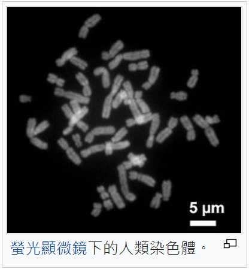

---
hide:
  - navigation
---

# 📚專題：DNA與遺傳編碼

----------------------------
##  📕 引言 
----------------------------

: 孩子身上會有來自父親或母親的特徵，如血型、眼睛顏色和捲舌的能力。生物後代獲得親代的特徵稱為遺傳。

: 

: <sup>(資料來源:</sup>[^dna_flower]<sup>)</sup>

[^dna_flower]: 花色基因 [可汗學院連結](https://zh.khanacademy.org/science/biology/gene-expression-central-dogma/central-dogma-transcription/a/intro-to-gene-expression-central-dogma)

: 現代生物遺傳的研究歷程，從孟得爾豌豆實驗建立的遺傳規則(1865)，到染色體在細胞減數分裂與有性生殖的重新組合(1902)，到去氧核醣核酸(DNA)的遺傳功能確認(1952)，到人類基因組序列草圖的發表(2001)，至今一直不斷的在發展，廣泛應用在遺傳工程、基因定序、法醫鑑識、疾病防治等，甚至是新冠病毒的相關研究。

:  

: <sup>(資料來源:</sup>[^photo_and_model]<sup>)</sup>

[^photo_and_model]: 染色體 , [維基百科連結](https://zh.wikipedia.org/zh-tw/%E6%9F%93%E8%89%B2%E4%BD%93) ; DNA結構模型複製品，[科學博物館-倫敦](https://collection.sciencemuseumgroup.org.uk/objects/co146411/crick-and-watsons-dna-molecular-model-molecular-model)

: 資訊科技可以應用在生物遺傳的研究，幫助學習者理解概念。在此專題中，**請實作出遺傳物質DNA及含有遺傳編碼訊息的3D模型**。

??? info "建議先備課程"

     在學習本專題前，建議先完成 :fontawesome-solid-long-arrow-alt-right: <a href="../explore3d/" target="_blank">「探索3D空間」</a> ，在學習概念銜接上會較為平順。

<br/><br/><br/> 

----------------------------
##  📙 問題 
----------------------------

: 要如何做出DNA的模型呢？我們需要對DNA與遺傳的機制有一定的認識後，才能使用資訊科技來實作出3D模型。

: 我們需要了解的是：

: * 什麼是DNA？它的作用又是什麼？

: * DNA的分子結構(化學結構)是什麼？

: * 什麼是遺傳編碼？它的種類有哪些？

    

: 

<br/>

: 想一想，還有想到與DNA 3D模型實作相關的問題嗎？

<br/><br/><br/> 

----------------------------
##  📗 搜尋
----------------------------

: 利用**搜尋引擎**，運用「DNA」「遺傳」「染色體」…等**關鍵字**，可以找到許多相關的資料。


: :fontawesome-solid-long-arrow-alt-right: <a href="https://zh.wikipedia.org/wiki/%E8%84%B1%E6%B0%A7%E6%A0%B8%E7%B3%96%E6%A0%B8%E9%85%B8" target="_blank">維基百科: DNA</a>

: :fontawesome-solid-long-arrow-alt-right: <a href="https://zh.wikipedia.org/wiki/%E6%9F%93%E8%89%B2%E4%BD%93" target="_blank">維基百科: 染色體</a>

: :fontawesome-solid-long-arrow-alt-right: <a href="https://zh.wikipedia.org/wiki/%E9%81%97%E4%BC%A0%E5%AF%86%E7%A0%81" target="_blank">維基百科: 遺傳密碼</a>

: :fontawesome-solid-long-arrow-alt-right: <a href="https://zh.wikipedia.org/wiki/%E4%BA%BA%E9%A1%9E%E5%9F%BA%E5%9B%A0%E7%B5%84" target="_blank">維基百科: 人類基因組</a>

: :fontawesome-solid-long-arrow-alt-right: <a href="https://askthescientists.com/zh-hant/genetics/" target="_blank">遺傳學基本課程</a>

: :fontawesome-solid-long-arrow-alt-right: <a href="https://zh.khanacademy.org/science/biology/gene-expression-central-dogma/central-dogma-transcription/a/intro-to-gene-expression-central-dogma" target="_blank">可汗學院: DNA到RNA到蛋白質</a>

<br>

: DNA是生物的分子藍圖，它的遺傳編碼會逐步產生蛋白質，而蛋白質是地球上生物體中的必要組成成分。請觀看以下影片來認識什麼是DNA及它的功能。

: <iframe width="560" height="315" src="https://www.youtube.com/embed/zwibgNGe4aY?start=0&amp;end=294" frameborder="0" allow="accelerometer; autoplay; encrypted-media; gyroscope; picture-in-picture" allowfullscreen></iframe>

: <sup>(4分54秒,可選中文字幕, 資料來源:</sup>[^what_is_dna]<sup>)</sup>

[^what_is_dna]: 什麼是ＤＮＡ？ＤＮＡ如何發揮功能？, by Stated Clearly , [youtube連結](https://www.youtube.com/watch?v=zwibgNGe4aY) 


<br>


: 在生物的細胞核中有染色體，染色體中有雙螺旋結構的DNA。

: 

: <sup>(資料來源:</sup>[^dna_in_chromosome]<sup>)</sup>

[^dna_in_chromosome]: 染色體 , [維基百科連結](https://zh.wikipedia.org/zh-tw/%E6%9F%93%E8%89%B2%E4%BD%93) 


<br>

: DNA的兩個螺旋骨架是由數以百萬計的核苷酸分子相連。核苷酸上的鹼基會成對(A-T成對，C-G成對)。化學結構圖如下。

: 

: <sup>(資料來源:</sup>[^chemical_structure]<sup>)</sup>

[^chemical_structure]: DNA , [維基百科連結](https://zh.wikipedia.org/wiki/%E8%84%B1%E6%B0%A7%E6%A0%B8%E7%B3%96%E6%A0%B8%E9%85%B8:) 

??? info "補充 什麼是核苷酸？"

     : 核苷酸是核酸的基本組成單位。核苷酸以一個含氮鹼基為核心，加上一個五碳醣和一個或者多個磷酸基團組成。詳細資料可參考 :fontawesome-solid-long-arrow-alt-right: <a href="https://zh.m.wikipedia.org/zh-tw/%E6%A0%B8%E8%8B%B7%E9%85%B8" target="_blank">維基百科: 核苷酸</a>

<br>
<br>

: DNA上的ATCG四種鹼基，經過組合後，會有合成胺基酸(蛋白質基本單位)的訊息，這就是基礎的遺傳編碼。

: 

: <sup>(資料來源:</sup>[^dna_code]<sup>)</sup>

[^dna_code]: 什麼是ＤＮＡ？ＤＮＡ如何發揮功能？, by Stated Clearly , [youtube連結](https://www.youtube.com/watch?v=zwibgNGe4aY)

??? info "補充 DNA遺傳密碼子"

     : 標準遺傳密碼是將DNA或mRNA序列以三個核苷酸為一組的「密碼子（codon）」轉譯為蛋白質的胺基酸序列，以用於蛋白質合成。詳細資料可參考 :fontawesome-solid-long-arrow-alt-right: <a href="https://zh.m.wikipedia.org/zh-tw/%E9%81%97%E4%BC%A0%E5%AF%86%E7%A0%81" target="_blank">維基百科: 遺傳密碼</a>

     : 本專題為簡化設計，易於中小學生理解資訊科技在生物上的應用，僅使用到最基礎的ATCG編碼。


<br/><br/><br/> 

----------------------------
##  📒 構思
----------------------------

: 從分子的化學結構，可以看出DNA非常的複雜。

: 

: <sup>(資料來源:</sup>[^dna_molecular]<sup>)</sup>

[^dna_molecular]: 去氧核糖核酸, [維基百科連結](https://zh.wikipedia.org/wiki/%E8%84%B1%E6%B0%A7%E6%A0%B8%E7%B3%96%E6%A0%B8%E9%85%B8)

: 為了讓人能理解並聚焦於DNA的主要結構，模型的設計會簡化，我們使用球體代表核苷酸分子(組成兩個螺旋長條骨架)，橢圓體代表鹼基。

: 另外，為表現出DNA模型上的遺傳編碼序列，綠色橢圓代表鹼基A，紅色橢圓代表鹼基T，藍色橢圓代表鹼基C，黃色橢圓代表鹼基G。且依查詢到的資料，A-T需成對， C-G需成對。  


: 


<br/><br/><br/> 

----------------------------
##  📘 實作(4)


###  ***波提甜甜圈***

----------------------------


???+ example "範例程式 波提甜甜圈 - - - - - - - (專題實作1/4 新檔)"

    === "🎦操作影片"
    
        <iframe width="560" height="315" src="https://www.youtube.com/embed/Mfb5IJ3f4-Y?start=2&amp;end=386" frameborder="0" allow="accelerometer; autoplay; encrypted-media; gyroscope; picture-in-picture" allowfullscreen></iframe>

        【長度6:24 章節時間如下】

        * 0:00 檔案儲存、模組設定
        * 0:46 波提甜甜圈

    === "💻程式碼"

        ```python
        from 模擬3D模組 import *

        for i in range(12) :
            旋轉中心 = 新增立方體()
            旋轉中心.旋轉z = 30 * i
          
            核苷酸 = 新增球體()
            核苷酸.顏色 = color.orange
            核苷酸.位置y = 10
            核苷酸.親代 = 旋轉中心
            核苷酸.縮放 = 7.5

        模擬主迴圈()
        ``` 


<br/><br/><br/>

----------------------------


###  ***螺旋與自轉***

----------------------------


???+ example "範例程式 螺旋與自轉 - - - - - - - (專題實作2/4 接續)"

    === "🎦操作影片"
    
        <iframe width="560" height="315" src="https://www.youtube.com/embed/Mfb5IJ3f4-Y?start=389&amp;end=704" frameborder="0" allow="accelerometer; autoplay; encrypted-media; gyroscope; picture-in-picture" allowfullscreen></iframe>

        【長度5:15 章節時間如下】

        * 6:30 螺旋與自轉

    === "💻程式碼"

        ```python
        from 模擬3D模組 import *

        原點 = 新增物體()

        for i in range(100) :
            旋轉中心 = 新增物體()
            旋轉中心.旋轉z = 30 * i
            旋轉中心.位置z = 5 * i
            旋轉中心.親代 = 原點
          
            核苷酸 = 新增球體()
            核苷酸.顏色 = color.orange
            核苷酸.位置y = 10
            核苷酸.親代 = 旋轉中心
            核苷酸.縮放 = 7.5

        def 當更新時(dt):
            原點.旋轉z  +=  0.2
          
        模擬主迴圈()
        ``` 

<br/><br/><br/>

----------------------------

###  ***雙股螺旋***

----------------------------


???+ example "範例程式 雙股螺旋 - - - - - - - (專題實作3/4 接續)"

    === "🎦操作影片"
    
        <iframe width="560" height="315" src="https://www.youtube.com/embed/Mfb5IJ3f4-Y?start=708&amp;end=791" frameborder="0" allow="accelerometer; autoplay; encrypted-media; gyroscope; picture-in-picture" allowfullscreen></iframe>

        【長度1:23 章節時間如下】

        * 11:48 雙股螺旋

    === "💻程式碼"

        ```python
        from 模擬3D模組 import *

        原點 = 新增物體()

        for i in range(100) :
            旋轉中心 = 新增物體()
            旋轉中心.旋轉z = 30 * i
            旋轉中心.位置z = 5 * i
            旋轉中心.親代 = 原點
            
            核苷酸 = 新增球體()
            核苷酸.顏色 = color.orange
            核苷酸.位置y = 10
            核苷酸.親代 = 旋轉中心
            核苷酸.縮放 = 7.5

            核苷酸2 = 新增球體()
            核苷酸2.位置y = -10
            核苷酸2.親代 = 旋轉中心
            核苷酸2.縮放 = 7.5

        def 當更新時(dt):
            原點.旋轉z  +=  0.2
            
        模擬主迴圈()
        ```


<br/><br/><br/>

----------------------------

###  ***成對鹼基***

----------------------------


???+ example "範例程式 成對鹼基 - - - - - - - (專題實作4/4 接續)"

    === "🎦操作影片"
    
        <iframe width="560" height="315" src="https://www.youtube.com/embed/Mfb5IJ3f4-Y?start=795&amp;end=989" frameborder="0" allow="accelerometer; autoplay; encrypted-media; gyroscope; picture-in-picture" allowfullscreen></iframe>

        【長度3:14 章節時間如下】

        * 13:14 成對鹼基

    === "💻程式碼"

        ```python
        from 模擬3D模組 import *

        原點 = 新增物體()

        for i in range(100) :
            旋轉中心 = 新增物體()
            旋轉中心.旋轉z = 30 * i
            旋轉中心.位置z = 5 * i
            旋轉中心.親代 = 原點
            
            核苷酸 = 新增球體()
            核苷酸.顏色 = color.orange
            核苷酸.位置y = 10
            核苷酸.親代 = 旋轉中心
            核苷酸.縮放 = 7.5

            鹼基 = 新增球體()
            鹼基.顏色 = color.orange
            鹼基.位置y = 5
            鹼基.親代 = 旋轉中心
            鹼基.縮放y = 10

            核苷酸2 = 新增球體()
            核苷酸2.位置y = -10
            核苷酸2.親代 = 旋轉中心
            核苷酸2.縮放 = 7.5

            鹼基2 = 新增球體()
            鹼基2.位置y = -5
            鹼基2.親代 = 旋轉中心
            鹼基2.縮放y = 10

        def 當更新時(dt):
            原點.旋轉z  +=  0.2
            
        模擬主迴圈()
        ```

<br/><br/><br/>


----------------------------
##  📙 擴展(2)


### ***編碼字串***

----------------------------

???+ example "範例程式 編碼字串 - - - - - - - (專題擴展1/2 接續)"

    === "🎦操作影片"
    
        <iframe width="560" height="315" src="https://www.youtube.com/embed/Mfb5IJ3f4-Y?start=992&amp;end=1478" frameborder="0" allow="accelerometer; autoplay; encrypted-media; gyroscope; picture-in-picture" allowfullscreen></iframe>

        【長度8:06 章節時間如下】

        * 16:33 編碼字串

    === "💻程式碼"

        ```python
        from 模擬3D模組 import *

        原點 = 新增物體()
        DNA序列 = 'AAAATTTTCCCCGGGGAAAATTTTCCCCGGGG'

        for i, 編碼 in enumerate(DNA序列) :
            旋轉中心 = 新增物體()
            旋轉中心.旋轉z = 30 * i
            旋轉中心.位置z = 5 * i
            旋轉中心.親代 = 原點
            
            核苷酸 = 新增球體()
            核苷酸.顏色 = color.orange
            核苷酸.位置y = 10
            核苷酸.親代 = 旋轉中心
            核苷酸.縮放 = 7.5

            鹼基 = 新增球體()
            鹼基.顏色 = color.orange
            鹼基.位置y = 5
            鹼基.親代 = 旋轉中心
            鹼基.縮放y = 10

            核苷酸2 = 新增球體()
            核苷酸2.位置y = -10
            核苷酸2.親代 = 旋轉中心
            核苷酸2.縮放 = 7.5

            鹼基2 = 新增球體()
            鹼基2.位置y = -5
            鹼基2.親代 = 旋轉中心
            鹼基2.縮放y = 10
            
            if 編碼 == 'A' :
                鹼基.顏色 = color.green
                鹼基2.顏色 = color.red
            elif 編碼 == 'T' :
                鹼基.顏色 = color.red
                鹼基2.顏色 = color.green
            elif 編碼 == 'C' :
                鹼基.顏色 = color.blue
                鹼基2.顏色 = color.yellow
            elif 編碼 == 'G' :
                鹼基.顏色 = color.yellow
                鹼基2.顏色 = color.blue
            else :
                pass

        def 當更新時(dt):
            原點.旋轉z  +=  0.2
            
        模擬主迴圈()
        ```


<br/><br/><br/>

----------------------------

### ***人類DNA序列***

----------------------------

人類基因組計劃是一項跨國跨學科的科學探索巨型工程，為了要測定組成人類染色體中所包含的六十億對組成的核苷酸序列，從而繪製人類基因組圖譜。2001年人類基因組工作草圖的發表被認為是人類基因組計劃成功的里程碑。大多數政府資助的測序是在美國，英國，日本，法國，德國和中國的20所大學和研究中心進行。

: 

: <sup>(資料來源:</sup>[^hgp_logo]<sup>)</sup>

[^hgp_logo]: 人類基因組計劃, [維基百科連結](https://zh.wikipedia.org/zh-tw/%E4%BA%BA%E7%B1%BB%E5%9F%BA%E5%9B%A0%E7%BB%84%E8%AE%A1%E5%88%92)

<br>

我們也可以在網站中查詢到部分人類的DNA序列資料，如[臺灣人體生物資料庫](https://taiwanview.twbiobank.org.tw/index)的網站。

: 

<br>

人類基因組含有約30億個DNA鹼基對，而X染色體約有1.5億個鹼基對。X染色體是決定性別的染色體之一，但它也可能會造成隱性遺傳疾病的發生。讓我們來查查看人類X染色體的一小段序列(位置10022~10122)，查詢到的鹼基序列如下圖：

: 

<br>

從網站下載的範例DNA序列資料如下(字串形式)：

```python
DNA序列 = 'ACCCTAACCCTAACCCTCTGAAAGTGGACCTATCAGCAGGATGTGGGTGGGAGCAGATTAGAGAATAAAAGCAGACTGCCTGAGCCAGCAGTGGCAACCCA'
```

<br>

???+ example "範例程式 人類DNA序列 - - - - - - - (專題擴展2/2 接續)"

    === "🎦操作影片"
    
        <iframe width="560" height="315" src="https://www.youtube.com/embed/Mfb5IJ3f4-Y?start=1482&amp;end=1587" frameborder="0" allow="accelerometer; autoplay; encrypted-media; gyroscope; picture-in-picture" allowfullscreen></iframe>

        【長度1:45 章節時間如下】

        * 24:42 人類DNA序列

    === "💻程式碼"

        ```python
        from 模擬3D模組 import *    

        原點 = 新增物體()
        DNA序列 = 'ACCCTAACCCTAACCCTCTGAAAGTGGACCTATCAGCAGGATGTGGGTGGGAGCAGATTAGAGAATAAAAGCAGACTGCCTGAGCCAGCAGTGGCAACCCA'

        for i, 編碼 in enumerate(DNA序列) :
            旋轉中心 = 新增物體()
            旋轉中心.旋轉z = 30 * i
            旋轉中心.位置z = 5 * i
            旋轉中心.親代 = 原點
            
            核苷酸 = 新增球體()
            核苷酸.顏色 = color.orange
            核苷酸.位置y = 10
            核苷酸.親代 = 旋轉中心
            核苷酸.縮放 = 7.5

            鹼基 = 新增球體()
            鹼基.顏色 = color.orange
            鹼基.位置y = 5
            鹼基.親代 = 旋轉中心
            鹼基.縮放y = 10

            核苷酸2 = 新增球體()
            核苷酸2.位置y = -10
            核苷酸2.親代 = 旋轉中心
            核苷酸2.縮放 = 7.5
            
            鹼基2 = 新增球體()
            鹼基2.位置y = -5
            鹼基2.親代 = 旋轉中心
            鹼基2.縮放y = 10
            
            if 編碼 == 'A' :
                鹼基.顏色 = color.green
                鹼基2.顏色 = color.red
            elif 編碼 == 'T' :
                鹼基.顏色 = color.red
                鹼基2.顏色 = color.green
            elif 編碼 == 'C' :
                鹼基.顏色 = color.blue
                鹼基2.顏色 = color.yellow
            elif 編碼 == 'G' :
                鹼基.顏色 = color.yellow
                鹼基2.顏色 = color.blue
            else :
                pass
                    
        def 當更新時(dt):
            原點.旋轉z  +=  0.2    
            
        模擬主迴圈()
        ```


<br/><br/><br/>

