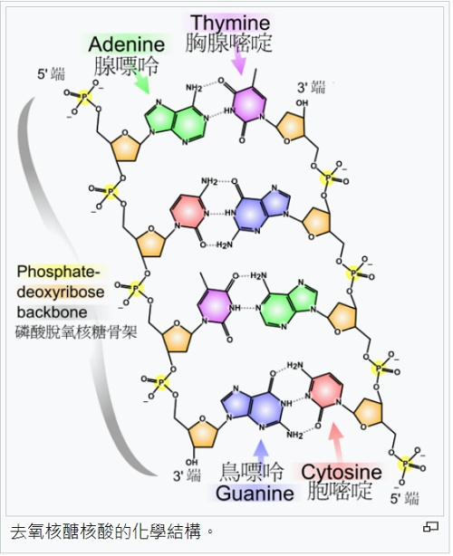

---
hide:
  - navigation
---

# 📚專題：DNA模型與遺傳編碼

----------------------------
##  📕 引言 
----------------------------

: 孩子身上會有來自父親或母親的特徵，如血型、眼睛顏色和捲舌的能力。生物後代獲得親代的特徵稱為遺傳。

: 

: (資料來源:[^dna_flower])

[^dna_flower]: 花色基因 [可汗學院連結](https://zh.khanacademy.org/science/biology/gene-expression-central-dogma/central-dogma-transcription/a/intro-to-gene-expression-central-dogma)

: 現代生物遺傳的研究從孟得爾豌豆實驗建立的遺傳規則(1865)，到染色體在細胞減數分裂與有性生殖的重新組合(1902)，到去氧核醣核酸(DNA)的遺傳功能確認(1952)，到人類基因組序列草圖的發表(2001)，至今一直不斷的在發展，廣泛應用在遺傳工程、基因定序、法醫鑑識、疾病防治等，甚至是新冠病毒的相關研究。

:  

: (資料來源:[^photo_and_model])

[^photo_and_model]: 染色體 , [維基百科連結](https://zh.wikipedia.org/zh-tw/%E6%9F%93%E8%89%B2%E4%BD%93) ; DNA結構模型複製品，[科學博物館-倫敦](https://collection.sciencemuseumgroup.org.uk/objects/co146411/crick-and-watsons-dna-molecular-model-molecular-model)

: 電腦除了計算以外，也可以應用在生物遺傳的研究，幫助學習者理解概念。**請應用資訊3D科技，實作出遺傳物質DNA及其遺傳編碼訊息的模型**。

??? info "建議先備課程"

     在學習本專題前，建議先完成 :fontawesome-solid-long-arrow-alt-right: <a href="../explore3d/" target="_blank">「探索3D空間」</a> ，在學習概念銜接上會較為平順。

    

----------------------------
##  📙 問題 
----------------------------

: 要如何做出DNA的模型呢？我們需要對DNA與遺傳的機制有一定的認識後，才能使用資訊科技來實作出3D模型。

: 我們需要了解的是：

: * 什麼是DNA？它的作用又是什麼？

: * DNA的分子結構(化學結構)是什麼？

: * 什麼是遺傳編碼？它的種類有哪些？

    

: 

 

: 想一想，還有想到與DNA 3D模型實作相關的問題嗎？

    

----------------------------
##  📗 搜尋
----------------------------

: 利用**搜尋引擎**，運用「DNA」「遺傳」「染色體」…等**關鍵字**，可以找到許多相關的資料。

: :fontawesome-solid-long-arrow-alt-right: <a href="https://zh.wikipedia.org/wiki/%E8%84%B1%E6%B0%A7%E6%A0%B8%E7%B3%96%E6%A0%B8%E9%85%B8" target="_blank">維基百科: DNA</a>

: :fontawesome-solid-long-arrow-alt-right: <a href="https://zh.wikipedia.org/wiki/%E6%9F%93%E8%89%B2%E4%BD%93" target="_blank">維基百科: 染色體</a>

: :fontawesome-solid-long-arrow-alt-right: <a href="https://zh.wikipedia.org/wiki/%E9%81%97%E4%BC%A0%E5%AF%86%E7%A0%81" target="_blank">維基百科: 遺傳密碼</a>

: :fontawesome-solid-long-arrow-alt-right: <a href="https://zh.wikipedia.org/wiki/%E4%BA%BA%E9%A1%9E%E5%9F%BA%E5%9B%A0%E7%B5%84" target="_blank">維基百科: 人類基因組</a>

: :fontawesome-solid-long-arrow-alt-right: <a href="https://askthescientists.com/zh-hant/genetics/" target="_blank">遺傳學基本課程</a>

: :fontawesome-solid-long-arrow-alt-right: <a href="https://zh.khanacademy.org/science/biology/gene-expression-central-dogma/central-dogma-transcription/a/intro-to-gene-expression-central-dogma" target="_blank">可汗學院: DNA到RNA到蛋白質</a>

: DNA是生物的分子藍圖，它的遺傳編碼會逐步產生蛋白質，而蛋白質是地球上生物體中的必要組成成分。請觀看以下影片來認識什麼是DNA及它的功能。

: <iframe width="560" height="315" src="https://www.youtube.com/embed/zwibgNGe4aY?start=0&amp;end=294" frameborder="0" allow="accelerometer; autoplay; encrypted-media; gyroscope; picture-in-picture" allowfullscreen></iframe>

: (4分54秒,可選中文字幕, 資料來源:[^what_is_dna])

[^what_is_dna]: 什麼是ＤＮＡ？ＤＮＡ如何發揮功能？, by Stated Clearly , [youtube連結](https://www.youtube.com/watch?v=zwibgNGe4aY) 

 

: 在生物的細胞核中有染色體，染色體中有雙螺旋結構的DNA。

: 

: (資料來源:[^dna_in_chromosome])

[^dna_in_chromosome]: 染色體 , [維基百科連結](https://zh.wikipedia.org/zh-tw/%E6%9F%93%E8%89%B2%E4%BD%93) 

 

: DNA的兩個螺旋長條骨架是由數以百萬計的核苷酸相連。核苷酸上的鹼基會成對(A-T成對，C-G成對)。化學結構圖如下。

: 

: (資料來源:[^chemical_structure])

[^chemical_structure]: DNA , [維基百科連結](https://zh.wikipedia.org/wiki/%E8%84%B1%E6%B0%A7%E6%A0%B8%E7%B3%96%E6%A0%B8%E9%85%B8:) 

 

: DNA上的鹼基帶有合成胺基酸(蛋白質基本單位)的訊息，這就是基礎的遺傳編碼。

: 

: (資料來源:[^dna_code])

[^dna_code]: 什麼是ＤＮＡ？ＤＮＡ如何發揮功能？, by Stated Clearly , [youtube連結](https://www.youtube.com/watch?v=zwibgNGe4aY)

??? info "補充 DNA遺傳密碼子"

     標準遺傳密碼是將DNA或mRNA序列以三個核苷酸為一組的「密碼子（codon）」轉譯為蛋白質的胺基酸序列，以用於蛋白質合成。詳細資料可參考 :fontawesome-solid-long-arrow-alt-right: <a href="https://zh.m.wikipedia.org/zh-tw/%E9%81%97%E4%BC%A0%E5%AF%86%E7%A0%81" target="_blank">維基百科: 遺傳密碼</a>

     本專題為簡化設計，易於學生理解資訊科技在生物上的應用，僅使用到最基礎的ATCG編碼。

    

----------------------------
##  📒 構思
----------------------------

從DNA分子的化學式，可以知道它相當的複雜。為了容易理解DNA的主要結構，模型的設計會簡化，我們會使用球體代表核苷酸(組成兩個螺旋長條骨架)，並使用長方體代表鹼基。

為了表現出DNA模型上的遺傳編碼序列，綠色長方體代表鹼基A，紅色長方體代表鹼基T，藍色長方體代表鹼基C，黃色長方體代表鹼基G。且依查詢到的資料，A-T需成對， C-G需成對。  

: 

    

----------------------------
##  📘 實作(5)

###  ***程式結構***

----------------------------

   

----------------------------

###  ***單股螺旋結構***

----------------------------

   

----------------------------

###  ***雙股螺旋結構***

----------------------------

   

----------------------------

###  ***鹼基配對結構***

----------------------------

   

----------------------------

###  ***自動旋轉功能***

----------------------------

   

----------------------------
##  📙 擴展(1)

### ***人類X染色體編碼***

----------------------------