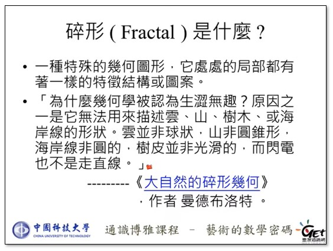
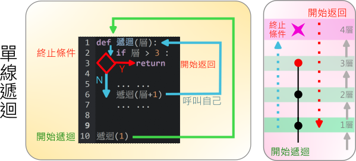
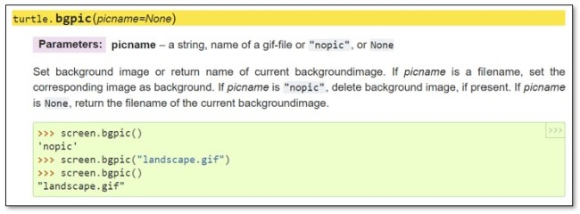
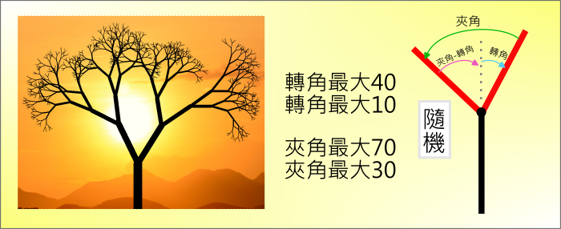

---
hide:
  - navigation
---

# 📚專題：海龜與樹

----------------------------
##  📕 引言 
----------------------------

: 當使用海龜畫完美麗的禪繞圖形之後，還可以畫什麼有重覆規律的圖案呢？ 試著從生活中找尋靈感。

: 


: 在校園中，在公園裡，甚至在人行道上，常常可以看到不同種類的樹。樹可以美化景觀，也可以淨化空氣，對我們的環境有著許多的好處。

: 你知道樹是如何生長的嗎？來看看蘋果樹生長的縮時攝影：


: <iframe width="560" height="315" src="https://www.youtube.com/embed/UzggoZ3qHVE?start=0&amp;end=76" frameborder="0" allow="accelerometer; autoplay; encrypted-media; gyroscope; picture-in-picture" allowfullscreen></iframe>

: <sup>(76秒, 資料來源:</sup>[^growing_plants_timelapse]<sup>)</sup>

[^growing_plants_timelapse]: 800 days in 8 minutes - Growing Plants Time Lapse Compilation, by Boxlapse , [youtube連結](https://youtu.be/UzggoZ3qHVE) 

: 利用資訊科技設備，可以產生電腦圖形(Computer Graphics)，它的意思是利用電腦創造出的圖形，廣泛應用在建築、氣象、醫療、生物、娛樂等不同的領域。**在此專題中，請利用海龜程式畫出樹的電腦圖形**。


??? info "建議先備課程"

     在學習本專題前，建議先完成 :fontawesome-solid-long-arrow-alt-right: <a href="../zentangle/" target="_blank">「海龜畫禪繞」</a> ，在學習概念銜接上會較為平順。

<br/><br/><br/> 

----------------------------
##  📙 問題 
----------------------------

: 要使用程式來畫出樹，我們可能會有以下的問題：

: * 樹的構造有哪些？它的作用是什麼？

: * 樹的形狀像什麼？哪些因素會影響到樹的形狀？

: * 樹在藝術作品中的呈現方式？樹本身具備有哪些顏色？

: * 如何使用電腦程式畫出一棵樹？

<br/>

: 想一想，還有想到與產生樹的圖形實作相關的問題嗎？

<br/><br/><br/> 

----------------------------
##  📗 搜尋
----------------------------

: 利用**搜尋引擎**，可以找到許多相關與樹相關的資料。


: :fontawesome-solid-long-arrow-alt-right: <a href="https://www.youtube.com/watch?v=qB2WLWHmh9c" target="_blank">國小自然 植物的生長四要素</a>

: :fontawesome-solid-long-arrow-alt-right: <a href="https://www.youtube.com/watch?v=qvoumF31R3E" target="_blank">《看見台灣大樹》‖ 城市中的行道樹 榕樹、欒樹、木棉、樟樹、茄苳...你認識幾種？</a>

: :fontawesome-solid-long-arrow-alt-right: <a href="https://cendalirit.blogspot.com/2017/05/20170531.html" target="_blank">一棵開花的樹　◎席慕蓉</a>

: :fontawesome-solid-long-arrow-alt-right: <a href="https://www.wowlavie.com/article/ae1901944" target="_blank">探索樹之美學！巴黎卡地亞當代藝術基金會《樹》從剪紙、攝影、插畫為大自然發聲</a>

: :fontawesome-solid-long-arrow-alt-right: <a href="https://www.youtube.com/watch?v=lGi5L7i9r6o" target="_blank">劉東啟教授：樹想告訴我們什麼？：2.演講</a>

: :fontawesome-solid-long-arrow-alt-right: <a href="https://web.math.sinica.edu.tw/mathmedia/HTMLarticle18.jsp?mID=44108" target="_blank">數以載情 — 古文詩詞意境的一些數學描繪</a>

: :fontawesome-solid-long-arrow-alt-right: <a href="https://www.youtube.com/watch?v=uaTiG5_tsbE" target="_blank">藝術的數學密碼 Ch 10. 數學美術館 (三)：碎形 - 製造碎形的數學密碼 / 徐惠莉</a>

: :fontawesome-solid-long-arrow-alt-right: <a href="http://www.fractal-wu.com/essay/2012/10078448_fractal_art_self_similarity.shtml" target="_blank">談碎形與藝術：自我相似之結構套嵌</a>


: :fontawesome-solid-long-arrow-alt-right: <a href="https://www.youtube.com/watch?v=IErkDyzygRw" target="_blank">吳文成老師演講段落：碎形幾何的動態演變，從 H 碎形到樹碎形</a>


: :fontawesome-solid-long-arrow-alt-right: <a href="https://pansci.asia/archives/130135" target="_blank">蝴蝶效應｜科學史上的今天：12/29</a>


<br/><br/>

: 在找尋資料的過程，發現數學中的碎形可以用來描述自然界中雲、山脈、閃電、海岸線、雪片、植物根等等。到底什麼是碎形呢？


: <iframe width="560" height="315" src="https://www.youtube.com/embed/ysD5aHP3jYA?start=152&amp;end=518" frameborder="0" allow="accelerometer; autoplay; encrypted-media; gyroscope; picture-in-picture" allowfullscreen></iframe>

: <sup>(6分06秒,可選中文字幕, 資料來源:</sup>[^what_is_fractal]<sup>)</sup>

[^what_is_fractal]: 藝術的數學密碼 Ch 10. 數學美術館 (三)：碎形 - 碎形是什麼？ / 徐惠莉, by 臺灣通識網General Education TW-開放式課程GET , [youtube連結](https://youtu.be/ysD5aHP3jYA) 

<br/>


: 

: <sup>(資料來源:</sup>[^what_is_fractal]<sup>)</sup>

[^what_is_fractal]: 藝術的數學密碼 Ch 10. 數學美術館 (三)：碎形 - 碎形是什麼？ / 徐惠莉, by 臺灣通識網General Education TW-開放式課程GET , [youtube連結](https://youtu.be/ysD5aHP3jYA) 

<br/>

: 碎形具有自我相似性，形狀中處處有相似的結構。

: 

: <sup>(資料來源:</sup>[^fractal_and_fern]<sup>)</sup>

[^fractal_and_fern]: 左圖 https://www.pexels.com/zh-tw/photo/5345030/ . 右圖來源 [吳文成老師教學網站 碎形幾何內涵與 Logo 程式繪圖 ](http://www.fractal-wu.com/essay/2012/10141991_fractal_logo_turtle_graphics.shtml)   


<br/>

: 瑞典數學家科赫提出的科赫曲線也是一種碎形，它不斷地在線段的中間三分之一處(如下圖綠色線段)，形成新的正三角形的隆起。


: 

: <sup>(資料來源:</sup>[^what_is_fractal]<sup>)</sup>

[^what_is_fractal]: 藝術的數學密碼 Ch 10. 數學美術館 (三)：碎形 - 碎形是什麼？ / 徐惠莉, by 臺灣通識網General Education TW-開放式課程GET , [youtube連結](https://youtu.be/ysD5aHP3jYA) 

<br>


: 科赫曲線一直不斷地重複之後，看起來像什麼呢？


: 

: <sup>(資料來源:</sup>[^koch_curve]<sup>)</sup>

[^koch_curve]: 由 英文維基百科的Dino, CC BY-SA 3.0, https://commons.wikimedia.org/w/index.php?curid=3872598 


<br/>


: 樹也是由樹枝不斷地進行分支，有類似自我相似的形狀。

: 

: <sup>(資料來源:</sup>[^fractal_and_tree]<sup>)</sup>

[^fractal_and_tree]: Fractal Foundation, https://fractalfoundation.org/OFC/OFC-1-1.html


: 碎形的概念可以幫助我們來理解樹的形狀。


<br/><br/><br/> 

----------------------------
##  📒 構思
----------------------------

: 要如何實作出樹的形狀呢？先來認識一下「遞迴」方法。

: <iframe width="560" height="315" src="https://www.youtube.com/embed/50KKo1spKwc?start=17&amp;end=128" frameborder="0" allow="accelerometer; autoplay; encrypted-media; gyroscope; picture-in-picture" allowfullscreen></iframe>

: <sup>(1分51秒, 資料來源:</sup>[^visual_recursion]<sup>)</sup>

[^visual_recursion]: 不插電 程式運算邏輯入門5 遞迴(recursion), by Sophia Hsiao , [youtube連結](https://youtu.be/50KKo1spKwc)


<br/>

: 下面兩個圖形，也都是遞迴的視覺化例子，在自己的圖形中包含自己。

: 

: <sup>(資料來源:</sup>[^droste_effect]<sup>)</sup>

[^droste_effect]: 由 Designer: Jan MissetUploader: Alf van Beem - 自己的作品, 公有領域, https://commons.wikimedia.org/w/index.php?curid=30739029


<br/>


: 如何使用Python程式來表達遞迴呢？我們可以使用函式，並在函式的中間呼叫自己，不斷地重複。


: 

: 要小心，如果是無限遞迴的話，到最後會耗盡電腦的記憶體或產生系統錯誤。

<br/>

: 如何避免無限遞迴呢？我們可以在每次的遞迴函式呼叫中傳遞「層」的參數，並設立遞迴的終止條件。

: 


<br/>

: 當我們在遞迴函式中，呼叫自己兩次，就會有分支的情形。不斷的遞迴，就會不斷分支，直到終止條件發生，再逐一返回。

: 我們將使用這樣的構想，不斷地分支遞迴，來產生樹枝形狀的結構。

: 

<br/>


<br/><br/><br/> 

----------------------------
##  📘 實作(4)


###  ***程式結構***

----------------------------

我們使用以下的安排，做為程式的結構：

: 

* 模組區 - 匯入內建或第三方函式庫
* 全域變數 - 整個檔案內可共用的變數
* 函式區 - 自訂的各種公用函式
* 主程式 - 程式開始運作

<br/>

使用程式註解，可以達到分區標示的效果，試著動手寫寫看。


???+ example "範例程式 程式結構 - - - - - - - (專題實作1/4 新檔)"

    === "🎦操作影片"
    
        <iframe width="560" height="315" src="https://www.youtube.com/embed/FEi_l-Ie1Gc?start=2&amp;end=129" frameborder="0" allow="accelerometer; autoplay; encrypted-media; gyroscope; picture-in-picture" allowfullscreen></iframe>

        【長度2:07 章節時間如下】

        * 0:00 檔案儲存
        * 0:32 程式結構


    === "💻程式碼"

        ```python
        # 模組區 ----------
        from 海龜模組 import *

        # 全域變數 ----------

        # 函式區 ----------

        # 主程式 ----------


        完成()
        ``` 


<br/><br/><br/>

----------------------------


###  ***單線遞迴***

----------------------------

: 先以簡易的單線遞迴，來畫出一條直線。從下圖中，你看得出「向上畫線」與「後退」的執行順序嗎？

: 

<br/><br/>

如果像樹枝一樣漸漸彎曲，要如何做呢？先來找出遞迴樣式的規則：


: 

看看「3.呼叫自己」之後的動作，像不像是「倒轉」動作呢？

<iframe width="560" height="315" src="https://www.youtube.com/embed/H4mpMKJFN_E?start=0&amp;end=80" frameborder="0" allow="accelerometer; autoplay; encrypted-media; gyroscope; picture-in-picture" allowfullscreen></iframe>

: <sup>(1分20秒, 資料來源:</sup>[^reverse_world]<sup>)</sup>

[^reverse_world]: THIS IS THE BEST REVERSE VIDEO I EVER MADE!, by Mr. Reverse, [youtube連結](https://youtu.be/H4mpMKJFN_E)


<br/><br/>

: 原來要做出如樹支彎曲般的效果，就要在遞迴函式中適當之處加上「右轉」及「左轉」。


: 

<br/><br/>

: 試著動手實作看看。


???+ example "範例程式 單線遞迴 - - - - - - - (專題實作2/4 接續)"

    === "🎦操作影片"
    
        <iframe width="560" height="315" src="https://www.youtube.com/embed/FEi_l-Ie1Gc?start=131&amp;end=491" frameborder="0" allow="accelerometer; autoplay; encrypted-media; gyroscope; picture-in-picture" allowfullscreen></iframe>

        【長度6:00 章節時間如下】

        * 2:11 單線遞迴

    === "💻程式碼"

        ```python
        # 模組區 ----------------
        from 海龜模組 import *

        # 全域變數 ----------------

        # 函式區 ----------------
        def 初始設定() :
            左轉(90)
            
        def 遞迴(層) :
            if 層 > 5 :
                畫點(10, 'red')
                return
            
            向前(50)
            畫點(10, 'black')
            右轉(20)
            
            遞迴(層 + 1)
            
            左轉(20)
            向後(50)
                
        # 主程式 ----------------
        初始設定()
        遞迴(1)
        完成()
        ``` 


<br/><br/><br/>

----------------------------

###  ***碎形樹***

----------------------------

: 要如何畫出如下的樹狀圖形呢？

: 

<br/><br/>

: 整理一下之前的兩種遞迴樣式與傳遞參數。

: 

<br/><br/>

: 那樹狀圖形的遞迴樣式與傳遞參數又是什麼呢？

: 

<br/><br/>

: 下圖是2層分支遞迴的函式呼叫，看得出下圖中的執行順序嗎？(從黃色區塊開始)

<br/>

: 


<br/><br/>

???+ example "範例程式 碎形樹 - - - - - - - (專題實作3/4 接續)"

    === "🎦操作影片"
    
        <iframe width="560" height="315" src="https://www.youtube.com/embed/FEi_l-Ie1Gc?start=493&amp;end=976" frameborder="0" allow="accelerometer; autoplay; encrypted-media; gyroscope; picture-in-picture" allowfullscreen></iframe>

        【長度8:03 章節時間如下】

        * 8:13 碎形樹

    === "💻程式碼"

        ```python
        # 模組區 ----------------
        from 海龜模組 import *

        # 全域變數 ----------------
        最大層數 = 5
        轉角 = 20
        開始長度 = 100
        長縮減率 = 0.7

        # 函式區 ----------------
        def 初始設定() :
            左轉(90)
            速度('fastest')	
                
        def 遞迴(層, 長) :
            if 層 > 最大層數 :
                畫點(10, 'red')
                return
            
            向前(長)
            畫點(10, 'black')
            
            右轉(轉角)
            遞迴(層 + 1, 長 * 長縮減率)
            
            左轉(轉角 * 2)
            遞迴(層 + 1, 長 * 長縮減率)
            
            右轉(轉角)
            向後(長)
                
        # 主程式 ----------------
        初始設定()
        遞迴(1, 開始長度)
        完成()        
        ``` 

<br/><br/><br/>

----------------------------

###  ***碎形動畫***

----------------------------

: 看看下面有關碎形樹的演示動畫(點選在youtube上觀看)。


<iframe width="560" height="315" src="https://www.youtube.com/embed/Ec8Q1q9cbbo?start=0&amp;end=57" frameborder="0" allow="accelerometer; autoplay; encrypted-media; gyroscope; picture-in-picture" allowfullscreen></iframe>

: <sup>(資料來源:</sup>[^fractal_tree_animation]<sup>)</sup>

[^fractal_tree_animation]: Fractal Tree Morph 4K UHD 60FPS, by syntaxerror147, [youtube連結](https://youtu.be/Ec8Q1q9cbbo)


<br/>

: 真是令人賞心悅目。可以使用海龜程式做出類似的效果嗎？

: 在畫碎形樹時，即使已將速度調整為fastest(最快)，仍要花上一段時間才可以畫完，有辦法提升海龜的繪圖速度嗎？

<br/>


: 

: (資料來源: [Python官網 海龜說明文件](https://docs.python.org/3.7/library/turtle.html#turtle.tracer) )

: 上圖是海龜的說明文件，當我們把tracer關閉時，海龜會忽略繪圖動作，可以加快運算速度，等到算完時，再手動執行update更新繪圖畫面。

: 利用這樣的機制，可以試著做出簡單的碎形動畫。請動手試做看看。


<br>

???+ example "範例程式 碎形動畫 - - - - - - - (專題實作4/4 接續)"

    === "🎦操作影片"
    
        <iframe width="560" height="315" src="https://www.youtube.com/embed/FEi_l-Ie1Gc?start=978&amp;end=1180" frameborder="0" allow="accelerometer; autoplay; encrypted-media; gyroscope; picture-in-picture" allowfullscreen></iframe>

        【長度3:22 章節時間如下】

        * 16:18 碎形動畫

    === "💻程式碼"

        ```python
        # 模組區 ----------------
        from 海龜模組 import *

        # 全域變數 ----------------
        最大層數 = 5
        轉角 = 20
        開始長度 = 100
        長縮減率 = 0.7

        # 函式區 ----------------
        def 初始設定() :
            左轉(90)
            速度('fastest')
            tracer(0, 0)
                
        def 遞迴(層, 長) :
            if 層 > 最大層數 :
                畫點(10, 'red')
                return
            
            向前(長)
            畫點(10, 'black')
            
            右轉(轉角)
            遞迴(層 + 1, 長 * 長縮減率)
            
            左轉(轉角 * 2)
            遞迴(層 + 1, 長 * 長縮減率)
            
            右轉(轉角)
            向後(長)
                
        # 主程式 ----------------
        初始設定()

        for 數 in range(90+1) :
            筆跡清除()
            轉角 = 數 
            遞迴(1, 開始長度)
            update()    

        完成()        
        ``` 

<br/><br/><br/>

----------------------------
##  📙 擴展(3)


### ***樹與剪影***

----------------------------


: 剪影（silhouette)是一種將人事物用單色描繪（通常為黑色），凸顯輪廓的藝術圖像。剪影也可應用在攝影上，利用逆光方式的攝影技巧，將人事物拍攝出有如剪影效果。


: 

: <sup>(資料來源:</sup>[^portait_silhouette]<sup>)</sup>

[^portait_silhouette]: 左圖來源 Public Domain, https://commons.wikimedia.org/w/index.php?curid=1449030 ； 右圖來源 By Bob Jagendorf from Manalapan, NJ, USA - Lady Liberty At Sunset, CC BY 2.0, https://commons.wikimedia.org/w/index.php?curid=4203048

<br/><br/>

: 為了凸顯剪影的效果，接下來會在夕陽剪影的背景下，使用海龜程式畫出碎形樹。

: 

: (資料來源: [Python官網 海龜說明文件](https://docs.python.org/3.7/library/turtle.html#turtle.bgpic) )

: 上圖是海龜的說明文件，使用bgpic函式可以設定海龜的背景圖片(需使用gif圖檔)。


<br/>

: 為了讓碎形樹更像樹，在傳遞的參數上，使用到「長」、「寬」，隨著遞迴的層次，會逐步縮減。


: 


: 試著動手實作看看。

<br/>


??? warning "記得要下載範例夕陽圖片"

    : 本範例程式需一張夕陽圖片，請挑選一張下載(右鍵「另存圖片」)，下載的圖片需與Python程式在同一資料夾。圖片的檔名要與程式中的檔名相同。

    : {width=150} {width=150} {width=150}

    : 圖片來源 https://www.pexels.com


???+ example "範例程式 樹與剪影 - - - - - - - (專題實作1/3 接續)"

    === "🎦操作影片"
    
        <iframe width="560" height="315" src="https://www.youtube.com/embed/FEi_l-Ie1Gc?start=1182&amp;end=1645" frameborder="0" allow="accelerometer; autoplay; encrypted-media; gyroscope; picture-in-picture" allowfullscreen></iframe>

        【長度7:43 章節時間如下】

        * 19:42 樹與剪影 

    === "💻程式碼"

        ```python
        # 需匯入sunset1.gif(海龜便利貼:背景->匯入)

        # 模組區 ----------------
        from 海龜模組 import *

        # 全域變數 ----------------
        最大層數 = 11
        轉角 = 20
        開始長度 = 300
        長縮減率 = 0.7
        開始寬度 = 40
        寬縮減率 = 0.7

        # 函式區 ----------------
        def 初始設定() :
            左轉(90)
            速度('fastest')
            tracer(50, 0)
            視窗設定(1000, 1000)
            畫筆顏色('black')
            停筆()
            走到(0,-500)
            bgpic('sunset1.gif')
                
        def 遞迴(層, 長, 寬) :
            if 層 > 最大層數 :
                return
            
            下筆()
            畫筆尺寸(寬)
            向前(長)
            停筆()
            
            右轉(轉角)
            遞迴(層 + 1, 長 * 長縮減率, 寬 * 寬縮減率)
            
            左轉(轉角 * 2)
            遞迴(層 + 1, 長 * 長縮減率, 寬 * 寬縮減率)
            
            右轉(轉角)
            向後(長)
                
        # 主程式 ----------------

        初始設定()

        遞迴(1, 開始長度, 開始寬度)    

        完成()        
        ``` 


<br/><br/><br/>

----------------------------

### ***樹與混沌***

----------------------------

: 在上一個範例中，畫出來的樹似乎太過「規則」，與真正的樹不一樣。

: 先長看看實際的樹，在生長時會受到影響的因素。

<br/>

<iframe width="560" height="315" src="https://www.youtube.com/embed/qB2WLWHmh9c?start=344&amp;end=383" frameborder="0" allow="accelerometer; autoplay; encrypted-media; gyroscope; picture-in-picture" allowfullscreen></iframe>

: <sup>(影片長度39秒，資料來源:</sup>[^tree_growing_factor]<sup>)</sup>

[^tree_growing_factor]: 國小自然 植物的生長四要素, by 台北酷課雲, [youtube連結](https://youtu.be/qB2WLWHmh9c)

<br/>

: 樹在生長時的空氣、光照、風雨等變化，如同蝴蝶效應一樣，細微的改變累積，最後會產生長期的連鎖反應，讓樹有了某些的不規則形變化，這是一種自然界常有的混沌狀態。

: 我們使用範圍內的隨機長度、寬度與轉角角度，簡單模擬出這種混沌狀態。


: 

<br/>

: 


<br>

: 動手實作看看。


??? warning "記得要下載範例夕陽圖片"

    : 本範例程式需一張夕陽圖片，請挑選一張下載(右鍵「另存圖片」)，下載的圖片需與Python程式在同一資料夾。圖片的檔名要與程式中的檔名相同。

    : {width=150} {width=150} {width=150}

    : 圖片來源 https://www.pexels.com

???+ example "範例程式 樹與混沌 - - - - - - - (專題實作2/3 接續)"

    === "🎦操作影片"
    
        <iframe width="560" height="315" src="https://www.youtube.com/embed/FEi_l-Ie1Gc?start=1647&amp;end=2134" frameborder="0" allow="accelerometer; autoplay; encrypted-media; gyroscope; picture-in-picture" allowfullscreen></iframe>

        【長度8:07 章節時間如下】

        * 27:27 樹與混沌

    === "💻程式碼"

        ```python
        # 需匯入sunset1.gif(海龜便利貼:背景->匯入)

        # 模組區 ---------------
        from 海龜模組 import *
        import random as 隨機

        # 全域變數 ---------------
        最大層數 = 11
        開始長度 = 300
        長縮減最小 = 0.6
        長縮減最大 = 0.8
        開始寬度 = 40
        寬縮減率 = 0.7
        轉角最小 = 10
        轉角最大 = 40
        夾角最小 = 30
        夾角最大 = 70

        # 函式區 ---------------
        def 初始設定() :
            左轉(90)
            速度('fastest')
            tracer(50, 0)
            視窗設定(1000, 1000)
            畫筆顏色('black')
            停筆()
            走到(0,-500)
            bgpic('sunset1.gif')

                
        def 遞迴(層, 長, 寬) :
            if 層 > 最大層數 :
                return
            
            下筆()
            畫筆尺寸(寬)
            向前(長)
            停筆()
            
            轉角 = 隨機.randint(轉角最小,轉角最大)
            右轉(轉角)
            長縮減率 = 隨機.uniform(長縮減最小, 長縮減最大)
            遞迴(層 + 1, 長 * 長縮減率, 寬 * 寬縮減率)
            
            夾角 = 隨機.randint(夾角最小,夾角最大)
            左轉(夾角)
            長縮減率 = 隨機.uniform(長縮減最小, 長縮減最大)
            遞迴(層 + 1, 長 * 長縮減率, 寬 * 寬縮減率)
            
            右轉(夾角 - 轉角)
            向後(長)
            
        # 主程式 ---------------
        初始設定()

        遞迴(1, 開始長度, 開始寬度)
        update()

        完成()        
        ``` 

<br/><br/><br/>

----------------------------

### ***樹與葉***

----------------------------

: 有了混沌狀態的簡易模擬，看起來就更像樹了。不過畫起來的感覺有點蕭瑟，因為都是枯枝。

: 為了讓樹有點生氣，再加上葉子的設計。

: 


<br/><br/>

動手實作看看。


??? warning "記得要下載範例夕陽圖片"

    : 本範例程式需一張夕陽圖片，請挑選一張下載(右鍵「另存圖片」)，下載的圖片需與Python程式在同一資料夾。圖片的檔名要與程式中的檔名相同。

    : {width=150} {width=150} {width=150}

    : 圖片來源 https://www.pexels.com

???+ example "範例程式 樹與葉 - - - - - - - (專題實作3/3 接續)"

    === "🎦操作影片"
    
        <iframe width="560" height="315" src="https://www.youtube.com/embed/FEi_l-Ie1Gc?start=2136&amp;end=2488" frameborder="0" allow="accelerometer; autoplay; encrypted-media; gyroscope; picture-in-picture" allowfullscreen></iframe>

        【長度5:52 章節時間如下】

        * 35:36 樹與葉

    === "💻程式碼"

        ```python
        # 需匯入sunset1.gif(海龜便利貼:背景->匯入)

        # 模組區 ---------------
        from 海龜模組 import *
        import random as 隨機

        # 全域變數 ---------------
        最大層數 = 11
        開始長度 = 300
        長縮減最小 = 0.6
        長縮減最大 = 0.8
        開始寬度 = 40
        寬縮減率 = 0.7
        轉角最小 = 10
        轉角最大 = 40
        夾角最小 = 30
        夾角最大 = 70
        葉直徑 = 6
        葉層數 = 5

        # 函式區 ---------------
        def 初始設定() :
            左轉(90)
            速度('fastest')
            tracer(50, 0)
            視窗設定(1000, 1000)
            畫筆顏色('black')
            停筆()
            走到(0,-500)
            bgpic('sunset1.gif')
            隨機.seed(1)

        def 葉() :
            畫點(葉直徑, 'black')
            for 數 in range(4) :
                向前(葉直徑 * 2)
                畫點(葉直徑, 'black')
                向後(葉直徑 * 2)
                右轉(90)
                
        def 遞迴(層, 長, 寬) :
            if 層 > 最大層數 :
                return
            elif 層 > 最大層數 - 葉層數 :
                葉()
            
            下筆()
            畫筆尺寸(寬)
            向前(長)
            停筆()
            
            轉角 = 隨機.randint(轉角最小,轉角最大)
            右轉(轉角)
            長縮減率 = 隨機.uniform(長縮減最小, 長縮減最大)
            遞迴(層 + 1, 長 * 長縮減率, 寬 * 寬縮減率)
            
            夾角 = 隨機.randint(夾角最小,夾角最大)
            左轉(夾角)
            長縮減率 = 隨機.uniform(長縮減最小, 長縮減最大)
            遞迴(層 + 1, 長 * 長縮減率, 寬 * 寬縮減率)
            
            右轉(夾角 - 轉角)
            向後(長)
            
        # 主程式 ---------------
        初始設定()
        遞迴(1, 開始長度, 開始寬度)
        update()
        完成()        
        ``` 

<br/><br/><br/>


