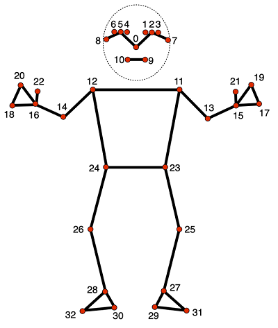
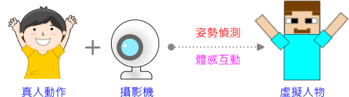
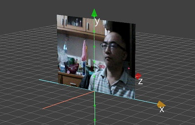
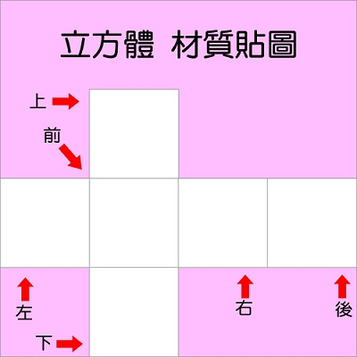
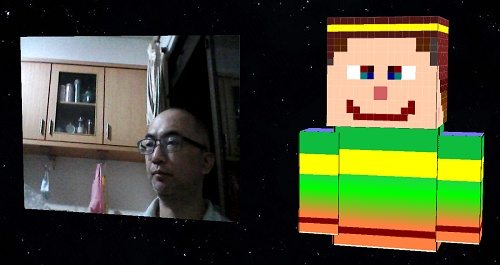
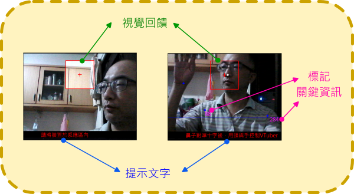
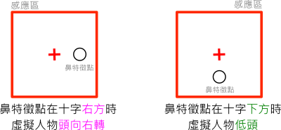
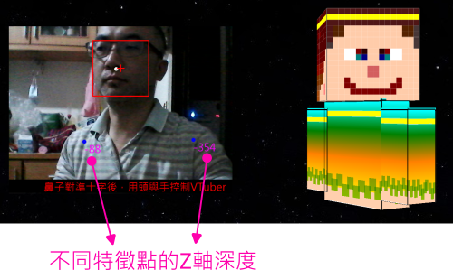
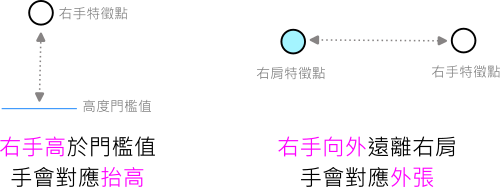

---
hide:
  - navigation
---

# 📚專題閱讀：姿勢偵測與簡易Vtuber

----------------------------
##  📕 引言 
----------------------------

什麼是Vtuber？

<br/>

: <iframe width="560" height="315" src="https://www.youtube.com/embed/Kxgve6-gQFI?start=0&amp;end=130" frameborder="0" allow="accelerometer; autoplay; encrypted-media; gyroscope; picture-in-picture" allowfullscreen></iframe>

: <sup>(2分10秒, 資料來源:</sup>[^what_is_vtuber]<sup>)</sup>

[^what_is_vtuber]: VTuber靠粉絲抖內比上班族還賺？揭露虛擬YouTuber勞動的血汗面｜公視P# 新聞實驗室, by 公視P#新聞實驗室 , [youtube連結](https://youtu.be/Kxgve6-gQFI) 


<br/>

Vtuber就是「利用動態捕捉程式達成虛擬形象與真的人結合的角色」

下圖是具有手勢追蹤功能的 vtuber的圖例。


: 

: <sup>(資料來源:</sup>[^immanuelle_wave]<sup>)</sup>

[^immanuelle_wave]: 維基百科 VTuber , https://zh.wikipedia.org/zh-tw/VTuber


<br/>


??? info "建議先備課程"

     在學習本專題前，建議先體驗過以下課程 

     :fontawesome-solid-long-arrow-alt-right: <a href="../hand_detection_motion_control/" target="_blank">「手部偵測與體感互動」</a> 
     
     :fontawesome-solid-long-arrow-alt-right: <a href="../explore3d/" target="_blank">「探索3D空間」</a>
     
     在學習概念銜接上會較為平順。

<br/><br/><br/> 


----------------------------
##  📗 認識姿勢偵測(1)
----------------------------


: 

: <sup>(資料來源:</sup>[^pose_landmarks]<sup>)</sup>

[^pose_landmarks]: mediapipe , https://developers.google.com/mediapipe/solutions/vision/pose_landmarker

<br/>

|    索引值         |  特徵說明       |  英文             |
|  :-----------:   | :-----------:   |  :-----------:   |
|0 | 鼻子     |      nose      | 
|1 | 左眼(內) | left eye (inner)|
|2 | 左眼     | left eye        |
|3 | 左眼(外) |  left eye (outer) |
|4 | 右眼(內) | right eye (inner) |
|5 | 右眼 | right eye |
|6 | 右眼(外) | right eye (outer) |
|7 | 左耳 | left ear |
|8 | 右耳 | right ear|
|9 | 嘴巴(左) | mouth (left) |
|10 | 嘴巴(右) | mouth (right) |
|11 | 左肩 | left shoulder |
|12 | 右肩 | right shoulder|
|13 | 左手肘 |  left elbow |
|14 | 右手肘 | right elbow |
|15 | 左手腕 | left wrist  |
|16 | 右手腕 | right wrist |
|17 | 左小指 | left pinky |
|18 | 右小指 | right pinky |
|19 | 左食指 | left index |
|20 | 右食指 | right index |
|21 | 左拇指 | left thumb |
|22 | 右拇指 | right thumb |
|23 | 左髖關節 | left hip |
|24 | 右髖關節 | right hip |
|25 | 左膝蓋 | left knee |
|26 | 右膝蓋 | right knee |
|27 | 左踝關節 | left ankle |
|28 | 右踝關節 | right ankle |
|29 | 左腳後跟 | left heel |
|30 | 右腳後跟 | right heel |
|31 | 左二腳趾 | left foot index |
|32 | 右二腳趾 | right foot index |

<br/>

<br/>

???+ example "範例程式 姿勢偵測 - - - - - - - (姿勢偵測 1/1)"

    === "💻程式碼"

        ```python
        from 視覺模組 import *

        攝影機 = 設置影像擷取(id=0,後端='DSHOW')
        偵測器 = 設置PoseDetection()

        while True :
            陣列 = 擷取影像(攝影機)
            陣列 = 左右翻轉(陣列)
            結果 = 偵測器.process(陣列)
            if 結果:
                標記Pose(陣列, 結果)
            顯示影像(陣列)
        ```


<br/><br/><br/> 

----------------------------
##  📒 構思
----------------------------

 
: 

<br/><br/><br/> 


----------------------------
##  📘 程式探究(8)


###  ***程式架構***

----------------------------

??? example "程式架構 - - - - - - - (程式閱讀 1/8)"

    === "💻程式碼"

        ```python
        from 模擬3D模組 import *
        from 視覺模組 import *

        ##### 初始設定 
            # 攝影機影像
            # 虛擬人物 頭 身體 手
            # 感應區大家
            # 背景

        ##### 函式區
            # 設置頭角度 
            # 設置身體角度
            # 設置手角度
            # 畫感應區
            # 繪製介面
            # 標記偵測位置
            
        ###### 主要迴圈
        def 當更新時(dt):
            pass
            # 影像擷取
            # 偵測動作
            # 虛擬人物
            # 呼叫函式

        模擬主迴圈()

        ```


<br>


----------------------------

###  *** 攝影機與3D貼圖 ***

----------------------------

: 


<br/>

??? example "範例程式 攝影機與3D貼圖 - - - - - - - (程式閱讀 2/8)"

    === "💻程式碼"

        ```python
        from 模擬3D模組 import *
        from 視覺模組 import *

        ##### 初始設定 
        舞台 = 模擬3D引擎(1600,900)
        攝影機 = 設置影像擷取(後端='DSHOW')
        偵測器 = 設置PoseDetection()

        # 攝影機影像
        螢幕 = 新增方形平面()
        螢幕.縮放 = [6.4, 4.8, 1]

        ##### 函式區

        ##### 主要迴圈

        def 當更新時(dt):
            陣列 = 擷取影像(攝影機)
            陣列 = 左右翻轉(陣列)  
            螢幕.多維陣列貼圖 = 陣列

        模擬主迴圈()
        ```

<br>


----------------------------


###  *** 虛擬人物設計 ***

----------------------------


: 

: 


<br/>


??? example "範例程式 虛擬人物與背景 - - - - - - - (程式閱讀 3/8)"

    === "💻程式碼"

        ```python
        # 需匯入頭6面.png (3D便利貼:材質->匯入)
        # 需匯入自訂6面.png (3D便利貼:材質->匯入)
        # 需匯入星空.jpg (3D便利貼:材質->匯入)
                
        from 模擬3D模組 import *
        from 視覺模組 import *

        ##### 初始設定 
        舞台 = 模擬3D引擎(1600,900)
        攝影機 = 設置影像擷取(後端='DSHOW')
        偵測器 = 設置PoseDetection()

        # 攝影機影像
        螢幕 = 新增方形平面()
        螢幕.縮放 = [6.4, 4.8, 1]
        螢幕.位置x = -3.5

        # 虛擬人物 頭 身體 手
        頭 = 新增6面貼圖方塊()
        頭.材質貼圖 = '頭6面.png'
        頭.位置 = [3.5,1.5,0]
        頭.縮放 = 2.5

        身體 = 新增6面貼圖方塊()
        身體.位置 = [3.5,-1.2,0]
        身體.縮放 = [2.5, 3, 1]
        身體.材質貼圖 = '自訂6面.png'

        左肩 = 新增物體() # 不顯示
        左肩.親代 = 身體
        左肩.全域位置 = [1.9,-0.2,0]

        左手 = 新增6面貼圖方塊()
        左手.中心點偏移 = [0,0.4,0]
        左手.縮放 = [1, 2.5, 1]
        左手.材質貼圖 = '自訂6面.png'

        右肩 = 新增物體() # 不顯示
        右肩.親代 = 身體
        右肩.全域位置 = [5.2,-0.2,0]

        右手 = 新增6面貼圖方塊()
        右手.中心點偏移 = [0,0.4,0]
        右手.縮放 = [1, 2.5, 1]
        右手.材質貼圖 = '自訂6面.png'

        上次身體轉向 = 0  # 靜止時穩定身體

        # 感應區以(320,120)為中心 正方形邊長80
        感應區x0 = 320 - 80  
        感應區y0 = 120 - 80 
        感應區x1 = 320 + 80
        感應區y1 = 120 + 80
        感應區中心x = (感應區x0 + 感應區x1) // 2
        感應區中心y = (感應區y0 + 感應區y1) // 2

        # 背景
        背景 = 新增內面貼圖球體()
        背景.材質貼圖 = '星空.jpg'
        背景.縮放 = 100

        ##### 函式區

        def 同步手與肩():
            左手.位置 = 左肩.全域位置
            右手.位置 = 右肩.全域位置
            左手.旋轉y = 身體.旋轉y
            右手.旋轉y = 身體.旋轉y
            
        ###### 主要迴圈

        def 當更新時(dt):
            背景.旋轉y += 0.1
            背景.旋轉x += 0.1
            同步手與肩() 
            陣列 = 擷取影像(攝影機)
            陣列 = 左右翻轉(陣列)  
            螢幕.多維陣列貼圖 = 陣列

        模擬主迴圈()
        ```
<br/>


----------------------------


###  *** 視覺提示與回饋 ***

----------------------------


: 
<br/>

??? example "範例程式 視覺提示與回饋 - - - - - - - (程式閱讀 4/8)"

    === "💻程式碼"

        ```python
        # 需匯入頭6面.png (3D便利貼:材質->匯入)
        # 需匯入自訂6面.png (3D便利貼:材質->匯入)
        # 需匯入星空.jpg (3D便利貼:材質->匯入)
                
        from 模擬3D模組 import *
        from 視覺模組 import *

        ##### 初始設定 
        舞台 = 模擬3D引擎(1600,900)
        攝影機 = 設置影像擷取(後端='DSHOW')
        偵測器 = 設置PoseDetection()

        # 攝影機影像
        螢幕 = 新增方形平面()
        螢幕.縮放 = [6.4, 4.8, 1]
        螢幕.位置x = -3.5

        # 虛擬人物 頭 身體 手
        頭 = 新增6面貼圖方塊()
        頭.材質貼圖 = '頭6面.png'
        頭.位置 = [3.5,1.5,0]
        頭.縮放 = 2.5

        身體 = 新增6面貼圖方塊()
        身體.位置 = [3.5,-1.2,0]
        身體.縮放 = [2.5, 3, 1]
        身體.材質貼圖 = '自訂6面.png'

        左肩 = 新增物體() # 不顯示
        左肩.親代 = 身體
        左肩.全域位置 = [1.9,-0.2,0]

        左手 = 新增6面貼圖方塊()
        左手.中心點偏移 = [0,0.4,0]
        左手.縮放 = [1, 2.5, 1]
        左手.材質貼圖 = '自訂6面.png'

        右肩 = 新增物體() # 不顯示
        右肩.親代 = 身體
        右肩.全域位置 = [5.2,-0.2,0]

        右手 = 新增6面貼圖方塊()
        右手.中心點偏移 = [0,0.4,0]
        右手.縮放 = [1, 2.5, 1]
        右手.材質貼圖 = '自訂6面.png'

        上次身體轉向 = 0  # 靜止時穩定身體

        # 感應區以(320,120)為中心 正方形邊長80
        感應區x0 = 320 - 80  
        感應區y0 = 120 - 80 
        感應區x1 = 320 + 80
        感應區y1 = 120 + 80
        感應區中心x = (感應區x0 + 感應區x1) // 2
        感應區中心y = (感應區y0 + 感應區y1) // 2

        # 背景
        背景 = 新增內面貼圖球體()
        背景.材質貼圖 = '星空.jpg'
        背景.縮放 = 100

        ##### 函式區
        def 鼻子在感應區嗎(特徵清單):
            鼻子特徵點x, 鼻子特徵點y = 特徵清單[0]
            if 感應區x0 < 鼻子特徵點x < 感應區x1 and \
                    感應區y0 < 鼻子特徵點y < 感應區y1 :
                return True
            else:
                return False
                
        def 同步手與肩():
            左手.位置 = 左肩.全域位置
            右手.位置 = 右肩.全域位置
            左手.旋轉y = 身體.旋轉y
            右手.旋轉y = 身體.旋轉y

        def 畫感應區(陣列):
            畫矩形(image=陣列,
                pt1=(感應區x0,感應區y0),
                pt2=(感應區x1,感應區y1),
                thickness=2)
            畫直線(image=陣列,
                pt1=(感應區中心x-10,感應區中心y),
                pt2=(感應區中心x+10,感應區中心y),
                thickness=2)
            畫直線(image=陣列,
                pt1=(感應區中心x,感應區中心y-10),
                pt2=(感應區中心x,感應區中心y+10),
                thickness=2)

        def 繪製介面(陣列, 特徵清單):
            陣列[440:, :] = 0
            if not 鼻子在感應區嗎(特徵清單):
                文字 = '請將臉置於感應區內'
                陣列[感應區y0:感應區y1, 感應區x0:感應區x1] = \
                    調整亮度(陣列[感應區y0:感應區y1, 感應區x0:感應區x1], 80)
            else:
                文字 = '鼻子對準十字後，用頭與手控制VTuber'
                
            畫出文字(image=陣列,
                    text=文字,
                    pos=(100, 440))

        def 標記偵測位置(陣列, 特徵清單):
            鼻關鍵點 = 特徵清單[0]
            
            
            畫圓形(image=陣列,
                center=鼻關鍵點,
                radius=3,
                color=(255,255,255),
                thickness=3)
            
        ###### 主要迴圈

        def 當更新時(dt):
            背景.旋轉y += 0.1
            背景.旋轉x += 0.1
            同步手與肩()    
            陣列 = 擷取影像(攝影機)
            陣列 = 左右翻轉(陣列)
            結果 = 偵測器.process(陣列)
                
            if 結果:
                特徵清單 = 取出PoseLandmarks(結果)
                if 鼻子在感應區嗎(特徵清單):
                    標記偵測位置(陣列, 特徵清單)
                繪製介面(陣列, 特徵清單)       
            畫感應區(陣列)
            螢幕.多維陣列貼圖 = 陣列

        模擬主迴圈()
        
        ```

<br/>
<br/>


----------------------------

###  *** 頭部互動 ***

----------------------------


: 
<br/>


??? example "範例程式 頭部互動 - - - - - - - (程式閱讀 5/8)"

    === "💻程式碼"

        ```python
        # 需匯入頭6面.png (3D便利貼:材質->匯入)
        # 需匯入自訂6面.png (3D便利貼:材質->匯入)
        # 需匯入星空.jpg (3D便利貼:材質->匯入)
                
        from 模擬3D模組 import *
        from 視覺模組 import *

        ##### 初始設定 
        舞台 = 模擬3D引擎(1600,900)
        攝影機 = 設置影像擷取(後端='DSHOW')
        偵測器 = 設置PoseDetection()

        # 攝影機影像
        螢幕 = 新增方形平面()
        螢幕.縮放 = [6.4, 4.8, 1]
        螢幕.位置x = -3.5

        # 虛擬人物 頭 身體 手
        頭 = 新增6面貼圖方塊()
        頭.材質貼圖 = '頭6面.png'
        頭.位置 = [3.5,1.5,0]
        頭.縮放 = 2.5

        身體 = 新增6面貼圖方塊()
        身體.位置 = [3.5,-1.2,0]
        身體.縮放 = [2.5, 3, 1]
        身體.材質貼圖 = '自訂6面.png'

        左肩 = 新增物體() # 不顯示
        左肩.親代 = 身體
        左肩.全域位置 = [1.9,-0.2,0]

        左手 = 新增6面貼圖方塊()
        左手.中心點偏移 = [0,0.4,0]
        左手.縮放 = [1, 2.5, 1]
        左手.材質貼圖 = '自訂6面.png'

        右肩 = 新增物體() # 不顯示
        右肩.親代 = 身體
        右肩.全域位置 = [5.2,-0.2,0]

        右手 = 新增6面貼圖方塊()
        右手.中心點偏移 = [0,0.4,0]
        右手.縮放 = [1, 2.5, 1]
        右手.材質貼圖 = '自訂6面.png'

        上次身體轉向 = 0  # 靜止時穩定身體

        # 感應區以(320,120)為中心 正方形邊長80
        感應區x0 = 320 - 80  
        感應區y0 = 120 - 80 
        感應區x1 = 320 + 80
        感應區y1 = 120 + 80
        感應區中心x = (感應區x0 + 感應區x1) // 2
        感應區中心y = (感應區y0 + 感應區y1) // 2

        # 背景
        背景 = 新增內面貼圖球體()
        背景.材質貼圖 = '星空.jpg'
        背景.縮放 = 100

        ##### 函式區
        def 鼻子在感應區嗎(特徵清單):
            鼻子特徵點x, 鼻子特徵點y = 特徵清單[0]
            if 感應區x0 < 鼻子特徵點x < 感應區x1 and \
                    感應區y0 < 鼻子特徵點y < 感應區y1 :
                return True
            else:
                return False

        def 設置頭角度(特徵清單):
            if not 鼻子在感應區嗎(特徵清單):
                頭.旋轉y = 0
                頭.旋轉x = 0
                return
            
            鼻子特徵點x, 鼻子特徵點y = 特徵清單[0]    
            # 頭旋轉y 左到右範圍: 90 ~ -90
            if 鼻子特徵點x > 感應區中心x: # 向右
                delta = -(鼻子特徵點x - 感應區中心x)
                delta = delta if delta > -90 else -90
                頭.旋轉y = delta
            else: # 向左
                delta = 感應區中心x - 鼻子特徵點x
                delta = delta if delta < 90 else 90
                頭.旋轉y = delta
                
            # 頭旋轉y 下到上範圍: -90 ~ 90
            # y座標越往下越大
            if 鼻子特徵點y > 感應區中心y: # 向下
                delta = -(鼻子特徵點y - 感應區中心y)
                delta = delta if delta > -60 else -60
                頭.旋轉x = delta 
            else: # 向上
                delta = (感應區中心y - 鼻子特徵點y) * 1.5
                delta = delta if delta < 60 else 60
                頭.旋轉x = delta 
                
        def 同步手與肩():
            左手.位置 = 左肩.全域位置
            右手.位置 = 右肩.全域位置
            左手.旋轉y = 身體.旋轉y
            右手.旋轉y = 身體.旋轉y

        def 畫感應區(陣列):
            畫矩形(image=陣列,
                pt1=(感應區x0,感應區y0),
                pt2=(感應區x1,感應區y1),
                thickness=2)
            畫直線(image=陣列,
                pt1=(感應區中心x-10,感應區中心y),
                pt2=(感應區中心x+10,感應區中心y),
                thickness=2)
            畫直線(image=陣列,
                pt1=(感應區中心x,感應區中心y-10),
                pt2=(感應區中心x,感應區中心y+10),
                thickness=2)

        def 繪製介面(陣列, 特徵清單):
            陣列[440:, :] = 0
            if not 鼻子在感應區嗎(特徵清單):
                文字 = '請將臉置於感應區內'
                陣列[感應區y0:感應區y1, 感應區x0:感應區x1] = \
                    調整亮度(陣列[感應區y0:感應區y1, 感應區x0:感應區x1], 80)
            else:
                文字 = '鼻子對準十字後，用頭與手控制VTuber'
                
            畫出文字(image=陣列,
                    text=文字,
                    pos=(100, 440))

        def 標記偵測位置(陣列, 特徵清單):
            鼻關鍵點 = 特徵清單[0]
            
            
            畫圓形(image=陣列,
                center=鼻關鍵點,
                radius=3,
                color=(255,255,255),
                thickness=3)
            
        ###### 主要迴圈

        def 當更新時(dt):
            背景.旋轉y += 0.1
            背景.旋轉x += 0.1
            同步手與肩()    
            陣列 = 擷取影像(攝影機)
            陣列 = 左右翻轉(陣列)
            結果 = 偵測器.process(陣列)
                
            if 結果:
                特徵清單 = 取出PoseLandmarks(結果)
                if 鼻子在感應區嗎(特徵清單):
                    標記偵測位置(陣列, 特徵清單)
                設置頭角度(特徵清單)
                繪製介面(陣列, 特徵清單)       
            畫感應區(陣列)
            螢幕.多維陣列貼圖 = 陣列

        模擬主迴圈()
        ```

<br/><br/>

----------------------------

###  *** 身體互動 ***

----------------------------


: 
<br/>

??? example "範例程式 身體互動 - - - - - - - (程式閱讀 6/8)"

    === "💻程式碼"

        ```python
        # 需匯入頭6面.png (3D便利貼:材質->匯入)
        # 需匯入自訂6面.png (3D便利貼:材質->匯入)
        # 需匯入星空.jpg (3D便利貼:材質->匯入)
                
        from 模擬3D模組 import *
        from 視覺模組 import *

        ##### 初始設定 
        舞台 = 模擬3D引擎(1600,900)
        攝影機 = 設置影像擷取(後端='DSHOW')
        偵測器 = 設置PoseDetection()

        # 攝影機影像
        螢幕 = 新增方形平面()
        螢幕.縮放 = [6.4, 4.8, 1]
        螢幕.位置x = -3.5

        # 虛擬人物 頭 身體 手
        頭 = 新增6面貼圖方塊()
        頭.材質貼圖 = '頭6面.png'
        頭.位置 = [3.5,1.5,0]
        頭.縮放 = 2.5

        身體 = 新增6面貼圖方塊()
        身體.位置 = [3.5,-1.2,0]
        身體.縮放 = [2.5, 3, 1]
        身體.材質貼圖 = '自訂6面.png'

        左肩 = 新增物體() # 不顯示
        左肩.親代 = 身體
        左肩.全域位置 = [1.9,-0.2,0]

        左手 = 新增6面貼圖方塊()
        左手.中心點偏移 = [0,0.4,0]
        左手.縮放 = [1, 2.5, 1]
        左手.材質貼圖 = '自訂6面.png'

        右肩 = 新增物體() # 不顯示
        右肩.親代 = 身體
        右肩.全域位置 = [5.2,-0.2,0]

        右手 = 新增6面貼圖方塊()
        右手.中心點偏移 = [0,0.4,0]
        右手.縮放 = [1, 2.5, 1]
        右手.材質貼圖 = '自訂6面.png'

        上次身體轉向 = 0  # 靜止時穩定身體

        # 感應區以(320,120)為中心 正方形邊長80
        感應區x0 = 320 - 80  
        感應區y0 = 120 - 80 
        感應區x1 = 320 + 80
        感應區y1 = 120 + 80
        感應區中心x = (感應區x0 + 感應區x1) // 2
        感應區中心y = (感應區y0 + 感應區y1) // 2

        # 背景
        背景 = 新增內面貼圖球體()
        背景.材質貼圖 = '星空.jpg'
        背景.縮放 = 100

        ##### 函式區
        def 鼻子在感應區嗎(特徵清單):
            鼻子特徵點x, 鼻子特徵點y = 特徵清單[0]
            if 感應區x0 < 鼻子特徵點x < 感應區x1 and \
                    感應區y0 < 鼻子特徵點y < 感應區y1 :
                return True
            else:
                return False
                
        def 設置身體角度(特徵清單):
            if not 鼻子在感應區嗎(特徵清單):
                身體.旋轉y = 0
                return
            
            global 上次身體轉向
            # 身體 旋轉y範圍 left 90 ~ right -90
            身體轉向 = 0.2*(特徵清單.z(索引=12) - 特徵清單.z(索引=11))
            身體轉向 = 身體轉向 if 身體轉向 < 90 else 90
            身體轉向 = 身體轉向 if 身體轉向 > -90 else -90
            #防抖動 保持穩定
            if abs(身體轉向 - 上次身體轉向) > 10:
                身體.旋轉y = 身體轉向
                上次身體轉向 = 身體轉向

        def 同步手與肩():
            左手.位置 = 左肩.全域位置
            右手.位置 = 右肩.全域位置
            左手.旋轉y = 身體.旋轉y
            右手.旋轉y = 身體.旋轉y

        def 畫感應區(陣列):
            畫矩形(image=陣列,
                pt1=(感應區x0,感應區y0),
                pt2=(感應區x1,感應區y1),
                thickness=2)
            畫直線(image=陣列,
                pt1=(感應區中心x-10,感應區中心y),
                pt2=(感應區中心x+10,感應區中心y),
                thickness=2)
            畫直線(image=陣列,
                pt1=(感應區中心x,感應區中心y-10),
                pt2=(感應區中心x,感應區中心y+10),
                thickness=2)

        def 繪製介面(陣列, 特徵清單):
            陣列[440:, :] = 0
            if not 鼻子在感應區嗎(特徵清單):
                文字 = '請將臉置於感應區內'
                陣列[感應區y0:感應區y1, 感應區x0:感應區x1] = \
                    調整亮度(陣列[感應區y0:感應區y1, 感應區x0:感應區x1], 80)
            else:
                文字 = '鼻子對準十字後，用頭與手控制VTuber'
                
            畫出文字(image=陣列,
                    text=文字,
                    pos=(100, 440))

        def 標記偵測位置(陣列, 特徵清單):
            鼻關鍵點 = 特徵清單[0]
            左肩關鍵點 = 特徵清單[12]
            左手關鍵點 = 特徵清單[16]
            右肩關鍵點 = 特徵清單[11]
            右手關鍵點 = 特徵清單[15]
            左肩深度 = 特徵清單.z(索引=12)
            右肩深度 = 特徵清單.z(索引=11) 
            
            畫圓形(image=陣列,
                center=鼻關鍵點,
                radius=3,
                color=(255,255,255),
                thickness=3)
            畫圓形(image=陣列,
                center=左肩關鍵點,
                radius=3,
                color=(255,0,0),
                thickness=3)
            畫圓形(image=陣列,
                center=右肩關鍵點,
                radius=3,
                color=(255,0,0),
                thickness=3)
            畫出文字(image=陣列,
                text=str(左肩深度),
                pos=左肩關鍵點,
                color=(255,0,255))
            畫出文字(image=陣列,
                text=str(右肩深度),
                pos=右肩關鍵點,
                color=(255,0,255))
            
        ###### 主要迴圈

        def 當更新時(dt):
            背景.旋轉y += 0.1
            背景.旋轉x += 0.1
            同步手與肩()    
            陣列 = 擷取影像(攝影機)
            陣列 = 左右翻轉(陣列)
            結果 = 偵測器.process(陣列)
                
            if 結果:
                特徵清單 = 取出PoseLandmarks(結果)
                if 鼻子在感應區嗎(特徵清單):
                    標記偵測位置(陣列, 特徵清單)
                設置身體角度(特徵清單)
                繪製介面(陣列, 特徵清單)       
            畫感應區(陣列)
            螢幕.多維陣列貼圖 = 陣列

        模擬主迴圈()
        ```

<br/>
<br/>

----------------------------

###  *** 手部互動 ***

----------------------------


: 
<br/>


??? example "範例程式 手部互動 - - - - - - - (程式閱讀 7/8)"

    === "💻程式碼"

        ```python
        # 需匯入頭6面.png (3D便利貼:材質->匯入)
        # 需匯入自訂6面.png (3D便利貼:材質->匯入)
        # 需匯入星空.jpg (3D便利貼:材質->匯入)
                
        from 模擬3D模組 import *
        from 視覺模組 import *

        ##### 初始設定 
        舞台 = 模擬3D引擎(1600,900)
        攝影機 = 設置影像擷取(後端='DSHOW')
        偵測器 = 設置PoseDetection()

        # 攝影機影像
        螢幕 = 新增方形平面()
        螢幕.縮放 = [6.4, 4.8, 1]
        螢幕.位置x = -3.5

        # 虛擬人物 頭 身體 手
        頭 = 新增6面貼圖方塊()
        頭.材質貼圖 = '頭6面.png'
        頭.位置 = [3.5,1.5,0]
        頭.縮放 = 2.5

        身體 = 新增6面貼圖方塊()
        身體.位置 = [3.5,-1.2,0]
        身體.縮放 = [2.5, 3, 1]
        身體.材質貼圖 = '自訂6面.png'

        左肩 = 新增物體() # 不顯示
        左肩.親代 = 身體
        左肩.全域位置 = [1.9,-0.2,0]

        左手 = 新增6面貼圖方塊()
        左手.中心點偏移 = [0,0.4,0]
        左手.縮放 = [1, 2.5, 1]
        左手.材質貼圖 = '自訂6面.png'

        右肩 = 新增物體() # 不顯示
        右肩.親代 = 身體
        右肩.全域位置 = [5.2,-0.2,0]

        右手 = 新增6面貼圖方塊()
        右手.中心點偏移 = [0,0.4,0]
        右手.縮放 = [1, 2.5, 1]
        右手.材質貼圖 = '自訂6面.png'

        上次身體轉向 = 0  # 靜止時穩定身體

        # 感應區以(320,120)為中心 正方形邊長80
        感應區x0 = 320 - 80  
        感應區y0 = 120 - 80 
        感應區x1 = 320 + 80
        感應區y1 = 120 + 80
        感應區中心x = (感應區x0 + 感應區x1) // 2
        感應區中心y = (感應區y0 + 感應區y1) // 2

        # 背景
        背景 = 新增內面貼圖球體()
        背景.材質貼圖 = '星空.jpg'
        背景.縮放 = 100

        ##### 函式區
        def 鼻子在感應區嗎(特徵清單):
            鼻子特徵點x, 鼻子特徵點y = 特徵清單[0]
            if 感應區x0 < 鼻子特徵點x < 感應區x1 and \
                    感應區y0 < 鼻子特徵點y < 感應區y1 :
                return True
            else:
                return False

        def 設置手角度(特徵清單):
            if not 鼻子在感應區嗎(特徵清單):
                左手.旋轉x = 0
                左手.旋轉z = 0
                右手.旋轉x = 0
                右手.旋轉z = 0
                return
            
            # 左手抬起 高度門檻值
            左手特徵點y = 特徵清單.y(索引=16)    
            if 左手特徵點y < 360 :
                左手.旋轉x = (360 - 左手特徵點y)/2
            else:
                左手.旋轉x = 0
            
            # 左肩特徵到左手特徵距離 決定旋轉z
            左手特徵點x = 特徵清單.x(索引=16)  
            左肩特徵點x = 特徵清單.x(索引=12)
            if 左手特徵點x < 左肩特徵點x and 左手特徵點y < 360 :
                delta = (左肩特徵點x - 左手特徵點x)/2
                delta = delta if delta < 90 else 90
                左手.旋轉z = delta 
            else:
                左手.旋轉z = 0
                
            # 右手抬起 高度門檻值
            右手特徵點y = 特徵清單.y(索引=15)    
            if 右手特徵點y < 360 :
                右手.旋轉x = (360 - 右手特徵點y)/2
            else:
                右手.旋轉x = 0
            
            # 右肩特徵到右手特徵距離 決定旋轉z
            右手特徵點x = 特徵清單.x(索引=15)  
            右肩特徵點x = 特徵清單.x(索引=11)
            if 右手特徵點x > 右肩特徵點x and 右手特徵點y < 360 :
                delta = -(右手特徵點x - 右肩特徵點x)/2
                delta = delta if delta > -90 else -90
                print(delta)
                右手.旋轉z = delta 
            else:
                右手.旋轉z = 0
                
        def 同步手與肩():
            左手.位置 = 左肩.全域位置
            右手.位置 = 右肩.全域位置
            左手.旋轉y = 身體.旋轉y
            右手.旋轉y = 身體.旋轉y

        def 畫感應區(陣列):
            畫矩形(image=陣列,
                pt1=(感應區x0,感應區y0),
                pt2=(感應區x1,感應區y1),
                thickness=2)
            畫直線(image=陣列,
                pt1=(感應區中心x-10,感應區中心y),
                pt2=(感應區中心x+10,感應區中心y),
                thickness=2)
            畫直線(image=陣列,
                pt1=(感應區中心x,感應區中心y-10),
                pt2=(感應區中心x,感應區中心y+10),
                thickness=2)

        def 繪製介面(陣列, 特徵清單):
            陣列[440:, :] = 0
            if not 鼻子在感應區嗎(特徵清單):
                文字 = '請將臉置於感應區內'
                陣列[感應區y0:感應區y1, 感應區x0:感應區x1] = \
                    調整亮度(陣列[感應區y0:感應區y1, 感應區x0:感應區x1], 80)
            else:
                文字 = '鼻子對準十字後，用頭與手控制VTuber'
                
            畫出文字(image=陣列,
                    text=文字,
                    pos=(100, 440))

        def 標記偵測位置(陣列, 特徵清單):
            鼻關鍵點 = 特徵清單[0]
            左肩關鍵點 = 特徵清單[12]
            左手關鍵點 = 特徵清單[16]
            右肩關鍵點 = 特徵清單[11]
            右手關鍵點 = 特徵清單[15]
            左肩深度 = 特徵清單.z(索引=12)
            右肩深度 = 特徵清單.z(索引=11) 
            
            畫圓形(image=陣列,
                center=鼻關鍵點,
                radius=3,
                color=(255,255,255),
                thickness=3)
            畫圓形(image=陣列,
                center=左肩關鍵點,
                radius=3,
                color=(255,0,0),
                thickness=3)
            畫圓形(image=陣列,
                center=右肩關鍵點,
                radius=3,
                color=(255,0,0),
                thickness=3)
            畫圓形(image=陣列,
                center=左手關鍵點,
                radius=3,
                color=(255,0,0),
                thickness=3)
            畫圓形(image=陣列,
                center=右手關鍵點,
                radius=3,
                color=(255,0,0),
                thickness=3)
            畫直線(image=陣列,
                pt1=(0,360),
                pt2=(640,360),
                color=(255,0,0),
                thickness=1)
            
        ###### 主要迴圈

        def 當更新時(dt):
            背景.旋轉y += 0.1
            背景.旋轉x += 0.1
            同步手與肩()    
            陣列 = 擷取影像(攝影機)
            陣列 = 左右翻轉(陣列)
            結果 = 偵測器.process(陣列)
                
            if 結果:
                特徵清單 = 取出PoseLandmarks(結果)
                if 鼻子在感應區嗎(特徵清單):
                    標記偵測位置(陣列, 特徵清單)
                
                設置手角度(特徵清單)
                繪製介面(陣列, 特徵清單)       
            畫感應區(陣列)
            螢幕.多維陣列貼圖 = 陣列

        模擬主迴圈()
        ```

<br/>
<br/>

----------------------------

###  *** 簡易Vtuber ***

----------------------------


??? example "範例程式 簡易Vtuber - - - - - - - (程式閱讀 8/8)"

    === "💻程式碼"

        ```python
        # 需匯入頭6面.png (3D便利貼:材質->匯入)
        # 需匯入自訂6面.png (3D便利貼:材質->匯入)
        # 需匯入星空.jpg (3D便利貼:材質->匯入)

        from 模擬3D模組 import *
        from 視覺模組 import *

        ##### 初始設定 
        舞台 = 模擬3D引擎(1600,900)
        攝影機 = 設置影像擷取(後端='DSHOW')
        偵測器 = 設置PoseDetection()

        # 攝影機影像
        螢幕 = 新增方形平面()
        螢幕.縮放 = [6.4, 4.8, 1]
        螢幕.位置x = -3.5

        # 虛擬人物 頭 身體 手
        頭 = 新增6面貼圖方塊()
        頭.材質貼圖 = '頭6面.png'
        頭.位置 = [3.5,1.5,0]
        頭.縮放 = 2.5

        身體 = 新增6面貼圖方塊()
        身體.位置 = [3.5,-1.2,0]
        身體.縮放 = [2.5, 3, 1]
        身體.材質貼圖 = '自訂6面.png'

        左肩 = 新增物體() # 不顯示
        左肩.親代 = 身體
        左肩.全域位置 = [1.9,-0.2,0]

        左手 = 新增6面貼圖方塊()
        左手.中心點偏移 = [0,0.4,0]
        左手.縮放 = [1, 2.5, 1]
        左手.材質貼圖 = '自訂6面.png'

        右肩 = 新增物體() # 不顯示
        右肩.親代 = 身體
        右肩.全域位置 = [5.2,-0.2,0]

        右手 = 新增6面貼圖方塊()
        右手.中心點偏移 = [0,0.4,0]
        右手.縮放 = [1, 2.5, 1]
        右手.材質貼圖 = '自訂6面.png'

        上次身體轉向 = 0  # 靜止時穩定身體

        # 感應區以(320,120)為中心 正方形邊長80
        感應區x0 = 320 - 80  
        感應區y0 = 120 - 80 
        感應區x1 = 320 + 80
        感應區y1 = 120 + 80
        感應區中心x = (感應區x0 + 感應區x1) // 2
        感應區中心y = (感應區y0 + 感應區y1) // 2

        # 背景
        背景 = 新增內面貼圖球體()
        背景.材質貼圖 = '星空.jpg'
        背景.縮放 = 100

        ##### 函式區
        def 鼻子在感應區嗎(特徵清單):
            鼻子特徵點x, 鼻子特徵點y = 特徵清單[0]
            if 感應區x0 < 鼻子特徵點x < 感應區x1 and \
                      感應區y0 < 鼻子特徵點y < 感應區y1 :
                return True
            else:
                return False

        def 設置頭角度(特徵清單):
            if not 鼻子在感應區嗎(特徵清單):
                頭.旋轉y = 0
                頭.旋轉x = 0
                return
            
            鼻子特徵點x, 鼻子特徵點y = 特徵清單[0]    
            # 頭旋轉y 左到右範圍: 90 ~ -90
            if 鼻子特徵點x > 感應區中心x: # 向右
                delta = -(鼻子特徵點x - 感應區中心x)
                delta = delta if delta > -90 else -90
                頭.旋轉y = delta
            else: # 向左
                delta = 感應區中心x - 鼻子特徵點x
                delta = delta if delta < 90 else 90
                頭.旋轉y = delta
                
            # 頭旋轉y 下到上範圍: -90 ~ 90
            # y座標越往下越大
            if 鼻子特徵點y > 感應區中心y: # 向下
                delta = -(鼻子特徵點y - 感應區中心y)
                delta = delta if delta > -60 else -60
                頭.旋轉x = delta 
            else: # 向上
                delta = (感應區中心y - 鼻子特徵點y) * 1.5
                delta = delta if delta < 60 else 60
                頭.旋轉x = delta 
                  
        def 設置身體角度(特徵清單):
            if not 鼻子在感應區嗎(特徵清單):
                身體.旋轉y = 0
                return
            
            global 上次身體轉向
            # 身體 旋轉y範圍 left 90 ~ right -90
            身體轉向 = 0.2*(特徵清單.z(索引=12) - 特徵清單.z(索引=11))
            身體轉向 = 身體轉向 if 身體轉向 < 90 else 90
            身體轉向 = 身體轉向 if 身體轉向 > -90 else -90
            #防抖動 保持穩定
            if abs(身體轉向 - 上次身體轉向) > 10:
                身體.旋轉y = 身體轉向
                上次身體轉向 = 身體轉向

        def 設置手角度(特徵清單):
            if not 鼻子在感應區嗎(特徵清單):
                左手.旋轉x = 0
                左手.旋轉z = 0
                右手.旋轉x = 0
                右手.旋轉z = 0
                return
            
            # 左手抬起 高度門檻值
            左手特徵點y = 特徵清單.y(索引=16)    
            if 左手特徵點y < 360 :
                左手.旋轉x = (360 - 左手特徵點y)/2
            else:
                左手.旋轉x = 0
            
            # 左肩特徵到左手特徵距離 決定旋轉z
            左手特徵點x = 特徵清單.x(索引=16)  
            左肩特徵點x = 特徵清單.x(索引=12)
            if 左手特徵點x < 左肩特徵點x and 左手特徵點y < 360 :
                delta = (左肩特徵點x - 左手特徵點x)/2
                delta = delta if delta < 90 else 90
                左手.旋轉z = delta 
            else:
                左手.旋轉z = 0
                
            # 右手抬起 高度門檻值
            右手特徵點y = 特徵清單.y(索引=15)    
            if 右手特徵點y < 360 :
                右手.旋轉x = (360 - 右手特徵點y)/2
            else:
                右手.旋轉x = 0
            
            # 右肩特徵到右手特徵距離 決定旋轉z
            右手特徵點x = 特徵清單.x(索引=15)  
            右肩特徵點x = 特徵清單.x(索引=11)
            if 右手特徵點x > 右肩特徵點x and 右手特徵點y < 360 :
                delta = -(右手特徵點x - 右肩特徵點x)/2
                delta = delta if delta > -90 else -90
                print(delta)
                右手.旋轉z = delta 
            else:
                右手.旋轉z = 0
                
        def 同步手與肩():
            左手.位置 = 左肩.全域位置
            右手.位置 = 右肩.全域位置
            左手.旋轉y = 身體.旋轉y
            右手.旋轉y = 身體.旋轉y

        def 畫感應區(陣列):
            畫矩形(image=陣列,
                pt1=(感應區x0,感應區y0),
                pt2=(感應區x1,感應區y1),
                thickness=2)
            畫直線(image=陣列,
                pt1=(感應區中心x-10,感應區中心y),
                pt2=(感應區中心x+10,感應區中心y),
                thickness=2)
            畫直線(image=陣列,
                pt1=(感應區中心x,感應區中心y-10),
                pt2=(感應區中心x,感應區中心y+10),
                thickness=2)

        def 繪製介面(陣列, 特徵清單):
            陣列[440:, :] = 0
            if not 鼻子在感應區嗎(特徵清單):
                文字 = '請將臉置於感應區內'
                陣列[感應區y0:感應區y1, 感應區x0:感應區x1] = \
                    調整亮度(陣列[感應區y0:感應區y1, 感應區x0:感應區x1], 80)
            else:
                文字 = '鼻子對準十字後，用頭與手控制VTuber'
                
            畫出文字(image=陣列,
                    text=文字,
                    pos=(100, 440))

        def 標記偵測位置(陣列, 特徵清單):
            鼻關鍵點 = 特徵清單[0]
            左肩關鍵點 = 特徵清單[12]
            左手關鍵點 = 特徵清單[16]
            右肩關鍵點 = 特徵清單[11]
            右手關鍵點 = 特徵清單[15]
            左肩深度 = 特徵清單.z(索引=12)
            右肩深度 = 特徵清單.z(索引=11) 
            
            畫圓形(image=陣列,
                center=鼻關鍵點,
                radius=3,
                color=(255,255,255),
                thickness=3)
            畫圓形(image=陣列,
                center=左肩關鍵點,
                radius=3,
                color=(255,0,0),
                thickness=3)
            畫圓形(image=陣列,
                center=右肩關鍵點,
                radius=3,
                color=(255,0,0),
                thickness=3)
            畫圓形(image=陣列,
                center=左手關鍵點,
                radius=3,
                color=(255,0,0),
                thickness=3)
            畫圓形(image=陣列,
                center=右手關鍵點,
                radius=3,
                color=(255,0,0),
                thickness=3)
            畫直線(image=陣列,
                pt1=(0,360),
                pt2=(640,360),
                color=(255,0,0),
                thickness=1)
            畫出文字(image=陣列,
                text=str(左肩深度),
                pos=左肩關鍵點,
                color=(255,0,255))
            畫出文字(image=陣列,
                text=str(右肩深度),
                pos=右肩關鍵點,
                color=(255,0,255))
            
        ###### 主要迴圈

        def 當更新時(dt):
            背景.旋轉y += 0.1
            背景.旋轉x += 0.1
            同步手與肩()    
            陣列 = 擷取影像(攝影機)
            陣列 = 左右翻轉(陣列)
            結果 = 偵測器.process(陣列)
                
            if 結果:
                特徵清單 = 取出PoseLandmarks(結果)
                if 鼻子在感應區嗎(特徵清單):
                    標記偵測位置(陣列, 特徵清單)
                設置頭角度(特徵清單)
                設置身體角度(特徵清單)
                設置手角度(特徵清單)
                繪製介面(陣列, 特徵清單)       
            畫感應區(陣列)
            螢幕.多維陣列貼圖 = 陣列

        模擬主迴圈()
        ```


<br/><br/><br/> 


----------------------------
##  📗 姿勢偵測應用
----------------------------

<br/>

長青中心 健康體感互動

<br/> 

: <iframe width="560" height="315" src="https://www.youtube.com/embed/py_3iG32_Is" frameborder="0" allow="accelerometer; autoplay; encrypted-media; gyroscope; picture-in-picture" allowfullscreen></iframe>

: <sup>(1分37秒, 資料來源:</sup>[^for_elder_citizen]<sup>)</sup>

[^for_elder_citizen]: 高市長青中心 推出AI加AR健康體感互動【客家新聞20220917】, by 客家新聞 Hakka News , [youtube連結](https://youtu.be/py_3iG32_Is) 

<br/>

台灣的運動科技輔助(拳擊)

<br/>

: <iframe width="560" height="315" src="https://www.youtube.com/embed/gu33VzAU8qo?start=236&amp;end=276" frameborder="0" allow="accelerometer; autoplay; encrypted-media; gyroscope; picture-in-picture" allowfullscreen></iframe>

: <sup>(40秒, 資料來源:</sup>[^sport_technology]<sup>)</sup>

[^sport_technology]: 運動科學輔助，為台灣運動員增加優勢！｜運動選手的第三隻眼｜公視 獨立特派員 第804集 20230607, by 公共電視-獨立特派員 PTS INNEWS , [youtube連結](https://youtu.be/gu33VzAU8qo) 

<br/><br/><br/> 
