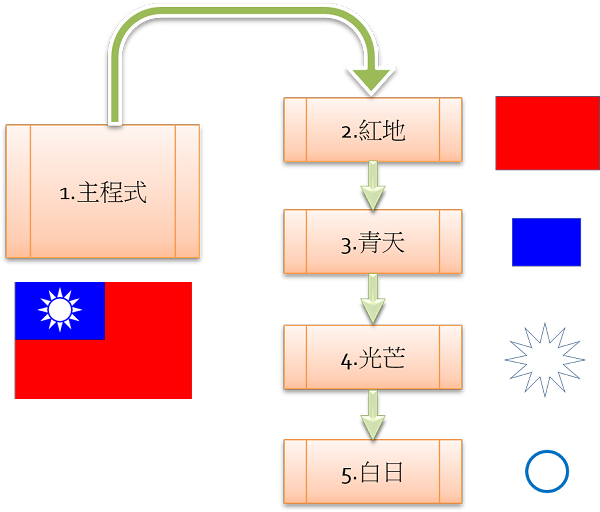

---
hide:
  - navigation
---

# 📚專題：中華民國國旗

----------------------------
##  📕 引言 
----------------------------

: (圖為2011年台灣搜救隊從松山機場出發，前往日本協助救援311大地震。資料來源:[^taiwan_rescue311])

[^taiwan_rescue311]: 311大地震災後送暖 意外牽起台日10年友情, 中央社檔案照片, [來源連結](https://www.cna.com.tw/news/firstnews/202103110084.aspx) , 引用時間2022-02-07

在國際救援活動場合中，參與救災的我國醫療人員曾表示，最感動的就是看到架設在醫療站的中華民國青天白日滿地紅國旗，和其他國家的國旗一同飄揚，讓他在參與國際救援行動時，很感動也很驕傲！<small>(資料來源:</small>[^moi_flag]<small>)</small>

中華民國國旗是我國的象徵之一，平常會固定在學校禮堂、政府機關會議室。遇到國家慶典或紀念日時，會懸掛於街道。在中小學的升旗典禮中，也是儀式的主角。

[^moi_flag]: 中華民國內政部 國旗懸掛禮儀網, [來源連結](https://www.moi.gov.tw/cl.aspx?n=10609) , 2022-02-07

在本專題中，請**利用海龜程式來畫出中華民國的國旗**。

??? quote "建議先備課程"

     在學習本專題前，建議先完成 :fontawesome-solid-link: <a href="../national_flag/" target="_blank">海龜畫國旗</a> ，學習曲線會較為平順。

    

----------------------------
##  📙 問題 
----------------------------

 

在實際寫國旗繪製程式時，可能會遇到一些關於國旗的基本問題，例如：

* 各個地方大大小小的國旗看起來都很像。國旗的長度、形狀、比例、顏色，有沒有統一的規定？在哪裡有**國旗相關說明**呢？

* 我國的國旗，除了有紅、藍、白色以外，還有一個像太陽的標誌，這個標誌看起來很複雜，**國旗的畫法**是什麼呢？

: (資料來源:[^flag_windy])

[^flag_windy]: 飄揚的中華民國國旗 , by jitcji , [維基百科連結](https://commons.wikimedia.org/wiki/File:Flag_of_the_Republic_of_China_(3).JPG) 

還有想到與國旗相關的問題嗎？這些問題要怎麼克服呢？

    

----------------------------
##  📗 搜尋
----------------------------

利用**搜尋引擎**，運用「國旗」「繪製」…等**關鍵字**，可以找到許多相關的資料如下：

國旗規格

: 

: (資料來源:[^roc_flag_spec])

 

:fontawesome-solid-link: 網站

: :fontawesome-solid-long-arrow-alt-right: [中華民國內政部 國旗懸掛禮儀網](https://www.moi.gov.tw/cl.aspx?n=10609)

: :fontawesome-solid-long-arrow-alt-right: [維基百科 中華民國國旗](https://zh.wikipedia.org/wiki/%E4%B8%AD%E8%8F%AF%E6%B0%91%E5%9C%8B%E5%9C%8B%E6%97%97)

: :fontawesome-solid-long-arrow-alt-right: [行政院 國情簡介](https://www.ey.gov.tw/state/62879155A536D543/2e90c3de-b5ee-465c-8ea6-5577b2d2a32b)

: :fontawesome-solid-long-arrow-alt-right: [旗海圖幟 中華民國國旗繪製](https://www.globalflag.idv.tw/wg/hzgq.htm)

:fontawesome-solid-link: 法規

: :fontawesome-solid-long-arrow-alt-right: [中華民國憲法 第6條](https://law.moj.gov.tw/LawClass/LawAll.aspx?pcode=A0000001)

: :fontawesome-solid-long-arrow-alt-right: [中華民國國徽國旗法](https://law.moj.gov.tw/LawClass/LawAll.aspx?pcode=D0020020)

除了以上的資料，還有沒有其他的參考資料？找到資料後，要怎麼運用這些資料呢？

    

----------------------------
##  📒 規劃
----------------------------

當我們對國旗有了基本的了解之後，就可以把大的問題拆解成小的問題，再逐一克服。

: 

 

當然也必須思考動手實作的程式順序。

: 

反覆以上的步驟，思考問題、搜尋資料與設計規劃，當準備好了就可以動手實作了。

??? abstract "運算思維"

    :fontawesome-solid-link: <a href="../basic/comthink/#_7" target="_blank">演算法思維</a>

    

----------------------------
##  📘 實作

###  ***程式結構***

----------------------------

綜合上面「問題拆解」與「演算流程」的思考，可以整理出以下的程式結構

: 

 

我們可以使用「程式模組化設計-函式功能」來寫出這樣的流程

??? abstract "模組化程式設計"

    :fontawesome-solid-link: <a href="../basic/scratch_python_compare/#_14" target="_blank">函式 (function 功能)</a>

 

動手來寫國旗主要結構的程式。

??? example "範例程式 程式結構"

     :fontawesome-solid-link: <a href="../../turtle4t/roc_flag/#1" target="_blank">Let's Code 程式結構 (含操作影片、程式碼及說明)</a>

    

----------------------------

###  ***紅地與青天***

----------------------------

接下來實作紅地與青天這兩個長方形，從下圖中，你看得出它們的寬高比例嗎？

 

: 

: (資料來源:[^roc_flag_spec])

[^roc_flag_spec]: by Jason22 , CC BY-SA 3.0, [維基百科連結](https://commons.wikimedia.org/w/index.php?curid=1577907) .  Modified by Chang Wen-Hung , 加入輔助說明  

也要留意海龜的起點位置。試著用程式寫寫看。

??? example "範例程式 紅地與青天"

     :fontawesome-solid-link: <a href="../../turtle4t/roc_flag/#2" target="_blank">Let's Code 紅地與青天 (含操作影片、程式碼及說明)</a>

??? abstract "結構化程式設計"

    :fontawesome-solid-link: <a href="../basic/scratch_python_compare/#for" target="_blank">計次式重複 (for 迴圈)</a>

   

----------------------------

###  ***光芒***

----------------------------

國旗中光芒的基本形狀是12角星形，可以利用「海龜畫國旗」中的方式來畫出

: 

: (資料來源:[^star_fomula])

[^star_fomula]: 自由軟體Scratch融入數學領域教學(王公國小102上半年教師在職資訊應用培訓)

 

另外要留意12角星形中的起點、邊長，與一開始傾斜的角度。

: 

: (資料來源:[^roc_flag_spec])

??? abstract "光芒的邊長？"

    細心的同學會有疑問，為什麼光芒的邊長大約是29呢？想要解答這個問題，必須解出下面的問題。

    : 

    其實只要使用三角函數就可以計算出光芒的邊長。
    
    在不久的將來，同學們會在數學課中學到在導航、工程學以及物理學…等方面都有廣泛用途的三角函數，要認真學習哦。

    :fontawesome-solid-link: <a href="https://zh.wikipedia.org/wiki/%E4%B8%89%E8%A7%92%E5%87%BD%E6%95%B0" target="_blank">維基百科 三角函數</a>

 

最後，再讓線條與填充都是白色就可以了，用海龜程式來做做看。

??? example "範例程式 光芒"

     :fontawesome-solid-link: <a href="../../turtle4t/roc_flag/#3" target="_blank">Let's Code 光芒 (含操作影片、程式碼及說明)</a>

   

----------------------------

###  ***白日***

----------------------------

可以再次使用問題拆解的思考方法，將白日拆解成兩個圓形。

: 

 

白日的圓形直徑與圓心座標如下：

: 

: (資料來源:[^roc_flag_spec])

有了這些資訊，就可以寫出白日的海龜程式。

??? example "範例程式 白日"

     :fontawesome-solid-link: <a href="../../turtle4t/roc_flag/#4" target="_blank">Let's Code 白日 (含操作影片、程式碼及說明)</a>

 

這樣就完成了基本的中華民國國旗

   
----------------------------
##  📙 擴展

***縮放倍率***

----------------------------

相信在國旗的基本繪製過程中，會發現新的問題，依原比例繪製的國旗好像太小了，怎麼辦？

: 

 

有新的需求，就會促使我們思考突破，增加更多功能。

想一想，當我們想做放大的國旗時，有哪些性質會跟著放大呢？下圖為長方形及圓形的放大思考。

 

: 

 

想清楚了嗎？試著來寫寫看倍率放大的國旗。

??? example "範例程式 縮放倍率"

     :fontawesome-solid-link: <a href="../../turtle4t/roc_flag/#5" target="_blank">Let's Code 縮放倍率 (含操作影片、程式碼及說明)</a>

   

----------------------------

***座標平移***

----------------------------

完成縮放倍率的程式後，好像又覺得怪怪的，海龜每次都會從視窗的中心開始畫(原點)，所以畫出來的國旗會偏一邊，有辦法讓國旗移到左上方嗎？要注意什麼呢？

 

: 

想好了嗎？試著來寫寫看座標平移的國旗。

??? example "範例程式 座標平移"

     :fontawesome-solid-link: <a href="../../turtle4t/roc_flag/#6" target="_blank">Let's Code 座標平移 (含操作影片、程式碼及說明)</a>

   

----------------------------

***使用者介面***

----------------------------

還有一個在實作過程中會發現的問題，放大縮小的倍率都是使用變數控制，這樣每次都要修改程式，都必須透過設計者修改，有沒有方法克服，讓程式的使用者更方便？

我們可以透過使用者介面的設計，讓使用者輸入想要的值，這樣使用起來會更有彈性。下圖是海龜的「輸入數字」方塊：

 

: 

 

實際來寫相關的海龜程式。

??? example "範例程式 使用者介面"

     :fontawesome-solid-link: <a href="../../turtle4t/roc_flag/#7" target="_blank">Let's Code 使用者介面 (含操作影片、程式碼及說明)</a>

??? info "補充資料 使用者介面"

     :fontawesome-solid-link: <a href="https://zh.wikipedia.org/wiki/%E7%94%A8%E6%88%B7%E7%95%8C%E9%9D%A2" target="_blank">維基百科 使用者介面</a>

   

----------------------------

***結語***

----------------------------

如果你能跟著一路學習到最後，那真是太棒了。沒想到國旗，還有這麼多講究吧！這些解決問題的相關知識，都是同學們將來會在課堂上學習到的。希望你收獲滿滿，學習愉快。

  

