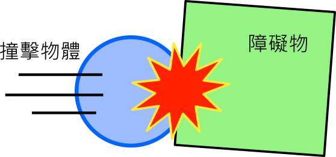

---
hide:
  - navigation
---

# 📚專題：物理射擊實驗室

----------------------------
##  📕 引言 
----------------------------

汽車撞擊測試是一種對市售新車所做的撞擊試驗，測試車輛的耐撞性是否符合安全設計標準。在車禍事故發生時，能最大程度保障司機與乘客的安全。

<iframe width="560" height="315" src="https://www.youtube.com/embed/G0EVIYU59zk?start=0&amp;end=125" frameborder="0" allow="accelerometer; autoplay; encrypted-media; gyroscope; picture-in-picture" allowfullscreen></iframe>

: (資料來源:[^car_collision])

[^car_collision]: 汽車撞擊測試, By 消費者委員會(香港), [youtube連結](https://www.youtube.com/watch?v=G0EVIYU59zk) 

在正面、後面與測面撞擊的測試中，車子與障礙物的質量、速度、方向、結構、材料…等，都會影響撞擊結果，從車內假人身上的感測器，也可以了解撞擊過程中，對人類身體的影響。

在之前的學習中，相信各位已經練習與運動相關物理量的設置與模擬。請利用所學，做出一個**與物理碰撞模擬有關的程式，並探討影響碰撞的各種因素**。

??? quote "建議先備課程"

     在學習本專題前，建議先完成 :fontawesome-solid-long-arrow-alt-right: <a href="../mechanics_playground/" target="_blank">「力與運動遊樂場」</a> ，在學習概念銜接上會較為平順。

??? info "補充資料"

     :fontawesome-solid-link: <a href="https://www.car-safety.org.tw/car_safety/TemplateOneList?OpID=373" target="_blank">車輛安全資訊網 實車碰撞</a>

     :fontawesome-solid-link: <a href="https://zh.wikipedia.org/wiki/%E7%A2%B0%E6%92%9E%E6%B5%8B%E8%AF%95%E5%81%87%E4%BA%BA" target="_blank">維基百科 碰撞測試假人</a>

     

    

----------------------------
##  📙 問題 
----------------------------

首先，將碰撞模擬中的物體分成「撞擊物體」與「障礙物」。

 

: 

接著思考以下的問題：

* 撞擊物體的運動方式有哪些呢？

* 障礙物的結構有哪些形式？

* 哪些因素會影響碰撞的結果？

還有想到其他與碰撞模擬相關的問題嗎？

    

----------------------------
##  📗 搜尋
----------------------------

    

----------------------------
##  📒 規劃
----------------------------

    

----------------------------
##  📘 實作

###  ***程式結構***

----------------------------

   

----------------------------
##  📙 擴展

***慢動作***

----------------------------

----------------------------

***結語***

----------------------------

  

