---
hide:
  - navigation
---

# 📚 以Scratch及Python趣玩物理彈跳碰撞   

: 試試看以下的物理模擬功能

: :fontawesome-solid-long-arrow-alt-right: <a href="https://phet.colorado.edu/zh_TW/simulations/projectile-motion" target="_blank">「Projectile Motion_拋射運動」</a>
 
: <a href="https://phet.colorado.edu/zh_TW/simulations/projectile-motion" target="_blank">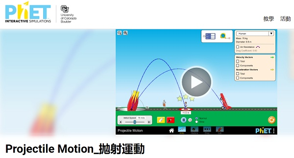</a>

: <sup>(資料來源:</sup>[^phet_projectile_motion]<sup>)</sup>

[^phet_projectile_motion]: PhET, Projectile Motion_拋射運動, [連結](https://phet.colorado.edu/zh_TW/simulations/projectile-motion) 

: 以Scratch來做出砲彈模擬吧！

<br/><br/>


----------------------------

##  📕 Scratch砲彈模擬(4)

----------------------------


: 物體位置的表達

: 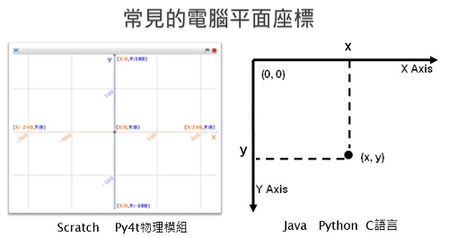

<br/>

: 在Scratch中如何表達物體的位移呢？

: 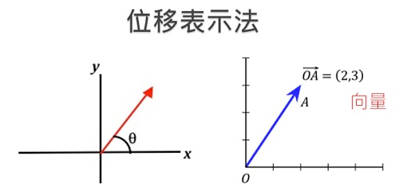


<br/>


: 物體運動基本公式

: 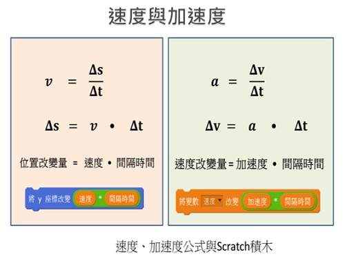

<br/>


: :fontawesome-solid-long-arrow-alt-right: <a href="https://scratch.mit.edu/projects/135667715/" target="_blank">「Scratch: 一維砲彈運動」</a>
 
: <a href="https://scratch.mit.edu/projects/135667715/" target="_blank">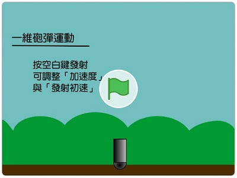</a>

<br/><br/>


推鉛球，是一個常見的運動會比賽項目。

: <iframe width="560" height="315" src="https://www.youtube.com/embed/EkiaYNEAagA?start=0&amp;end=118" frameborder="0" allow="accelerometer; autoplay; encrypted-media; gyroscope; picture-in-picture" allowfullscreen></iframe>

: <sup>(1分58秒, 資料來源:</sup>[^shot_put]<sup>)</sup>

[^shot_put]: 超越人類極限【金牌鉛球國手】巨人手掌宛如人體砲臺發射器, By 健人蓋伊, [youtube連結](https://www.youtube.com/watch?v=EkiaYNEAagA)

鉛球丟出後，就是一個在空中的拋物體。

<br/>


: :fontawesome-solid-long-arrow-alt-right: <a href="https://scratch.mit.edu/projects/135667854/" target="_blank">「Scratch: 二維砲彈運動」</a>
 
: <a href="https://scratch.mit.edu/projects/135667854/" target="_blank">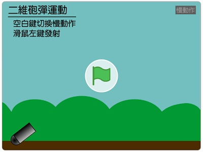</a>

<br/><br/>


: :fontawesome-solid-long-arrow-alt-right: <a href="https://scratch.mit.edu/projects/135667935/" target="_blank">「Scratch: 車輪運動」</a>
 
: <a href="https://scratch.mit.edu/projects/135667935/" target="_blank">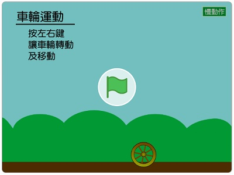</a>

<br/><br/>


高速攝影機的慢動作效果：

<br/>

: 作用力與反作用力

: <iframe width="560" height="315" src="https://www.youtube.com/embed/cP0Bb3WXJ_k?start=30&amp;end=91" frameborder="0" allow="accelerometer; autoplay; encrypted-media; gyroscope; picture-in-picture" allowfullscreen></iframe>

: <sup>(1分01秒, 資料來源:</sup>[^action_reaction]<sup>)</sup>

[^action_reaction]: Newton's Laws Of Motion (3): Action And Reaction, By ESOcast, [youtube連結](https://youtu.be/cP0Bb3WXJ_k)


<br/>


: <iframe width="560" height="315" src="https://www.youtube.com/embed/0-pZ4t-kAWw?start=0&amp;end=36" frameborder="0" allow="accelerometer; autoplay; encrypted-media; gyroscope; picture-in-picture" allowfullscreen></iframe>

: <sup>(36秒, 資料來源:</sup>[^slow_motion]<sup>)</sup>

[^slow_motion]: EVERYTHING Looks Better in Slow Motion, By Legendary Shots, [youtube連結](https://youtu.be/0-pZ4t-kAWw)  

<br/>

: :fontawesome-solid-long-arrow-alt-right: <a href="https://scratch.mit.edu/projects/135668004/" target="_blank">「Scratch: 砲彈遊戲物理模擬」</a>
 
: <a href="https://scratch.mit.edu/projects/135668004/" target="_blank">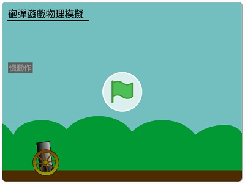</a>


<br/><br/><br/>


----------------------------

##  📒 物理引擎(2)

----------------------------

: 2D衝量物理引擎展示(原作者以C++實作)

<iframe width="560" height="315" src="https://www.youtube.com/embed/AzA_owsZU04?start=0&amp;end=30" frameborder="0" allow="accelerometer; autoplay; encrypted-media; gyroscope; picture-in-picture" allowfullscreen></iframe>

: <sup>(36秒, 資料來源:</sup>[^impulse_engine]<sup>)</sup>

[^impulse_engine]: Custom 2D Physics Engine: Impulse Engine Demo, By Tuts+ Game Developmen, [youtube連結](https://youtu.be/AzA_owsZU04)  

: :fontawesome-solid-long-arrow-alt-right: <a href="https://drive.google.com/file/d/1qF-Sbo3LrQP54oQZdAJwFR_nnsvEX0b7/view?usp=sharing" target="_blank">java物理引擎下載(執行需有JRE環境)</a>

<br/>
<br/>

: Python的物理引擎函式庫

: :fontawesome-solid-long-arrow-alt-right: <a href="https://www.pymunk.org/en/latest/" target="_blank">pymunk</a>
 
: <a href="https://www.pymunk.org/en/latest/" target="_blank">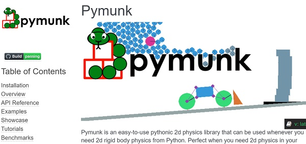</a>

<br/>


???+ example "範例程式 pymunk模擬物體運動"


    === "💻程式碼"

        ```python
        import pymunk

        space = pymunk.Space() # 物理模擬空間
        space.gravity = 0,0   # 重力加速度

        body = pymunk.Body()  # 產生物體       
        body.position = 0,0   # 位置

        circle = pymunk.Circle(body, 10) # 產生圓形 半徑
        space.add(body, circle) # 圓形物體加入空間

        circle.mass = 1       # 質量      
        body.velocity = 100, 0  # 初始速度

        seconds = 0
        dt = 1  # 步進時間
        for i in range(20): # 重複次數
            x, y = body.position
            print(f'{seconds:.1f}秒 -- 位置(x:{x:.1f},y:{y:.1f})')
            space.step(dt) # 模擬下一步 
            seconds += dt                 
        ```

        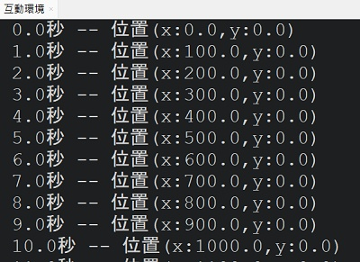


<br/>
<br/>

???+ example "範例程式 pymunk模擬matplotlib標示"


    === "💻程式碼"

        ```python
        import pymunk
        import matplotlib.pyplot as plt

        plt.axis('equal')
        x_list, y_list = [], []

        space = pymunk.Space() # 物理模擬空間
        space.gravity = 0,0   # 重力加速度

        body = pymunk.Body()  # 產生物體       
        body.position = 0,0   # 位置

        circle = pymunk.Circle(body, 10) # 產生圓形 半徑
        space.add(body, circle) # 圓形物體加入空間

        circle.mass = 1       # 質量      
        body.velocity = 100, 0  # 初始速度

        seconds = 0
        dt = 1  # 步進時間
        for i in range(20): # 重複次數
            x, y = body.position
            print(f'{seconds:.1f}秒 -- 位置(x:{x:.1f},y:{y:.1f})')
            x_list.append(body.position.x) # 記錄x位置
            y_list.append(body.position.y) # 記錄y位置
            space.step(dt) # 模擬下一步 
            seconds += dt 

        plt.plot(x_list, y_list, 'o') # 標示xy位置
        plt.show()                    
        ```

        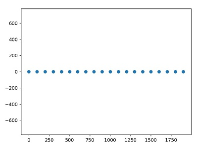

        : 如何執行出以下的結果呢？

        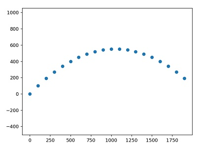

??? info "如何執行pymunk的官方範例" 
    : 於命令列執行，可列出pymunk的官方範例 (需先安裝pygame)

    ```batch
    python -m pymunk.examples -l                           
    ```

: 想想看，使用物理引擎的優缺點是什麼？

: Py4t的物理模組封裝了pymunk，當初的目的是讓青少年能簡易使用(物理模組<a href="https://github.com/beardad1975/pie4t/tree/master" target="_blank">原始碼</a>) 

: 以下我們將使用來Py4t來做物理模擬。


<br/>


----------------------------

##  📗 噴射拋體(2)


***拋體運動***

----------------------------

什麼是拋體運動？

: <iframe width="560" height="315" src="https://www.youtube.com/embed/bhavS93SEaM?start=32&amp;end=97" frameborder="0" allow="accelerometer; autoplay; encrypted-media; gyroscope; picture-in-picture" allowfullscreen></iframe>

: <sup>(1分05秒, 資料來源:</sup>[^projectile_motion]<sup>)</sup>

[^projectile_motion]: 吉娃斯科學小教室｜#37 : 拋體運動｜動能、重力、運動半徑｜兒童科普動畫, By 
EngineTV 原金動畫, [youtube連結](https://www.youtube.com/watch?v=bhavS93SEaM&t=32s)

<br/><br/>

如果想用程式來模擬拋體，要先決定發射位置與速度。

將圓球發射位置定在視窗左下角，用滑鼠的座標位置當作速度的大小，操作起來較為直覺，如下圖：


: 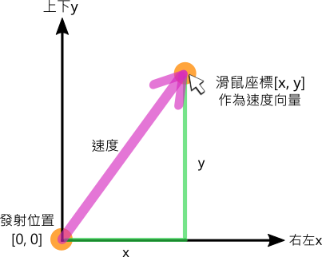 

<br/><br/>

一起來動手寫寫看。

<br/>

???+ example "範例程式 拋體運動 - - - - - - - (噴射拋體1/2 新檔)"

    === "💻程式碼"

        ```python
        # 請按住Alt，並使用滑鼠右鍵移除地板地形

        from 物理模組 import *
        舞台 = 物理引擎(800,600)

        def 按下滑鼠時(x, y):
            物體 = 新增圓球(半徑=20)
            物體.位置 = [0, 0]
            物體.速度 = [x, y]

        模擬主迴圈()
        ```


??? info "補充資料 拋體" 

    : :fontawesome-solid-link: <a href="https://zh.wikipedia.org/wiki/%E6%8B%8B%E9%AB%94" target="_blank">維基百科: 拋體</a>

    : :fontawesome-solid-link: <a href="https://www.zetria.org/view.php?subj=physics&chap=lfym2aorgz" target="_blank">學呀: 拋物線運動</a>


<br/><br/><br/>


----------------------------

***連續噴射***

----------------------------

完成了基本的拋體運動程式，接下來可以做出什麼變化呢？

: <iframe width="560" height="315" src="https://www.youtube.com/embed/HGBoMrsC0iE" frameborder="0" allow="accelerometer; autoplay; encrypted-media; gyroscope; picture-in-picture" allowfullscreen></iframe>

: <sup>(9秒, 資料來源:</sup>[^sprinkler]<sup>)</sup>

[^sprinkler]: 太陽能系統-自動灑水器-噴水頭, By CHIJIJOHNNY, [youtube連結](https://www.youtube.com/watch?v=HGBoMrsC0iE)

<br/><br/>


讓我們把多顆小圓球當成拋體，做出噴水的簡單模擬。

這次將發射位置定在視窗中間底部，當發射位置改變時，要如何用滑鼠來呈現速度？為了達到直覺的操作，需做以下的修正：

<br/>

:  

<br/><br/>

一起來動手寫寫看。

<br/>

???+ example "範例程式 連續噴射 - - - - - - - (噴射拋體2/2 接續)"


    === "💻程式碼"

        ```python
        # 請按住Alt，並使用滑鼠右鍵移除地板地形

        from 物理模組 import *
        舞台 = 物理引擎(800,600)

        def 拖曳滑鼠時(x, y, dx, dy):
            物體 = 新增圓球(半徑=5)
            物體.位置 = [400, 0]
            物體.速度 = [(x - 400) * 2, y * 2]

        模擬主迴圈()

        ```


<br/><br/><br/>

----------------------------

##  📘 理想氣體(2)

----------------------------

: 在下方的模擬中，氣體分子在做什麼運動？

: :fontawesome-solid-long-arrow-alt-right: <a href="https://phet.colorado.edu/zh_TW/simulations/gas-properties" target="_blank">「Gas Properties_氣體特性」</a>
 
: <a href="https://phet.colorado.edu/zh_TW/simulations/gas-properties" target="_blank">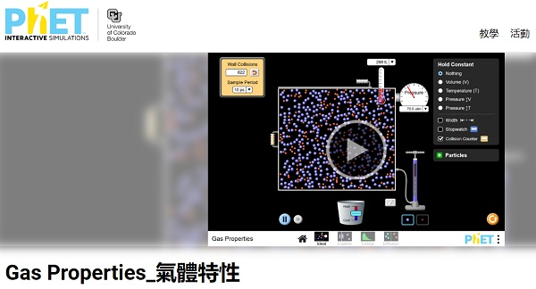</a>

: <sup>(資料來源:</sup>[^phet_gas_properties]<sup>)</sup>

[^phet_gas_properties]: PhET, Gas Properties_氣體特性, [連結](https://phet.colorado.edu/zh_TW/simulations/gas-properties) 

<br>
<br>

: 先將情況簡化，看看下面兩個物體的碰撞。

: <iframe width="560" height="315" src="https://www.youtube.com/embed/jRliH0jVilM?start=52&amp;end=108" frameborder="0" allow="accelerometer; autoplay; encrypted-media; gyroscope; picture-in-picture" allowfullscreen></iframe>

: <sup>(56秒, 資料來源:</sup>[^elastic_collision]<sup>)</sup>

[^elastic_collision]: Collisions Demo: Two Carts, By Physics Demos, [youtube連結](https://youtu.be/jRliH0jVilM)

<br/><br/>


: 彈性碰撞指的是兩個物體互相碰撞，碰撞前動能和與碰撞後動能和相等。在動量守恆定律中碰撞前的動量和同樣等於碰撞後的動量和。(見<a href="https://zh.wikipedia.org/zh-tw/%E5%BD%88%E6%80%A7%E7%A2%B0%E6%92%9E" target="_blank">維基百科</a>)


: 請試著運用Py4t物理模組，做出以下的完全彈性碰撞模擬

: 

    | 說明      | 展示                         |
    | ----------- | ------------------------------------ |
    | 兩相同質量物體<br/>一個靜止，另一個有速度       |  |
    | 兩相同質量物體<br/>一個是另一個的一半速度       |  |
    | 一個質量為另一個兩倍<br/>兩速度相同，方向相向       |  |

: <sup>(資料來源:</sup>[^Elastischer_stoß]<sup>)</sup>

[^Elastischer_stoß]:  維基百科 彈性碰撞, [連結](https://zh.wikipedia.org/zh-tw/%E5%BD%88%E6%80%A7%E7%A2%B0%E6%92%9E) 

<br/>

???+ example "範例程式 兩物體彈性碰撞 "

    === "💻程式碼"

        ```python
        from 物理模組 import *

        舞台 = 物理引擎(800,600)
        舞台.重力 = [0, 0]

        def 按下滑鼠時(x, y):
            物體 = 新增方塊(寬=30,高=20)
            物體.位置 = [0, y]
            物體.摩擦 = 0
            物體.彈性 = 1
            物體.速度 = [400, 0]
            
            物體2 = 新增方塊(寬=30,高=20)
            物體2.位置 = [400, y]
            物體2.摩擦 = 0
            物體2.彈性 = 1
            物體2.速度 = [0, 0]

        模擬主迴圈()
        
        ```

<br/><br/><br/>        
        

: 想一想，當兩物體彈性碰撞為斜向時(不在同一直線)，會發生什麼事？

: 

: <sup>(資料來源:</sup>[^Elastischer_stoß]<sup>)</sup>

: 那如果有多個物體碰撞會怎樣？


<br/>

???+ example "範例程式 兩物體彈性碰撞 "

    === "💻程式碼"

        ```python
        # 請按住Ctrl鍵，以滑鼠右鍵建立地形，圍住球體

        from 物理模組 import *
        import random

        舞台 = 物理引擎(800,600)
        舞台.重力 = [0, 0]

        def 拖曳滑鼠時(x, y, dx, dy):
            物體 = 新增圓球(10)
            物體.摩擦 = 0
            物體.彈性 = 1
            物體.位置 = [x, y]
            物體.速度 = [random.randint(-100,100),
                        random.randint(-100,100)]

        def 按下鍵盤時(按鍵, x, y):
            舞台.慢動作 = True
            
        def 放開鍵盤時(按鍵, x, y):
            舞台.慢動作 = False
            
        模擬主迴圈()        
        
        ```

??? info "Scratch彈性碰撞" 
    : :fontawesome-solid-long-arrow-alt-right: <a href="https://scratch.mit.edu/projects/129748531/" target="_blank">「Scratch: 彈性碰撞(數量2)」 by beardad1975</a>
 
    : <a href="https://scratch.mit.edu/projects/129748531/" target="_blank"></a>

    <br/>

    : :fontawesome-solid-long-arrow-alt-right: <a href="https://scratch.mit.edu/projects/129753669/" target="_blank">「Scratch: 彈性碰撞(數量多)」 by beardad1975 </a>
 
    : <a href="https://scratch.mit.edu/projects/129753669/" target="_blank">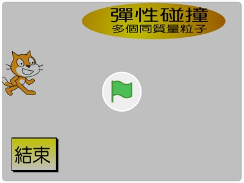</a>
    
??? info "Scratch撞球遊戲" 
    : :fontawesome-solid-long-arrow-alt-right: <a href="https://scratch.mit.edu/projects/10079318/" target="_blank">「Scratch: eRK's Billiard (offline multiplayer)」 by eRKSToCK</a>

    : <a href="https://scratch.mit.edu/projects/10079318/" target="_blank">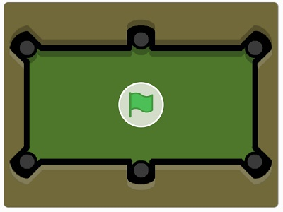</a>


----------------------------

##  📙 結語

----------------------------

: 筆者曾在Scratch的網站中，找到國外作者griffpatch所寫的「2D衝量物理引擎」，花費許多時間理解原理後，將之中文化，並改版為「懷舊彈珠台」(2016.12)

??? info "Scratch 2D衝量物理引擎" 
    : :fontawesome-solid-long-arrow-alt-right: <a href="https://scratch.mit.edu/projects/133931204/" target="_blank">「Scratch: Impulse 2D Physics Engine 1.3.0 衝力2D物理引擎中文版」 by beardad1975 , 原作者griffpatch</a>

    : <a href="https://scratch.mit.edu/projects/133931204/" target="_blank"></a>

??? info "Scratch 懷舊彈珠台" 
    : :fontawesome-solid-long-arrow-alt-right: <a href="https://scratch.mit.edu/projects/134193915/" target="_blank">「Scratch: OldTimesPinball懷舊彈珠台」 by beardad1975</a>

    : <a href="https://scratch.mit.edu/projects/134193915/" target="_blank">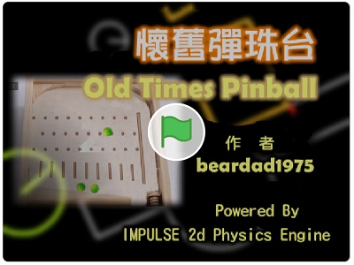</a>

: 即便如此，由於程式碼複雜，當時仍無法達成讓中小學生動手寫物理碰撞模擬程式的心願。

: 感謝這些年，多人的支持與鼓勵，筆者整合了Py4t，也將pymunk物理引擎包裝成簡易的「物理模組」，這個心願總算完成了。


<br/><br/><br/>

