---
hide:
  - navigation
---

# 📚 Python程式設計-計算篇 (9上翰林版2-2)

本課程是資訊科技教科書(9上翰林版)的補充教材與範例操作，搭配課本中的內容，來學習Python的基本輸入輸出，資料型態的轉換、內建函式的使用、認識選擇與重複結構…等，入門文字型程式語言，銜接高中資訊科技課程。

實際撰寫程式時，搭配Py4t專為中小學學生設計的便利貼與輔助排版功能，簡化Python程式撰寫的步驟。希望讓學生能更專注於程式的思考及運算思維的培養。

??? info "教科書資料引用來源"

     本課程之例題、範例程式及Scratch對照圖片，均引用自翰林出版資訊科技教科圖書9上第2章-從Scratch到Python，2-2Python程式設計-計算篇

   

----------------------------

##  📕 哈囉 

----------------------------

在校園的早晨，常常會看到同學之間互相道早安。仔細想一想，「當別人跟我說早安，而我也向他打招呼」，在這個情境中發生了什麼事？

 

: 

 

人與人之間的「聽」跟「說」，對電腦來說，有沒有類似的動作？

 

: 

 

**請設計一個程式，讓使用者輸入名字後，電腦會將名字呈現在畫面上與使用者打招呼。**

 

???+ example "Python計算篇 範例 (1/8 新檔) --- 哈囉程式"

    === "🎦Py4t操作影片(3:41)"
    
        <iframe width="560" height="315" src="https://www.youtube.com/embed/XdwNrOKtyUU" frameborder="0" allow="accelerometer; autoplay; encrypted-media; gyroscope; picture-in-picture" allowfullscreen></iframe>

    === "💻Python程式截圖"

        

    === "🗒️Scratch積木對照"

        

??? info "補充資料 馮紐曼與現代電腦架構"

     :fontawesome-solid-link: <a href="https://www.inside.com.tw/article/9507-von-neumann-architecture" target="_blank">【Lynn 寫點科普】你知道你正在用的電腦是 70 年前發明的馮紐曼架構嗎？</a>

   

----------------------------

##  📙 求三數之和 

----------------------------

除了把輸入的文字直接顯示，有時我們會想要把資料做一些計算，比如是加法的運算。

但是在Python程式中，「文字」卻不能直接拿來做計算，這到底是為什麼呢？

  

: 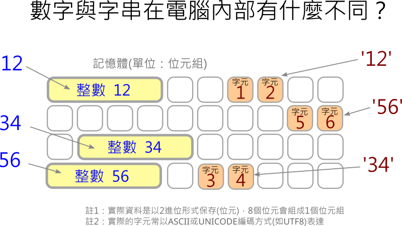

 

所以記得要把「輸入文字」先轉換成「整數」哦。

接下來，**請設計一個程式，讓使用者輸入三個數字後，再呈現三個數字相加的和**。

 

???+ example "Python計算篇 範例 (2/8 新檔) --- 求三數之和"

    === "🎦Py4t操作影片(5:06)"
    
        <iframe width="560" height="315" src="https://www.youtube.com/embed/fgobY4o2BTU?start=2&amp;end=306" frameborder="0" allow="accelerometer; autoplay; encrypted-media; gyroscope; picture-in-picture" allowfullscreen></iframe>

    === "💻Python程式截圖"

        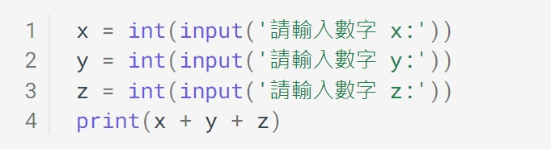
        

    === "🗒️Scratch積木對照"

        
        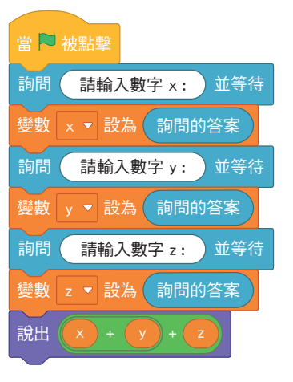

   

----------------------------

##  📒 求平均數 

----------------------------

計算後的數字，也可以再轉換成字串，做出不同的輸出組合。再來做個練習。

**請設計一個程式，讓使用者輸入兩個數字後，再呈現兩個數字的平均值**。

程式資料的轉換流程如下：

 

: 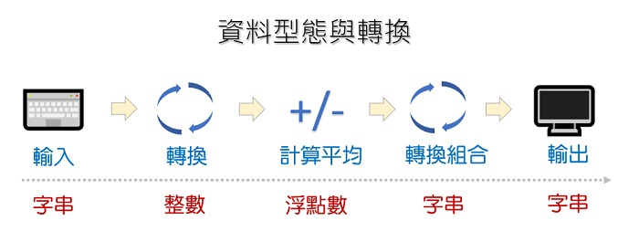

 

請試著動手寫寫看。

 

???+ example "Python計算篇 範例 (3/8 新檔) --- 求平均數"

    === "🎦Py4t操作影片(5:35)"
    
        <iframe width="560" height="315" src="https://www.youtube.com/embed/4_UyYrlISZw?start=2&amp;end=336" frameborder="0" allow="accelerometer; autoplay; encrypted-media; gyroscope; picture-in-picture" allowfullscreen></iframe>

    === "💻Python程式截圖"

        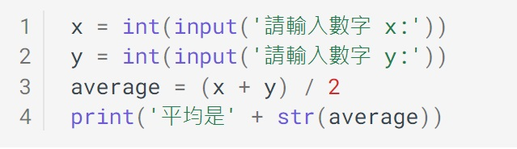
        

    === "🗒️Scratch積木對照"

        
        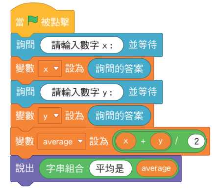

   

----------------------------

##  📗 計算學期成績 

----------------------------

除了計算以外，我們也常常會對結果做分析，從數字中取出有意義的訊息。

 

: 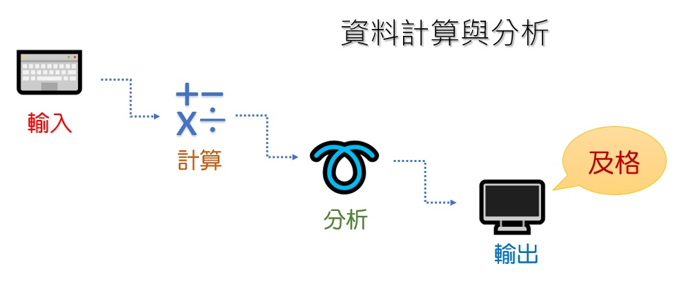

 

**請設計一個程式，讓使用者輸入各項成績後，再將各項成績轉換為學期成績，並判
斷學期成績是否及格？（其中，作業成績占 40％，測驗成績占 40％，平時成績占
20％，學期成績 60 分為及格分數。）**

 

???+ example "Python計算篇 範例 (4/8 新檔) --- 計算學期成績"

    === "🎦Py4t操作影片(9:15)"
    
        <iframe width="560" height="315" src="https://www.youtube.com/embed/H4ouv9LyflI?start=2&amp;end=555" frameborder="0" allow="accelerometer; autoplay; encrypted-media; gyroscope; picture-in-picture" allowfullscreen></iframe>

    === "💻Python程式截圖"

        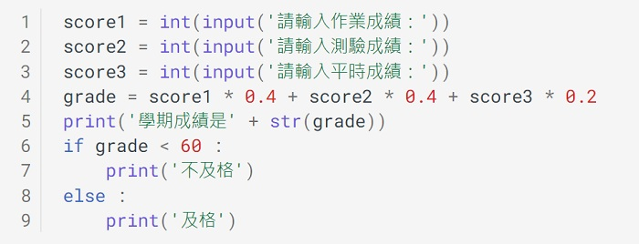
        

    === "🗒️Scratch積木對照"

        
        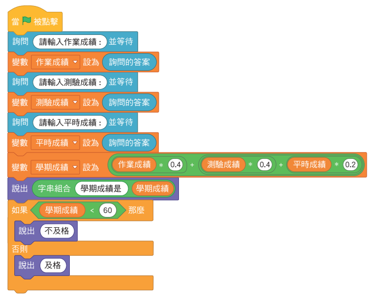

??? abstract "結構化程式設計"

    :fontawesome-solid-link: <a href="../basic/scratch_python_compare/#if_else" target="_blank">雙向選擇結構</a>

   

----------------------------

##  📘 累加計算 

----------------------------

接下來，**請設計一個程式，讓使用者輸入數字 n 後，再計算 1 ＋ 2 ＋ 3 ＋⋯＋ n 的值。**

先將問題簡化，想一想計算1+2+3+4的值，如何用程式來做呢？

使用Python的for重複結構可以解決這個問題。for常常會搭配range函式所產生的整數數列來執行計次的迴圈。不過你知道嗎？如果要產生1~4的數列，要使用range(1, 4+1)，奇怪，到底是為什麼呢？

 

: 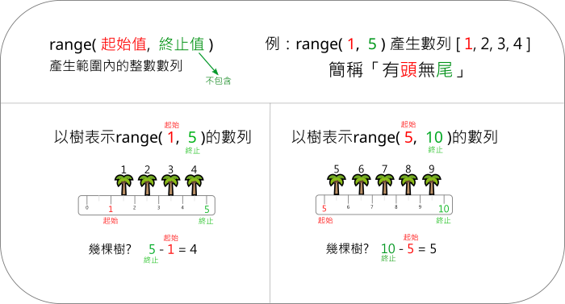

 

想清楚了嗎？實際來寫程式看看：

 

???+ example "Python計算篇 範例 (5/8 新檔) --- 累加計算"

    === "🎦Py4t操作影片(6:39)"
    
        <iframe width="560" height="315" src="https://www.youtube.com/embed/DhcDjRpchoA?start=2&amp;end=399" frameborder="0" allow="accelerometer; autoplay; encrypted-media; gyroscope; picture-in-picture" allowfullscreen></iframe>

    === "💻Python程式截圖"

        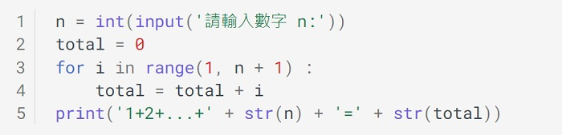
        

        註：課本範例使用sum做為變數名稱，但sum為python內建函式，不建議使用，故在本範例中改為total
        

    === "🗒️Scratch積木對照"

        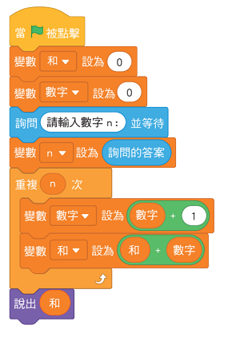

??? abstract "結構化程式設計"

    :fontawesome-solid-link: <a href="../basic/scratch_python_compare/#for" target="_blank">重複結構</a>        
        
   

----------------------------

##  📕 密碼檢查

----------------------------

當我們使用晶片金融卡到自動提款機(ATM)領錢時，要注意什麼事呢？

 

: 

: (資料來源:[^atm])

[^atm]: 自動提款機, By Solomon203, [維基百科連結](https://wuu.wikipedia.org/wiki/%E8%87%AA%E5%8A%A8%E6%9F%9C%E5%91%98%E6%9C%BA#/media/File:Chunghwa_Post_ATM_in_ROC-NCL_headquarters_20100908.jpg)

 

根據以上的情境，**請設計一個電腦系統的密碼驗證機制，條件如下**：

1. 若第一次輸入密碼錯誤後，可再重複嘗試輸入兩次。
2. 若三次密碼都錯誤，跳出使用者帳號被鎖定的訊息。

 

???+ example "Python計算篇 範例 (6/8 新檔) --- 密碼檢查"

    === "🎦Py4t操作影片(8:25)"
    
        <iframe width="560" height="315" src="https://www.youtube.com/embed/rZMMfeqgRnw?start=2&amp;end=505" frameborder="0" allow="accelerometer; autoplay; encrypted-media; gyroscope; picture-in-picture" allowfullscreen></iframe>

    === "💻Python程式截圖"

        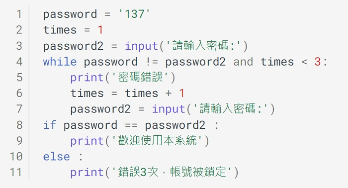       

    === "🗒️Scratch積木對照"

        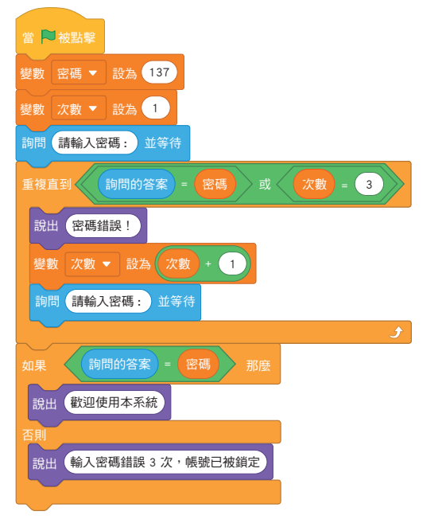

??? abstract "結構化程式設計"

    :fontawesome-solid-link: <a href="../basic/scratch_python_compare/#while" target="_blank">while重複結構</a> 

    :fontawesome-solid-link: <a href="../basic/scratch_python_compare/#if_else" target="_blank">雙向選擇結構</a> 

   

----------------------------

##  📙 任意數的所有因數

----------------------------

接下來，**請設計一個程式，讓使用者輸入一個數字後，再找出該數字的所有因數**。

 

還記得以前學過的因數與倍數嗎？

<iframe width="560" height="315" src="https://www.youtube.com/embed/NEafa4sDswc?start=0&amp;end=112" frameborder="0" allow="accelerometer; autoplay; encrypted-media; gyroscope; picture-in-picture" allowfullscreen></iframe>

: (1分52秒, 資料來源:[^factor_multiple])

[^factor_multiple]: 因數與倍數, By均一教育平台 Junyi Academy, [youtube連結](https://youtu.be/NEafa4sDswc)

 

在Python中， % 是代表除法取餘數的運算，比如說 6 % 2 的餘數是 0 ，而 5 % 2 的餘數是 1，利用 % 可以讓我們找出因數。

想清楚了嗎？試著寫寫看程式。

 

???+ example "Python計算篇 範例 (7/8 新檔) --- 任意數的所有因數"

    === "🎦Py4t操作影片(5:29)"
    
        <iframe width="560" height="315" src="https://www.youtube.com/embed/_5sLEY8aFAA?start=2&amp;end=330" frameborder="0" allow="accelerometer; autoplay; encrypted-media; gyroscope; picture-in-picture" allowfullscreen></iframe>

    === "💻Python程式截圖"

        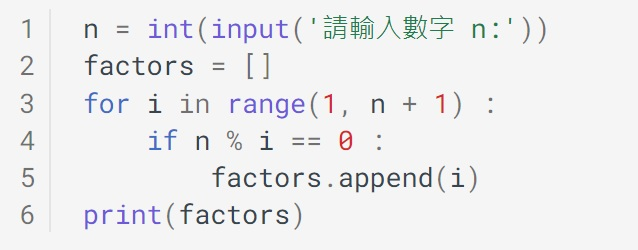       

    === "🗒️Scratch積木對照"

        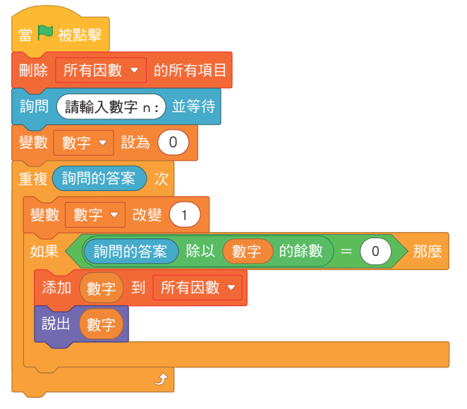

   

----------------------------

##  📒  抽獎

----------------------------

**有三十人參加摸獎活動，分別有編號 1 ∼ 30 的摸獎券，透過電腦進行抽獎，從中抽出三位幸運兒頒發獎品**。

Python的random模組中，有個randint函式，類似Scratch中的隨機取數，試著寫寫看程式。

 

???+ example "Python計算篇 範例 (8/8 新檔) --- 抽獎"

    === "🎦Py4t操作影片(7:44)"
    
        <iframe width="560" height="315" src="https://www.youtube.com/embed/vOE9gW7T2Fc?start=2&amp;end=464" frameborder="0" allow="accelerometer; autoplay; encrypted-media; gyroscope; picture-in-picture" allowfullscreen></iframe>

    === "💻Python程式截圖"

        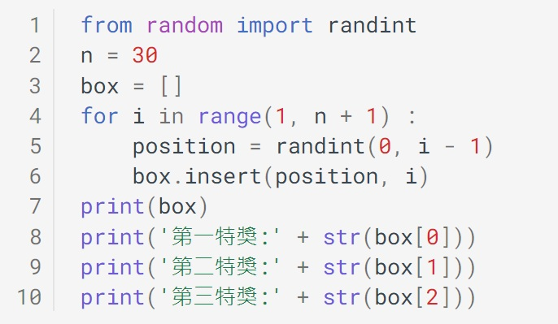       

    === "🗒️Scratch積木對照"

        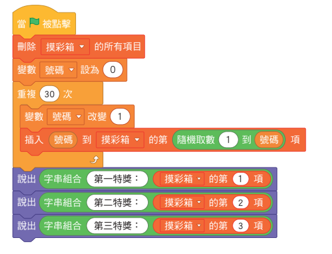

   