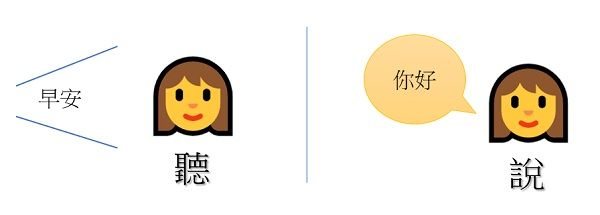
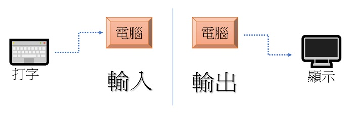
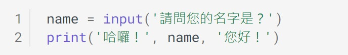
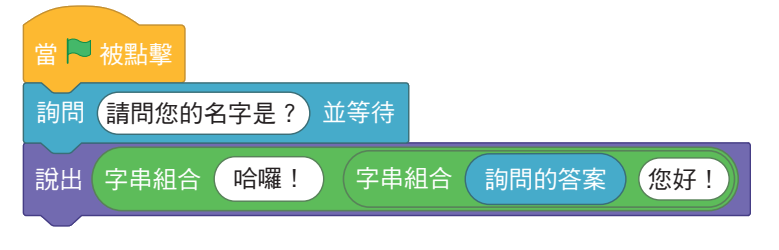

---
hide:
  - navigation
---

# 📚 從Scratch到Python (9上翰林版)

??? info "教科書資料引用來源"

     本課程之例題、範例程式及Scratch對照圖片，均引用自翰林出版資訊科技教科圖書9上第2章-從Scratch到Python

   

----------------------------

##  📕 哈囉程式

----------------------------

在校園的早晨，常常會看到同學之間互相道早安。仔細想一想，當別人跟我說早安，我回應他時，這中間發生了什麼事？

 

: 

 

人與人之間的「聽」跟「說」，對電腦來說，有沒有類似的動作？

 

: 

 

請設計一個程式，讓使用者輸入名字後，電腦會將名字呈現在畫面上與使用者打招呼。

 

???+ example "範例 哈囉程式"

    === "🎦Py4t操作影片"
    
        <iframe width="560" height="315" src="https://www.youtube.com/embed/XdwNrOKtyUU" frameborder="0" allow="accelerometer; autoplay; encrypted-media; gyroscope; picture-in-picture" allowfullscreen></iframe>

    === "💻Python程式截圖"

        

    === "🗒️Scratch積木對照"

        

   

