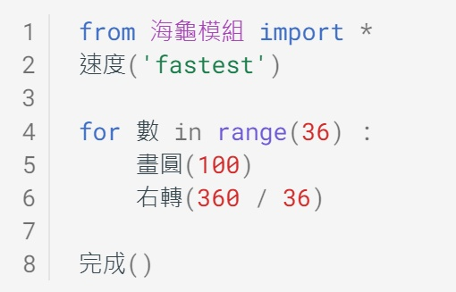
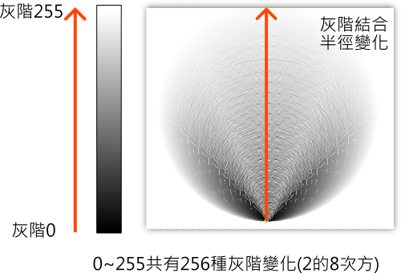

---
hide:
  - navigation
---

# 📚海龜畫禪繞

: 禪繞畫是由美國的芮克（Rick Roberts）與瑪莉亞（Maria Thomas）這對夫妻於2005年創辦。畫法是以簡單的圖樣規則一筆一筆畫出。在禪繞畫的作畫過程中，可以讓人保持、放鬆、專注與平靜，是一種人人都可從事的繪畫活動。

: 

: (資料來源:[^zentangle_example])

[^zentangle_example]: Zentangle art || Doodle patterns || Zen-doodle,Bycharvi ashtekar, [youtube連結](https://youtu.be/gBsW_wpFBxc) 

: 雖然禪繞畫大多是以紙與筆來完成(紙磚、代針筆、2B鉛筆等)，不過禪繞畫的特點之一是「沒有框架丶可自由創作」，所以在這個課程中，我們會跳脫框架，使用海龜程式來畫出禪繞圖，試試看當科技與藝術結合時，會產生怎樣的火花。

??? info "關於海龜程式"

    : Py4t海龜程式的介紹，加上中文的函式庫、範例程式與原始碼。

    : :fontawesome-solid-link: <a href="../../turtle4t/" target="_blank">海龜學習模組 說明</a>

    

----------------------------

##  📙 禪繞特性

----------------------------

: 禪繞畫看起來很美麗，但卻好像有點複雜，要如何畫出禪繞畫？它的特性是什麼？

: <iframe width="560" height="315" src="https://www.youtube.com/embed/tOSbo8fHPgQ?start=158&amp;end=521" frameborder="0" allow="accelerometer; autoplay; encrypted-media; gyroscope; picture-in-picture" allowfullscreen></iframe>

: (6分03秒, 資料來源:[^zentangle_first_time])

[^zentangle_first_time]: 學一次禪繞畫就上手!!新手必學四招！ft.芬妮心理師 Beginners Guide to Start Zentangles, By 棋樂玩文具 , [youtube連結](https://youtu.be/tOSbo8fHPgQ) 

 

: 禪繞畫是由多個圖樣組成，從影片中，我們可以看到幾種常見的圖樣。(也可以自己創造哦)

: 

: (資料來源:[^zentangle_first_time])

 

: 在作畫時也會使用到填滿及陰影的技巧，讓畫面更有層次感。

: 

: (資料來源:[^zentangle_first_time])

 

: 禪繞畫會依照圖樣的簡單規則來重複畫出。禪繞筆劃的5個元素簡稱icso，分別代表點、直線、弧線、S型、圓形。

: 

: (資料來源:[^rule_and_element])

[^rule_and_element]: 親子DIY創作 舒壓禪繞畫, By 明報 Mingpao, [youtube連結](https://youtu.be/oEvT826CHn8) 

: 經由以上的簡介，大家是不是比較了解禪繞畫了呢？

: 原來禪繞畫的特性有「**禪繞5元素**」、「**圖樣規則**」、「**重複畫出**」、「**填滿及陰影**」等。

: 接下來要使用海龜程式，從以上討論的特性，畫出禪繞畫囉。

    

----------------------------

##  📗 迴轉線條(4) 

***方陣擴大*** 

----------------------------

: 先使用禪繞5元素中的「直線」來發想，規律的直線可以產生什麼基本圖樣呢？

: 當一條直線，以90度的規律轉動，會變成一個直角，而4個規律的直角會讓人聯想到正方形。

: 

 

: 在海龜程式中，從起點開始，一開始的方向朝右，利用「向前」及「旋轉」的指令，就可以畫出正方形的圖樣。

: 

 
 

: 接著使用禪繞畫中的「重複畫出」要素，想一想，不斷重複畫出正方形的邊長，可以使用什麼規則變化？

: 利用程式的重複結構，以Python的for迴圈為例，我們可以使用「迴圈變數」，它在重複結構中的作用像是圈數計數器(從0開始)。如果把迴圈變數做為正方形的邊長時，就會產生一個不斷迴轉擴大的方陣，如下示意圖。

: 

 

請動手實作，畫出不斷擴大的方陣。

???+ example "範例程式 方陣擴大 - - - - - - - (迴轉線條1/4 新檔)"

    === "🎦操作影片"
    
        <iframe width="560" height="315" src="https://www.youtube.com/embed/jwwAbyi0Ang?start=2&amp;end=152" frameborder="0" allow="accelerometer; autoplay; encrypted-media; gyroscope; picture-in-picture" allowfullscreen></iframe>

        【長度2:30 章節時間如下】

        * 0:00 存檔、匯入模組

        * 0:50 方陣擴大

    === "💻程式截圖"

         

    

----------------------------

***長度迭代***

----------------------------

: 在資訊科學的領域，迭代(iteration)代表著重複的指令執行。在Python中，雖然迭代與迴圈(loop)的意義相近，但「迭代」更有利用迴圈變數「不斷重複替換」來做出變化之意，所以以下的重複替換變化都會使用「迭代」這個詞。

: 回想上一個例子，我們對正方形的長度迭代，不斷的把線條變長，產生方陣的圖案。如果使用乘法或加法，讓迴圈變數產生規律的變化時，方陣會發生什麼事情呢？分別來測試看看。

: 測試一，把迴圈變數每次都變成2倍，方陣會如何？：

: 

 

: 測試二，把迴圈變數每次都加上50，方陣又會如何？

: 

 
 

: 試著動手實作，利用不同的長度迭代變化，畫出不同的方陣圖案。

???+ example "範例程式 長度迭代 - - - - - - - (迴轉線條2/4 接續)"

    === "🎦操作影片"
    
        <iframe width="560" height="315" src="https://www.youtube.com/embed/jwwAbyi0Ang?start=155&amp;end=271" frameborder="0" allow="accelerometer; autoplay; encrypted-media; gyroscope; picture-in-picture" allowfullscreen></iframe>

        【長度1:56 章節時間如下】

        * 2:35 長度迭代

    === "💻程式截圖"

         

    

----------------------------

***角度迭代***

----------------------------

: 接下來，我們來試試對角度做迭代的變化，先來思考角度與正方形的關係。

: 正方形的轉角是90度。而海龜程式畫出正方形時，其實都會以一樣的角度回到起點。所以正方形可以想成是海龜「轉一圈分成4次」。那在正5邊形或正6邊形又是如何呢？

: 

: 有了以上的規則，是不是可以畫出各種正多邊形的圖樣了呢！

 
 

: 另一種想法是，讓角度迭代產生細微的差異。

: 以方陣擴大為例，想一想，如果每次轉的角度是90-1度，那方陣會產生什麼變化？

: 

: 思考畫出來圖案，是不是由每次細微的轉角差異，不斷累積出來的呢？

 

: 試著動手實作，利用不同的角度迭代變化，畫出不同的方陣圖案。

???+ example "範例程式 角度迭代 - - - - - - - (迴轉線條3/4 接續)"

    === "🎦操作影片"
    
        <iframe width="560" height="315" src="https://www.youtube.com/embed/jwwAbyi0Ang?start=273&amp;end=394" frameborder="0" allow="accelerometer; autoplay; encrypted-media; gyroscope; picture-in-picture" allowfullscreen></iframe>

        【長度2:01 章節時間如下】

        * 4:33 角度迭代

    === "💻程式截圖"

         

    

----------------------------

***玩轉禪繞***

----------------------------

: 了解了以上的迭代變化後，就可以使用不同的「重複次數」、「長度規則」、「角度規則」來產生禪繞畫了。以下兩個例子做為參考。

: 範例禪繞畫一：

: 

 
 

: 範例禪繞畫二：(看起來像什麼？)

: 

 
 

: 請動手實作，改變「重複」、「長度」、「角度」的規則，畫出獨一無二的「迴轉線條」禪繞畫。

???+ example "範例程式 玩轉禪繞 - - - - - - - (迴轉線條4/4 接續)"

    === "🎦操作影片"
    
        <iframe width="560" height="315" src="https://www.youtube.com/embed/jwwAbyi0Ang?start=398&amp;end=535" frameborder="0" allow="accelerometer; autoplay; encrypted-media; gyroscope; picture-in-picture" allowfullscreen></iframe>

        【長度2:17 章節時間如下】

        * 6:38 玩轉禪繞

    === "💻程式截圖"

        

    

----------------------------

##  📘 花樣圓圈(4)

***圓圈與角度迭代***

----------------------------

: 接下來，使用禪繞5元素中的「圓形」來發想，規律的圓形可以產生什麼樣的禪繞圖呢？

: 海龜學習函式庫提供了「畫圓」的功能，讓我們方便地畫出圓圈。

: 

 
 

: 圓圈與圓圈部份重疊時，兩圓重疊之處稱為交集，它的形狀看起來像是葉子形狀，也像是花瓣的形狀。

: 

 
 

: 當我們利用迴圈產生多個圓圈，而每個圓圈之間以固定的轉角做為規則，就會產生圓圈重複畫的效果。少量的圓圈交錯會有花瓣形狀出現，較多的圓圈交錯則會產生更複雜的變化。

: 

 

: 請動手實作看看。

???+ example "範例程式 圓圈與角度迭代 - - - - - - - (花樣圓圈1/4 新檔)"

    === "🎦操作影片"
    
        <iframe width="560" height="315" src="https://www.youtube.com/embed/78-cLvZuqTA?start=2&amp;end=196" frameborder="0" allow="accelerometer; autoplay; encrypted-media; gyroscope; picture-in-picture" allowfullscreen></iframe>

        【長度3:14 章節時間如下】

        * 0:00 存檔、匯入模組

        * 0:46 圓圈與角度迭代

    === "💻程式截圖"

         

    

----------------------------

***半徑迭代***

----------------------------

: 不同的圓圈，也可以經由半徑迭代的規律，產生圓中之圓的圖案。

: 

 
 

: 動手實作看看。

???+ example "範例程式 半徑迭代 - - - - - - - (花樣圓圈2/4 接續)"

    === "🎦操作影片"
    
        <iframe width="560" height="315" src="https://www.youtube.com/embed/78-cLvZuqTA?start=200&amp;end=262" frameborder="0" allow="accelerometer; autoplay; encrypted-media; gyroscope; picture-in-picture" allowfullscreen></iframe>

        【長度2:42 章節時間如下】

        * 3:20 半徑迭代

    === "💻程式截圖"

         

    

----------------------------

***灰階迭代與循環***

----------------------------

: 禪繞畫的特性之一，是以鉛筆呈現光影深淺的變化，那在海龜程式中，要怎樣才能做出來呢？

: 在資訊科學中，灰階影像代表顏色從黑色到白色之間的多種變化，類似黑白照片的效果。以常見的8位元取樣影像，灰階值0代表不發光的黑色，255代表最亮的白，而中間的數值則會呈現各種灰度。

: 

: 如上圖，利用灰階迭代可以用來做出深淺筆劃的效果，如果同時與半徑迭代搭配的話，更能產生特別的效果呢！

 
 

: 如果想更進一步，讓灰階顏色可以從「深到淺」，再從「深到淺」這樣的循環變化，要怎麼做呢？

: 

 
 

: % 這個符號在Python中，代表「除法取餘數」的運算，觀察下圖中的運算變化：

: 

: 原來如此，使用 % 的運算，就可以讓規律的數列產生循環的效果了。

 
 

: 試著找出灰階循環的樣式規則，以2次的灰階循環為例：

: 

 
 

: 在以上的樣式規則中，「乘以2」代表2次的灰階循環，而「乘以4」則代表4次的灰階循環，這樣是不是可以做出多次的灰階循環了呢！。

: 請動手實作程式看看。

???+ example "範例程式 灰階迭代與循環 - - - - - - - (花樣圓圈3/4 接續)"

    === "🎦操作影片"
    
        <iframe width="560" height="315" src="https://www.youtube.com/embed/78-cLvZuqTA?start=266&amp;end=443" frameborder="0" allow="accelerometer; autoplay; encrypted-media; gyroscope; picture-in-picture" allowfullscreen></iframe>

        【長度2:57 章節時間如下】

        * 4:26 灰階迭代與循環

    === "💻程式截圖"

         

    

----------------------------

***玩轉禪繞***

----------------------------

: 了解了以上的圓形各種迭代變化後，就可以使用不同的「重複次數」、「半徑規則」、「角度規則」、「灰階規則」來產生禪繞畫了。以下是兩個參考的例子。

: 範例禪繞畫一：

: 

 

: 範例禪繞畫二：(加上向前的規則)

: 

 

請做出屬於你的禪繞圖變化。

???+ example "範例程式 玩轉禪繞 - - - - - - - (花樣圓圈4/4 接續)"

    === "🎦操作影片"
    
        <iframe width="560" height="315" src="https://www.youtube.com/embed/78-cLvZuqTA?start=447&amp;end=623" frameborder="0" allow="accelerometer; autoplay; encrypted-media; gyroscope; picture-in-picture" allowfullscreen></iframe>

        【長度2:56 章節時間如下】

        * 7:27 玩轉禪繞

    === "💻程式截圖"

         

    

----------------------------

##  📙 未來展望：數位藝術

----------------------------

: 經過上面的例子，你是否感受到程式與禪繞畫結合的樂趣呢？

: 若是對這個方式感到興趣，你可以再更進一步探索程式與藝術的結合，以下提供一些些資源讓你自行探索：

: * [互動程式創作](https://creativecoding.in/)

: * [互動程式創作-生成式藝術](https://creativecoding.in/category/inspiration/%E7%94%9F%E6%88%90%E5%BC%8F%E8%97%9D%E8%A1%93/)

: * [生成式藝術-NFT藝術市場](https://500times.udn.com/wtimes/story/120840/6049933)

: * [生成式藝術-NFT平台](https://www.fxhash.xyz/)

: (感謝桃園市桃園區建國國小鄭老師提供資訊與方向)

   

##  

##

##  

----------------------------

##  待建構 - 點點螺旋

----------------------------

: 

    

----------------------------

##  待建構 - 色塊重疊 

----------------------------

: 

   